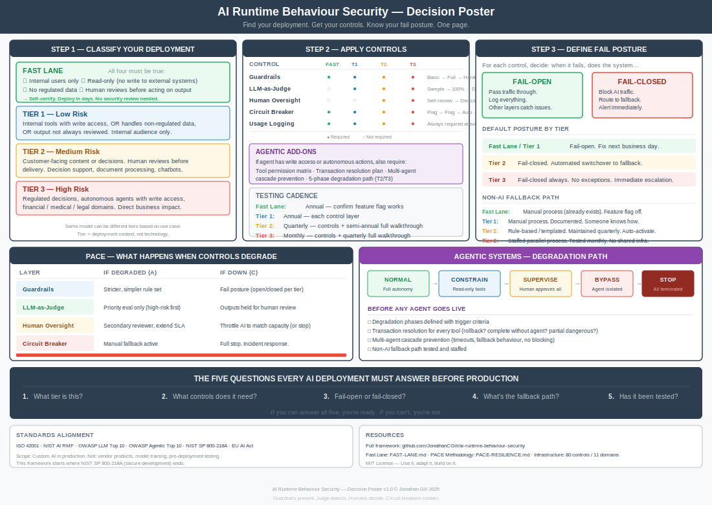

# Decision Poster

**The entire framework on one page. Classify → Control → Fail Posture → Test.**

*Open this file on GitHub to view full-size. Right-click the image to save or print.*

---

---

## Print It

To print at full size: click the image above to open the SVG directly, then use your browser's print function (Ctrl+P / Cmd+P) with landscape orientation.

## Related

| Resource | Purpose |
|---|---|
| [Cheat Sheet](CHEATSHEET.md) | Same content in text — scannable tables, copy-paste friendly |
| [Fast Lane](FAST-LANE.md) | Pre-approved path for low-risk deployments |
| [PACE Resilience](PACE-RESILIENCE.md) | Full resilience methodology |
| [README](README.md) | Full framework overview |
