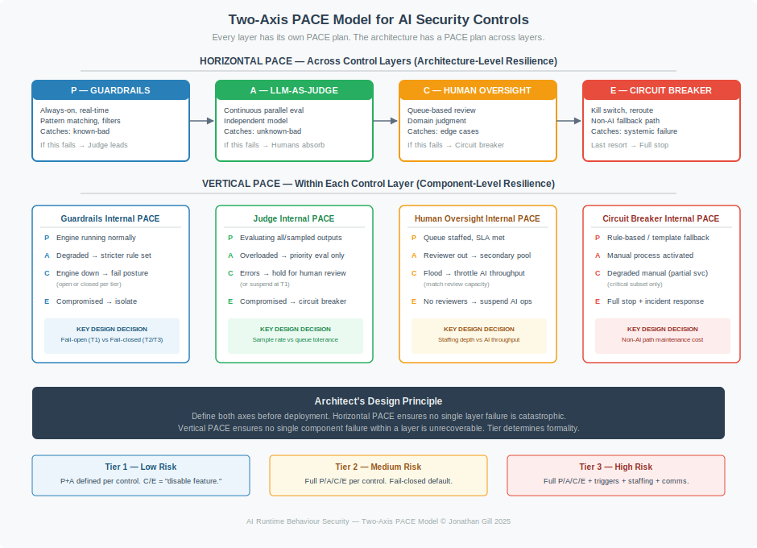
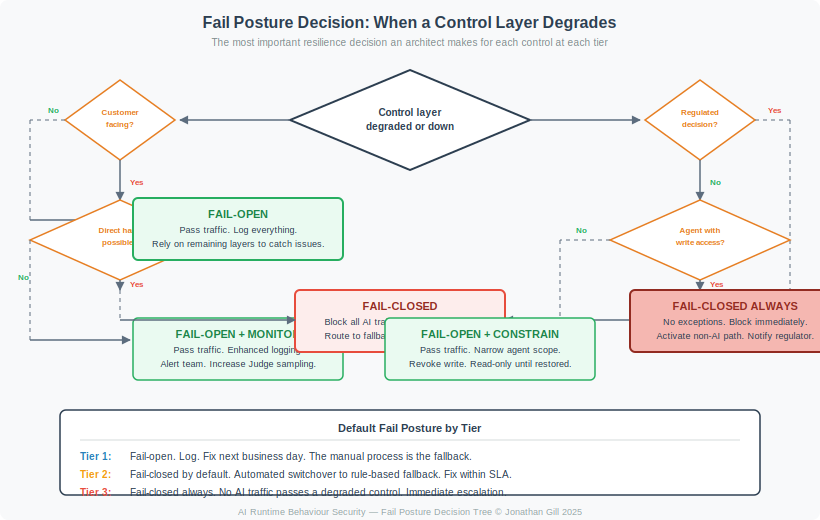

# PACE Resilience Methodology

**Primary. Alternate. Contingency. Emergency.**

*The structured approach to ensuring no single failure in your AI security controls is catastrophic.*

> *This document uses the simplified three-tier system (Tier 1/2/3). See [Risk Tiers — Simplified Tier Mapping](core/risk-tiers.md#simplified-tier-mapping) for the mapping to LOW/MEDIUM/HIGH/CRITICAL.*

---

## What PACE Is

PACE (Primary, Alternate, Contingency, Emergency) is a resilience planning methodology from military communications planning. It ensures mission-critical functions continue even when the preferred method fails, by pre-defining four layers of redundancy — each on a different failure domain so a single event can't cascade through all of them.

This framework adopts PACE as a **core design principle**, not an optional overlay. Every control, at every tier, must have a defined fail posture and fallback path before the system enters production.

---

## The Two-Axis PACE Model

PACE applies to AI security controls on two axes simultaneously:

**Horizontal PACE** operates across the three control layers. If Guardrails fail, the LLM-as-Judge becomes the primary defence. If the Judge fails, Human Oversight absorbs more. If Human Oversight is overwhelmed, the Circuit Breaker activates and routes to a non-AI path. This is the architecture-level resilience plan.

**Vertical PACE** operates within each control layer. If the guardrail engine is slow, it falls back to a stricter, simpler rule set. If it's down entirely, the system adopts its configured fail posture (open or closed, depending on tier). If it's compromised, the system isolates and escalates. This is the component-level resilience plan.

Both axes must be defined before deployment. The risk tier determines how formally each is documented, tested, and maintained.

---

## The PACE Principle: Independent Failure Domains

The critical rule that makes PACE effective: **each layer must depend on a different mechanism**, so a single failure mode can't take everything down simultaneously.

| Layer | Mechanism Type | Dependency | Why It's Independent |
|---|---|---|---|
| Guardrails | Deterministic rules engine | Pattern database, API gateway | Different from probabilistic model inference |
| LLM-as-Judge | Probabilistic model inference | Separate LLM, evaluation prompts | Different model, different evaluation criteria |
| Human Oversight | Cognitive judgment | Trained personnel, review interface | Not affected by model or engine failures |
| Circuit Breaker | Infrastructure control | Network routing, feature flags | Operates at infrastructure layer, independent of AI stack |

A prompt injection that bypasses guardrails won't automatically fool the Judge. A Judge model failure doesn't impair guardrails or human review. A staffing gap in human oversight doesn't affect automated controls. This independence is the foundation of resilience.

---

## The Core Architect Decision: Fail Posture

When a control layer degrades, it must do one of two things:

- **Fail-open:** Allow traffic to pass, rely on remaining layers to catch problems. Accepts risk of uncontrolled output in exchange for service continuity.
- **Fail-closed:** Block all AI traffic through the degraded layer. Accepts service disruption in exchange for safety.

This decision is the single most important resilience choice an architect makes for each control at each tier.

**The rule of thumb:**
- Tier 1 (internal, no customer impact): Fail-open is acceptable. Log everything. Fix next business day.
- Tier 2 (customer-facing, human-reviewed): Fail-closed by default. Automated switchover to fallback.
- Tier 3 (regulated, autonomous): Fail-closed always. No AI traffic passes a degraded control. Immediate escalation.

---

## Where PACE Requirements Live in This Framework

PACE is integrated throughout the framework, not isolated in a single document:

| Framework Document | What It Contains |
|---|---|
| [Risk Tiers](core/risk-tiers.md) | Resilience requirements per tier — PACE formality, fail posture defaults, testing frequencies, fallback path requirements |
| [Controls](core/controls.md) | Internal PACE tables for each control layer — what Primary/Alternate/Contingency/Emergency looks like within Guardrails, Judge, and Human Oversight at each tier |
| [Agentic](core/agentic.md) | Graceful degradation path for autonomous systems — the five-phase transition from full autonomy to full stop, with transaction resolution and multi-agent cascade prevention |
| [Checklist](core/checklist.md) | PACE verification items — what to check before go-live and at each testing interval |

This document is the methodology reference. The requirements are in the documents above.

---

## Why PACE, Not Just "Defence in Depth"

Defence in depth tells you to have multiple layers. It doesn't tell you:

1. What happens when a layer fails (not just "the next layer catches it" — what specifically changes?)
2. What the trigger is to transition from one operational state to another
3. How to step **back up** to normal operation after an incident
4. What to do when "turn it off" isn't simple (mid-transaction agents, multi-agent cascades)
5. How to test whether your fallback actually works

PACE answers all five. That's why it's a design principle, not an afterthought.

---

## PACE for Multi-Agent Systems

The two-axis model above applies to single-model deployments. When **multiple agents collaborate across trust boundaries**, PACE extends to a third axis: **agent orchestration resilience.**

Multi-agent systems fail differently. A single agent producing a bad output is a local problem. An agent chain where one compromised agent's output becomes another agent's trusted input is a systemic problem. PACE for multi-agent systems must handle cascading failures, not just component failures.

The **[MASO Framework](maso/)** integrates PACE at the orchestration level:

| PACE Phase | Multi-Agent Response |
|---|---|
| **Primary** | All agents operational. Full autonomy within tier permissions. Message bus integrity verified. Judge evaluates cross-agent outputs. |
| **Alternate** | One agent anomalous. Isolate that agent. Activate backup (potentially from a different provider). Tighten tool permissions to read-only across the chain. All write operations require human approval. |
| **Contingency** | Multiple agents degraded or correlated failure detected. Suspend multi-agent orchestration. Human approves every action. Reduced capacity, high assurance. |
| **Emergency** | Confirmed compromise or cascading failure. Kill switch fires. All agent sessions terminated. Non-AI fallback activated. Incident response engaged. |

**Key differences from single-agent PACE:**

**Blast radius is wider.** A compromised agent can inject instructions into the message bus that affect every downstream agent. Containment must isolate the agent *and* quarantine its recent outputs across the chain.

**Transitions are automated at higher tiers.** At MASO Tier 2+, the monitoring agent or orchestrator can initiate P→A transitions without waiting for human approval — because multi-agent cascading failures move faster than human response times. Humans are notified, not gated.

**Recovery requires chain verification.** Stepping back from C→A or A→P isn't just "restart the failed component." The system must verify that no poisoned data from the compromised agent persists in other agents' memory, context, or RAG corpus.

**→ [MASO PACE Implementation](maso/)** · [Tier 1](maso/implementation/tier-1-supervised.md) · [Tier 2](maso/implementation/tier-2-managed.md) · [Tier 3](maso/implementation/tier-3-autonomous.md)

---

## Testing Your PACE Plan

A PACE plan that hasn't been tested is a plan that won't work.

| Test Type | Tier 1 | Tier 2 | Tier 3 |
|---|---|---|---|
| **Guardrail bypass / failure simulation** | Annually | Quarterly | Monthly |
| **Judge failure simulation** | Annually | Quarterly | Monthly |
| **Human escalation exercise** | Annually | Quarterly | Quarterly |
| **Circuit breaker activation** | Annually | Quarterly | Monthly |
| **Full degradation walkthrough** | — | Semi-annually | Quarterly |
| **Non-AI fallback operation** | Annually | Quarterly | Monthly |
| **Recovery (step-back-up) validation** | Annually | Quarterly | Monthly |

For Tier 3 systems, testing should involve the same personnel who would handle a real incident, using the same tools and communication channels.

---

## Related Framework Documents

| Document | Relevance |
|---|---|
| [Controls](core/controls.md) | The three-layer architecture with integrated PACE resilience |
| [Agentic](core/agentic.md) | Graceful degradation for autonomous agents |
| [Risk Tiers](core/risk-tiers.md) | Classification that determines PACE requirements |
| [MASO Framework](maso/) | PACE extended to multi-agent orchestration — agent failover, cascading failure response, kill switch architecture |
| [Incident Playbook](extensions/templates) | Templates for Emergency layer activation |
| [Infrastructure Beats Instructions](insights/infrastructure-beats-instructions.md) | Why the Emergency layer must be infrastructure, not prompts |

---

*Enterprise AI Security Controls Framework, 2026 (Jonathan Gill).*
