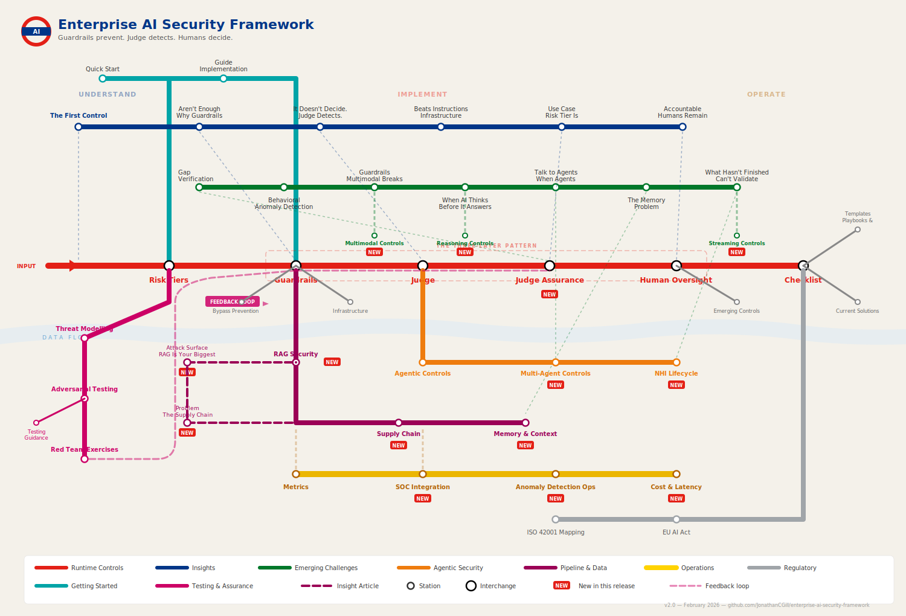

# AI Security Blueprint

A practical guide to implementing behavioral controls for AI systems.

---

## The Problem

Traditional software assurance relies on design-time testing. You write code, test it, prove it works, ship it.

**AI breaks this model.**

- **Non-deterministic** — Same input can produce different outputs
- **Emergent behavior** — You can't predict all failure modes
- **Adversarial inputs** — Users will find edge cases your test suite never imagined

You can't fully test an AI system before deployment. So how do you know it's working correctly?

---

## Before You Proceed

> **[The First Control: Choosing the Right Tool](insights/the-first-control.md)**
>
> The most effective way to reduce AI risk is to not use AI where it doesn't belong. Before guardrails, judges, or human oversight — ask whether AI is the right tool for this problem. Design thinking should precede technology selection.

Everything in this Blueprint assumes you've already answered "yes" to that fundamental question.

---

## The Pattern

The industry is converging on an answer: **runtime behavioral monitoring**.

Instead of proving correctness at design time, you continuously verify behavior in production.

| Layer | Function | Timing |
|-------|----------|--------|
| **Guardrails** | Prevent known-bad inputs/outputs | Real-time (~10ms) |
| **Judge** | Detect unknown-bad via LLM evaluation | Async (~500ms–5s) |
| **Human Oversight** | Decide edge cases, remain accountable | As needed |

**Guardrails prevent. Judge detects. Humans decide.**

> Design reviews prove intent. Behavioral monitoring proves reality.

---

## This Isn't New

This pattern already exists in production. What's been missing is a clear explanation of *why* it's necessary and *how* to implement it proportionate to risk.

### Platforms Implementing This Pattern

| Platform | Implementation |
|----------|----------------|
| [NVIDIA NeMo Guardrails](https://github.com/NVIDIA/NeMo-Guardrails) | 5 rail types: input, dialog, retrieval, execution, output |
| [LangChain](https://docs.langchain.com/) | Middleware + human-in-the-loop |
| [Guardrails AI](https://www.guardrailsai.com/) | Open-source validator framework |
| [Galileo](https://www.rungalileo.io/) | Eval-to-guardrail lifecycle |
| [Confident AI / DeepEval](https://github.com/confident-ai/deepeval) | LLM-as-judge evaluation framework |
| AWS Bedrock Guardrails | Managed input/output filtering |
| Azure AI Content Safety | Content filtering and moderation |

### Standards Describing the Risks

| Standard | Focus |
|----------|-------|
| [OWASP LLM Top 10](https://owasp.org/www-project-top-10-for-large-language-model-applications/) | Security vulnerabilities in LLM applications |
| [OWASP Top 10 for Agentic Applications](https://genai.owasp.org/) | Risks specific to autonomous AI agents |
| [NIST AI RMF](https://www.nist.gov/itl/ai-risk-management-framework) | Risk management framework |
| [ISO 42001](https://www.iso.org/standard/81230.html) | AI management system standard |

---

## What This Guide Provides

A practical synthesis: how to understand the pattern, select appropriate controls, and implement them proportionate to risk.

**[→ Quick Start](QUICK_START.md)** — Implement basic controls in 30 minutes.

---

## Core Content

| Document | Purpose |
|----------|---------|
| [Risk Tiers](core/risk-tiers.md) | Classify your system, determine control requirements |
| [Controls](core/controls.md) | Guardrails, Judge, Human Oversight implementation |
| [Agentic](core/agentic.md) | Additional controls for AI agents |
| [Checklist](core/checklist.md) | Track your implementation |
| [Emerging Controls](core/emerging-controls.md) | Multimodal, reasoning, streaming *(theoretical)* |

---

## Extensions

Reference material for specific needs.

| Folder | Contents |
|--------|----------|
| [extensions/regulatory/](extensions/regulatory/) | ISO 42001, EU AI Act mapping |
| [extensions/technical/](extensions/technical/) | Bypass prevention, infrastructure, metrics |
| [extensions/technical/current-solutions.md](extensions/technical/current-solutions.md) | **Industry solutions reference** — guardrails, evaluators, safety models |
| [extensions/templates/](extensions/templates/) | Incident playbooks, threat models |
| [extensions/examples/](extensions/examples/) | Worked examples by use case |

---

## Insights

Articles explaining the thinking behind the pattern.

### Why This Pattern?
| Article | Summary |
|---------|---------|
| [Why Your AI Guardrails Aren't Enough](insights/why-guardrails-arent-enough.md) | Guardrails block known-bad; you need detection for unknown-bad |
| [The Judge Detects. It Doesn't Decide.](insights/judge-detects-not-decides.md) | Async evaluation beats real-time blocking for nuance |
| [Infrastructure Beats Instructions](insights/infrastructure-beats-instructions.md) | You can't secure systems with prompts alone |
| [Humans Remain Accountable](insights/humans-remain-accountable.md) | AI assists decisions; humans own outcomes |

### Emerging Challenges
| Article | Summary |
|---------|---------|
| [Multimodal AI Breaks Your Text-Based Guardrails](insights/multimodal-breaks-guardrails.md) | Images, audio, video create new attack surfaces |
| [When AI Thinks Before It Answers](insights/when-ai-thinks.md) | Reasoning models need reasoning-aware controls |
| [When Agents Talk to Agents](insights/when-agents-talk-to-agents.md) | Multi-agent systems have accountability gaps |

---

## Scope

**In scope:** Custom LLM applications, AI decision support, document processing, agentic systems

**Out of scope:** 
- Vendor AI products (Copilot, Gemini, etc.) — use vendor controls
- Model training — see MLOps security guidance
- Pre-deployment testing — this guide is about production monitoring

This guide is **operationally focused** — deployment through incident response.

---

## Status

This is a **synthesis and practical guide**, not a standard.

- Combines existing patterns with implementation guidance
- Feedback welcome — see [CONTRIBUTING.md](CONTRIBUTING.md)
- Will evolve as the field matures

---

## Quick Links

| Need | Go To |
|------|-------|
| Get started | [Quick Start](QUICK_START.md) |
| Classify a system | [Risk Tiers](core/risk-tiers.md) |
| Implement controls | [Controls](core/controls.md) |
| Deploy an agent | [Agentic](core/agentic.md) |
| Test your controls | [Testing Guidance](extensions/templates/testing-guidance.md) |
| Threat model | [Threat Model Template](extensions/templates/threat-model-template.md) |
| Map to ISO 42001 | [Regulatory Extensions](extensions/regulatory/) |
