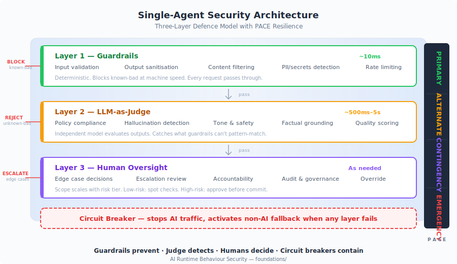

# AI Runtime Behaviour Security

**Runtime behavioural security for AI systems — from single-model deployments to autonomous multi-agent orchestration.**

[](foundations/) [](maso/red-team/red-team-playbook.md) [](maso/controls/risk-register.md) [](PACE-RESILIENCE.md) [](https://opensource.org/licenses/MIT)

> **You tested your AI before deployment. You proved it worked. Then it hallucinated a medical dosage, leaked customer data through a prompt injection, or autonomously approved a transaction it should have escalated.** Traditional software assurance assumes deterministic behaviour. AI doesn't have any. If your security model can't answer "what is this system doing *right now*, and how do I know it's correct?" — you have a gap. This framework helps you figure out how to close it.

**This is a thinking tool, not a checklist.** It gives you a structured way to reason about what controls your AI systems need — given your threat model, risk appetite, and regulatory obligations. Two organisations should arrive at different implementations. That's the point.

**Executives and board members:** [What AI runtime risk means for leadership](stakeholders/risk-and-governance.md) — 5-minute read. | **New here?** [Quick Start](QUICK_START.md) — zero to working controls in 30 minutes.

---

## Find Your Entry Point

| I want to... | Start here |
| --- | --- |
| **Find what matters for my role** | **[Stakeholder Views](stakeholders/)** — Security, Risk, Architecture, Product, Engineering, Compliance |
| **Secure a single-model AI system** | **[Foundation Framework](foundations/)** — 80 controls, risk tiers, PACE resilience |
| **Secure a multi-agent system** | **[MASO Framework](maso/)** — 93 controls, 6 domains, 3 tiers |
| **Align AI with business strategy** | **[From Strategy to Production](strategy/)** |
| **Deploy low-risk AI quickly** | **[Fast Lane](FAST-LANE.md)** |
| **See the entire framework on one map** | **[Tube Map](TUBE-MAP.md)** |
| **Get started in 30 minutes** | **[Quick Start](QUICK_START.md)** — from zero to working controls |
| **Get the one-page reference** | **[Cheat Sheet](CHEATSHEET.md)** — classify, control, fail posture, test |
| Classify a system by risk | [Risk Tiers](core/risk-tiers.md) |
| Understand PACE resilience | [PACE Methodology](PACE-RESILIENCE.md) |
| Run adversarial tests on agents | [Red Team Playbook](maso/red-team/red-team-playbook.md) |
| Implement in LangGraph, AutoGen, CrewAI, or Bedrock | [Integration Guide](maso/integration/integration-guide.md) |
| See real incidents mapped to controls | [Incident Tracker](maso/threat-intelligence/incident-tracker.md) |

---

The framework has three layers: **[Foundation](foundations/)** secures single-model AI, **[MASO](maso/)** extends into multi-agent orchestration, and **[Strategy](strategy/)** connects both to business decisions. Each builds on the last.

## The Problem

Traditional software assurance relies on design-time testing. You write code, test it, prove it works, ship it.

AI breaks this model. AI systems are non-deterministic — the same input can produce different outputs. They exhibit emergent behaviour that can't be predicted through conventional test suites. And adversarial inputs will find edge cases no QA team imagined.

You can't fully test an AI system before deployment. The question is: **how do you know it's working correctly in production?**

---

## The Foundation



The industry is converging on an answer: **runtime behavioural monitoring.** Instead of proving correctness at design time, you continuously verify behaviour in production through three complementary layers.

| Layer | What It Does | When It Acts |
| --- | --- | --- |
| **Guardrails** | Prevent known-bad inputs and outputs | Real-time (~10ms) |
| **LLM-as-Judge** | Detect unknown-bad via independent LLM evaluation | Async (~500ms–5s) |
| **Human Oversight** | Decide edge cases, maintain accountability | As needed |
| **Circuit Breaker** | Stop AI traffic, activate non-AI fallback when controls fail | Immediate |

**Guardrails prevent. Judge detects. Humans decide. Circuit breakers contain.**

But security controls alone aren't enough — you also need to know what happens when they fail. The framework pairs every control layer with a **[PACE resilience architecture](PACE-RESILIENCE.md)** (Primary, Alternate, Contingency, Emergency). When a layer degrades, the system doesn't fail silently — it transitions to a predetermined safe state. Full stack operational → backup activated → supervised-only mode → full stop. Every tier has a plan. Every plan has been defined before the incident, not during it.

This pattern already exists in production at major platforms — NVIDIA NeMo, AWS Bedrock, Azure AI, LangChain, Guardrails AI, and others. The **[Foundation Framework](foundations/)** provides the complete implementation: risk classification, 80 infrastructure controls, PACE resilience methodology, regulatory mappings, and a fast lane for low-risk deployments.

For single-model AI systems, this is the answer. **→ [Start here](foundations/)**

---

## The Next Problem

Single-model controls assume one AI, one context window, one trust boundary. But the industry has already moved past this.

Multi-agent systems — where multiple LLMs from different providers collaborate, delegate tasks, and take autonomous actions — are the emerging architecture for complex AI workflows. Planning agents decompose problems. Specialist agents execute. Evaluation agents verify. Orchestrators coordinate.

This changes the threat model fundamentally:

- **Prompt injection propagates.** A poisoned document processed by one agent becomes instructions for another.
- **Delegation creates transitive authority.** If Agent A can delegate to Agent B, and Agent B has write access, then Agent A effectively has write access.
- **Consensus is not evidence.** Three agents agreeing doesn't mean three independent opinions — not when they share the same model, training data, and retrieval corpus.
- **Hallucinations compound.** Agent A hallucinates a claim. Agent B cites it as fact. By Agent C, it's been elaborated and presented with high confidence.
- **Failures look like success.** The most dangerous multi-agent failure modes produce outputs that are well-formatted, confident, and unanimously agreed — and wrong.

Single-model controls don't address any of this. You need a framework designed for multi-agent dynamics.

---

## MASO: Multi-Agent Security Operations


The **[MASO Framework](maso/)** extends the foundation into multi-agent orchestration. Six control domains. 93 controls. 99 tests. Three implementation tiers. Full PACE resilience integration. Coverage of all 20 OWASP risks across both the LLM Top 10 (2025) and Agentic Top 10 (2026), plus 30 emergent risks that have no OWASP equivalent.

### Control Domains

| Domain | What It Secures |
| --- | --- |
| **[Prompt, Goal & Epistemic Integrity](maso/controls/prompt-goal-and-epistemic-integrity.md)** | Agent instructions, objectives, and information quality across chains — injection, goal hijack, groupthink, hallucination amplification, uncertainty stripping |
| **[Identity & Access](maso/controls/identity-and-access.md)** | Non-Human Identity per agent, zero-trust credentials, scoped permissions, no transitive authority |
| **[Data Protection](maso/controls/data-protection.md)** | Cross-agent data fencing, DLP on the message bus, RAG integrity, memory isolation |
| **[Execution Control](maso/controls/execution-control.md)** | Sandboxed execution, blast radius caps, circuit breakers, LLM-as-Judge gate, interaction timeouts |
| **[Observability](maso/controls/observability.md)** | Decision chain audit, anomaly scoring, drift detection, independent observability agent with kill switch |
| **[Supply Chain](maso/controls/supply-chain.md)** | AIBOM per agent, signed tool manifests, MCP server vetting, A2A trust chain validation |

### Implementation Tiers

| Tier | Autonomy | Key Controls |
| --- | --- | --- |
| **[Tier 1 — Supervised](maso/implementation/tier-1-supervised.md)** | Human approves all writes | Guardrails, tool scoping, audit logging, manual review |
| **[Tier 2 — Managed](maso/implementation/tier-2-managed.md)** | Auto-approve low-risk, escalate high-risk | NHI, signed bus, LLM-as-Judge, continuous anomaly scoring, PACE A/C configured |
| **[Tier 3 — Autonomous](maso/implementation/tier-3-autonomous.md)** | Minimal human intervention | Self-healing PACE, adversarial testing, independent observability agent, kill switch |

### What Makes MASO Different

**Epistemic security.** Most AI security frameworks focus on adversarial attacks — injection, exfiltration, jailbreaks. MASO also addresses the non-adversarial failures that emerge from multi-agent interaction itself: groupthink, correlated errors, synthetic corroboration, semantic drift, and uncertainty stripping. These aren't attacks. They're emergent properties of agents working together. They produce failures that look like success. We haven't found another framework that treats these as a formal control domain with test criteria and maturity indicators — though others may be working on similar ideas.

**PACE resilience for agent orchestration.** Every control has a defined failure mode. Every tier has a structured degradation path from full autonomy to full stop. The system doesn't just detect problems — it has a predetermined response at every phase: Primary → Alternate → Contingency → Emergency.

**Dual OWASP coverage.** Full mapping against both the OWASP Top 10 for LLM Applications and the OWASP Top 10 for Agentic Applications, with controls that address how individual LLM risks compound across agent chains. An additional [Emergent Risk Register](maso/controls/risk-register.md) captures 30 risks beyond the OWASP taxonomies.

**→ [Enter MASO](maso/)**

---

## Strategy: From Ideas to Running Systems

Security controls answer *how to secure* AI. They don't answer *what to build*, *whether AI is the right tool*, or *whether the organisation can deliver and operate it safely*.

The **[From Strategy to Production](strategy/)** section bridges this gap — connecting business strategy to the framework's controls through a defined process:

| Stage | Question | Output |
| --- | --- | --- |
| [Business Alignment](strategy/business-alignment.md) | Is this worth doing? Is AI the right tool? | Business case with alternatives assessed |
| [Use Case Definition](strategy/use-case-definition.md) | What exactly will it do? | Ten-question definition that feeds risk classification |
| [Risk Classification](core/risk-tiers.md) | What tier? What controls? | Six-dimension scored profile with governance approval |
| [From Idea to Production](strategy/idea-to-production.md) | How do we get from idea to safe operation? | Eight-stage lifecycle with gates and owners |

Three constraints that strategies routinely underestimate:

- **[Data Reality](strategy/data-reality.md)** — Your data determines your strategy more than your ambition does. The framework can secure AI built on poor data; it cannot make it accurate.
- **[Human Factors](strategy/human-factors.md)** — Skills, learning time, capacity, willingness, sustainability. Controls don't work if the people operating them aren't ready.
- **[Progression](strategy/progression.md)** — Moving from low to high risk takes 2–3 years. Skipping steps is the most common strategic failure.

The strategy section is honest about [where the framework helps and where it constrains](strategy/framework-tensions.md) strategic choices — and what to do when strategies legitimately test the framework's limits.

---

## What This Is

<details>
<summary><strong>A thinking tool — not a standard, policy, or compliance checklist. Expand for details.</strong></summary>

<br>

It does not tell you what to do. It gives you a structured way to reason about what you *should* do, given your own threat model, risk appetite, regulatory obligations, and existing infrastructure. Two organisations reading this framework should arrive at different implementations, because they have different contexts. That's the point.

**What it provides:**

- **A way of thinking about controls, not a prescription for them.** The framework describes *what* needs to be true (e.g., "agent identity is individually scoped and short-lived") and *why* it matters. It does not mandate a specific product, vendor, or architecture to get there. If your existing tools already satisfy a control, you don't need new ones.
- **Help deciding where to invest.** Not every control matters equally. Risk tiers, PACE resilience levels, and the distinction between foundation and multi-agent controls exist so you can reason about priority. A supervised single-agent system doesn't need the same controls as an autonomous multi-agent pipeline — and treating them the same wastes effort and creates a false sense of coverage.
- **Defence in depth as a design principle.** No single control is the answer. The layered approach — guardrails, LLM-as-Judge, human oversight, circuit breakers — exists because each layer covers gaps in the others. The question isn't "which layer do we need?" but "what happens when each layer fails?"
- **Resilience thinking for AI products.** Traditional security asks "how do we prevent bad things?" This framework also asks "what happens when prevention fails?" That's the PACE thread — Primary, Alternate, Contingency, Emergency — running through every control domain. Your system should degrade gracefully, not fail silently.
- **Clarity on when tools are *not* needed.** Some controls are already handled by your existing infrastructure — your cloud provider's IAM, your API gateway's rate limiting, your platform's audit logging. The framework should help you see where you already have coverage, not convince you to buy something new.

**What it is not:**

- Not a certification or audit standard. You cannot be "compliant with" this framework.
- Not a product recommendation. Tool and vendor references are illustrative, not endorsements.
- Not a substitute for professional security assessment of your specific deployment.
- Not a finished document. AI security is moving fast. This framework reflects the current state of industry practice and will evolve as the landscape does.

If you take one thing from this: the value is in the thinking, not the checklist. A team that understands *why* a control exists and *what happens when it fails* will make better decisions than a team that implements every control on a list without understanding the reasoning behind it.

</details>

---

## Standards Alignment

| Standard | Coverage |
| --- | --- |
| [OWASP LLM Top 10 (2025)](https://owasp.org/www-project-top-10-for-large-language-model-applications/) | Full mapping across foundation + MASO |
| [OWASP Agentic Top 10 (2026)](https://genai.owasp.org/) | Full mapping in MASO |
| [NIST AI RMF](https://www.nist.gov/itl/ai-risk-management-framework) | Govern, Map, Measure, Manage |
| [ISO 42001](https://www.iso.org/standard/81230.html) | AI management system alignment |
| [NIST SP 800-218A](https://csrc.nist.gov/pubs/sp/800/218/a/final) | Pre-deployment complement |
| [MITRE ATLAS](https://atlas.mitre.org/) | Agent-focused threat intelligence |
| [EU AI Act](https://artificialintelligenceact.eu/) | Art. 9, 14, 15 — risk management, oversight, robustness |
| [DORA](https://www.digital-operational-resilience-act.com/) | Digital operational resilience for financial services |

---

## More Navigation

| If you want to... | Go here |
| --- | --- |
| Understand MASO controls at a glance | [MASO Domain Map](images/maso-tube-map.svg) |
| See MASO applied in finance, healthcare, or energy | [Worked Examples](maso/examples/worked-examples.md) |
| Govern agent identity and access | [IAM Governance](core/iam-governance.md) |
| Quantify AI risk for board reporting | [Risk Assessment](core/risk-assessment.md) |
| Enforce controls at infrastructure level | [Infrastructure Controls](infrastructure/) |
| Navigate by role | [Framework Map](FRAMEWORK-MAP.md) |
| Understand what's validated and what's not | [Maturity & Validation](MATURITY.md) |
| See all references, sources, and further reading | [References & Sources](REFERENCES.md) |

---

## Repository Structure

```
├── README.md                          # This document — start here
├── TUBE-MAP.md                        # Complete framework tube map with guide
├── foundations/
│   └── README.md                      # Single-model AI security framework
├── maso/
│   ├── README.md                      # Multi-Agent Security Operations
│   ├── controls/                      # 6 domain specifications + risk register
│   ├── implementation/                # 3 tier guides (supervised, managed, autonomous)
│   ├── threat-intelligence/           # Incident tracker + emerging threats
│   ├── red-team/                      # Adversarial test playbook (13 scenarios)
│   ├── integration/                   # LangGraph, AutoGen, CrewAI, AWS Bedrock patterns
│   └── examples/                      # Financial services, healthcare, critical infrastructure
├── stakeholders/                      # Role-based entry points (security, risk, architecture, product, engineering, compliance)
├── images/                            # All SVGs (tube map, architecture, OWASP coverage, stakeholder map)
├── core/                              # Risk tiers, controls, IAM governance, checklists
├── infrastructure/                    # 80 technical controls, 11 domains
├── extensions/                        # Regulatory, templates, worked examples
├── insights/                          # Analysis articles and emerging challenges
└── strategy/                          # AI strategy — alignment, data, human factors, progression
```

---

## About the Author

**Jonathan Gill** is a cybersecurity practitioner with over 30 years in information technology and 20+ years in enterprise cybersecurity. His career spans UNIX system administration, building national-scale ISP infrastructure, enterprise security architecture at major financial institutions, and diplomatic IT service.

His current focus is AI security governance: designing control architectures that address the unique challenges of securing non-deterministic systems at enterprise scale, and translating complex technical risk into actionable guidance for engineering teams and executive leadership.

- GitHub: [@JonathanCGill](https://github.com/JonathanCGill)
- LinkedIn: [Jonathan Gill](https://www.linkedin.com/in/jonathancgill/)

---

## Disclaimer

This framework is provided as-is under the [MIT License](LICENSE). As described in [What This Is](#what-this-is), it is a thinking tool — not a standard, certification, or guarantee of security. It reflects one practitioner's synthesis of industry patterns, regulatory requirements, and operational experience.

If you adopt any part of this framework, you are responsible for validating it against your own threat model, environment, and regulatory obligations.

This framework was written with AI assistance (Claude and ChatGPT) for drafting, structuring, and research synthesis. Architecture, control design, risk analysis, and editorial judgment are the author's.

This is a personal project. It is not affiliated with, endorsed by, or representative of any employer, organisation, or other entity. The views and opinions expressed are the author's own and should not be construed as reflecting the position or policy of any company or institution with which the author is or has been associated.

---

*AI Runtime Behaviour Security, 2026 (Jonathan Gill).*
