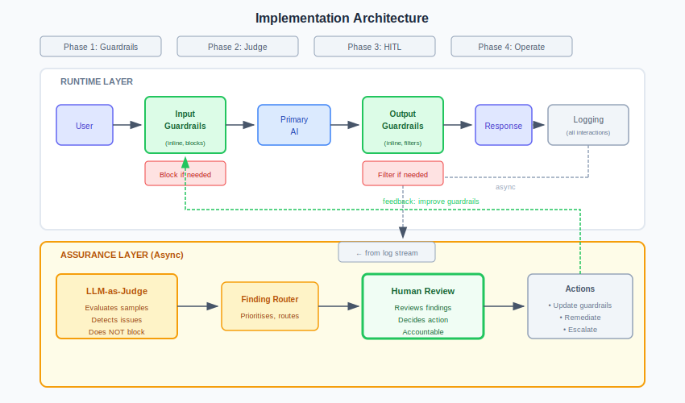

# Implementation Checklist

---

## Phase 1: Foundation

### Classification
- [ ] AI system identified and documented
- [ ] Risk tier assigned (LOW / MEDIUM / HIGH / CRITICAL)
- [ ] Classification rationale documented
- [ ] Business owner identified
- [ ] Review date set

### Governance
- [ ] Roles defined (owner, operator, reviewer)
- [ ] Approval workflow established
- [ ] Escalation path documented
- [ ] Success metrics defined

---

## Phase 2: Logging

### Interaction Capture
- [ ] Full input/output logging enabled
- [ ] User/session attribution working
- [ ] Timestamps accurate
- [ ] Context captured (system prompt, retrieved content)

### Storage
- [ ] Retention period configured per tier
- [ ] Access controls applied
- [ ] Tamper protection enabled (HIGH/CRITICAL)
- [ ] Backup/recovery tested

---

## Phase 3: Guardrails

### Input Guardrails
- [ ] Injection detection enabled
- [ ] PII detection configured
- [ ] Content policy applied
- [ ] Rate limiting set
- [ ] Input length limits set

### Output Guardrails
- [ ] Content filtering enabled
- [ ] PII detection configured
- [ ] Grounding checks enabled (if applicable)
- [ ] Format validation applied

### Testing
- [ ] Known-bad inputs blocked
- [ ] Legitimate inputs pass
- [ ] False positive rate acceptable
- [ ] Latency acceptable

---

## Phase 4: Judge

### Setup
- [ ] Judge prompt developed
- [ ] Evaluation criteria defined
- [ ] Scoring rubric documented
- [ ] Judge model selected

### Shadow Mode
- [ ] Judge running on all/sampled interactions
- [ ] Findings logged but not acted on
- [ ] Human comparison performed
- [ ] Accuracy measured (target: >90%)

### Calibration
- [ ] False positive rate measured
- [ ] False negative rate estimated
- [ ] Judge prompt tuned based on findings
- [ ] Re-validated after tuning

---

## Phase 5: Human Oversight

### Queues
- [ ] Queue structure defined
- [ ] SLAs set per queue
- [ ] Routing rules configured
- [ ] Escalation paths working

### Reviewers
- [ ] Reviewers identified and trained
- [ ] Review interface deployed
- [ ] Actions documented (approve, correct, escalate, etc.)
- [ ] Feedback loop to Judge established

### Quality Assurance
- [ ] Canary cases configured
- [ ] Review time tracking enabled
- [ ] Volume limits set
- [ ] Inter-rater reliability measured

---

## Phase 6: Operationalise

### Judge to Advisory
- [ ] Findings surfaced to reviewers
- [ ] Reviewer feedback captured
- [ ] Judge accuracy re-measured
- [ ] Tuning based on feedback

### Judge to Operational
- [ ] Findings automatically routed
- [ ] Workflows triggered by findings
- [ ] Metrics dashboard live
- [ ] Alerting configured

---

## Phase 7: Continuous Improvement

### Metrics
- [ ] Guardrail block rate tracked
- [ ] Judge finding rate tracked
- [ ] HITL review rate tracked
- [ ] False positive/negative trends monitored

### Tuning
- [ ] Regular guardrail rule review
- [ ] Judge prompt refinement
- [ ] Threshold adjustment based on data
- [ ] New attack pattern incorporation

### Review
- [ ] Quarterly control effectiveness review
- [ ] Annual risk tier re-assessment
- [ ] Incident lessons incorporated
- [ ] Regulatory changes assessed

---

## Agent-Specific (if applicable)

### Scope Enforcement
- [ ] Network allowlist configured
- [ ] Data access limited to authorised scope
- [ ] Action allowlist implemented
- [ ] Resource caps set

### Action Controls
- [ ] Action validator deployed
- [ ] Approval workflow for high-impact actions
- [ ] Circuit breakers configured
- [ ] Tool output sanitisation enabled

### Monitoring
- [ ] Action volume alerts set
- [ ] Error rate alerts set
- [ ] Cost anomaly alerts set
- [ ] Scope violation alerts set

---

## Sign-Off

| Phase | Completed | Signed Off By | Date |
|-------|-----------|---------------|------|
| Foundation | ☐ | | |
| Logging | ☐ | | |
| Guardrails | ☐ | | |
| Judge | ☐ | | |
| HITL | ☐ | | |
| Operational | ☐ | | |
| Agent Controls | ☐ | | |

**System approved for production:** ☐

**Approver:** __________________ **Date:** __________

---

*Enterprise AI Security Controls Framework, 2026 (Jonathan Gill).*
