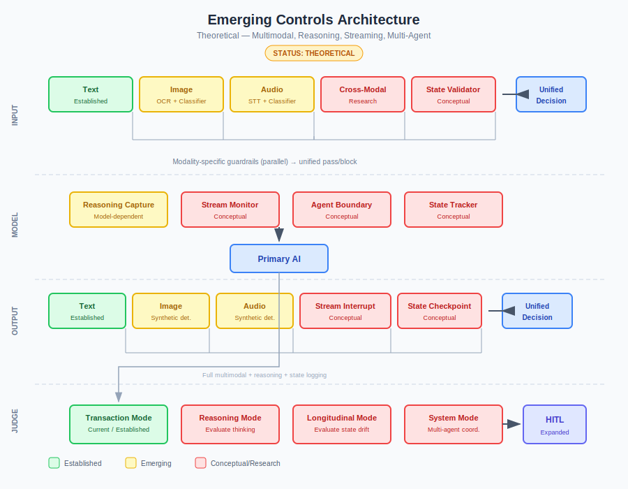
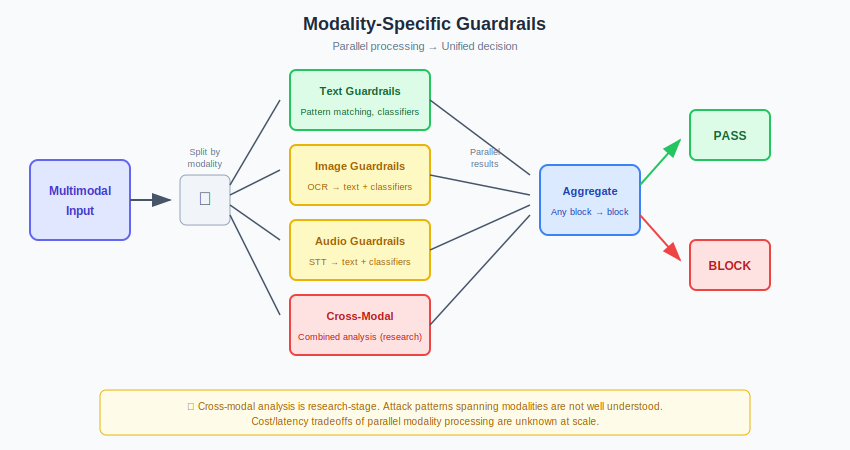
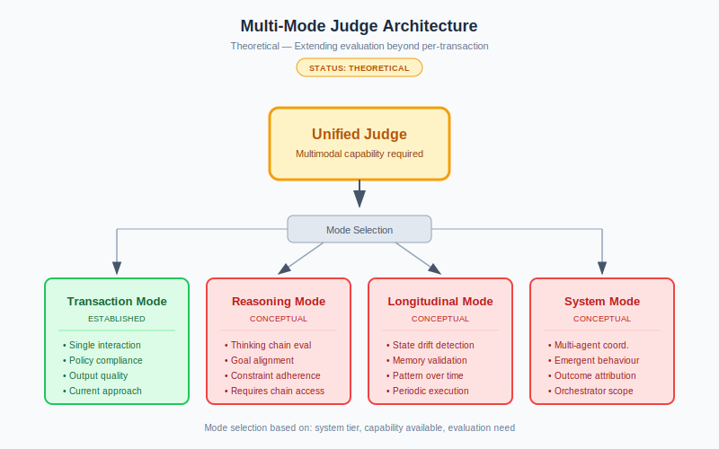
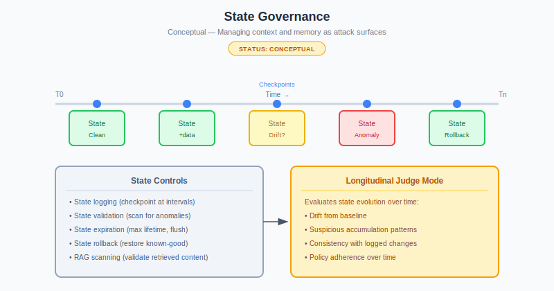

# Emerging Controls

**Status: Theoretical**

Proposed extensions for multimodal, reasoning, streaming, and multi-agent AI. These are design directions, not proven patterns.

---

## The Gap

The core framework assumes text-based, single-model, stateless, complete-before-deliver AI. Emerging capabilities break these assumptions:

| Capability | What Breaks |
|------------|-------------|
| Multimodal | Text guardrails can't see image/audio/video attacks |
| Reasoning models | Hidden thinking chains escape evaluation |
| Long context/memory | State accumulates; per-transaction controls miss slow attacks |
| Streaming | Output reaches users before validation completes |
| Multi-agent | Accountability diffuses; agent-to-agent injection |

The core principles hold. Implementation must evolve.

---

## Overview Map

The map shows how emerging controls connect. Solid lines indicate established or emerging patterns; dashed lines indicate conceptual/research-stage controls. Interchanges mark integration points between control domains.

---

## Proposed Architecture

---

## 1. Modality-Specific Guardrails

### Input

| Modality | Process | Maturity |
|----------|---------|----------|
| Text | Direct validation | Established |
| Image | OCR → text rules; image classifiers | Emerging |
| Audio | STT → text rules; audio classifiers | Emerging |
| Video | Frame + audio extraction → above | Conceptual |

**Cross-modal:** Dedicated analyser for attacks spanning modalities. Research stage.

### Output

| Modality | Process | Maturity |
|----------|---------|----------|
| Text | Standard guardrails | Established |
| Generated image | Content + synthetic detection | Emerging |
| Generated audio | Synthetic + content detection | Emerging |

### Open Questions

- Cost/latency of parallel modality pipelines?
- Cross-modal attack patterns at scale?
- Should HIGH/CRITICAL avoid generative output?

---

## 2. Unified Multimodal Judge

A Judge seeing only text when the interaction included images evaluates incomplete information.

### Options

| Approach | Trade-off |
|----------|-----------|
| Single multimodal Judge | Complete view; expensive |
| Modality-specific Judges | Specialised; may miss cross-modal |
| Tiered (fast triage → specialist) | Efficient; complex |

### Extended Criteria

| Criterion | Question |
|-----------|----------|
| Cross-modal consistency | Does image match text claims? |
| Generated content policy | Is synthetic media appropriate? |
| Manipulation indicators | Adversarial patterns across modalities? |

---

## 3. Reasoning Evaluation

When models think before answering, evaluating only the answer misses whether thinking was sound.

### Dependency

Requires model to expose reasoning. If hidden, this control is unavailable.

### Proposed Reasoning Mode

| Criterion | Question |
|-----------|----------|
| Goal alignment | Did reasoning pursue stated objective? |
| Constraint adherence | Did reasoning respect limitations? |
| Concerning exploration | Did reasoning explore problematic paths? |

### Application

| Tier | Approach |
|------|----------|
| LOW/MEDIUM | Optional |
| HIGH | Attempt if available |
| CRITICAL | Required if available; question model choice if not |

### Open Questions

- Can a Judge reliably evaluate complex reasoning?
- Does surface reasoning reflect actual computation?
- What capability does the Judge need?

---

## 4. State Governance

Long context and memory create attack surfaces that accumulate over time.

### Controls

| Control | Purpose |
|---------|---------|
| State logging | Checkpoint context/memory at intervals |
| State validation | Scan for anomalies |
| State expiration | Maximum lifetime; periodic flush |
| State rollback | Restore known-good state |
| RAG scanning | Validate retrieved content before inclusion |

### Longitudinal Judge Mode

| Criterion | Question |
|-----------|----------|
| Drift | Has state diverged from baseline? |
| Accumulation | Suspicious content building up? |
| Consistency | Does state match logged changes? |

### Open Questions

- What does malicious state accumulation look like?
- How to establish "normal" baselines?
- Right balance between capability and state restriction?

---

## 5. Streaming Controls

Output reaches users before validation completes. No good solution exists.

### Options

| Approach | Trade-off |
|----------|-----------|
| Buffer completely | Full coverage; defeats streaming |
| Validate chunks | Fast; misses cross-chunk patterns |
| Stream freely | No latency; post-hoc only |
| Monitor + interrupt | Probabilistic; imperfect |

### Proposed: Parallel Monitor

See the [Streaming Controls diagram](../images/streaming-controls.svg) for the full pattern: token streams to user while monitor evaluates in parallel. If confidence drops below threshold, interrupt with "Let me rephrase..."

### Acceptance

Streaming means accepting imperfect prevention. Design for fast detection and response.

---

## 6. Multi-Agent Controls

Agent-to-agent messages are injection vectors. System behaviour emerges unpredictably.

### Agent Boundary Validation

Treat inter-agent messages as untrusted: **Agent A → Guardrails → Agent B**

| Control | Purpose |
|---------|---------|
| Agent identity | Verify message source |
| Message validation | Input guardrails on inter-agent |
| Scope enforcement | Can A request this from B? |
| Delegation limits | Maximum chain depth |

### System-Level Controls

| Control | Purpose |
|---------|---------|
| End-to-end tracing | Track request through all agents |
| System circuit breakers | Halt all on anomaly |
| Outcome validation | Final output matches original intent |

### System Judge Mode

| Criterion | Question |
|-----------|----------|
| Coordination | Did agents coordinate as designed? |
| Attribution | Can outcome trace to origin? |
| Emergent behaviour | Unexpected system patterns? |

### Open Questions

- Performance impact of per-boundary validation?
- How to detect emergent behaviour we haven't imagined?
- Accountability in peer-to-peer systems?

---

## Maturity Summary

| Extension | Status |
|-----------|--------|
| Modality-specific guardrails | Emerging (tools exist) |
| Cross-modal analysis | Research |
| Multimodal Judge | Conceptual (feasible) |
| Reasoning evaluation | Conceptual (model-dependent) |
| State governance | Conceptual |
| Streaming controls | Conceptual |
| Multi-agent controls | Conceptual |

---

## Guidance

**Start with what you need:**

| If deploying... | Start with... |
|-----------------|---------------|
| Multimodal | Image/audio extraction + text rules |
| Reasoning models | Reasoning logging |
| Long context | State checkpointing + expiration |
| Streaming | Post-hoc evaluation; accept gaps |
| Multi-agent | Boundary validation; system logging |

**Experiment posture:**
1. Shadow mode first
2. Measure accuracy, latency, cost
3. Compare to baseline
4. Iterate
5. Share learnings

**When controls fail:** Fall back to tighter constraints, narrower scope, more human oversight.
---

*AI Runtime Behaviour Security, 2026 (Jonathan Gill).*
