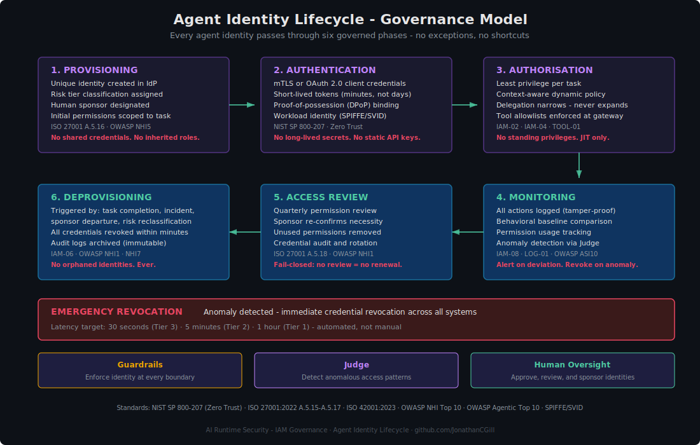
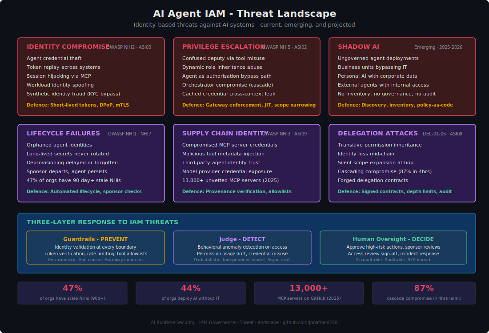

# IAM Governance for AI Systems

**Why traditional identity and access management fails for AI agents — and what to do about it.**

---

## The Problem Traditional IAM Doesn't Solve

Identity and access management was designed for a world where every actor is a human sitting at a keyboard, or an application running a predictable, pre-defined workflow. Access decisions are static: a role is assigned, permissions are granted, access reviews happen quarterly.

AI agents break every assumption in this model.

| Traditional IAM Assumption | AI Agent Reality |
|---------------------------|-----------------|
| Actors are human or run deterministic code | Agents are non-deterministic — same input, different actions |
| Access is scoped to a single application | Agents reach across systems, APIs, databases, and tools in a single task |
| Permissions are assigned at provisioning and reviewed quarterly | Agents need dynamic, task-scoped permissions that change per request |
| One identity = one set of actions | An agent acts on behalf of a user, but may exceed the user's intended scope |
| Sessions are human-length (minutes to hours) | Agent sessions may be seconds (single inference) or days (autonomous workflow) |
| Audit trail links action to person | Audit trail must link action to originating user *through* a chain of agents |

The consequence: AI agents are becoming **authorisation bypass paths**. A user with limited access can instruct an agent to perform actions the user couldn't perform directly — because the agent's service account has broader permissions than the user's role. This is not a theoretical risk. It is the primary IAM threat in AI systems today.

---

## Governance Principles

Ten principles govern IAM for AI systems. They are drawn from internationally recognised standards and adapted for the specific challenges of non-deterministic, agentic AI.

### 1. Identity Is the Primary Control Plane

Every AI agent is an identity. Not a feature. Not a tool. An identity with credentials, permissions, a lifecycle, and an owner.

Treat agent identities with the same governance rigour as human identities: formal registration, approval, classification, review, and decommissioning. ISO 27001:2022 (A.5.16) explicitly requires this — the 2022 revision expanded identity management to cover non-human identities as first-class citizens.

**Implication:** Your identity provider must recognise agents. If agents exist outside your IdP, they exist outside your governance.

### 2. Zero Trust for Every Agent Action

No agent is trusted by default, regardless of where it runs or what created it.

Every request from an agent — every tool invocation, every data retrieval, every delegation — must be evaluated against dynamic policy before it proceeds. This is NIST SP 800-207 (Zero Trust Architecture) applied to AI: continuous verification, per-session authorisation, no implicit trust based on network location or prior behaviour.

**Implication:** A successful authentication does not grant access. Access is determined per-request by a policy engine that evaluates identity, context, behaviour, and risk.

### 3. Least Privilege and Zero Standing Privileges

No agent should hold permissions it is not actively using.

Standing privileges — permissions assigned at provisioning and left in place until review — are the root cause of most IAM-related breaches. For AI agents, the risk is amplified because agent service accounts tend to receive broad permissions "so the AI can be useful." Just-in-time (JIT) access, task-scoped tokens, and short-lived credentials are not aspirational — they are mandatory.

**Implication:** If an agent's token lasts longer than its task, the token is too long-lived. Minutes, not days.

### 4. Delegation Can Only Narrow Scope

When an orchestrator agent delegates work to a sub-agent, the sub-agent's permissions must be a strict subset of the orchestrator's — which is itself a strict subset of the originating user's. Scope narrows at every hop. It never expands.

This is the single most important rule in multi-agent IAM. Without it, a compromised sub-agent can access systems the originating user never could.

**Implication:** Enforce at the gateway, not in the agent. An agent that "promises" to limit itself is not a security control.

### 5. Attribution Through the Full Chain

Every action must be traceable to the human who initiated it, through every agent and sub-agent that handled it, to the final tool that executed it. If the chain breaks — if an action reaches a system with no traceable originating user — the action must fail.

This is not just an audit requirement. It is the only way to maintain human accountability for AI-driven actions, which regulators (EU AI Act Article 14, GDPR Article 22) increasingly demand.

**Implication:** Use structured delegation tokens (OAuth On-Behalf-Of, nested JWT claims) that propagate user identity immutably through the chain.

### 6. Infrastructure Beats Instructions

Do not rely on prompts or agent instructions to enforce access control. An agent that is "told" not to access certain data can be instructed to do so through prompt injection. An agent that *cannot access* certain data — because its credentials don't permit it — is secured regardless of its instructions.

This principle applies to every IAM control: enforce at the gateway, the network, the data layer. Not in the prompt.

**Implication:** If removing the system prompt doesn't change the agent's access boundaries, the access controls are correctly implemented.

### 7. Automated Lifecycle — No Manual Steps in the Critical Path

Agent identity provisioning, credential rotation, access review, and decommissioning must be automated. Manual processes introduce delays that create attack windows: orphaned identities that persist for months, long-lived secrets that are never rotated, deprovisioning that waits for a ticket to be processed.

OWASP NHI Top 10 data shows 47% of organisations have IAM roles from third-party integrations that have been unused for over 90 days. That is 47% of organisations with standing attack surfaces they have forgotten about.

**Implication:** Policy-as-code in version control. Deploy through CI/CD. Every change tracked, reviewed, and reversible.

### 8. Environment Isolation Is Non-Negotiable

Development, staging, and production environments must have separate agent identities, separate credentials, and separate permission sets. An agent credential that works in development must not work in production.

This is OWASP NHI8 (Environment Isolation) and it is violated routinely in AI deployments where teams share API keys across environments for convenience.

**Implication:** A leaked development credential cannot become a production incident.

### 9. Every Tool Invocation Is a Security Boundary

When an agent calls a tool — whether through MCP, a REST API, a database query, or a function call — that invocation crosses a security boundary. It must be validated against a policy engine that checks: Is this agent authorised for this tool? Are the parameters within allowed constraints? Does this action require human approval? Is this action reversible?

This is enforced at the authorisation gateway, not in the agent. The agent does not see the gateway's logic. The agent cannot bypass the gateway. The gateway is the enforcement point.

**Implication:** Tool access governance is IAM governance. They are not separate disciplines.

### 10. Human Oversight for Irreversible Actions

Some actions cannot be undone: financial transactions, data deletion, external communications, contract execution. These actions require explicit human approval before execution, regardless of the agent's permissions. The HITL gate is the last line of defence when all technical controls have been satisfied but the action is too consequential to delegate to software alone.

**Implication:** The approval workflow must be fast enough that it doesn't become a bottleneck, but robust enough that it cannot be rubber-stamped. Canary cases, rotation, and SLA monitoring prevent reviewer fatigue.

---

## The Agent Identity Taxonomy

Not all non-human identities are equal. AI systems introduce identity classes that traditional IAM doesn't distinguish.

| Identity Class | Description | Authentication | Credential Lifetime | Governance |
|---------------|-------------|----------------|--------------------|-----------|
| **Human User** | Person interacting with AI system | IdP, MFA | Session-length | Standard HR/IAM lifecycle |
| **Application Service** | Deterministic software calling AI APIs | OAuth 2.0, mTLS | Hours to days | Existing NHI governance |
| **AI Agent** | Non-deterministic, autonomous actor | Unique identity, scoped tokens | Minutes to hours | New: agent-specific lifecycle |
| **Sub-Agent** | Delegated from orchestrator, narrowed scope | Inherited + narrowed credentials | Task-scoped (minutes) | New: delegation governance |
| **Model-to-Model** | Judge evaluating primary model output | Separate identity, read-only | Session-scoped | Isolated: independent trust domain |
| **MCP Tool Server** | External tool providing capabilities to agents | mTLS, OAuth 2.1 | Per-invocation | New: tool supply chain governance |

The critical distinction is between *application services* (deterministic, predictable, auditable code paths) and *AI agents* (non-deterministic, autonomous, capable of novel behaviour). Traditional NHI governance handles the former. AI agent governance must handle the latter.

---

## The Agent Identity Lifecycle

Every agent identity passes through six governed phases. No exceptions.



### Phase 1: Provisioning

A new agent identity is created when — and only when — a legitimate business need is documented and approved.

| Requirement | Detail |
|-------------|--------|
| **Unique identity** | Registered in the organisation's IdP — not a shared account, not an inherited role |
| **Risk classification** | Assigned a framework risk tier (LOW / MEDIUM / HIGH / CRITICAL) that determines control intensity |
| **Human sponsor** | A named individual accountable for this agent's existence and behaviour |
| **Purpose documentation** | What the agent does, what data it accesses, what tools it invokes, what its boundaries are |
| **Initial permissions** | Scoped to the specific task — not "what the agent might need later" |

**Standards:** ISO 27001:2022 A.5.16 (Identity Management), OWASP NHI5 (Overprivileged NHI)

### Phase 2: Authentication

The agent proves its identity on every interaction. Not once at startup — every time.

| Requirement | Detail |
|-------------|--------|
| **mTLS or OAuth 2.0 client credentials** | Certificate-based authentication preferred for high-trust environments |
| **Short-lived tokens** | Minutes, not days. Tier 3: 15-minute maximum. Tier 2: 1-hour maximum |
| **Proof-of-possession** | DPoP (Demonstration of Proof-of-Possession) binding prevents token replay |
| **Workload identity** | SPIFFE/SVID for platform-level identity in containerised and orchestrated environments |
| **No long-lived secrets** | API keys with no expiration are a vulnerability, not a credential |

**Standards:** NIST SP 800-207 (Zero Trust), OWASP NHI7 (Long-Lived Secrets), OWASP NHI4 (Insecure Authentication)

#### Workload Identity: SPIFFE and SPIRE

Traditional agent authentication relies on secrets — API keys, client certificates, or OAuth tokens that must be provisioned, stored, rotated, and eventually decommissioned. Every secret is a liability: it can be leaked, stolen, or forgotten.

**SPIFFE** (Secure Production Identity Framework for Everyone) eliminates this problem by giving every workload — including AI agents — a cryptographically verifiable identity that is not a secret. Instead of "here is my password," the agent says "here is a signed attestation of what I am, where I run, and what created me." The identity is bound to the workload itself, not to a credential that can be copied.

| Concept | What It Does |
|---------|-------------|
| **SPIFFE ID** | A URI-formatted identity (e.g., `spiffe://org.example/agent/research-bot/prod`) that uniquely identifies a workload. Not a secret — safe to log, inspect, and share |
| **SVID** (SPIFFE Verifiable Identity Document) | A short-lived X.509 certificate or JWT that proves the workload holds a given SPIFFE ID. Issued automatically, rotated frequently, never touches disk in plaintext |
| **Trust Domain** | A namespace boundary. Agents in `spiffe://bank.example/` cannot impersonate agents in `spiffe://partner.example/` without explicit federation |

**SPIRE** (the SPIFFE Runtime Environment) is the production implementation. It runs as infrastructure — an attestation authority that verifies workload identity based on platform-level evidence (node attestation, process attestation, Kubernetes service account, cloud instance metadata) and issues short-lived SVIDs automatically.

**Why this matters for AI agent IAM:**

| Traditional Approach | SPIFFE/SPIRE Approach |
|---------------------|----------------------|
| Agent holds an API key. Key must be stored somewhere. Key can be copied. | Agent's identity is attested by the platform. Nothing to copy. |
| Rotation requires updating every system that accepts the key | SVIDs rotate automatically (minutes to hours). No manual intervention |
| Stolen key works from any location | SVID is bound to platform attestation — stolen certificate is useless without the matching workload environment |
| Shared secrets between agents in the same cluster | Every agent gets a unique SPIFFE ID and unique SVID, even in the same cluster |
| Cross-organisation trust requires shared credentials | Trust domain federation allows controlled cross-org identity verification without sharing secrets |

**When to use SPIFFE/SPIRE:**

- Containerised or orchestrated agent deployments (Kubernetes, cloud-managed compute)
- Multi-agent systems where agents need to authenticate to each other
- Cross-trust-boundary communication (agent in one environment calling tools in another)
- Any Tier 2 or Tier 3 deployment where eliminating static secrets is a governance priority

**When it doesn't apply:**

- SaaS-only deployments where agent workloads run on a vendor's infrastructure (you don't control the attestation layer)
- Single-agent systems using a managed API gateway with OAuth (the gateway handles identity)

SPIFFE/SPIRE is vendor-neutral, CNCF-graduated, and supported across major cloud platforms. It is the closest the industry has to a universal standard for workload identity — and it solves the AI agent authentication problem at the infrastructure layer rather than the application layer.

### Phase 3: Authorisation

The agent receives permissions scoped to the current task, evaluated dynamically at each request.

| Requirement | Detail |
|-------------|--------|
| **Per-task scoping** | Permissions granted for this specific task, not all tasks the agent might perform |
| **Context-aware evaluation** | Policy engine considers: who initiated this request, what is the delegation chain, what is the risk tier, what environment is this |
| **Gateway enforcement** | Authorisation decisions enforced at the API gateway, not within the agent |
| **Tool allowlists** | Explicit declaration of which tools the agent can invoke, with parameter constraints |
| **Delegation contracts** | When sub-delegating, scope narrows — signed, scoped, time-limited delegation tokens |

**Standards:** NIST SP 800-207 (Policy Engine), IAM-02 (Least Privilege), IAM-04 (Tool Constraints), TOOL-01-06

**See also:** [Infrastructure — Identity & Access Controls](../infrastructure/controls/identity-and-access.md), [Tool Access Controls](../infrastructure/agentic/tool-access-controls.md)

### Phase 4: Monitoring

Every agent action is observed, logged, and evaluated — continuously, not after the fact.

| Requirement | Detail |
|-------------|--------|
| **Action logging** | Every tool invocation, data access, delegation event, and response logged with full context |
| **Behavioural baseline** | Establish normal patterns per agent; flag deviations |
| **Permission usage tracking** | Identify permissions granted but never used (candidates for removal) |
| **Judge evaluation** | LLM-as-Judge evaluates access patterns for anomalies that rule-based systems miss |
| **Credential access monitoring** | Track who accesses agent credentials, from where, and when |

**Standards:** IAM-08 (Audit), LOG-01-10 (Logging Controls), OWASP ASI10 (Logging Gaps)

**See also:** [Infrastructure — Logging & Observability](../infrastructure/controls/logging-and-observability.md)

### Phase 5: Access Review

Permissions are reviewed regularly by the agent's human sponsor. Not rubber-stamped — reviewed.

| Requirement | Detail |
|-------------|--------|
| **Quarterly review** | At minimum. CRITICAL-tier agents: monthly |
| **Sponsor confirmation** | The named sponsor re-confirms this agent still needs these permissions for this purpose |
| **Unused permission removal** | Permissions not exercised in the review period are removed (use-it-or-lose-it) |
| **Credential audit** | All credentials verified as current, rotated, and properly scoped |
| **Fail-closed** | If the review is not completed by deadline, the agent's permissions are suspended — not extended |

**Standards:** ISO 27001:2022 A.5.18 (Access Rights Review), OWASP NHI1 (Improper Offboarding)

### Phase 6: Deprovisioning

When an agent is no longer needed, its identity is fully removed. Not disabled — removed.

| Trigger | Action |
|---------|--------|
| **Task completion** | JIT identity automatically expires |
| **Sponsor departure** | Agent identity suspended pending new sponsor assignment (72-hour deadline) |
| **Security incident** | Immediate revocation (30-second target for Tier 3) |
| **Risk reclassification** | Old identity deprovisioned, new identity provisioned under appropriate controls |
| **Review failure** | Permissions not renewed = agent suspended |

All credentials revoked, all active sessions terminated, all downstream system access removed. Audit logs archived (immutable, retained per regulatory requirements).

---

## Delegation and Attribution

In multi-agent systems, the delegation chain determines who is accountable for every action.


### The Delegation Rules

| Rule | Enforcement |
|------|-------------|
| **Scope narrows at every hop** | Sub-agent permissions = intersection of orchestrator permissions and user permissions. Enforced at gateway. |
| **User identity propagates immutably** | OAuth On-Behalf-Of or nested JWT claims carry the originating user's identity through every hop |
| **Every hop is logged** | Chain ID, hop number, agent identity, action, result — full audit trail |
| **Depth is limited by tier** | Tier 1: no delegation. Tier 2: max 2 hops. Tier 3: max 3 hops |
| **No transitive permissions** | Agent A delegates to Agent B. Agent B cannot claim Agent A's permissions beyond the explicit delegation scope |
| **Chain break = action failure** | If identity context is lost at any hop, the action fails. No silent fallback to agent credentials |

**See also:** [Delegation Chains](../infrastructure/agentic/delegation-chains.md) (DEL-01 through DEL-05)

### Context-Aware Access: The Critical Pattern

The most important IAM pattern in AI systems is **context-aware access**: the AI system should never access data based on its own permissions. It should access data based on the *requesting user's* permissions.

```
Traditional:    User → AI Service Account → Database (full access)
Context-aware:  User → AI (user identity propagated) → Database (user's row-level access)
```

Without this pattern, every AI system is a privilege escalation vector. A junior analyst asks a question; the AI retrieves data only a senior executive should see — because the AI's service account can see everything.

Context-aware access requires:
- User identity passed through the entire chain (not just authenticated at the entry point)
- Data layer enforces user permissions (row-level security, column masking, view-based access)
- AI receives only what the user would receive if they queried the system directly

**See also:** [High-Risk Financial Services — Access Controls](../extensions/regulatory/high-risk-financial-services.md#access-controls-who-can-touch-what)

---

## The IAM Threat Landscape

AI agents face identity-based threats that traditional IAM was not designed to counter.



### Current Threats

| Threat | What Happens | Why It's Different for AI |
|--------|-------------|--------------------------|
| **Credential theft** | Attacker steals agent token, impersonates the agent | One stolen token scales to thousands of simultaneous actions — agents don't sleep |
| **Privilege escalation** | Agent accesses resources beyond intended scope | Confused deputy: agent is tricked via prompt injection into using tools in unintended ways |
| **Orphaned identities** | Agent decommissioned but credentials remain active | 47% of organisations have unused NHIs older than 90 days (OWASP NHI1) |
| **Long-lived secrets** | API keys without expiration used for agent authentication | Extended attack windows: one leak provides persistent access for months |
| **Environment leakage** | Development credentials work in production | AI teams share API keys across environments more than traditional development teams |

### Emerging Threats (2025-2026)

| Threat | What Happens | Scale |
|--------|-------------|-------|
| **Shadow AI** | Business units deploy AI agents without IT governance | 44% of organisations report unsanctioned AI deployments |
| **Agent as authorisation bypass** | Users instruct agents to perform actions they couldn't perform directly | Agent service accounts routinely have broader access than any individual user role |
| **MCP tool poisoning** | Malicious instructions embedded in tool metadata manipulate agent behaviour | 13,000+ MCP servers launched on GitHub in 2025, faster than security can catalogue |
| **Delegation chain compromise** | Compromised orchestrator cascades to all downstream agents | Simulated environments show 87% cascade rate within 4 hours |
| **Token chain attacks** | Orchestrator holding tokens for downstream agents is compromised | Single compromise = access to all downstream systems |

### Projected Threats

| Threat | What Changes |
|--------|-------------|
| **Cross-organisation agent delegation** | Agents acting on behalf of users across organisational boundaries — federated identity becomes mandatory |
| **Autonomous credential acquisition** | Agents that can request their own permissions, register their own tools, or negotiate access with other agents |
| **Identity at AI speed** | Attack and defence cycles measured in seconds, not days — human-speed governance becomes a bottleneck |
| **Regulatory identity mandates** | EU AI Act and sector-specific regulation requiring machine-readable identity chains for every AI action |

---

## How This Maps to the Three-Layer Defence

IAM is not a standalone domain. It integrates with every layer of the runtime behavioural security pattern.

| Layer | IAM Function | Controls |
|-------|-------------|----------|
| **Guardrails** | Enforce identity at every boundary. Validate tokens, check permissions, verify tool allowlists — before the agent acts | IAM-01, IAM-04, IAM-07, TOOL-01-06 |
| **Judge** | Detect anomalous access patterns. Behavioural baseline comparison, permission usage drift, credential misuse — evaluated independently of the guardrails the agent interacted with | IAM-08, LOG-01-10 |
| **Human Oversight** | Approve high-risk actions, sponsor agent identities, conduct access reviews, respond to IAM incidents | IAM-05, IAM-03 |

### Independent Failure Domains

The three layers must operate independently for IAM:

- A compromised guardrail (e.g., an attacker bypasses token validation) does not affect the Judge's ability to detect anomalous access patterns
- A Judge model failure does not impair the guardrails' enforcement of identity validation
- A compromised HITL reviewer's session does not affect the guardrail or Judge layer

This is PACE resilience applied to IAM. If one layer fails, the others continue. If all three fail, the [circuit breaker](../PACE-RESILIENCE.md) routes traffic to a non-AI fallback.

---

## Standards and Frameworks

This governance model draws from internationally recognised standards and emerging guidance.

| Standard | What It Contributes | Key References |
|----------|-------------------|----------------|
| **NIST SP 800-207** | Zero Trust Architecture — continuous verification, policy engine model, identity as control plane | Tenets 1-7, ZTA components |
| **NIST NCCoE (Feb 2026)** | AI agent identity and authorisation practical demonstrations — SCIM, NGAC, SPIFFE | Emerging — public comment period |
| **ISO 27001:2022** | Foundational IAM controls — A.5.15 (Access Control), A.5.16 (Identity Management), A.5.17 (Authentication), A.8.2 (Privileged Access), A.8.5 (Secure Authentication) | Non-human identity as first-class citizen |
| **ISO/IEC 42001:2023** | AI management system — risk-based AI governance, lifecycle threat mapping | Integrates with ISO 27001 for IAM |
| **OWASP NHI Top 10 (2025)** | Non-human identity risk taxonomy — 10 categories from improper offboarding to NHI reuse | NHI1, NHI2, NHI3, NHI4, NHI5, NHI7, NHI8, NHI9 |
| **OWASP Agentic Top 10 (2026)** | AI agent security risks — identity abuse, tool misuse, uncontrolled autonomy | ASI02, ASI03, ASI08, ASI10 |
| **OWASP MCP Top 10** | Tool protocol security — token mismanagement, scope creep, shadow servers | MCP-specific IAM risks |
| **OAuth 2.0/2.1** | Delegation standards — On-Behalf-Of, token exchange, DPoP, PKCE | Identity propagation through chains |
| **SPIFFE/SPIRE** | Workload identity — cryptographic attestation replaces static secrets for agent authentication. CNCF-graduated. See [Workload Identity](#workload-identity-spiffe-and-spire) | Kubernetes, containerised, orchestrated, cross-trust-boundary |
| **CoSAI MCP Taxonomy** | 12 MCP threat categories with actionable controls — identity chains, zero-trust, sandboxing | Industry consortium (EY, Google, IBM, Meta, Microsoft, NVIDIA, PayPal) |

---

## Governance Checklist

### Per Agent Identity

| Check | Tier 1 | Tier 2 | Tier 3 |
|-------|--------|--------|--------|
| Registered in IdP with unique identity? | Required | Required | Required |
| Human sponsor designated and documented? | Required | Required | Required |
| Risk tier classification assigned? | Required | Required | Required |
| Purpose and boundaries documented? | Recommended | Required | Required |
| Short-lived credentials (not static API keys)? | Recommended | Required | Required |
| Proof-of-possession binding (DPoP)? | Optional | Recommended | Required |
| Environment isolation (separate creds per env)? | Recommended | Required | Required |
| Tool allowlist defined and enforced at gateway? | N/A | Required | Required |
| Delegation depth limits configured? | No delegation | Max 2 hops | Max 3 hops |
| Automated credential rotation? | Recommended | Required | Required |
| Behavioural baseline established? | Optional | Recommended | Required |
| Access review schedule set? | Quarterly | Quarterly | Monthly |
| Emergency revocation latency tested? | N/A | 5 minutes | 30 seconds |
| Deprovisioning automation in place? | Recommended | Required | Required |

### Organisational

| Check | Status |
|-------|--------|
| Agent identity policy published and approved? | |
| IdP configured to support non-human identities? | |
| Authorisation gateway deployed for all AI endpoints? | |
| Delegation chain audit logging operational? | |
| Access review process documented and tested? | |
| Emergency revocation playbook documented and rehearsed? | |
| Shadow AI discovery process operational? | |
| MCP tool supply chain governance in place? | |
| IAM metrics dashboard operational? | |
| Regulatory compliance mapping maintained? | |

---

## Related Framework Content

| Topic | Document | What It Covers |
|-------|----------|---------------|
| **Technical IAM controls** | [Infrastructure — Identity & Access](../infrastructure/controls/identity-and-access.md) | IAM-01 through IAM-08: authentication, least privilege, plane separation, tool constraints, human approval, session credentials, credential exposure, audit |
| **Secrets and credentials** | [Infrastructure — Secrets & Credentials](../infrastructure/controls/secrets-and-credentials.md) | SEC-01 through SEC-08: context window isolation, short-lived tokens, vault management, credential scanning, rotation, agent isolation |
| **Tool access controls** | [Infrastructure — Tool Access Controls](../infrastructure/agentic/tool-access-controls.md) | TOOL-01 through TOOL-06: allowlisting, gateway enforcement, parameter constraints, reversibility classification, rate limits, logging |
| **Delegation chains** | [Infrastructure — Delegation Chains](../infrastructure/agentic/delegation-chains.md) | DEL-01 through DEL-05: least delegation, audit trails, depth limits, explicit authorisation, identity propagation |
| **Multi-agent IAM** | [MASO — Identity & Access](../maso/controls/identity-and-access.md) | Tiered controls for multi-agent systems: NHI lifecycle, mutual authentication, behavioural binding, delegation contracts |
| **NHI lifecycle** | [Extensions — NHI Lifecycle](../extensions/technical/nhi-lifecycle.md) | Six-phase lifecycle: provisioning, authentication, authorisation, monitoring, review, deprovisioning |
| **Financial services IAM** | [High-Risk Financial Services](../extensions/regulatory/high-risk-financial-services.md) | Four access control layers, financial services requirements, access control anti-patterns |
| **IAM architecture diagram** | [IAM Control Layers](../infrastructure/diagrams/iam-control-layers.svg) | Visual: control plane / data plane separation with agent authorisation gateway |
| **Three-layer pattern** | [Core Controls](controls.md) | How guardrails, Judge, and Human Oversight work together |
| **PACE resilience** | [PACE Resilience](../PACE-RESILIENCE.md) | Failover methodology applied to all controls including IAM |

---

*AI Runtime Behaviour Security, 2026 (Jonathan Gill).*
