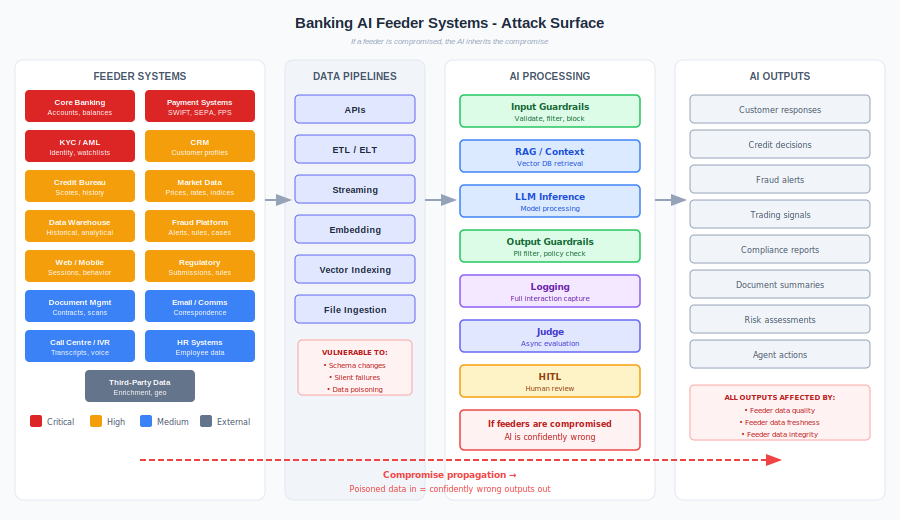

# High-Risk Financial Services

How the top 10 cyber risks facing financial services are affected by — and can be addressed through — AI runtime behavioural security.

---

## Why Financial Services Is the Stress Test

Financial services is where AI runtime security matters most. High regulatory burden, adversarial threat actors, real-time transaction processing, and zero tolerance for unexplainable decisions. If a control pattern works here, it works anywhere.

This document examines the top 10 cyber risks through two lenses:

| Lens | Question |
|------|----------|
| **AI as attack surface** | How does deploying AI systems create new exposure to each risk? |
| **Three-layer defence** | Which risks does the Guardrails → Judge → Human Oversight pattern actually address — and which require infrastructure or general cybersecurity controls instead? |

### Honest Scope

The three-layer runtime pattern (Guardrails prevent, Judge detects, Humans decide) is designed for **AI behavioural security** — controlling what AI systems say and do at runtime. It directly addresses risks that manifest through AI behaviour: data leakage in responses, manipulated outputs, undetected fraud patterns, unexplainable decisions.

It does **not** replace general cybersecurity. Risks like ransomware, DDoS, and cloud misconfiguration require infrastructure controls that sit beneath the behavioural layer. This document is honest about which risks map to the three-layer pattern, which require the framework's 80 infrastructure controls, and which sit outside the framework entirely.

---

## Risk 1: Ransomware

**The risk:** Ransomware attacks against banks increased significantly through 2024-2025, with attackers specifically targeting financial institutions for their willingness to pay. Ransomware-as-a-Service has lowered the barrier to entry. Record ransom demands have reached $75 million.

**How AI systems are exposed:**

| Exposure | Impact |
|----------|--------|
| AI infrastructure encrypted | AI services go offline, no fallback |
| Training data held ransom | Model retraining blocked |
| AI used to craft more convincing phishing | Enables the initial access that leads to ransomware deployment |
| Model endpoints targeted | Denial of AI-powered services |

**How AI can mitigate:**

| Capability | Application |
|------------|-------------|
| Anomaly detection | AI monitors file system activity, flags mass encryption patterns faster than rule-based systems |
| Email analysis | AI evaluates email content, sender behaviour, and attachment risk to catch phishing that delivers ransomware |
| Behavioural analytics | Detects lateral movement and privilege escalation that precedes ransomware deployment |
| Automated response | Isolate affected systems within seconds of detection |

**Three-layer fit:** Partial. Ransomware is an infrastructure threat — the three-layer pattern doesn't prevent ransomware, but it provides the monitoring telemetry (Judge) and escalation paths (Human Oversight) that accelerate detection and response. The primary defences are infrastructure controls: network segmentation, backup resilience, and incident response.

| Layer | Role |
|-------|------|
| Guardrails | Rate limiting, input validation on AI endpoints |
| Judge | Anomaly detection on access patterns; flags mass encryption signatures in telemetry |
| Human Oversight | Incident escalation; decides whether to invoke circuit breaker |
| **Infrastructure** (primary) | Backup isolation, network segmentation, automated containment |

---

## Risk 2: Third-Party and Supply Chain Attacks

**The risk:** Banks depend heavily on third-party vendors for core services. Supply chain attacks bypass the bank's own defences by compromising a trusted vendor. In 2025, a single ransomware attack on a financial services software company impacted over 70 US banks and credit unions. Over 4 million consumers' data was exposed through a breach at a credit reporting agency's CRM system.

**How AI systems are exposed:**

| Exposure | Impact |
|----------|--------|
| Foundation model provider compromised | Model outputs manipulated or service unavailable |
| AI SaaS vendor breached | Customer data exposed via AI platform |
| Poisoned dependencies | Malicious code in AI libraries (LangChain, LlamaIndex, etc.) |
| Embedding service compromise | RAG retrieval returns manipulated content |
| MCP/tool provider breach | Agent actions executed in compromised environment |

AI systems have a uniquely deep supply chain problem: model provider + cloud platform + vector database + embedding service + tool endpoints + framework libraries. Each is a potential attack vector.

**How AI can mitigate:**

| Capability | Application |
|------------|-------------|
| Vendor risk scoring | AI analyses vendor security posture continuously, not just at assessment time |
| Anomaly detection on vendor connections | Flags unusual data flows to/from third parties |
| Contract analysis | AI reviews vendor contracts for security gaps |
| Software composition analysis | AI scans dependencies for known vulnerabilities |

**Three-layer fit:** Partial. The AI supply chain is uniquely deep (model provider + cloud + vector DB + embedding service + tools + libraries). Guardrails can validate data integrity at ingestion boundaries. Judge can detect when retrieved content deviates from expected distributions. But supply chain security is fundamentally an infrastructure and procurement problem.

| Layer | Role |
|-------|------|
| Guardrails | Schema validation on feeder data; source authentication; reject unexpected formats |
| Judge | Detects drift in retrieved content quality; flags when RAG results deviate from baseline |
| Human Oversight | Vendor assessment review; approves new model or tool integrations |
| **Infrastructure** (primary) | Dependency scanning, model provenance verification, vendor risk management |

---

## Risk 3: Social Engineering and Phishing

**The risk:** Social engineering remains the most common initial access vector. 78% of attacks in banking were attributed to system intrusion, errors, and social engineering. AI-powered deepfakes have arrived — in 2025, a Deutsche Bank executive transferred over $140,000 after being deceived by a deepfake video call impersonating the CEO.

**How AI systems are exposed:**

| Exposure | Impact |
|----------|--------|
| AI generates more convincing phishing | Attackers use LLMs to craft personalised, grammatically perfect phishing at scale |
| Deepfake voice/video | AI-generated impersonation of executives for authorisation fraud |
| Prompt injection via social engineering | Users tricked into pasting malicious prompts into AI tools |
| AI chatbots manipulated | Customer-facing bots socially engineered into revealing information |

**How AI can mitigate:**

| Capability | Application |
|------------|-------------|
| Real-time phishing detection | AI analyses email/message content, sender patterns, URL reputation simultaneously |
| Voice authentication | AI verifies speaker identity, detects synthetic speech |
| Deepfake detection | AI identifies AI-generated video/audio in real-time |
| User behaviour analytics | Flags when a user's actions don't match their normal patterns (e.g., sudden large transfer after a call) |
| Customer-facing guardrails | Prevent AI chatbots from being manipulated into disclosing sensitive information |

**Three-layer fit:** Strong for customer-facing AI. The three-layer pattern directly addresses the scenario where attackers manipulate AI chatbots or exploit AI-generated content. Guardrails block known manipulation patterns. Judge evaluates whether the AI is being socially engineered. Human Oversight handles edge cases.

| Layer | Role |
|-------|------|
| Guardrails | Block known prompt injection patterns; content filtering on chatbot inputs/outputs; refuse sensitive disclosures |
| Judge | Detects conversational manipulation patterns; flags when chatbot behaviour deviates from policy; identifies deepfake indicators |
| Human Oversight | Reviews flagged chatbot interactions; approves high-value actions triggered through AI |
| Infrastructure | Voice/video authentication systems; email security infrastructure |

---

## Risk 4: Data Breaches

**The risk:** Financial institutions hold vast quantities of personal and financial data. 75% of stolen data in the sector is personal data. Breaches result in regulatory fines, litigation, and severe reputational damage.

**How AI systems are exposed:**

| Exposure | Impact |
|----------|--------|
| Training data leakage | Models memorise and reproduce PII from training data |
| Prompt-based extraction | Adversaries craft prompts to extract sensitive data from model context |
| RAG data exposure | AI retrieves and surfaces data the user shouldn't see |
| Log exposure | AI interaction logs contain customer data |
| Model inversion | Attackers infer training data from model outputs |

AI systems create new data breach vectors that traditional DLP doesn't cover. A model doesn't exfiltrate data through the network — it speaks it in a response.

**How AI can mitigate:**

| Capability | Application |
|------------|-------------|
| PII detection in outputs | AI scans every response for personal data before delivery |
| Data classification | AI classifies unstructured data at scale, enabling proper controls |
| Access anomaly detection | AI flags unusual data access patterns |
| DLP enhancement | AI understands context — distinguishes between legitimate data use and exfiltration |

**Three-layer fit:** Strong. This is the framework's sweet spot. AI creates entirely new data exfiltration vectors — a model doesn't send data through the network, it speaks it in a response. Traditional DLP doesn't cover this. The three-layer pattern does.

| Layer | Role |
|-------|------|
| **Guardrails** (primary) | PII detection in every output; content filtering blocks sensitive data patterns; data masking before response delivery |
| **Judge** (primary) | Evaluates whether responses contain data the user shouldn't see; detects prompt-based extraction attempts; flags training data memorisation |
| Human Oversight | Reviews flagged data exposure incidents; approves exceptions to data controls |
| Infrastructure | Encryption, access control, data classification, tokenisation |

---

## Risk 5: DDoS Attacks

**The risk:** DDoS attacks against financial services continue to grow in volume and sophistication, with multi-vector attacks rising 80% year-on-year. Attackers use DDoS as both a direct disruption and a smokescreen for other attacks. Financial institutions' strict SLA requirements make them particularly vulnerable to extortion.

**How AI systems are exposed:**

| Exposure | Impact |
|----------|--------|
| AI endpoint flooding | Model inference endpoints overwhelmed |
| Cost-based DoS | Attacker triggers expensive AI inference at scale (no need to crash it — just bankrupt it) |
| Guardrail exhaustion | Guardrail evaluation resources consumed, bypassing controls |
| Cascading failure | AI system failure cascades to dependent business processes |

Cost-based denial of service is a new category specific to AI. An attacker doesn't need to overwhelm your infrastructure — they just need to trigger enough expensive model calls to blow your budget.

**How AI can mitigate:**

| Capability | Application |
|------------|-------------|
| Traffic analysis | AI distinguishes legitimate traffic patterns from DDoS patterns in real-time |
| Adaptive rate limiting | AI adjusts rate limits dynamically based on threat level |
| Bot detection | AI identifies bot traffic that's indistinguishable to rule-based systems |
| Attack prediction | AI correlates threat intelligence to predict and preposition defences |

**Three-layer fit:** Minimal. DDoS is an infrastructure availability problem. The three-layer pattern contributes circuit breakers and PACE degradation (if controls are overwhelmed, degrade gracefully rather than fail open), but the primary defences are infrastructure: rate limiting at the API gateway, traffic analysis, and capacity planning.

| Layer | Role |
|-------|------|
| Guardrails | Rate limiting per user/session; reject malformed requests |
| Judge | Cost monitoring; flags anomalous inference volume |
| Human Oversight | Capacity decisions; approves emergency rate limit changes |
| **Infrastructure** (primary) | API gateway throttling, CDN, traffic analysis, circuit breakers, PACE failover |

---

## Risk 6: Insider Threats

**The risk:** Insiders — employees, contractors, and vendors with legitimate access — pose significant risk. Attackers actively recruit bank employees for intelligence on security configurations. Insiders may act maliciously or be compromised through social engineering.

**How AI systems are exposed:**

| Exposure | Impact |
|----------|--------|
| Prompt engineer manipulates system | Insider modifies prompts to disable controls or extract data |
| Judge criteria weakened | Insider changes evaluation criteria to hide issues |
| HITL reviewer collusion | Reviewer approves flagged transactions deliberately |
| Model exfiltration | Insider copies proprietary model weights or training data |
| Shadow AI deployment | Staff deploy unauthorised AI services that bypass controls |

AI systems amplify insider risk because a single prompt change can fundamentally alter system behaviour — and it's harder to detect than a firewall rule change.

**How AI can mitigate:**

| Capability | Application |
|------------|-------------|
| User behaviour analytics (UBA) | AI baselines normal behaviour and flags deviations |
| Privileged access monitoring | AI monitors admin actions on AI systems in real-time |
| Configuration drift detection | AI detects unauthorised changes to prompts, parameters, guardrails |
| Data access analytics | AI identifies unusual data access patterns by insiders |

**Three-layer fit:** Strong. AI systems amplify insider risk because a single prompt change can alter system behaviour — harder to detect than a firewall rule change. The three-layer pattern's independent failure domains are specifically designed for this: a compromised guardrail doesn't fool the Judge, and a compromised Judge doesn't bypass Human Oversight.

| Layer | Role |
|-------|------|
| Guardrails | Version-controlled configurations; reject unauthorised parameter changes |
| **Judge** (primary) | Configuration drift detection; detects when guardrail criteria weaken; flags prompt modifications that reduce safety coverage |
| **Human Oversight** (primary) | Approves all configuration changes to AI systems; reviews HITL reviewer decisions for collusion; mandatory sign-off for Judge criteria changes |
| Infrastructure | PAM, session recording, immutable audit logs, Git-based config management |

---

## Risk 7: Cloud Security

**The risk:** As banking operations migrate to cloud, the attack surface expands. Misconfigured cloud resources, inadequate access controls, and shared responsibility confusion create vulnerabilities. Cloud credentials are a high-value target.

**How AI systems are exposed:**

| Exposure | Impact |
|----------|--------|
| Misconfigured model endpoints | AI API exposed publicly without authentication |
| Overly permissive IAM | AI service accounts with excessive permissions |
| Data residency violations | AI processing data in unapproved regions |
| Shared tenancy risks | AI platform shared with other customers |
| Credential exposure | AI service credentials leaked in code or logs |

AI systems are particularly exposed because they often require broad data access to function, creating tension between security (least privilege) and capability (the model needs data to be useful).

**How AI can mitigate:**

| Capability | Application |
|------------|-------------|
| Cloud security posture management | AI continuously scans cloud configs for misconfigurations |
| Infrastructure as Code analysis | AI reviews IaC templates for security issues before deployment |
| Identity threat detection | AI monitors cloud identity activity for anomalies |
| Compliance monitoring | AI maps cloud resources against regulatory requirements continuously |

**Three-layer fit:** Minimal. Cloud security is an infrastructure problem. The framework's infrastructure controls (network segmentation, IAM, secrets management) address this directly, but the three-layer runtime pattern operates *on top of* cloud infrastructure — it doesn't secure the cloud itself.

| Layer | Role |
|-------|------|
| Guardrails | Enforce AI endpoint access controls |
| Judge | Monitor for credential exposure in AI interactions |
| Human Oversight | Review cloud configuration changes affecting AI systems |
| **Infrastructure** (primary) | Cloud security posture management, IAM, network zones, encryption, region-locked deployments |

---

## Risk 8: AI-Powered Attacks

**The risk:** Attackers are using AI to enhance traditional attack methods — more convincing phishing, faster vulnerability discovery, automated reconnaissance, and polymorphic malware that evades detection. 87% of C-suite executives believe their organisation's cyber protection is inadequate against these evolving threats.

**How AI systems are exposed:**

| Exposure | Impact |
|----------|--------|
| Adversarial inputs | Crafted inputs designed to make AI systems behave incorrectly |
| Prompt injection | Attacker instructions embedded in data the AI processes |
| Model evasion | Adversaries craft inputs that bypass AI-based detection |
| Data poisoning | Subtle corruption of training or RAG data |
| AI arms race | Defensive AI must keep pace with offensive AI |

This is the category where traditional cyber risk and AI-specific risk converge. Attackers using AI to attack AI creates a recursive problem.

**How AI can mitigate:**

| Capability | Application |
|------------|-------------|
| Adversarial robustness testing | AI red-teams other AI systems to find weaknesses |
| Adaptive defence | AI defences that evolve as attack patterns change |
| Threat intelligence synthesis | AI processes vast threat intelligence feeds to identify emerging attack techniques |
| Automated patch prioritisation | AI assesses vulnerability severity in context of the bank's specific environment |

**Three-layer fit:** Strong. This is the adversarial scenario the three-layer pattern was designed for. Adversarial inputs crafted to make AI behave incorrectly, prompt injection, data poisoning — these are runtime behavioural attacks. Independent failure domains mean an attack that bypasses guardrails still faces the Judge (different model, different evaluation criteria), and attacks that fool both still face Human Oversight.

| Layer | Role |
|-------|------|
| **Guardrails** (primary) | Adversarial input detection; prompt injection filtering; encoding and obfuscation detection |
| **Judge** (primary) | Evaluates whether outputs are policy-compliant despite adversarial manipulation; detects model evasion patterns; independent evaluation means different attack surface from guardrails |
| Human Oversight | Red team exercises; reviews novel attack patterns; updates guardrail and Judge criteria based on findings |
| Infrastructure | Adversarial robustness testing pipelines; model update and patch management |

---

## Risk 9: Regulatory Non-Compliance

**The risk:** Regulatory expectations around cybersecurity and AI are tightening. EU AI Act, DORA, GDPR, FFIEC guidelines, PRA/FCA expectations in the UK, and evolving frameworks like NIST AI RMF all impose requirements. Non-compliance leads to fines, enforcement action, and operational restrictions. The FFIEC Cybersecurity Assessment Tool is being retired in August 2025, creating a framework transition challenge.

**How AI systems are exposed:**

| Exposure | Impact |
|----------|--------|
| Unexplainable decisions | AI decisions that can't be explained to regulators |
| Automated decision-making (GDPR Art 22) | AI making decisions affecting individuals without human involvement |
| Cross-border data transfer | AI processing data across jurisdictions |
| Inadequate documentation | Can't demonstrate AI governance to auditors |
| Bias and fairness failures | AI producing discriminatory outcomes |

AI introduces new compliance obligations that most banks aren't yet equipped to meet. Every jurisdiction is developing AI-specific regulation at different speeds, creating a patchwork of requirements.

**How AI can mitigate:**

| Capability | Application |
|------------|-------------|
| Continuous compliance monitoring | AI maps controls to regulatory requirements and identifies gaps in real-time |
| Automated evidence collection | AI gathers audit evidence continuously rather than at audit time |
| Regulatory change tracking | AI monitors regulatory developments and assesses impact |
| Policy compliance checking | AI evaluates whether AI system behaviour aligns with documented policies |

**Three-layer fit:** Strong. Regulatory compliance is about proving your AI systems behave correctly — exactly what the three-layer pattern provides. Guardrails enforce policy boundaries. Judge provides continuous compliance evidence. Human Oversight delivers the accountability regulators demand.

| Layer | Role |
|-------|------|
| Guardrails | Enforce compliance boundaries (data residency, consent checks, content policy) |
| **Judge** (primary) | Continuous compliance evaluation; generates audit evidence showing every interaction was assessed; detects explainability gaps |
| **Human Oversight** (primary) | Provides the human accountability regulators require (GDPR Art 22, EU AI Act Art 14); documented review trails; responds to regulator inquiries |
| Infrastructure | Tamper-proof audit logging; evidence retention; regulatory reporting pipelines |

---

## Risk 10: Fraud

**The risk:** Fraud schemes in payments are becoming more sophisticated. 68% of banking professionals say payment fraud will definitely get more sophisticated in 2026. Account takeover fraud generated over $262 million in FBI-reported losses. Mule account networks are increasingly complex and AI-generated.

**How AI systems are exposed:**

| Exposure | Impact |
|----------|--------|
| AI used to generate synthetic identities | Fake customer profiles that pass KYC |
| AI-generated documents | Convincing forged documents for loan applications |
| AI chatbot manipulation | Customers' chatbot sessions hijacked to authorise transactions |
| AI-assisted mule networks | AI optimises money movement to avoid detection |
| Adversarial evasion | Fraudsters craft transactions to bypass AI fraud detection |

**How AI can mitigate:**

| Capability | Application |
|------------|-------------|
| Transaction monitoring | AI evaluates transaction patterns in real-time, flagging anomalies |
| Network analysis | AI maps relationships between accounts to identify mule networks |
| Document verification | AI detects forged or AI-generated documents |
| Behavioural biometrics | AI verifies identity through typing patterns, device usage, session behaviour |
| Adaptive models | Fraud detection that evolves as fraud techniques change |

**Three-layer fit:** Strongest. Fraud detection in financial services is the canonical use case for runtime behavioural security. Transaction guardrails enforce limits. The Judge evaluates transaction patterns for anomalies that rules miss. Human Oversight provides the final decision on flagged transactions — exactly the workflow this framework was designed for.

| Layer | Role |
|-------|------|
| **Guardrails** (primary) | Transaction limits, velocity checks, content filtering on AI-generated documents, synthetic identity detection rules |
| **Judge** (primary) | Evaluates transaction patterns against behavioural baselines; detects mule network patterns; flags AI-generated document forgeries; identifies adversarial evasion of fraud rules |
| **Human Oversight** (primary) | Reviews flagged transactions; makes final fraud/not-fraud determination; escalates novel patterns; provides feedback to improve Judge accuracy |
| Infrastructure | Transaction monitoring infrastructure; network analysis; behavioural biometrics |

---

## Summary: Risk to Three-Layer Mapping

| # | Cyber Risk | Three-Layer Fit | Primary Defence Layer | What the Pattern Addresses |
|---|-----------|----------------|----------------------|---------------------------|
| 1 | Ransomware | **Partial** | Infrastructure | Judge telemetry accelerates detection; PACE ensures graceful degradation |
| 2 | Supply chain | **Partial** | Infrastructure | Guardrails validate data at ingestion boundaries; Judge detects content drift |
| 3 | Social engineering | **Strong** | Guardrails + Judge | Guardrails block manipulation; Judge detects conversational attacks on chatbots |
| 4 | Data breaches | **Strong** | Guardrails + Judge | PII detection in outputs; Judge catches prompt-based extraction; new vectors, new defences |
| 5 | DDoS | **Minimal** | Infrastructure | Circuit breakers and PACE degradation; primary defence is infrastructure |
| 6 | Insider threats | **Strong** | Judge + Human Oversight | Judge detects config drift; Human Oversight enforces separation of duties on AI config |
| 7 | Cloud security | **Minimal** | Infrastructure | Three-layer pattern operates on top of cloud infra, doesn't secure it |
| 8 | AI-powered attacks | **Strong** | Guardrails + Judge | Independent failure domains — adversarial bypass of guardrails still faces Judge |
| 9 | Regulatory | **Strong** | Judge + Human Oversight | Judge provides continuous compliance evidence; Human Oversight delivers accountability |
| 10 | Fraud | **Strongest** | All three layers | Canonical use case: guardrails enforce limits, Judge detects anomalies, humans decide |

### What This Tells You

**5 of 10 risks map strongly to the three-layer pattern** (Social engineering, Data breaches, AI-powered attacks, Regulatory, Fraud). These are risks that manifest through AI behaviour — the pattern's design target.

**2 risks map strongly to Judge + Human Oversight** (Insider threats, Regulatory). Detection and accountability, not prevention.

**3 risks are primarily infrastructure problems** (Ransomware, DDoS, Cloud security). The three-layer pattern contributes but isn't the primary defence. Use the framework's [80 infrastructure controls](../../infrastructure/README.md) for these.

**1 risk is a procurement/governance problem** (Supply chain). The pattern helps at boundaries, but the real defence is vendor assessment, dependency management, and model provenance verification.

---

## Feeder Systems: What Feeds the AI

AI systems don't generate knowledge from nothing. They consume data from upstream financial systems — and inherit every vulnerability those systems carry. If a feeder system is compromised, the AI is confidently wrong or actively dangerous.



### The Financial Services AI Data Supply Chain

```
Feeder Systems → Data Pipelines → AI Processing → Outputs
(if any link is compromised, the AI inherits the compromise)
```

### Feeder System Inventory

| Feeder System | What It Feeds the AI | Data Sensitivity |
|---------------|---------------------|------------------|
| **Core Banking** | Account balances, transaction history, customer status | Critical |
| **CRM** | Customer profiles, interaction history, preferences | High |
| **Payment Systems** (SWIFT, SEPA, Faster Payments) | Transaction data, payment instructions | Critical |
| **KYC/AML Platform** | Customer identity, risk ratings, watchlist matches | Critical |
| **Credit Bureau Feeds** | Credit scores, repayment history, defaults | High |
| **Market Data** (Bloomberg, Reuters, exchanges) | Prices, rates, indices, economic data | High |
| **Document Management** | Scanned documents, contracts, correspondence | Medium-High |
| **Data Warehouse / Data Lake** | Aggregated, historical, analytical data | High |
| **HR Systems** | Employee data (if AI used for internal processes) | High |
| **Regulatory Reporting** | Regulatory submissions, compliance data | High |
| **Email / Communications** | Customer and internal communications | Medium-High |
| **Call Centre / IVR** | Call transcripts, voice recordings | Medium-High |
| **Web / Mobile Banking** | Session data, user behaviour, transaction requests | High |
| **Fraud Detection Platform** | Alerts, rules, case data | High |
| **Third-Party Data Providers** | Enrichment data, demographic, geolocation | Medium |

### How Feeder System Compromise Maps to the 10 Risks

| Feeder System | Relevant Cyber Risks | Compromise Scenario |
|---------------|---------------------|---------------------|
| **Core Banking** | #1 Ransomware, #4 Data breach, #6 Insider | Core banking encrypted → AI has no data. Core banking breached → AI surfaces stolen data in responses. Insider modifies account data → AI makes decisions on false information. |
| **CRM** | #2 Supply chain, #4 Data breach | Third-party CRM breached (as happened with credit reporting agency) → AI customer insights built on exposed data. AI-powered personalisation serves compromised profiles. |
| **Payment Systems** | #1 Ransomware, #5 DDoS, #10 Fraud | Payment system down → AI fraud detection blind. Payment data manipulated → AI learns wrong transaction patterns. Mule transactions injected → AI trained on fraudulent baselines. |
| **KYC/AML Platform** | #4 Data breach, #10 Fraud, #9 Regulatory | KYC data poisoned → AI approves synthetic identities. AML watchlist outdated → AI misses sanctioned entities. Regulatory fine for AI decisions based on compromised KYC. |
| **Credit Bureau Feeds** | #2 Supply chain, #10 Fraud | Bureau data manipulated → AI approves fraudulent credit applications. Feed interrupted → AI makes lending decisions without current credit data. |
| **Market Data** | #2 Supply chain, #5 DDoS | Market data feed poisoned → AI trading/risk models act on false prices. Feed goes down → AI uses stale data, makes wrong recommendations. |
| **Document Management** | #3 Social engineering, #10 Fraud | Forged documents uploaded → AI processes and trusts fraudulent content. AI-generated fake documents inserted → downstream processes approve fraudulent applications. |
| **Data Warehouse** | #4 Data breach, #6 Insider, #7 Cloud | Warehouse breached → AI training data exposed. Insider modifies historical data → AI models retrained on corrupted data. Cloud misconfiguration exposes warehouse → all AI systems affected. |
| **HR Systems** | #4 Data breach, #6 Insider | HR data exposed via AI-powered internal tools. Insider modifies access records → AI grants inappropriate permissions. |
| **Email / Comms** | #3 Social engineering, #4 Data breach | AI processes phishing emails as legitimate correspondence. AI summarises confidential communications to unauthorised users. |
| **Web / Mobile** | #3 Social engineering, #5 DDoS | Session data manipulated → AI learns from bot traffic. DDoS on mobile banking → AI customer service overwhelmed. |
| **Fraud Platform** | #6 Insider, #10 Fraud | Insider suppresses fraud alerts before AI sees them. Fraud rules manipulated → AI fraud models learn to ignore real fraud. |
| **Third-Party Data** | #2 Supply chain | Enrichment data poisoned → AI decisions based on false demographics. Provider breached → PII flows through AI pipelines undetected. |

### The Cascading Failure Problem

A single feeder system compromise can cascade through multiple AI systems:

| Scenario | Cascade Path | Impact |
|----------|-------------|--------|
| Core banking ransomware | Core banking down → Data lake stale → All AI systems operating on old data → Fraud detection blind, customer AI gives wrong balances, credit decisions based on outdated info | Multiple AI systems fail simultaneously |
| CRM breach | CRM data exposed → AI customer assistant has compromised context → AI-generated communications reference leaked data → Regulatory and reputational damage | Privacy violation amplified by AI |
| Market data poisoning | False prices → AI risk models miscalculate → Trading AI acts on bad data → AI reporting shows wrong positions → Regulatory breach | Financial loss compounded at each AI layer |
| KYC data manipulation | Synthetic identity passes KYC → AI onboarding approves → AI credit model approves loan → AI fraud detection sees "legitimate" customer → No alerts generated | End-to-end fraud enabled by trusted feeder |
| Payment system DDoS | Payments down → AI can't see transactions → Fraud detection blind → Attackers process fraudulent transactions during window → AI learns disrupted patterns as normal | Attack and exploitation in single event |

### Feeder System Controls

| Control | Purpose | Framework Mapping |
|---------|---------|-------------------|
| **Data integrity validation** | Verify feeder data hasn't been tampered with before AI ingestion | AI.5 Data Governance |
| **Freshness monitoring** | Alert when feeder data is stale beyond threshold | AI.5 Data Governance, AI.11 Monitoring |
| **Source authentication** | Verify feeder system identity before accepting data | AI.7 Guardrails |
| **Schema validation** | Reject data that doesn't match expected format | AI.7 Guardrails |
| **Anomaly detection on inputs** | Flag when feeder data distribution shifts unexpectedly | AI.8 Judge |
| **Fallback behaviour** | Define what AI does when feeder is unavailable (degrade gracefully, not silently) | AI.15 Continuity |
| **Data lineage tracking** | Know which feeder system produced which data in which AI output | AI.5 Data Governance |
| **Access segregation** | AI reads from replicas, not production feeder systems | AI.4 Development |
| **Reconciliation** | Compare AI's view of data against source of truth periodically | AI.11 Monitoring |

### Feeder System Checklist (Per AI System)

| Check | Status |
|-------|--------|
| All feeder systems identified and documented? | ☐ |
| Data flows mapped (what data, from where, how often)? | ☐ |
| Freshness thresholds defined per feeder? | ☐ |
| Fallback behaviour defined if feeder unavailable? | ☐ |
| Data integrity validation in place? | ☐ |
| Feeder system included in AI system risk assessment? | ☐ |
| Feeder system owners aware their data feeds AI? | ☐ |
| Incident response covers feeder system compromise? | ☐ |
| Data lineage tracked from feeder to AI output? | ☐ |

---

## Access Controls: Who Can Touch What

AI systems create an access control problem that traditional banking IAM wasn't designed for. The model needs broad data access to be useful. Security demands least privilege. These two requirements are in direct tension.

### The AI Access Control Challenge

In traditional banking, access control is straightforward: a user has a role, the role grants access to specific systems and data. With AI, the picture changes:

| Traditional Access | AI Access |
|-------------------|-----------|
| User → Application → Data | User → AI → Any data the AI can reach |
| Access scoped by role | AI may access data across roles to generate a response |
| Audit trail shows who accessed what | Audit trail shows the AI accessed it — but on behalf of whom? |
| Deny by default | AI needs broad access to be useful |
| Access is binary (yes/no) | AI may partially surface data it shouldn't |

**The core problem:** A customer service AI that can answer any question needs access to account data, transaction history, product information, policies, and more. But a customer service agent in a branch doesn't have access to all of that. The AI has become a privilege escalation vector.

### Access Control Layers for Financial Services AI

#### Layer 1: Who Can Access the AI System

| Control | Purpose | Implementation |
|---------|---------|----------------|
| **Authentication** | Verify identity of all AI consumers | SSO, MFA, certificate-based for system-to-system |
| **Authorisation** | Determine what each consumer can ask | Role-based access to AI endpoints |
| **API gateway** | Central enforcement point | API keys, OAuth tokens, rate limits |
| **Session management** | Limit session scope and duration | Token expiry, session timeout, re-authentication for sensitive actions |
| **Network segmentation** | Restrict who can reach AI endpoints | VPC, firewall rules, private endpoints |

#### Layer 2: What the AI Can Access

This is where financial institutions fail most often. The AI service account typically has far more access than any individual user would.

| Control | Purpose | Implementation |
|---------|---------|----------------|
| **Per-use-case service accounts** | Different AI systems get different access | Separate credentials per AI application, not one shared AI account |
| **Data scope restriction** | AI only accesses data relevant to its function | Row-level security, column masking, view-based access |
| **Context-aware access** | Access depends on who's asking | Pass user identity through to data layer; AI inherits the user's permissions, not its own |
| **Time-bound access** | Temporary access for specific tasks | Short-lived tokens, just-in-time access |
| **Read-only by default** | AI cannot modify source systems unless explicitly authorised | Read-only service accounts; separate write credentials requiring approval |

**Context-aware access is critical.** If a junior analyst asks the AI a question, the AI should only retrieve data the junior analyst can see — not everything the AI technically has access to. This requires passing user context through the entire chain.

#### Layer 3: What the AI Can Do

| Control | Purpose | Implementation |
|---------|---------|----------------|
| **Action allowlisting** | AI can only perform approved actions | Explicit action registry per AI system |
| **Approval workflows** | High-risk actions require human sign-off | HITL gates before financial transactions, data modifications |
| **Segregation of duties** | AI cannot both recommend and execute | Separate systems for recommendation and execution |
| **Transaction limits** | Cap what AI can commit to | Monetary limits, volume limits, scope limits |
| **Irreversibility controls** | Extra scrutiny for actions that can't be undone | Confirmation steps, cooling-off periods, dual approval |

#### Layer 4: Who Can Change the AI

This is the most overlooked layer. Whoever can modify the AI's configuration effectively controls what it does.

| Control | Purpose | Implementation |
|---------|---------|----------------|
| **Prompt access control** | Restrict who can modify system prompts | Git-based access control, branch protection, PR approval |
| **Guardrail admin** | Restrict who can change guardrail rules | Separate admin role, change approval, audit log |
| **Judge criteria access** | Restrict who can modify evaluation criteria | Same rigour as changing audit methodology |
| **Model deployment** | Restrict who can deploy or swap models | Deployment pipeline with approval gates |
| **Configuration audit** | Log all configuration changes with who, what, when, why | Immutable audit log for all AI config changes |

### Financial Services Access Requirements

| Requirement | Why It Matters for AI | Implementation |
|-------------|----------------------|----------------|
| **Chinese walls** | Investment banking AI must not access retail customer data and vice versa | Separate AI deployments per business division, network isolation |
| **Need-to-know** | AI shouldn't surface information the user doesn't need for their task | Contextual access control; scope retrieval to user's function |
| **Segregation of duties** | Same person shouldn't configure the AI and approve its outputs | Separate roles for AI development, deployment, operation, and HITL review |
| **Customer consent** | Some data use requires explicit customer consent | Consent flags in data layer; AI checks before retrieval |
| **Privileged access management** | Admin access to AI systems is high-risk | PAM solution, session recording, time-limited access, dual approval |
| **Cross-border restrictions** | Some customer data cannot leave jurisdiction | Data residency controls on AI processing; region-locked deployments |
| **Regulatory access** | Regulators may demand access to AI decision records | Tamper-proof logging, retention policies, export capability |

### Access Control Anti-Patterns in Financial Services AI

| Anti-Pattern | Risk | Fix |
|-------------|------|-----|
| Single "AI service account" with broad access | Every AI system has the same blast radius | Per-system service accounts with scoped permissions |
| AI inherits admin-level database access | Any prompt injection can query anything | Read-only, scoped views per AI system |
| No distinction between user roles at AI layer | Junior staff get same AI responses as senior | Pass user context; filter retrieval by user's permissions |
| Prompt engineers have production access | One person can change AI behaviour in production | Git-based config, PR review, separate deployment credentials |
| Shared API keys across environments | Dev key leaked → production exposed | Per-environment keys, rotated on schedule |
| No logging of who asked what | Can't investigate or audit | Log user identity, query, response, data accessed |
| AI can read and write to source systems | Compromised AI can modify banking data | Read-only by default; write access only through approved, audited paths |

---

## Data Security: Protecting Data Through the AI Pipeline

Data in an AI system moves through more stages than traditional banking applications. Each stage needs protection.

### Data States in an AI System

| Stage | Where Data Exists | Risk |
|-------|-------------------|------|
| **At rest in feeder** | Core banking, CRM, data warehouse | Traditional data breach risk |
| **In transit to AI** | API calls, ETL pipelines, streaming | Interception, manipulation |
| **In vector store** | Embeddings in vector database | Embedding inversion, unauthorised retrieval |
| **In model context** | Prompt + retrieved context sent to model | Prompt extraction, context leakage |
| **In model memory** | Model may retain information within session | Cross-session information leakage |
| **In model response** | Generated output containing data | PII leakage, data exfiltration via response |
| **In logs** | Full interaction logs for Judge evaluation | Log breach exposes all interactions |
| **In Judge evaluation** | Judge processes interaction data | Judge model sees all data the primary model saw |
| **In HITL queue** | Human reviewers see flagged interactions | Over-exposure of sensitive data to reviewers |
| **In backups** | Copies of all the above | Backup breach exposes everything |

**Traditional DLP focuses on stages 1 and 2.** AI creates stages 3-9, none of which existing banking DLP typically covers.

### Encryption Requirements

| Data State | Encryption Requirement | Standard |
|------------|----------------------|----------|
| At rest (all stages) | AES-256 | Mandatory |
| In transit (all stages) | TLS 1.2+ (prefer 1.3) | Mandatory |
| In vector store | Encrypted at rest, access controlled | Mandatory |
| In logs | Encrypted at rest, tamper-protected | Mandatory |
| In backups | Encrypted, separate key management | Mandatory |
| API keys and credentials | Vault-managed, never in code | Mandatory |
| Model weights (proprietary) | Encrypted at rest, access controlled | If applicable |

### Data Classification for AI

Financial institutions already classify data. AI requires extending classification to new data types:

| Data Type | Classification | AI-Specific Handling |
|-----------|---------------|---------------------|
| **Customer PII** | Confidential / Restricted | Mask before AI ingestion where possible; PII detection in outputs |
| **Financial data** | Confidential | Aggregate where possible; don't surface individual records |
| **Authentication credentials** | Restricted | Never include in AI context; strip from all pipelines |
| **Account numbers** | Confidential | Tokenise before AI processing |
| **Transaction data** | Confidential | Anonymise for training/testing; real data only in production with controls |
| **Credit data** | Confidential / Regulated | Subject to credit reporting regulations; extra consent requirements |
| **Embeddings** | Same as source data | Embeddings can be inverted — classify at source data level |
| **AI interaction logs** | Confidential | Contain customer queries and AI responses — treat as customer data |
| **System prompts** | Internal / Proprietary | Contain business logic and security controls — protect accordingly |
| **Judge evaluation results** | Internal | May contain sensitive interaction details |
| **Model weights** | Proprietary (if custom) | Represent significant investment; protect as trade secrets |

### Data Minimisation

Financial institutions should apply data minimisation principles specifically to AI:

| Principle | Application |
|-----------|-------------|
| **Collect minimum** | AI context window should contain only data needed for the specific query |
| **Retrieve minimum** | RAG should return relevant chunks, not entire documents |
| **Retain minimum** | Log retention based on risk tier; don't keep everything forever |
| **Surface minimum** | AI responses should not include data the user didn't ask for |
| **Share minimum** | Judge and HITL should see only what's needed to evaluate, not full context if avoidable |

### PII Handling in the AI Pipeline

| Pipeline Stage | PII Control | Implementation |
|----------------|------------|----------------|
| **Ingestion** | Detect and tag PII at ingestion | NER-based PII detection on all feeder data |
| **Storage** | Tokenise or mask PII in vector store | Replace PII with tokens; maintain mapping in secure vault |
| **Retrieval** | Filter PII from context based on user permissions | Context-aware retrieval with PII masking |
| **Prompt assembly** | Minimise PII in prompt | Include only essential PII; instruct model not to echo unnecessary PII |
| **Response** | Scan output for PII leakage | Output guardrail with PII detection; block or mask before delivery |
| **Logging** | Redact PII from logs where not needed for audit | Selective redaction; full logs only for CRITICAL tier |
| **Judge evaluation** | Judge sees PII only if needed to evaluate | Anonymised evaluation where possible |

### Data Residency and Sovereignty

AI introduces data residency complications that traditional banking systems don't have:

| Concern | Risk | Mitigation |
|---------|------|------------|
| **Model API calls** | Customer data sent to model provider's infrastructure | Use region-locked endpoints; verify provider's data processing location |
| **Embedding services** | Data sent to embedding API may cross borders | Self-host embedding models or use region-locked services |
| **Vector database** | Embeddings stored may be subject to local data laws | Deploy vector DB in same region as source data |
| **Multi-region failover** | Failover may route data to different jurisdiction | Ensure failover regions comply with same residency requirements |
| **Model provider logging** | Provider may log your data for training/improvement | Contractual prohibition; verify with provider; use zero-retention options |
| **Third-party tools (MCP)** | Agent tool calls may send data to external services | Allowlist tool endpoints; verify data handling per tool |

### Data Security Checklist (Per AI System)

| Check | Status |
|-------|--------|
| **Encryption** | |
| Data encrypted at rest in all stages? | ☐ |
| TLS 1.2+ for all data in transit? | ☐ |
| API keys in vault, not code? | ☐ |
| Backup encryption with separate keys? | ☐ |
| **Classification** | |
| All data types classified? | ☐ |
| Embeddings classified at source data level? | ☐ |
| AI logs classified as customer data? | ☐ |
| **PII** | |
| PII detected at ingestion? | ☐ |
| PII masked/tokenised in vector store? | ☐ |
| PII scanned in AI outputs? | ☐ |
| PII redacted in logs (where appropriate)? | ☐ |
| **Residency** | |
| Model API region confirmed? | ☐ |
| Vector DB region confirmed? | ☐ |
| Provider zero-retention confirmed? | ☐ |
| Cross-border data flows documented? | ☐ |
| **Minimisation** | |
| Context window contains only required data? | ☐ |
| RAG retrieval scoped appropriately? | ☐ |
| Log retention aligned to risk tier? | ☐ |
| **Access** | |
| Per-system service accounts (not shared)? | ☐ |
| User context passed through to data layer? | ☐ |
| Read-only by default? | ☐ |
| Configuration changes audited? | ☐ |
| Privileged access managed (PAM)? | ☐ |

---

## Implications for Financial Services AI

### Build With These Risks In Mind

Every financial services AI system should be evaluated against these 10 risks during design — and classified against the framework's risk tiers. Most customer-facing and regulated AI systems in financial services will be CRITICAL or HIGH tier, requiring all three defence layers at full strength.

| Design Question | Relevant Risks |
|----------------|----------------|
| What happens if this AI system is unavailable? | #1 Ransomware, #5 DDoS |
| What third parties does this depend on? | #2 Supply chain |
| Can this system be socially engineered? | #3 Social engineering |
| What data can this system access or expose? | #4 Data breach |
| What does it cost if an attacker triggers it at scale? | #5 DDoS (cost-based) |
| Who can change how this system behaves? | #6 Insider |
| Where does this system process data? | #7 Cloud, #9 Regulatory |
| How would an attacker manipulate this system? | #8 AI-powered attacks |
| Can we explain this system's decisions to a regulator? | #9 Regulatory |
| Could this system be used to facilitate fraud? | #10 Fraud |

### The SaaS Dimension

When financial institutions build AI-powered SaaS solutions for internal use or customer-facing services, they inherit the responsibilities of a SaaS provider:

| Responsibility | Implication |
|----------------|-------------|
| **Availability** | SLA commitments require resilience planning (Risks #1, #5) |
| **Multi-tenancy** | Data isolation between business units or customers (Risk #4) |
| **Patching** | Continuous updates without service disruption (Risk #2) |
| **Access control** | Identity and authorisation at scale (Risks #6, #7) |
| **Audit trail** | Comprehensive logging for compliance (Risk #9) |
| **Incident response** | Defined processes when things go wrong (All risks) |

---

## Recommended Actions

### Immediate

1. Classify every AI system against the framework's risk tiers (CRITICAL / HIGH / MEDIUM / LOW)
2. Map each system against these 10 risks — identify which are unmitigated
3. Deploy basic guardrails on all customer-facing AI (input validation, output PII scanning)

### Short-Term

4. Deploy Judge in shadow mode on CRITICAL-tier systems — measure before you enforce
5. Establish HITL queues with SLAs for flagged interactions (1h for CRITICAL, 4h for HIGH)
6. Integrate AI risk into existing cyber risk frameworks — don't create a parallel process
7. Review data access permissions for all AI systems (least privilege)

### Medium-Term

8. Move Judge from shadow to advisory to operational on validated systems
9. Establish AI red-teaming capability — test against Risks #3, #4, #8, #10 specifically
10. Deploy PACE resilience across all CRITICAL-tier AI systems — define fail postures
11. Develop AI-specific incident response playbooks covering all 10 risks
---

*AI Runtime Behaviour Security, 2026 (Jonathan Gill).*
