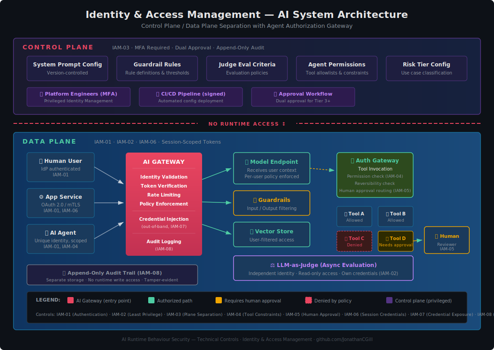
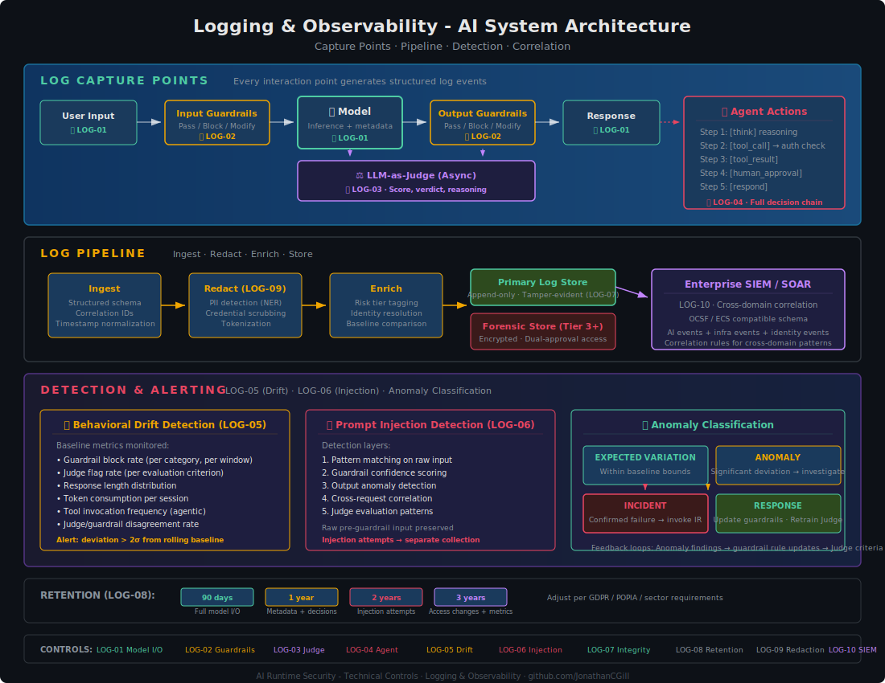
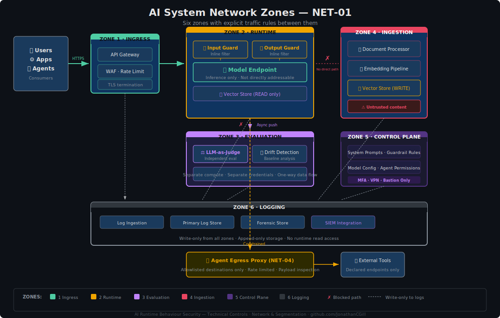

# AI Security Infrastructure Controls

**The infrastructure layer that makes behavioural AI security enforceable.**

Companion to [AI Runtime Behaviour Security](https://github.com/JonathanCGill/ai-runtime-behaviour-security), which defines the three-layer behavioural security pattern (Guardrails → LLM-as-Judge → Human Oversight). This repo defines the 80 technical infrastructure controls that underpin that pattern.

---

## The Problem

You can't enforce behavioural security controls on infrastructure you don't control. The parent framework tells you *what* to enforce. This repo tells you *how* to enforce it:

- **Who can reach the model?** → [Identity & Access Management](controls/identity-and-access.md)
- **How do you know it's working?** → [Logging & Observability](controls/logging-and-observability.md)
- **What's the blast radius if it fails?** → [Network & Segmentation](controls/network-and-segmentation.md)
- **Where does sensitive data go?** → [Data Protection](controls/data-protection.md)
- **How are credentials managed?** → [Secrets & Credentials](controls/secrets-and-credentials.md)
- **Can you trust the model?** → [Supply Chain](agentic/supply-chain.md)
- **What happens when things break?** → [Incident Response](controls/incident-response.md)

---

## Architecture

### How Technical Controls Enable the Three-Layer Pattern

### IAM Control Architecture

### Logging Pipeline and Detection Architecture

### Network Zone Architecture

---

## Control Domains

### [Identity & Access Management](controls/identity-and-access.md) — 8 controls

Authentication, least privilege, control plane separation, agent tool constraints, human approval workflows, session credentials, credential exposure prevention, and access auditing.

| Control | Purpose | Risk Tiers |
|---------|---------|------------|
| IAM-01 | Authenticate all entities | All |
| IAM-02 | Enforce least privilege | All |
| IAM-03 | Separate control/data planes | Tier 2+ |
| IAM-04 | Constrain agent tool invocation | Tier 2+ (agentic) |
| IAM-05 | Human approval for high-impact actions | Tier 3+ (agentic) |
| IAM-06 | Session-scoped credentials | Tier 2+ |
| IAM-07 | Prevent credential exposure in context | All |
| IAM-08 | Audit all access changes | Tier 2+ |

### [Logging & Observability](controls/logging-and-observability.md) — 10 controls

Model I/O logging, guardrail decisions, Judge evaluations, agent chains, drift detection, injection detection, log integrity, retention, redaction, and SIEM correlation.

| Control | Purpose | Risk Tiers |
|---------|---------|------------|
| LOG-01 | Log all model inputs and outputs | All |
| LOG-02 | Log guardrail decisions | All |
| LOG-03 | Log Judge evaluations | Tier 2+ |
| LOG-04 | Log agent decision chains | Tier 2+ (agentic) |
| LOG-05 | Detect behavioural drift | Tier 2+ |
| LOG-06 | Detect prompt injection attempts | All |
| LOG-07 | Protect log integrity | Tier 2+ |
| LOG-08 | Enforce retention policies | All |
| LOG-09 | Redact sensitive data in logs | All |
| LOG-10 | Correlate with enterprise SIEM | Tier 3+ |

### [Network & Segmentation](controls/network-and-segmentation.md) — 8 controls

Six-zone architecture, guardrail bypass prevention, Judge isolation, agent egress controls, ingestion/runtime separation, control plane protection, API gateway enforcement, and cross-zone monitoring.

| Control | Purpose | Risk Tiers |
|---------|---------|------------|
| NET-01 | Define network zone architecture | All |
| NET-02 | Prevent guardrail bypass at network level | All |
| NET-03 | Isolate Judge evaluation infrastructure | Tier 2+ |
| NET-04 | Control agent egress destinations | Tier 2+ (agentic) |
| NET-05 | Separate ingestion from runtime | Tier 2+ |
| NET-06 | Protect control plane network path | All |
| NET-07 | Enforce API gateway as single entry | All |
| NET-08 | Monitor cross-zone traffic | Tier 2+ |

### [Data Protection](controls/data-protection.md) — 8 controls

Data classification, minimisation, PII detection/redaction, access-controlled RAG, encryption, response leakage prevention, conversation history management, and evaluation data protection.

| Control | Purpose | Risk Tiers |
|---------|---------|------------|
| DAT-01 | Classify data at AI boundaries | All |
| DAT-02 | Enforce data minimisation | All |
| DAT-03 | Detect and redact PII in model I/O | All |
| DAT-04 | Enforce access-controlled RAG retrieval | Tier 2+ |
| DAT-05 | Encrypt data at rest and in transit | All |
| DAT-06 | Prevent sensitive data leakage via responses | Tier 2+ |
| DAT-07 | Manage conversation history retention | All |
| DAT-08 | Protect evaluation data sent to Judge | Tier 2+ |

### [Secrets & Credentials](controls/secrets-and-credentials.md) — 8 controls

Context window isolation, short-lived tokens, centralised vault, credential scanning, rotation on exposure, agent credential isolation, endpoint protection, and code scanning.

| Control | Purpose | Risk Tiers |
|---------|---------|------------|
| SEC-01 | Never inject credentials into context windows | All |
| SEC-02 | Use short-lived, scoped tokens | All |
| SEC-03 | Centralise secrets in a vault | All |
| SEC-04 | Scan model I/O for credential patterns | All |
| SEC-05 | Rotate credentials on exposure | All |
| SEC-06 | Isolate agent credentials per session | Tier 2+ (agentic) |
| SEC-07 | Protect model endpoint credentials | All |
| SEC-08 | Scan code and config for embedded credentials | All |

### [Supply Chain](agentic/supply-chain.md) — 8 controls

Model provenance, risk assessment, RAG data integrity, fine-tuning security, tool supply chain, safety model integrity, AI-BOM, and vulnerability monitoring.

| Control | Purpose | Risk Tiers |
|---------|---------|------------|
| SUP-01 | Verify model provenance and integrity | All |
| SUP-02 | Assess model risk before adoption | All |
| SUP-03 | Verify RAG data source integrity | Tier 2+ |
| SUP-04 | Secure fine-tuning pipeline | Tier 2+ |
| SUP-05 | Audit tool and plugin supply chain | Tier 2+ (agentic) |
| SUP-06 | Verify guardrail and safety model integrity | All |
| SUP-07 | Maintain AI component inventory (AI-BOM) | All |
| SUP-08 | Monitor for model and dependency vulnerabilities | All |

### [Incident Response](controls/incident-response.md) — 8 controls

AI-specific incident categories, detection triggers, containment procedures, rollback capability, investigation for non-deterministic systems, communication protocols, post-incident review, and enterprise IR integration.

| Control | Purpose | Risk Tiers |
|---------|---------|------------|
| IR-01 | Define AI-specific incident categories | All |
| IR-02 | Establish detection triggers from logging | All |
| IR-03 | Define containment procedures | All |
| IR-04 | Implement model rollback and guardrail hot-reload | Tier 2+ |
| IR-05 | Define investigation for non-deterministic systems | Tier 2+ |
| IR-06 | Establish communication protocols | Tier 2+ |
| IR-07 | Conduct AI-specific post-incident review | All |
| IR-08 | Integrate with enterprise IR processes | All |

---

## Agentic AI Controls

Additional controls for systems where AI agents invoke tools, generate code, delegate to other agents, or take autonomous actions.

### [Tool Access Controls](agentic/tool-access-controls.md) — 6 controls

| Control | Purpose |
|---------|---------|
| TOOL-01 | Declare tool permissions explicitly before deployment |
| TOOL-02 | Enforce permissions at the gateway, not at the agent |
| TOOL-03 | Constrain tool parameters to declared bounds |
| TOOL-04 | Classify tool actions by reversibility and impact |
| TOOL-05 | Rate-limit tool invocations per agent and per tool |
| TOOL-06 | Log every tool invocation with full context |

### [Session & Scope](controls/session-and-scope.md) — 5 controls

| Control | Purpose |
|---------|---------|
| SESS-01 | Define and enforce session boundaries with automatic expiry |
| SESS-02 | Isolate sessions from each other |
| SESS-03 | Limit session scope to a declared task |
| SESS-04 | Implement progressive trust within sessions |
| SESS-05 | Clean up session state on termination |

### [Delegation Chains](agentic/delegation-chains.md) — 5 controls

| Control | Purpose |
|---------|---------|
| DEL-01 | Enforce least delegation (no privilege escalation) |
| DEL-02 | Maintain complete audit trail across chains |
| DEL-03 | Limit delegation depth |
| DEL-04 | Require explicit delegation authorisation |
| DEL-05 | Propagate user identity through chains |

### [Sandbox Patterns](agentic/sandbox-patterns.md) — 6 controls

| Control | Purpose |
|---------|---------|
| SAND-01 | Execute generated code in isolated sandboxes |
| SAND-02 | Restrict sandbox file system access |
| SAND-03 | Restrict sandbox network access |
| SAND-04 | Enforce resource limits on execution |
| SAND-05 | Prevent persistent state escaping sessions |
| SAND-06 | Scan generated code before execution |

---

## Regulatory & Standards Mappings

Every control maps to the three-layer behavioural model and to established standards:

| Mapping | Coverage |
|---------|----------|
| [Controls → Three Layers](mappings/controls-to-three-layers.md) | All 80 controls × Guardrails, Judge, and Human Oversight |
| [ISO 42001 Annex A](mappings/iso42001-annex-a.md) | Full Annex A technical infrastructure mapping |
| [NIST AI RMF](mappings/nist-ai-rmf.md) | 51 subcategories across Govern, Map, Measure, Manage |
| [OWASP LLM Top 10](mappings/owasp-llm-top10.md) | All 10 risks + OWASP Agentic Top 10 |

---

## Platform Implementation Patterns

Reference patterns for implementing these controls on specific platforms:

| Platform | Covers |
|----------|--------|
| [AWS Bedrock](reference/platform-patterns/aws-bedrock.md) | Bedrock Guardrails, Knowledge Bases, Agent Framework, VPC architecture, IAM roles |
| [Azure AI](reference/platform-patterns/azure-ai.md) | Azure OpenAI, AI Content Safety, APIM, Entra ID PIM, Sentinel |
| [Databricks](reference/platform-patterns/databricks.md) | Mosaic AI Gateway, Model Serving, Unity Catalog, Vector Search, Inference Tables |

---

## Diagrams

Fourteen SVG diagrams covering IAM architecture, logging pipelines, network zones, agent egress flows, credential isolation, data classification, incident classification, delegation permission models, and more. All in [`diagrams/`](diagrams/).

---

## Design Principles

1. **Vendor-neutral.** Controls are defined in terms of *what* must be enforced, not *which product* enforces it. Platform-specific guidance lives in `reference/platform-patterns/`.
2. **Three-layer aligned.** Every control maps back to how it supports Guardrails, Judge, or Human Oversight.
3. **Risk-tiered.** Controls specify which risk tiers they apply to, enabling proportionate implementation.
4. **Practitioner-focused.** Written for security architects and engineers, not executive summaries.
5. **Agentic-aware.** Agent-specific controls are treated as first-class concerns, not afterthoughts.
6. **Infrastructure beats instructions.** Security controls are enforced via deterministic infrastructure (gateways, network policy, vaults), never via prompt instructions that can be overridden.

---

## Repo Structure

See [REPO-STRUCTURE.md](REPO-STRUCTURE.md) for the full layout and rationale.

---

## Contributing

Feedback, corrections, and extensions welcome. This is a living framework.

---

## Author

**Jonathan Gill** — Cybersecurity practitioner with 30+ years in IT and 20+ years in enterprise cybersecurity, currently focused on AI security governance.

- GitHub: [@JonathanCGill](https://github.com/JonathanCGill)
- LinkedIn: [Jonathan Gill](https://www.linkedin.com/in/jonathancgill/)
---

*AI Runtime Behaviour Security, 2026 (Jonathan Gill).*
