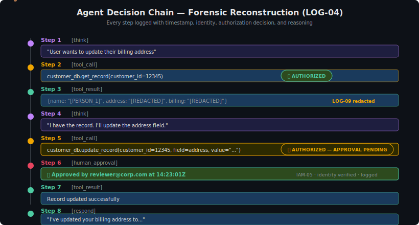

# Logging & Observability for AI Systems

> **Control Domain:** Behavioural Controls  
> **Purpose:** Capture, correlate, and analyse AI system behaviour to detect drift, anomalies, misuse, and control failures in production.  
> **Relationship:** Enables the LLM-as-Judge layer (by providing the data the Judge evaluates) and the Human Oversight layer (by surfacing the signals humans need to make decisions).

---

## Why AI Logging Is Different

Traditional application logging records discrete events: user logged in, API called, error thrown. AI systems require a fundamentally different approach because:

1. **Non-determinism.** The same input produces different outputs. You can't diff against expected output — you must evaluate *behavioural patterns* over time.
2. **Semantic content.** A model response that is technically well-formed (valid JSON, no errors) can still be harmful, biased, or wrong. Logging must capture enough semantic context for evaluation.
3. **Multi-step reasoning.** Agentic systems chain decisions. A single harmful outcome may result from a sequence of individually reasonable steps. Logging must preserve the full chain.
4. **Adversarial inputs.** Prompt injection attempts must be detectable in logs. This means logging raw inputs *before* guardrail processing, not just the sanitised versions.
5. **Evaluation loops.** The Judge LLM's evaluations are themselves AI outputs that need logging and monitoring. Who watches the watchers? The logging pipeline does.

---

## Control Objectives

| ID | Objective | Risk Tiers |
|----|-----------|------------|
| LOG-01 | Log all model inputs and outputs with full context | All |
| LOG-02 | Log guardrail decisions (pass, block, modify) with rationale | All |
| LOG-03 | Log Judge evaluations with scores and reasoning | Tier 2+ |
| LOG-04 | Log agent actions, tool invocations, and decision chains | Tier 2+ (agentic) |
| LOG-05 | Detect behavioural drift from established baselines | Tier 2+ |
| LOG-06 | Detect and alert on prompt injection attempts | All |
| LOG-07 | Protect log integrity (append-only, tamper-evident) | Tier 2+ |
| LOG-08 | Implement retention policies aligned with regulatory requirements | All |
| LOG-09 | Redact sensitive data in logs while preserving forensic utility | All |
| LOG-10 | Correlate AI system logs with enterprise security telemetry | Tier 3+ |

---

## LOG-01: Model Input/Output Logging

Every interaction with a model endpoint must be logged with sufficient context to reconstruct what happened and evaluate whether the behaviour was acceptable.

### Required Fields

| Field | Description | Example |
|-------|-------------|---------|
| `request_id` | Unique identifier for the interaction | `uuid` |
| `timestamp` | UTC timestamp with millisecond precision | `2025-02-12T14:23:01.456Z` |
| `user_identity` | Authenticated identity of the requesting user | `user:jgill@corp.com` |
| `service_identity` | Application or agent identity | `svc:customer-assistant-v2` |
| `session_id` | Conversation or task session identifier | `session:abc123` |
| `model_id` | Model identifier and version | `bedrock:claude-3-sonnet-v2` |
| `system_prompt_hash` | Hash of the system prompt (not the prompt itself) | `sha256:a1b2c3...` |
| `input_text` | Full user input (pre-guardrail) | Raw prompt text |
| `input_tokens` | Token count of input | `1,247` |
| `output_text` | Full model response (post-guardrail) | Response text |
| `output_tokens` | Token count of output | `892` |
| `latency_ms` | End-to-end response time | `2,340` |
| `guardrail_actions` | List of guardrail decisions applied | See LOG-02 |
| `risk_tier` | Risk tier of the use case | `tier-2` |
| `metadata` | Additional context (temperature, top_p, etc.) | JSON blob |

### What NOT to Log in Plain Text

- Credentials, API keys, or tokens that appear in prompts (redact — see LOG-09).
- Full PII unless explicitly required for the use case and protected accordingly.
- System prompt content in full (log the hash; store the prompt in version-controlled config).

### Volume Considerations

AI logging generates significantly more data than traditional application logging. A single interaction may produce 5,000+ tokens of logged content. Plan storage, retention, and query infrastructure accordingly.

---

## LOG-02: Guardrail Decision Logging

Every guardrail evaluation must be logged, including passes. You need to know what the guardrails *didn't* catch as much as what they did.

### Required Fields

| Field | Description |
|-------|-------------|
| `request_id` | Links to the model interaction |
| `guardrail_id` | Which guardrail rule was evaluated |
| `guardrail_version` | Version of the rule at evaluation time |
| `stage` | `input` or `output` |
| `decision` | `pass`, `block`, `modify`, `flag` |
| `confidence` | Guardrail confidence score (0–1) |
| `rationale` | Why the decision was made (category match, pattern match, threshold) |
| `original_content` | The content before modification (if modified) |
| `modified_content` | The content after modification (if modified) |
| `latency_ms` | Time taken for guardrail evaluation |

### Detection Value

Guardrail logs enable:

- **False positive analysis:** How often are guardrails blocking legitimate requests? High false positive rates degrade user trust and create pressure to weaken controls.
- **Evasion detection:** Patterns of near-miss inputs (confidence scores just above the pass threshold) may indicate adversarial probing.
- **Coverage gaps:** Categories of content that are never flagged may indicate missing guardrail rules.
- **Drift detection:** Changes in the distribution of guardrail decisions over time may indicate changes in user behaviour or model behaviour.

---

## LOG-03: Judge Evaluation Logging

The LLM-as-Judge layer produces evaluations that are themselves AI outputs. These must be logged with the same rigour as primary model outputs.

### Required Fields

| Field | Description |
|-------|-------------|
| `request_id` | Links to the original model interaction |
| `judge_model_id` | Which model performed the evaluation |
| `evaluation_criteria` | What the Judge was evaluating (safety, accuracy, policy compliance, etc.) |
| `evaluation_criteria_version` | Version of the criteria |
| `score` | Numeric evaluation score |
| `verdict` | `acceptable`, `flagged`, `escalate` |
| `reasoning` | Judge's explanation of its evaluation |
| `latency_ms` | Evaluation time |
| `escalation_target` | If escalated, who/what receives the escalation |

### Monitoring the Monitor

The Judge itself can fail, hallucinate, or be manipulated. Log analysis should detect:

- **Judge availability:** Is the Judge evaluating all interactions it should?
- **Evaluation latency:** Is the Judge keeping up with production throughput?
- **Score distribution shifts:** A sudden change in the distribution of Judge scores may indicate Judge drift or model drift.
- **Disagreement rates:** How often does the Judge flag content that guardrails passed? High rates may indicate guardrail gaps or Judge miscalibration.

---

## LOG-04: Agent Action Logging

For agentic AI systems, every step in the agent's decision chain must be logged. A harmful outcome may result from a sequence of individually reasonable steps — you need the full chain to diagnose and prevent recurrence.

### Required Fields per Action

| Field | Description |
|-------|-------------|
| `request_id` | Links to the initiating interaction |
| `agent_id` | Unique agent instance identifier |
| `step_number` | Position in the decision chain |
| `action_type` | `think`, `tool_call`, `tool_result`, `delegate`, `respond` |
| `tool_name` | If tool invocation: which tool |
| `tool_parameters` | If tool invocation: parameters passed (redacted as needed) |
| `tool_result` | If tool invocation: result returned (redacted as needed) |
| `authorization_decision` | Did the authorization gateway permit this action? |
| `reasoning` | Agent's stated reasoning for this step |
| `tokens_consumed` | Running token count for cost tracking |
| `elapsed_ms` | Time for this step |

### Chain Reconstruction

Logs must support reconstruction of the full decision chain for any agent task:

This chain is the forensic record. Without it, you cannot explain *why* the agent did what it did.

---

## LOG-05: Behavioural Drift Detection

AI systems drift. Model behaviour changes with updates. User behaviour changes over time. Adversaries probe incrementally. Drift detection identifies when behaviour moves outside established baselines.

### Baseline Metrics

Establish baselines for:

| Metric | What It Detects |
|--------|----------------|
| Guardrail block rate (per category, per time window) | Model drift, policy changes, attack campaigns |
| Judge flag rate (per evaluation criterion) | Quality drift, emerging risks |
| Average response length | Model configuration changes, jailbreak success |
| Topic distribution of requests | Misuse patterns, scope creep |
| Tool invocation frequency (agentic) | Permission abuse, automation runaway |
| Token consumption per session | Cost anomalies, prompt injection (inflated context) |
| Error rate by type | Infrastructure issues, model degradation |
| User behaviour clustering | Adversarial user identification |

### Alerting Thresholds

Define alert thresholds as deviations from baseline. Example:

- Guardrail block rate increases by >2σ from 7-day rolling average → Alert
- Judge escalation rate exceeds 5% of interactions → Alert
- Single user generates >3σ token volume → Investigate
- Agent tool invocation rate exceeds 2× baseline for task type → Alert

### Anomaly vs. Incident

Not every anomaly is an incident. The logging pipeline should classify:

- **Expected variation:** Normal fluctuation within baseline bounds.
- **Anomaly:** Statistically significant deviation — investigate.
- **Incident:** Anomaly confirmed as control failure, misuse, or compromise — invoke IR.

---

## LOG-06: Prompt Injection Detection

Prompt injection is the primary adversarial threat to LLM systems. Logging must support detection of both known and novel injection patterns.

### Detection Approaches

| Approach | What It Catches | Limitation |
|----------|----------------|------------|
| **Pattern matching** on raw input | Known injection templates ("ignore previous instructions") | Trivially evaded with paraphrasing |
| **Guardrail confidence scoring** | Inputs that score near the block threshold | Only catches what guardrails are tuned for |
| **Output anomaly detection** | Responses that deviate from expected format/tone/scope | Requires well-defined baselines |
| **Cross-request correlation** | Sequential inputs that individually pass guardrails but collectively form an attack | Requires session-aware analysis |
| **Judge evaluation patterns** | Content flagged by Judge but not caught by guardrails | Async — detection is delayed |

### Logging for Injection Forensics

Critical: log the **raw input before guardrail processing**. If you only log the sanitised input, you lose the ability to analyse the injection technique.

Store injection attempts (confirmed and suspected) in a separate collection for:

- Pattern analysis and guardrail rule improvement.
- Threat intelligence sharing (anonymised).
- Training data for injection detection models.

---

## LOG-07: Log Integrity Protection

AI system logs are high-value forensic and compliance artifacts. They must be protected from tampering, including by privileged insiders and by the AI system itself.

### Requirements

- **Append-only storage:** Logs cannot be modified or deleted during the retention period.
- **Cryptographic integrity:** Log entries are chained (hash chains or Merkle trees) so tampering is detectable.
- **Separate storage:** AI system logs are stored in a system that the AI system itself cannot access for writes (preventing an agent from covering its tracks).
- **Access control:** Read access to logs is restricted and audited. The AI system's runtime identities have no read access to historical logs.
- **Backup:** Logs are replicated to a separate failure domain.

---

## LOG-08: Retention Policies

| Data Type | Minimum Retention | Rationale |
|-----------|-------------------|-----------|
| Model I/O (full text) | 90 days | Operational, debugging, evaluation improvement |
| Model I/O (metadata only) | 1 year | Trend analysis, drift detection |
| Guardrail decisions | 1 year | Control effectiveness analysis |
| Judge evaluations | 1 year | Evaluation criteria improvement |
| Agent action chains | 1 year | Forensics, accountability |
| Access control changes | 3 years | Compliance, audit |
| Injection attempts | 2 years | Threat intelligence |
| Aggregated metrics | 3 years | Long-term trend analysis |

Adjust per regulatory requirements (GDPR, POPIA, sector-specific).

---

## LOG-09: Sensitive Data Redaction

AI logs frequently contain PII, financial data, or other sensitive information — because users put it in their prompts and models include it in their responses.

### Redaction Strategy

1. **Real-time redaction at ingestion:** Apply PII detection patterns (regex + NER) to model I/O before writing to the primary log store.
2. **Preserve forensic copy:** For Tier 3+ systems, store an encrypted, access-controlled copy of the unredacted log for incident investigation. Dual-approval access only.
3. **Redaction patterns:** Names, email addresses, phone numbers, national IDs, credit card numbers, medical record numbers, account numbers.
4. **Tokenisation option:** Replace PII with consistent tokens (`[PERSON_1]`, `[EMAIL_1]`) that preserve referential integrity across a session without exposing real values.
5. **Audit redaction effectiveness:** Periodically sample logs and verify that redaction is working. PII leakage into logs is a data protection incident.

---

## LOG-10: Enterprise Telemetry Correlation

AI system logs in isolation miss context. Correlating AI logs with enterprise security telemetry reveals attacks that span the AI system and the broader environment.

### Correlation Points

| AI System Event | Enterprise Telemetry | Combined Insight |
|----------------|---------------------|------------------|
| Unusual prompt patterns from user X | User X's device has compromised IoC | Adversary using stolen session to probe AI system |
| Agent makes unexpected outbound API call | Network logs show data exfiltration to unknown IP | Agent used as exfiltration channel |
| Spike in token consumption | Cost management alert | Prompt injection inflating context (denial of wallet) |
| Judge flags multiple responses as policy violations | No corresponding guardrail blocks | Guardrail evasion technique — update rules |
| System prompt hash changes | No corresponding change request in ITSM | Unauthorized configuration change |

### Integration Architecture

AI system logs should flow to the enterprise SIEM/SOAR with:

- Standardised event schema (compatible with OCSF, ECS, or equivalent).
- Correlation IDs that link AI system events to infrastructure events.
- Alert rules that trigger on cross-domain patterns (not just AI-domain patterns).

---

## Three-Layer Mapping

| Control | Guardrails | LLM-as-Judge | Human Oversight |
|---------|-----------|--------------|-----------------|
| LOG-01 Model I/O | Captures what guardrails processed | Provides data for Judge evaluation | Enables human review of interactions |
| LOG-02 Guardrail decisions | Enables guardrail effectiveness analysis | Judge compares its findings to guardrail decisions | Humans tune guardrails based on log data |
| LOG-03 Judge evaluations | Identifies guardrail gaps | Enables Judge calibration and improvement | Humans review Judge accuracy |
| LOG-04 Agent actions | Guardrails on tool parameters logged | Judge evaluates action chains | Humans review agent decisions and approve high-risk actions |
| LOG-05 Drift detection | Detects guardrail effectiveness decay | Detects Judge calibration drift | Alerts humans when the system moves outside expected behaviour |
| LOG-06 Injection detection | Captures what guardrails missed | Judge flags injection-like outputs | Humans investigate confirmed injection attempts |
| LOG-07 Log integrity | Guardrail logs can't be tampered with | Judge logs are independently verifiable | Humans trust the audit trail |
| LOG-08 Retention | Historical guardrail data available for analysis | Historical Judge data enables trend analysis | Compliance and regulatory requirements met |
| LOG-09 Redaction | PII doesn't persist in guardrail logs | Judge doesn't receive unnecessary PII | Reduces data protection risk for oversight teams |
| LOG-10 Correlation | Guardrail evasion visible in broader context | Judge findings enriched with infrastructure context | Humans see the full picture |

---

## Platform-Neutral Implementation Checklist

- [ ] All model interactions logged with full context (input, output, identities, metadata)
- [ ] Guardrail decisions logged for every evaluation (including passes)
- [ ] Judge evaluations logged with scores, reasoning, and criteria version
- [ ] Agent decision chains reconstructable from logs
- [ ] Behavioural baselines established and drift alerting configured
- [ ] Raw inputs (pre-guardrail) preserved for injection forensics
- [ ] Logs stored in append-only, tamper-evident storage
- [ ] Retention policies defined and enforced per data type
- [ ] PII redaction applied at log ingestion with periodic effectiveness audits
- [ ] AI logs integrated with enterprise SIEM with correlation rules active

---

*AI Runtime Behaviour Security, 2026 (Jonathan Gill).*
