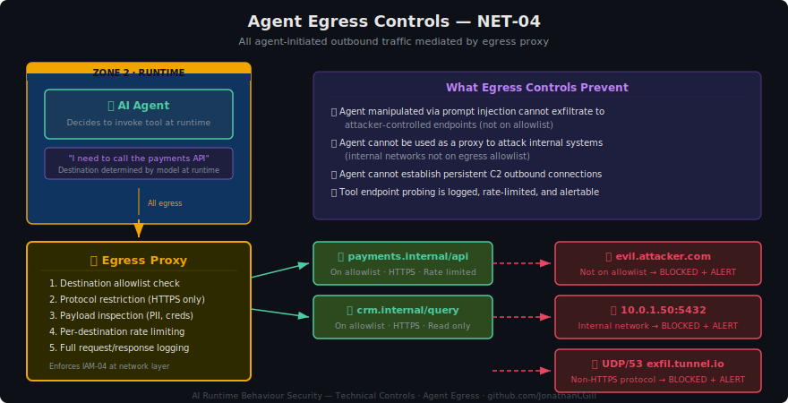

# Network & Segmentation for AI Systems

> **Control Domain:** Containment Controls  
> **Purpose:** Isolate AI system components into defined network zones, restrict lateral movement, and limit the blast radius when a component is compromised.  
> **Relationship:** Supports the Guardrails layer (by ensuring guardrails cannot be bypassed via network-level access) and the Human Oversight layer (by ensuring control plane access is network-isolated from the data plane).

---

## Why AI Network Security Is Different

Traditional application network security segments by tier: web, application, database. AI systems introduce components that don't fit neatly into these tiers and have communication patterns that traditional network controls weren't designed for:

| Component | Network Behaviour | Risk |
|-----------|-------------------|------|
| **Model endpoints** | Receive prompts, return responses. May call external APIs for tool use. | Prompt injection payloads traverse the network as legitimate traffic |
| **Vector stores** | Queried by models at inference time with embedding similarity searches | Data exfiltration via crafted embeddings or retrieval manipulation |
| **Agent tool APIs** | Called dynamically by agents — destination determined at runtime by the model | Agents can be manipulated to call unintended endpoints |
| **LLM-as-Judge** | Evaluates primary model output — must be independent | If Judge shares infrastructure with primary model, compromise of one affects both |
| **Guardrail services** | Inline on the request/response path — must be un-bypassable | If guardrails can be routed around at the network level, they provide zero value |
| **Embedding pipelines** | Ingest documents, generate embeddings, write to vector stores | Poisoned documents enter via ingestion — separate from runtime |

The core problem: **AI agents make runtime decisions about which network endpoints to call.** Traditional allow-lists based on known destinations break when the model decides where to send traffic. Network controls must constrain what the model *can* reach, regardless of what it *wants* to reach.

---

## Control Objectives

| ID | Objective | Risk Tiers |
|----|-----------|------------|
| NET-01 | Segment AI components into defined network zones | All |
| NET-02 | Enforce guardrail bypass prevention at the network layer | All |
| NET-03 | Isolate the LLM-as-Judge from the primary model | Tier 2+ |
| NET-04 | Restrict agent egress to declared tool endpoints | Tier 2+ (agentic) |
| NET-05 | Separate ingestion pipelines from runtime inference | Tier 2+ |
| NET-06 | Protect the control plane network path | Tier 2+ |
| NET-07 | Implement API gateway as the single entry point | All |
| NET-08 | Monitor and log all cross-zone traffic | Tier 2+ |

---

## NET-01: Network Zone Architecture

AI system components must be deployed into defined network zones with explicit traffic rules between them. No component should have unrestricted network access.

### Zone Definitions

**Zone 1 — Ingress:** API gateway, load balancers, WAF. This is the only zone exposed to consumers (users, applications). All traffic enters here.

**Zone 2 — Runtime:** Model endpoints, guardrail services, vector stores (read). These components serve inference requests. They receive traffic only from the API gateway and from each other within defined flows.

**Zone 3 — Evaluation:** LLM-as-Judge, evaluation pipelines, drift detection. Physically or logically separated from Zone 2 to ensure independence. Receives copies of model I/O for async evaluation — does not sit inline on the request path.

**Zone 4 — Ingestion:** Embedding pipelines, document processors, vector store (write). Handles data ingestion. Separated from runtime to prevent poisoned ingestion traffic from reaching inference components.

**Zone 5 — Control Plane:** System prompt management, guardrail configuration, model configuration, deployment pipelines. Accessible only via privileged network paths with MFA (see IAM-03). No runtime traffic.

**Zone 6 — Logging:** Log ingestion, storage, analysis, SIEM integration. Receives logs from all other zones. Write-only from the perspective of runtime components — no zone can read its own historical logs via the runtime path.

### Traffic Rules

| Source → Destination | Permitted | Protocol / Constraints |
|----------------------|-----------|----------------------|
| Consumer → Zone 1 (Ingress) | ✅ | HTTPS only, rate-limited |
| Zone 1 → Zone 2 (Runtime) | ✅ | Authenticated, via gateway only |
| Zone 2 → Zone 2 (Runtime internal) | ✅ | Model ↔ guardrails ↔ vector store (read) |
| Zone 2 → Zone 3 (Evaluation) | ✅ | Async push of model I/O for evaluation |
| Zone 3 → Zone 2 | ❌ | Judge cannot modify runtime behaviour directly |
| Zone 2 → Zone 4 (Ingestion) | ❌ | Runtime cannot write to ingestion pipeline |
| Zone 4 → Zone 2 | ❌ | Ingestion cannot reach runtime inference |
| Zone 4 → Vector Store (write) | ✅ | Ingestion writes embeddings |
| Zone 2 → Vector Store (read) | ✅ | Runtime reads embeddings |
| Any → Zone 5 (Control Plane) | ❌ from runtime | Privileged access only |
| All Zones → Zone 6 (Logging) | ✅ | Write-only, structured events |
| Zone 2 → External (agent tools) | Constrained | Via egress proxy, allowlisted destinations only (NET-04) |

---

## NET-02: Guardrail Bypass Prevention

Guardrails are only effective if every request and response passes through them. If a consumer or internal component can reach the model endpoint without traversing guardrails, the guardrails provide no security value.

### Enforcement

- The model endpoint must not be directly addressable from outside Zone 2.
- All traffic from Zone 1 (Ingress) to the model endpoint must traverse the guardrail service.
- Network policy (not application routing) must enforce this — if guardrail bypass is prevented only by application-layer routing, a misconfiguration or vulnerability can circumvent it.
- Health checks and monitoring probes are the only exception, and these must be authenticated and logged.

### Architecture Pattern

### Verification

Periodically test that direct access to the model endpoint from outside Zone 2 is blocked. This should be an automated test in the deployment pipeline, not a manual check.

---

## NET-03: Judge Isolation

The LLM-as-Judge must be independent of the primary model. If they share infrastructure, a compromise of the primary model (via prompt injection, jailbreak, or configuration tampering) could also compromise the Judge's evaluation.

### Isolation Requirements

- **Separate compute:** Judge runs on different instances/containers from the primary model.
- **Separate network zone:** Zone 3, with no inbound traffic from Zone 2 except the evaluation data feed.
- **Separate credentials:** Judge uses different API keys, service identities, and access tokens from the primary model.
- **No shared state:** Judge does not read the primary model's system prompt, configuration, or conversation history (it receives only the I/O to evaluate).
- **One-way data flow:** Zone 2 pushes evaluation data to Zone 3. Zone 3 does not pull from Zone 2 or write back to Zone 2 components.

### What Judge Isolation Prevents

- Primary model jailbreak does not affect Judge evaluation criteria.
- Prompt injection that modifies primary model behaviour does not modify Judge behaviour.
- Infrastructure compromise of the runtime zone does not compromise evaluation integrity.
- Judge evaluations cannot be retroactively modified by the runtime system.

---

## NET-04: Agent Egress Controls

When AI agents invoke tools, they generate outbound network traffic to tool endpoints. The destinations are determined at runtime by the model — making traditional static firewall rules insufficient.

### Egress Proxy Architecture

All agent-initiated outbound traffic must pass through an egress proxy that enforces:

1. **Destination allowlist:** Only pre-declared tool endpoints are reachable. The allowlist is defined at deployment as part of the agent's permission set (see IAM-04) and enforced at the network layer.
2. **Protocol restrictions:** Only permitted protocols (typically HTTPS) are allowed. No raw TCP, no DNS tunnelling, no non-standard ports unless explicitly declared.
3. **Payload inspection:** For high-risk tiers, the egress proxy inspects outbound payloads for data exfiltration indicators (PII patterns, credential patterns, encoded data).
4. **Rate limiting:** Per-destination rate limits prevent agents from flooding external services or being used for denial-of-service.
5. **Logging:** Every egress request is logged with full context (agent identity, destination, payload hash, response code) for forensic and drift detection purposes (LOG-04, LOG-08).

### What This Prevents

- An agent manipulated via prompt injection cannot exfiltrate data to an attacker-controlled endpoint (the endpoint isn't on the allowlist).
- An agent cannot be used as a proxy to attack other internal systems (internal networks are not on the egress allowlist).
- An agent cannot establish persistent outbound connections (C2 channels).
- Tool endpoint enumeration and probing is logged and rate-limited.

---

## NET-05: Ingestion / Runtime Separation

The pipeline that ingests documents, generates embeddings, and writes to the vector store must be network-isolated from the pipeline that serves inference requests.

### Why

- **Poisoning risk:** If a malicious document enters the ingestion pipeline, it should not be able to directly affect runtime inference until the embeddings are written and become queryable. This creates a natural inspection point.
- **Different trust levels:** Ingestion processes untrusted external content (uploaded documents, crawled web pages). Runtime processes authenticated user queries. Mixing these trust levels in the same network zone violates least privilege.
- **Different access patterns:** Ingestion needs write access to the vector store. Runtime needs read access. These should be enforced at the network level, not just the application level.

### Implementation

- Ingestion pipeline runs in Zone 4 with write access to the vector store's ingestion endpoint.
- Runtime inference runs in Zone 2 with read access to the vector store's query endpoint.
- These are different network endpoints on the vector store, or different vector store instances (replicated from ingestion to runtime).
- No direct network path between Zone 4 and Zone 2.

---

## NET-06: Control Plane Network Protection

The control plane (system prompts, guardrail rules, Judge criteria, model configuration, agent permission sets) must be accessible only via a dedicated network path that is separate from all runtime traffic.

### Requirements

- Control plane APIs are not exposed on the same network interfaces as data plane APIs.
- Access requires a privileged network path (VPN, bastion host, or dedicated management network).
- All control plane access requires MFA (see IAM-03).
- Control plane network traffic is logged separately from data plane traffic.
- No runtime component (model, guardrail, agent, Judge) has network access to control plane APIs.

### What This Prevents

- A prompt injection attack cannot reach control plane APIs to modify guardrail rules.
- A compromised agent cannot modify its own permission set.
- A compromised model endpoint cannot alter its system prompt.
- Lateral movement from runtime to control plane requires a separate network compromise.

---

## NET-07: API Gateway as Single Entry Point

All consumer traffic to the AI system must enter through a single API gateway in Zone 1. No direct access to any internal component.

### Gateway Responsibilities

| Function | Detail |
|----------|--------|
| **TLS termination** | All external traffic encrypted in transit |
| **Authentication** | Validates consumer identity before routing (see IAM-01) |
| **Rate limiting** | Per-consumer and global rate limits |
| **Request routing** | Routes to guardrails → model → guardrails → response |
| **Request/response logging** | Captures full I/O for logging pipeline (LOG-01) |
| **WAF integration** | Standard web attack prevention (SQLi, XSS, etc.) |
| **Schema validation** | Rejects malformed requests before they reach the model |

### Why Not Direct Model Access

Exposing the model endpoint directly means:

- Guardrails can be bypassed (NET-02 violation).
- Rate limiting is model-dependent (unreliable).
- Authentication is model-dependent (the model is not an IdP).
- Logging happens only if the model logs its own I/O (inconsistent).
- No single enforcement point for policy changes.

---

## NET-08: Cross-Zone Traffic Monitoring

All traffic crossing zone boundaries must be logged and monitored. This is distinct from application-level logging (LOG-01 through LOG-04) — this is network-level telemetry.

### What to Monitor

| Signal | What It Detects |
|--------|----------------|
| Unexpected source → destination pairs | Compromised component attempting lateral movement |
| Traffic volume anomalies per zone pair | Data exfiltration, DDoS, resource abuse |
| New destinations in agent egress traffic | Agent probing or injection-driven exfiltration |
| Traffic to/from control plane outside change windows | Unauthorised configuration changes |
| Ingestion zone traffic outside scheduled ingestion windows | Unexpected data pipeline activity |
| Judge zone receiving traffic from unexpected sources | Attempted Judge tampering |

### Integration

Cross-zone traffic logs feed into the enterprise SIEM alongside AI application logs (LOG-10), enabling detection of attacks that span the network and application layers.

---

## Three-Layer Mapping

| Control | Guardrails | LLM-as-Judge | Human Oversight |
|---------|-----------|--------------|-----------------|
| NET-01 Zones | Guardrails in Zone 2, can't be bypassed | Judge in Zone 3, independent | Control plane in Zone 5, human-only |
| NET-02 Bypass prevention | Guardrails enforced at network level | Judge receives post-guardrail data for comparison | Humans notified of bypass attempts |
| NET-03 Judge isolation | Guardrail and Judge failures are independent | Judge integrity protected from runtime compromise | Humans trust Judge evaluations |
| NET-04 Egress controls | Guardrails on agent tool destinations | Judge evaluates tool invocation patterns | Humans define agent egress allowlists |
| NET-05 Ingestion separation | Guardrails on ingested content | Judge evaluates retrieval quality | Humans manage ingestion approvals |
| NET-06 Control plane | Guardrail config network-protected | Judge criteria network-protected | Humans access control plane via separate path |
| NET-07 API gateway | Single enforcement point for guardrails | Gateway logs feed Judge evaluation | Gateway provides audit trail for oversight |
| NET-08 Traffic monitoring | Guardrail bypass detectable at network level | Network anomalies correlated with Judge flags | Humans investigate cross-zone anomalies |

---

## OWASP LLM Top 10 Mapping

| Control | OWASP LLM Risk |
|---------|----------------|
| NET-01, NET-02 | LLM01: Prompt Injection (limiting bypass paths) |
| NET-03 | LLM09: Overreliance (ensuring independent evaluation) |
| NET-04 | LLM06: Excessive Agency, LLM07: Insecure Plugin Design |
| NET-05 | LLM03: Training Data Poisoning (ingestion isolation) |
| NET-06 | LLM01: Prompt Injection (control plane protection) |
| NET-07 | LLM06: Excessive Agency (single entry point) |
| NET-08 | LLM08: Excessive Permissions (network-level detection) |

---

## Platform-Neutral Implementation Checklist

- [ ] AI components deployed into defined network zones with explicit traffic rules
- [ ] Model endpoint unreachable without traversing guardrails (network-enforced)
- [ ] LLM-as-Judge runs in a separate zone with one-way data flow from runtime
- [ ] Agent egress passes through a proxy with destination allowlist enforcement
- [ ] Ingestion pipeline network-isolated from runtime inference
- [ ] Control plane accessible only via privileged network path with MFA
- [ ] All consumer traffic enters via API gateway — no direct component access
- [ ] Cross-zone traffic logged and monitored with anomaly detection
- [ ] Automated tests verify guardrail bypass prevention in deployment pipeline
- [ ] Network controls enforce IAM-04 agent tool constraints at layer 3/4

---

*AI Runtime Behaviour Security, 2026 (Jonathan Gill).*
