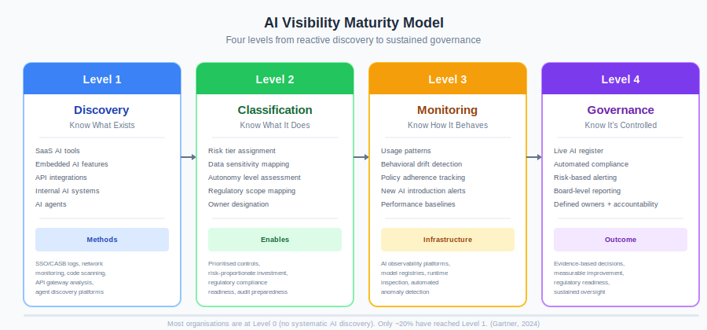

# The Visibility Problem: You Can't Govern What You Can't See

> *Sustaining oversight requires knowing what AI solutions are running. Most enterprises don't.*

The most sophisticated control framework in the world is irrelevant if you don't know what AI systems are running in your organisation. Before guardrails, before judges, before PACE resilience — there's a prerequisite: **visibility**.

This isn't a theoretical gap. It's the dominant failure mode in enterprise AI security today. Organisations are deploying controls for AI systems they know about while the majority of their AI exposure sits outside their line of sight.

---

## The Scale of What You Don't Know

The data on enterprise AI visibility is stark:

| Finding | Source |
| --- | --- |
| **86% of organisations are blind to AI data flows** | IBM, 2025 |
| **78% of AI users bring their own tools to work**; 52% won't admit it | Microsoft/LinkedIn Work Trend Index, 2024 |
| **47% of generative AI usage happens through personal accounts** outside corporate oversight | Netskope, 2025 |
| **Only 18.5% of employees** are aware of any company AI policy | Shadow AI Survey (12,000+ employees), 2025 |
| **68% surge in shadow generative AI usage** in enterprises year-on-year | Reco.ai, 2025 |
| The average enterprise hosts **1,200 unauthorised applications** | IBM, 2025 |

Mid-sized organisations average **200 shadow AI tools per 1,000 employees**. Smaller companies are worse — up to **269 per 1,000**. These aren't hypothetical threats. They're active data flows your security team doesn't monitor, your governance framework doesn't cover, and your incident response plan doesn't account for.

The implication: **most enterprise AI security programmes are protecting a minority of their actual AI exposure.**

---

## Why Visibility Fails

AI is harder to inventory than traditional software. Traditional IT assets — servers, databases, SaaS applications — have observable network signatures, licence records, and procurement trails. AI is different:

**AI is embedded, not standalone.** It arrives inside existing products. Your CRM adds an AI assistant. Your email client gains a summariser. Your documentation platform starts offering AI search. None of these trigger a procurement event or firewall rule. They appear as feature updates to tools your organisation already approved.

**AI is accessible without IT.** A browser tab and a personal email address are sufficient to access GPT-4, Claude, Gemini, or any number of specialised AI tools. No installation, no admin rights, no network signature. Traditional shadow IT detection — which relies on endpoint agents, network monitoring, or SSO logs — misses this entirely.

**AI is ephemeral.** An employee pastes confidential data into a public AI tool, gets a response, and closes the tab. The data exposure happened. The AI interaction left no artefact in your systems. Unless you have DLP controls specifically watching for AI tool domains, you have no record it occurred.

**AI is composable.** Developers integrate AI APIs into internal tools, scripts, and workflows. A Python script calling the OpenAI API doesn't appear in your SaaS inventory. A Slack bot using an LLM backend doesn't register as a new application. The AI capability is woven into existing infrastructure in ways that traditional asset management can't see.

**Agentic AI compounds the problem.** AI agents that autonomously call tools, invoke other agents, and execute multi-step workflows create discovery challenges that go beyond anything traditional IT asset management was designed for. An agent spawned dynamically during a workflow execution may exist for minutes, consume significant resources, and disappear — leaving only log traces that require specialised tooling to interpret.

---

## The Cost of Not Knowing

The financial case for visibility is concrete:

| Metric | Value | Source |
| --- | --- | --- |
| Average cost of a shadow AI breach | **$4.63 million** | IBM Cost of a Data Breach, 2025 |
| Cost premium over standard breaches | **+$670,000** (17% higher) | IBM, 2025 |
| Organisations that suffered shadow AI breaches | **1 in 5** | IBM, 2025 |
| Of breached AI systems, percentage lacking access controls | **97%** | IBM, 2025 |
| Organisations reporting internal data leaks via generative AI | **46%** | Cisco, 2025 |

But financial loss is only part of the picture. Lack of visibility also means:

- **Regulatory non-compliance.** The EU AI Act requires registration of high-risk AI systems (Article 71). You cannot register what you don't know exists. ISO 42001 requires a comprehensive AI inventory as the foundation of an AI Management System. US federal agencies must publicly inventory their AI use cases under OMB M-24-10.

- **Unmanaged risk accumulation.** Every unknown AI system is an unclassified risk. It hasn't been assessed against your threat model, tested against your policies, or included in your incident response plan. Risk isn't eliminated by ignorance — it's amplified.

- **Incident response blindness.** When an AI-related incident occurs, your first question is "which system caused this?" If you don't have a comprehensive inventory, that question takes hours or days to answer — time during which the incident continues.

- **Audit failure.** External auditors increasingly ask for AI system inventories. "We don't know what AI we're running" is an audit finding, not an acceptable answer.

---

## What Visibility Actually Requires

Effective AI visibility isn't a single tool or a one-time inventory. It's a sustained capability that operates across four levels of maturity:

### Level 1: Discovery — Know What Exists

The foundation. Identify every AI system, tool, API integration, and embedded AI capability in your environment.

**What to discover:**

| Category | Examples | Discovery Method |
| --- | --- | --- |
| **SaaS AI tools** | ChatGPT, Claude, Gemini, Copilot | SSO logs, CASB, network monitoring, browser extension telemetry |
| **Embedded AI features** | CRM AI assistants, email summarisers, code completion | Vendor disclosure, feature audit of existing tools |
| **API integrations** | OpenAI API, Anthropic API, Hugging Face | API gateway logs, code repository scanning, egress monitoring |
| **Internal AI systems** | Custom models, fine-tuned deployments, RAG pipelines | Model registry, CI/CD pipeline analysis, infrastructure scanning |
| **AI agents** | Autonomous agents, multi-agent systems | Agent discovery platforms, orchestrator logs, compute monitoring |

**The honest challenge:** Complete discovery is aspirational. The goal is to close the gap between known and actual AI usage to a manageable level — not to achieve perfection. Even partial visibility is dramatically better than none.

### Level 2: Classification — Know What It Does

Discovery tells you *what* exists. Classification tells you *what it does* and *how much risk it carries*.

Every discovered AI system should be classified against:

- **Risk tier** — Using the framework's risk classification (or your own). What's the blast radius if this system fails or is compromised?
- **Data sensitivity** — What data does this system access, process, or generate? Is it handling PII, financial data, intellectual property, health records?
- **Autonomy level** — Is this a suggestion engine (human reviews every output), a semi-autonomous tool (human reviews some outputs), or a fully autonomous system (acts without human approval)?
- **Regulatory scope** — Does this system fall under EU AI Act high-risk categories? Does it make decisions about people (employment, credit, insurance)?

Classification enables prioritisation. You don't need the same controls on every AI system — but you need to know which ones require the most.

### Level 3: Monitoring — Know How It Behaves

Static inventories decay. Models update, configurations change, usage patterns shift, new AI capabilities appear inside existing tools. Monitoring is the continuous loop that keeps your inventory accurate and your risk assessment current.

**Continuous monitoring should track:**

- **Usage patterns** — Who is using which AI systems, how frequently, and with what data?
- **Behavioural drift** — Are AI outputs changing over time? Are error rates, hallucination rates, or refusal rates shifting?
- **Policy adherence** — Are AI systems operating within defined boundaries? Are guardrails firing? Are escalation thresholds being respected?
- **New AI introduction** — Are new AI tools, APIs, or embedded capabilities appearing in your environment?

This is where AI observability platforms become essential infrastructure, not optional tooling.

### Level 4: Governance — Know It's Controlled

Governance closes the loop. It takes the intelligence from discovery, classification, and monitoring and translates it into organisational decision-making.

At this level, you have:

- A **live AI register** that reflects current state, not a point-in-time snapshot
- **Automated compliance checks** against regulatory requirements
- **Risk-based alerting** when AI systems drift outside acceptable parameters
- **Board-level reporting** on AI risk posture
- **Defined owners** for every AI system, with accountability for its behaviour

---

## Governance Through Metrics: What to Measure

> Governance without measurement is aspiration. Governance with measurement is management.

Only **30% of companies using AI track governance performance through formal indicators** (World Economic Forum, 2023). Only **15% of boards receive AI-related metrics** (McKinsey, 2025). This means most organisations are governing AI by opinion, not evidence.

Effective AI governance requires metrics across five domains:

### 1. Inventory Coverage

These metrics answer: *How much of our AI exposure do we actually know about?*

| KPI | What It Measures | Target |
| --- | --- | --- |
| **AI systems inventoried** | Number of known AI systems vs. estimated total | >90% discovery rate |
| **Shadow AI detection rate** | Unauthorised AI tools discovered per period | Trending downward |
| **Time to discover** | Mean time from AI deployment to inventory inclusion | <30 days |
| **Classification completeness** | Percentage of inventoried systems with risk classification | 100% |
| **Owner assignment rate** | Percentage of AI systems with a designated accountable owner | 100% |

### 2. Risk and Compliance

These metrics answer: *Are our AI systems operating within acceptable risk boundaries?*

| KPI | What It Measures | Target |
| --- | --- | --- |
| **Risk assessment coverage** | Percentage of AI systems with completed risk assessments | 100% for high-risk, >80% overall |
| **Policy adherence rate** | Percentage of AI operations compliant with governance policies | >95% |
| **Regulatory mapping coverage** | AI systems mapped to applicable regulations (EU AI Act, NIST, ISO 42001) | 100% for in-scope systems |
| **Audit finding closure rate** | Time to remediate governance audit findings | <30 days for critical |
| **Open exceptions** | Number of active governance exceptions and their age | Trending downward |

### 3. Operational Health

These metrics answer: *Are our AI systems performing as expected?*

| KPI | What It Measures | Target |
| --- | --- | --- |
| **Model drift indicators** | Data drift, concept drift, prediction drift scores | Within defined thresholds |
| **Hallucination rate** | Percentage of outputs containing fabricated information | Measured and trending downward |
| **Guardrail activation rate** | Frequency of guardrail interventions | Stable or context-appropriate |
| **Escalation rate** | Percentage of AI outputs requiring human review | Within staffing capacity |
| **Judge agreement rate** | LLM-as-Judge alignment with human evaluation | >80% for domain |

### 4. Security Posture

These metrics answer: *Are our AI systems secure?*

| KPI | What It Measures | Target |
| --- | --- | --- |
| **AI incident count** | Security incidents involving AI systems per period | Measured, trending downward |
| **Mean time to detect (MTTD)** | Time from AI security event to detection | <24 hours |
| **Mean time to respond (MTTR)** | Time from detection to containment | <4 hours for critical |
| **Data leakage incidents** | Confirmed data exposures via AI tools | Zero target |
| **Access control coverage** | AI systems with proper authentication and authorisation | 100% |

### 5. Governance Maturity

These metrics answer: *Is our governance programme improving?*

| KPI | What It Measures | Target |
| --- | --- | --- |
| **Governance programme coverage** | AI systems under active governance vs. total inventory | >90% |
| **Board reporting cadence** | Frequency of AI risk reporting to board/executive level | Quarterly minimum |
| **Training completion rate** | Employees who have completed AI governance training | >90% |
| **Automated vs. manual monitoring** | Percentage of AI systems with automated observability | >80% |
| **Policy review cadence** | Frequency of AI governance policy updates | At least annually |

### The Metrics Anti-Pattern

A warning: metrics without context are dangerous. Tracking 50 KPIs that nobody acts on is governance theatre. The goal is not a dashboard full of green lights. It's a feedback loop that drives decisions.

**Effective metric programmes:**
- Start with 5–10 KPIs, not 50
- Tie every metric to a decision or action trigger
- Define what "out of threshold" means and who responds
- Review and retire metrics that don't drive action
- Report trends, not snapshots — a single data point is noise; a trajectory is signal

---

## The Regulatory Push for Visibility

Regulation is making AI visibility a compliance requirement, not a best practice:

### EU AI Act (Effective August 2024, phased enforcement through 2027)

- **Article 71** establishes a public EU database for high-risk AI systems
- **Article 49** requires providers to register themselves and their high-risk AI systems *before* placing them on the market
- Penalties: up to **35 million euros or 7% of global annual turnover**
- The database is publicly accessible and machine-readable

### ISO/IEC 42001:2023

- First certifiable AI management system standard
- Requires organisations to **document all AI systems** in use or under development
- Mandates cataloguing of purposes, data sources, decision-making processes, and stakeholder impacts
- AI inventory is the foundation of the AI Management System (AIMS)

### NIST AI RMF

- **GOVERN 1.1** requires that AI-related legal and regulatory requirements are "understood, managed, and documented"
- Implicitly supports comprehensive AI system documentation and tracking
- The Measure function specifically addresses ongoing monitoring for drift and degradation

### US Federal Requirements (OMB M-24-10)

- Federal agencies must **inventory and publicly share AI use cases**
- As of December 2024: **1,700+ use cases** reported, **227 classified as rights- or safety-impacting**
- Agencies had to implement minimum practices for impactful AI or **stop using non-compliant AI** by December 2024

The direction is clear: regulators worldwide are requiring AI inventories. Organisations that cannot demonstrate visibility into their AI estate will face compliance gaps regardless of how good their controls are.

---

## What the Market Is Building

The AI governance market is responding to the visibility gap. It's projected to grow from **$227 million in 2024 to $4.83 billion by 2034**, with the specialised AI observability segment reaching **$12.5 billion by 2034** (Custom Market Insights / QKS Group).

The tools are converging on four capability layers — aligned with Gartner's AI TRiSM framework:

| Capability | What It Does | Example Platforms |
| --- | --- | --- |
| **AI Catalogue** | Inventory of all AI entities in the organisation | Arthur AI (Agent Discovery), Zylo, Harmonic Security |
| **AI Data Mapping** | Maps data used for AI training, tuning, and contextualisation | Securiti, Alation, DataRobot |
| **Continuous Assurance** | Ongoing performance, reliability, and security assessment | Arize AI, Fiddler AI, WhyLabs, Weights & Biases |
| **Runtime Inspection** | Real-time monitoring and enforcement of governance policies | Datadog LLM Observability, Dynatrace, Fiddler AI |

**Important:** No single vendor currently covers all four capabilities comprehensively. Enterprises are assembling multi-tool stacks. When evaluating platforms, map vendor capabilities to your specific gaps rather than seeking an all-in-one solution.

### The Agentic Discovery Challenge

Agentic AI adds a new dimension. With **62% of organisations experimenting with AI agents** (McKinsey, 2025) and Gartner projecting that **one-third of enterprise software will feature agentic AI by 2028**, the discovery problem is about to get significantly harder.

Traditional AI inventory assumes relatively static systems — a model deployed to an endpoint, a chatbot on a website, an API behind a gateway. AI agents are dynamic. They spawn, delegate, consume resources, and terminate within single workflow executions. Discovering and governing these ephemeral entities requires fundamentally different tooling — closer to container orchestration monitoring than traditional application inventory.

---

## The Honest Position

Gartner predicts that **40% of organisations will suffer security and compliance incidents due to shadow AI by 2030**. Through 2026, **at least 80% of unauthorised AI transactions will be caused by internal policy violations** — not malicious attacks. The threat is coming from inside the house.

The organisations that will navigate this successfully share a common trait: they treat AI visibility as continuous operational infrastructure, not a one-time compliance exercise. They invest in:

1. **Automated discovery** that catches new AI usage without relying on self-reporting
2. **Risk classification** that prioritises controls based on actual exposure
3. **Continuous monitoring** that detects drift, policy violations, and new introductions
4. **Metrics that drive decisions**, not dashboards that gather dust
5. **Governance structures with teeth** — designated owners, escalation paths, and consequences for non-compliance

None of this requires exotic technology. Most of the monitoring patterns — asset discovery, risk classification, continuous monitoring, KPI-driven governance — are well-established in traditional IT security. The challenge is extending them to a new class of asset that is harder to see, faster to deploy, and easier to adopt without oversight.

**You can't govern what you can't see. And right now, most enterprises can't see most of their AI.**

---

## Key Takeaways

1. **Visibility is the prerequisite for everything else.** No control framework, governance policy, or compliance programme works without knowing what AI systems exist in your environment.

2. **Shadow AI is the dominant risk — not adversarial attack.** 86% of organisations are blind to AI data flows. The average enterprise hosts 1,200 unauthorised applications. The threat is internal and largely non-malicious.

3. **The cost is measurable.** Shadow AI breaches cost $4.63 million on average — 17% more than standard breaches. 97% of breached AI systems lacked basic access controls.

4. **Regulation is making visibility mandatory.** The EU AI Act, ISO 42001, NIST AI RMF, and US federal requirements all demand AI inventories. "We don't know" is becoming a compliance violation.

5. **Metrics sustain governance.** Only 30% of AI-using companies track governance through formal indicators. Without metrics, governance is aspiration. With metrics tied to decisions, governance is management.

6. **Start with discovery, not perfection.** Partial visibility is dramatically better than none. Automate what you can, classify what you find, monitor what matters most, and measure whether you're improving.

---

## Related

- [State of Reality](state-of-reality.md) — What the incident data actually shows
- [The First Control](the-first-control.md) — Choosing the right tool before deploying AI
- [Infrastructure Beats Instructions](infrastructure-beats-instructions.md) — Why controls must be enforced at infrastructure level
- [Risk Tier Is Use Case, Not Technology](risk-tier-is-use-case.md) — Risk classification for control prioritisation
- [The Supply Chain Problem](the-supply-chain-problem.md) — Visibility into AI components you don't control

---

## Sources

| Source | What It Provides | Year |
| --- | --- | --- |
| [IBM Cost of a Data Breach 2025](https://newsroom.ibm.com/) | Shadow AI breach costs, access control gaps, incident rates | 2025 |
| [Microsoft/LinkedIn Work Trend Index](https://www.microsoft.com/en-us/worklab/work-trend-index/) | BYOAI prevalence, employee behaviour data | 2024 |
| [Netskope Cloud Security Report](https://www.cybersecuritydive.com/news/shadow-ai-security-risks-netskope/808860/) | Personal account AI usage, corporate visibility gaps | 2025 |
| [McKinsey State of AI](https://www.mckinsey.com/capabilities/quantumblack/our-insights/the-state-of-ai) | Governance maturity, board reporting, agentic adoption | 2025 |
| [Gartner AI TRiSM](https://www.gartner.com/en/articles/ai-trust-and-ai-risk) | Four-capability governance model, shadow AI predictions | 2024–2025 |
| [Stanford HAI AI Index 2025](https://hai.stanford.edu/ai-index/2025-ai-index-report) | Incident counts, regulatory trends, adoption data | 2025 |
| [EU AI Act](https://artificialintelligenceact.eu/) | Articles 49, 71 — registration and database requirements | 2024 |
| [ISO/IEC 42001:2023](https://www.iso.org/standard/81230.html) | AI Management System inventory requirements | 2023 |
| [NIST AI RMF](https://www.nist.gov/itl/ai-risk-management-framework) | Govern, Map, Measure, Manage functions | 2023 |
| [OMB M-24-10](https://www.whitehouse.gov/wp-content/uploads/2024/03/M-24-10-Advancing-Governance-Innovation-and-Risk-Management-for-Agency-Use-of-Artificial-Intelligence.pdf) | US federal AI inventory requirements | 2024 |
| [Reco.ai Shadow AI Report](https://www.reco.ai/blog/popular-doesnt-mean-secure-the-2025-state-of-shadow-ai-report-findings) | Shadow AI usage trends, enterprise telemetry | 2025 |
| [Cisco AI Security Report](https://cloudsphere.com/shadow-ai-the-hidden-security-crisis-threatening-your-enterprise-in-2025/) | Data leakage via AI tools | 2025 |
| [World Economic Forum](https://www.weforum.org/) | AI governance KPI adoption rates | 2023 |
| [Forrester AEGIS](https://www.forrester.com/blogs/forrester-aegis-the-new-standard-for-ai-governance/) | AI governance market forecast, control framework alignment | 2025 |

---

*AI Runtime Behaviour Security, 2026 (Jonathan Gill).*
