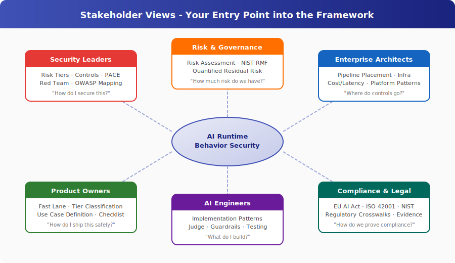

# Stakeholder Views

**Your role. Your risks. Your entry point into the framework.**

> *Part of the [AI Runtime Behaviour Security](../)*

---

This framework covers a lot of ground — risk tiers, three-layer controls, PACE resilience, MASO multi-agent security, infrastructure controls, regulatory mappings, strategy. Nobody needs all of it.

These pages tell you **what matters for your role**, **why you should care**, and **where to start reading**. Each one is a window into the framework from your perspective — not a summary of everything, but a filter for what's relevant to your work.

---

## Pick Your Role

<table markdown="block">
<tr>
<td width="50%" markdown="block">

### [Security Leaders](security-leaders.md)
CISOs, Security Directors, Security Architects

*You're accountable for AI risk but the threat model is different from anything you've secured before.*

</td>
<td width="50%" markdown="block">

### [Risk & Governance](risk-and-governance.md)
CROs, Risk Managers, GRC Teams

*You need to quantify AI risk, set appetite, and prove to the board that controls are working.*

</td>
</tr>
<tr>
<td markdown="block">

### [Enterprise Architects](enterprise-architects.md)
Solution Architects, Platform Architects, Technical Leads

*You're designing the pipeline. You need to know where controls go, what they cost, and how they fail.*

</td>
<td markdown="block">

### [Product Owners](product-owners.md)
Product Managers, Business Owners, Delivery Leads

*You want to ship AI features. You need to know what controls are required and what they cost in time and money.*

</td>
</tr>
<tr>
<td markdown="block">

### [AI Engineers](ai-engineers.md)
ML Engineers, AI Developers, Data Scientists, Platform Engineers

*You're building the system. You need implementation patterns, not governance theory.*

</td>
<td markdown="block">

### [Compliance & Legal](compliance-and-legal.md)
Compliance Officers, Legal Counsel, DPOs, Audit Teams

*You need to demonstrate that AI deployments meet regulatory obligations — with evidence, not assertions.*

</td>
</tr>
</table>

---

## How These Pages Work

Each stakeholder page follows the same structure:

1. **The problem from your perspective** — why AI security isn't like the security you already know
2. **What this framework gives you** — the specific parts relevant to your work
3. **Your starting path** — ordered reading list, 3-5 documents deep
4. **What you can do Monday morning** — concrete first actions
5. **Common objections addressed** — the pushback you'll get, with answers

These are entry points, not destinations. Follow the links into the full framework when you need depth.

---

*AI Runtime Behaviour Security, 2026 (Jonathan Gill).*
