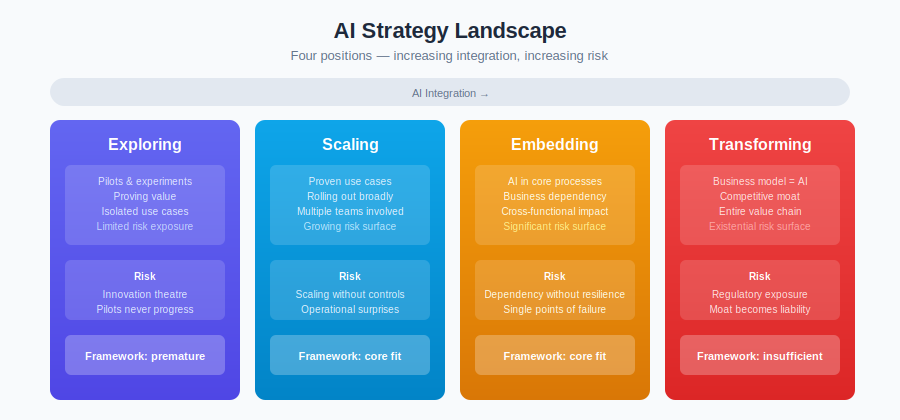

# AI Strategy

*How organisations should approach AI strategy — considering what the framework supports, where it's silent, and where strategies will test its limits.*

> Part of [AI Runtime Behaviour Security](../)

---

## Why Strategy Needs Its Own Section

The rest of this framework tells you **how to secure AI systems**. It doesn't tell you **which AI systems to build**, or whether building them is the right decision in the first place.

That gap matters. Organisations don't fail at AI because they picked the wrong guardrail library. They fail because they pursued the wrong use case, with the wrong data, expecting the wrong people to operate it, at the wrong point in their maturity.

Security frameworks are constraints. Strategy is about choosing what to do within those constraints — and sometimes deciding which constraints need to change.

This section addresses the questions the framework deliberately avoids:

- **What AI should we build?** Not everything that *can* be done with AI *should* be done with AI.
- **What can we actually deliver?** Given our data, skills, and organisational readiness.
- **How do we get from simple to ambitious?** Without skipping the steps that make ambitious work safe.
- **Where does the framework help strategy — and where does it get in the way?**

---

## Articles

Read in order, or jump to what's relevant.

| # | Article | One-Line Summary |
|---|---------|-----------------|
| 1 | [Business Alignment](business-alignment.md) | How to match AI investments to business problems — and why most mismatches are strategic, not technical |
| 2 | [Use Case Filter](use-case-filter.md) | Is AI the right solution? A structured decision flow with five exits — from rules engines to agentic AI |
| 3 | [Data Reality](data-reality.md) | Your data determines your strategy more than your ambition does |
| 4 | [Human Factors](human-factors.md) | Skills, time, learning capacity, and the organisational readiness nobody wants to audit |
| 5 | [Progression](progression.md) | Moving from low-risk to high-risk AI — and why skipping steps is the most common strategic failure |
| 6 | [Framework Tensions](framework-tensions.md) | Where this framework supports strategy, where it's silent, and where it actively constrains strategic choices |
| 7 | [Use Case Definition](use-case-definition.md) | What makes a good use case from a security and governance perspective — and how to translate one into a risk profile |
| 8 | [From Idea to Production](idea-to-production.md) | The complete lifecycle: strategy to use case to tool selection to risk tiering to deployment to ongoing governance |

---

## The Strategic Landscape

Most organisations sit in one of four positions:

| Position | Description | Strategic Risk |
|----------|-------------|----------------|
| **Exploring** | Pilots, experiments, proving value | Risk of never moving beyond pilots; "innovation theatre" |
| **Scaling** | Proven use cases being rolled out | Risk of scaling without controls; operational surprises |
| **Embedding** | AI integrated into core processes | Risk of dependency without resilience; single points of failure |
| **Transforming** | Business model dependent on AI | Risk of regulatory exposure; competitive moat becomes liability |

The framework is designed primarily for organisations in the **Scaling** and **Embedding** positions. Organisations still **Exploring** may find the full framework premature. Organisations already **Transforming** may find it insufficient.

This section helps you understand where you are, what's appropriate, and what comes next.

---

## Key Principles

These run through every article in this section:

**1. Strategy must survive contact with constraints.**
An AI strategy that ignores data quality, team skills, or regulatory requirements isn't a strategy. It's a wish list.

**2. The framework is a tool, not a ceiling.**
Controls exist to manage risk, not to prevent progress. If a strategic priority requires changing a constraint, that's a governance conversation — not a dead end.

**3. Start where you are, not where you want to be.**
The most dangerous strategies are the ones that assume capabilities the organisation doesn't have yet. Build competence through progressive risk, not leap-of-faith deployments.

**4. Not every problem is an AI problem.**
The [first control](../insights/the-first-control.md) is choosing the right tool. Sometimes the right tool isn't AI. Strategy should identify where AI creates genuine advantage, not apply it everywhere because it's available.

**5. Honest assessment beats optimistic planning.**
The framework's [Maturity & Validation](../MATURITY.md) section is transparent about what's proven and what's theoretical. Strategy should be equally honest about organisational readiness.

---

## Relationship to the Framework

This section references framework components throughout but does not repeat them. You'll need familiarity with:

- [Risk Tiers](../core/risk-tiers.md) — how the framework classifies risk
- [Fast Lane](../FAST-LANE.md) — the pre-approved low-risk path
- [PACE Resilience](../PACE-RESILIENCE.md) — the degradation model
- [Novel AI Risks](../extensions/technical/novel-ai-risks.md) — what's genuinely new about AI risk
- [Governance Operating Model](../extensions/regulatory/ai-governance-operating-model.md) — the organisational structure

---

*AI Runtime Behaviour Security, 2026 (Jonathan Gill).*
