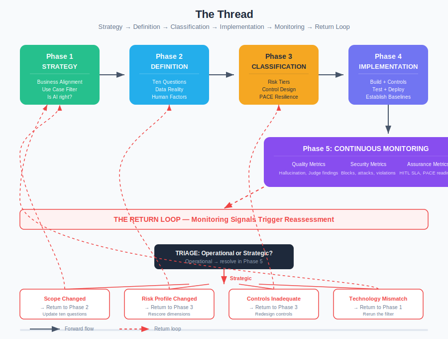

# The Thread

*How strategy, use case definition, solution filtering, security design, and continuous monitoring connect into a single, unbroken lifecycle.*

> Part of [AI Strategy](./)

---

## Why This Article Exists

The strategy section has eight articles. Each one does its job. Business Alignment asks whether the problem is real. The Use Case Filter asks whether AI is the right answer. Data Reality asks whether the data supports it. And so on through implementation, deployment, and governance.

But readers tell us the same thing: they can follow each article individually, and still not see how they connect. The stages in [From Idea to Production](idea-to-production.md) define the process. This article tells the story — how decisions made early constrain what happens later, how monitoring findings feed back into strategy, and why the lifecycle is a loop, not a line.



---

## Phase 1: Strategy — Knowing What Problem You're Solving

**Articles:** [Business Alignment](business-alignment.md) → [Use Case Filter](use-case-filter.md)

The thread starts with a business problem, not a technology choice. This is the single most important discipline in the lifecycle, and the one most frequently skipped.

### What Happens Here

Someone identifies a problem worth solving. Customer service costs too much. Fraud detection misses low-value cases. Regulatory reporting takes 200 hours per quarter. The problem is real, measurable, and painful enough to justify investment.

[Business Alignment](business-alignment.md) forces three honest questions:
1. **Is this problem real?** Not aspirational, not theoretical — does it show up in metrics, complaints, or costs?
2. **Is it worth solving now?** Given competing priorities, does this earn investment?
3. **How will we know it worked?** What specific, measurable outcome defines success?

If the answers are vague, stop. Vague problems produce vague solutions, and vague AI solutions are expensive to build, expensive to secure, and impossible to evaluate.

### The First Branch Point

Once the problem is confirmed, the [Use Case Filter](use-case-filter.md) asks the question that most organisations skip: **is AI actually the right tool?**

Seven questions, evaluated in order. Each one offers a non-AI exit:

- If the logic is deterministic → rules engine
- If the process is structured and repeatable → RPA
- If the answer exists in a document → search
- If the task is pattern recognition on structured data → traditional ML

Only if the problem genuinely requires understanding unstructured input, generating novel content, or autonomous multi-step reasoning does the filter point to AI. And when it does, it specifies *which kind* — NLP, generative AI, or agentic.

**Why this matters for the rest of the thread:** The filter determines not just the technology, but the entire control burden. A rules engine needs no guardrails, no Judge, no HITL oversight. Traditional ML needs monitoring and bias detection but not prompt injection defence. Only LLM and agentic AI require the full framework. The filter sets the cost of governance for the entire lifecycle.

**The honest answer is often hybrid.** A single system might use rules for routing, search for retrieval, and an LLM for response generation. The filter applies per-component. The framework applies only to the AI components.

---

## Phase 2: Definition — Knowing What You're Building

**Articles:** [Use Case Definition](use-case-definition.md) + [Data Reality](data-reality.md) + [Human Factors](human-factors.md)

The filter said AI is appropriate. Now define exactly what the AI system will do, what data it needs, and whether the organisation can actually operate it.

### The Ten Questions

[Use Case Definition](use-case-definition.md) asks ten questions that directly determine control requirements:

1. **What decisions will the AI make?** → Sets decision authority dimension
2. **Can those decisions be reversed?** → Sets reversibility dimension
3. **What data does it access?** → Sets data sensitivity dimension
4. **Who sees the output?** → Sets audience dimension
5. **At what volume?** → Sets scale dimension
6. **Under what regulations?** → Sets regulatory dimension
7. **What happens when it's wrong?** → Determines blast radius
8. **What does the human do?** → Determines HITL design
9. **Where does it sit in the process?** → Determines integration points
10. **Who is accountable?** → Determines ownership model

Every answer constrains what comes later. If the AI drafts customer communications (audience: external, data: personal), the risk tier will be at least MEDIUM. If it also sends those communications autonomously (decision authority: high, reversibility: low), it's HIGH or CRITICAL. These aren't abstract scores — they're direct inputs to control design.

### The Reality Checks

Two articles provide reality checks before anyone starts building:

**[Data Reality](data-reality.md)** asks whether the data actually supports the use case. Existence, accessibility, quality, legality, usability — five dimensions that frequently kill AI projects after significant investment. The question isn't "do we have data?" but "do we have data that's clean enough, accessible enough, and legal enough to train and run this system?"

**[Human Factors](human-factors.md)** asks whether the organisation can operate what it builds. Do HITL reviewers have the domain expertise to evaluate AI output? Can the team maintain guardrails as the system evolves? Is there enough AI operational skill to tune Judges, investigate anomalies, and manage drift? Skills gaps don't prevent deployment — they prevent safe deployment.

**Why this matters for the rest of the thread:** Incomplete use case definitions produce incorrect risk classifications. Incorrect risk classifications produce inadequate controls. Inadequate controls produce incidents. The time spent here is the cheapest risk mitigation in the entire lifecycle.

---

## Phase 3: Classification and Control Design — Knowing What Security Looks Like

**Framework references:** [Risk Tiers](../core/risk-tiers.md) → [Controls](../core/controls.md) → [PACE Resilience](../PACE-RESILIENCE.md)

The use case is defined. Now classify the risk and design the controls.

### Risk Classification

The framework scores six dimensions from the use case definition:

| Dimension | From Use Case Question | Drives |
|-----------|----------------------|--------|
| Decision Authority | Q1: What decisions? | How much autonomy the AI gets |
| Reversibility | Q2: Can decisions be undone? | How fast you need to catch errors |
| Data Sensitivity | Q3: What data? | Encryption, access control, DLP |
| Audience | Q4: Who sees output? | Guardrail strictness |
| Scale | Q5: At what volume? | Judge sampling rate, HITL capacity |
| Regulatory | Q6: Under what regulation? | Compliance controls, audit trail |

The highest dimension sets the floor. Adjacent HIGH scores compound upward. Modifiers apply (agentic: +1, customer-facing: +1, regulated: +1). The result is a tier: LOW, MEDIUM, HIGH, or CRITICAL.

### Control Specification

Each tier mandates specific controls. The specification isn't a checklist — it's an architecture:

- **Guardrails:** What gets blocked at input and output. PII filters, topic boundaries, format validation, action restrictions.
- **Judge evaluation:** What gets evaluated after generation. Quality, policy compliance, safety, accuracy. Sampling rate scales with tier (10% at MEDIUM, 50% at HIGH, 100% at CRITICAL).
- **Human oversight:** What humans review. Queue design, SLA, reviewer qualifications, escalation paths.
- **PACE resilience:** What happens when things go wrong. Performance degradation triggers, Accuracy fallback thresholds, Compliance circuit breakers, Error recovery procedures.
- **Monitoring:** What gets measured. Guardrail block rates, Judge finding rates, HITL agreement rates, anomaly detection thresholds.

### The Progression Constraint

[Progression](progression.md) adds one more constraint: the organisation's current position on the maturity curve determines what it can safely deploy. An organisation at "Assisted AI" (human makes all decisions, AI provides information) shouldn't jump to "Autonomous AI" (AI acts independently) regardless of what the use case suggests. The progression model maps five positions and the capabilities required at each.

**Why this matters for the rest of the thread:** The control specification is the contract between the deployment and the governance function. Every metric in Phase 5 traces back to a control designed here. If monitoring detects a problem, the first question is whether the control was correctly specified — and the answer is in this phase.

---

## Phase 4: Build, Test, and Deploy — Making It Real

**Framework references:** [Implementation Guide](../IMPLEMENTATION_GUIDE.md) → [Testing Guidance](../extensions/templates/testing-guidance.md) → [SOC Integration](../extensions/technical/soc-integration.md)

Design is done. Now build the system and its controls together — not the system first and controls later.

### The "Together" Principle

The most common implementation failure is building the AI system and then bolting on controls as an afterthought. Guardrails added late are configured wrong. Judge evaluation added late misses the context needed to evaluate correctly. HITL workflows added late don't match the operational reality.

Controls are part of the architecture, not a layer on top of it. The prompt pipeline includes guardrail checks. The response pipeline includes Judge evaluation. The deployment pipeline includes PACE transitions. They ship together or they don't ship.

### Testing the Controls, Not Just the System

Testing verifies three things:

1. **The system works:** It produces the right outputs for expected inputs.
2. **The controls work:** Guardrails block what they should. The Judge catches what it should. HITL queues route correctly.
3. **The failures work:** PACE transitions activate correctly. Fallbacks produce acceptable (if degraded) service. Kill switches stop what they should.

The pre-deployment checklist in [From Idea to Production](idea-to-production.md) covers every verification point. For HIGH and CRITICAL tiers, governance committee approval is required before go-live.

### The First 30 Days

Deployment isn't the end of implementation — it's the beginning of operational learning. The first 30 days involve daily review of guardrail effectiveness, Judge findings, and HITL SLA compliance. Guardrails get tuned (false positives reduced). Judge accuracy gets calibrated against HITL decisions. Operational baselines get established.

These baselines matter. They define what "normal" looks like. Without them, Phase 5 has nothing to compare against.

**Why this matters for the rest of the thread:** The baselines established during the first 30 days are the foundation of continuous monitoring. Every anomaly in Phase 5 is measured as deviation from these baselines. Poorly established baselines produce either constant false alarms (too tight) or missed problems (too loose).

---

## Phase 5: Continuous Monitoring — Knowing It's Still Working

**Framework references:** [Operational Metrics](../extensions/technical/operational-metrics.md) → [Anomaly Detection](../extensions/technical/anomaly-detection-ops.md) → [SOC Integration](../extensions/technical/soc-integration.md) → [Governance Operating Model](../extensions/regulatory/ai-governance-operating-model.md)

The system is live. Now keep it honest.

### What Monitoring Actually Means

AI monitoring isn't application monitoring with different labels. Traditional systems break in predictable ways — errors, timeouts, resource exhaustion. AI systems **drift** in ways that are subtle, gradual, and often invisible until they cause harm.

Three categories of monitoring, each serving a different purpose:

**Quality monitoring** asks: is the AI still producing good output?
- Hallucination rate (trending up = model or data drift)
- Grounding score (how well responses match source material)
- Judge finding rate (trending up = output quality declining)
- HITL override rate (trending up = AI accuracy declining)

**Security monitoring** asks: is anyone exploiting the AI?
- Guardrail block rate (trending up = more attack attempts or tighter guardrails)
- Prompt injection detection rate
- Data exfiltration attempt rate
- Agent boundary violation rate (for agentic systems)

**Assurance monitoring** asks: are the controls still working?
- Control effectiveness (are guardrails catching what they should?)
- Judge accuracy (does the Judge agree with human reviewers?)
- HITL SLA compliance (are reviews happening within the required time?)
- PACE readiness (do transitions still work when tested?)

### The Cadences

Not everything is real-time. Monitoring operates at three cadences:

| Cadence | Activities | Purpose |
|---------|-----------|---------|
| **Continuous** | Guardrail monitoring, anomaly detection, usage tracking | Catch immediate threats and failures |
| **Periodic** | Judge calibration (weekly–monthly), control effectiveness review (quarterly), use case reassessment (annual), PACE tests, human factors assessment | Catch gradual drift and evolving risk |
| **Event-driven** | Incident response, scope change assessment, model change review, regulatory change impact | Respond to discrete changes |

### The Signals That Matter

Monitoring produces data. The governance function needs signals — meaningful patterns that trigger action. Here are the ones that matter most:

| Signal | What It Means | Action Required |
|--------|--------------|-----------------|
| **Judge finding rate increasing** | AI output quality is declining | Investigate root cause: model drift, data change, or prompt degradation |
| **HITL override rate increasing** | AI decisions are becoming less accurate | Check training data currency; consider retraining or prompt revision |
| **Guardrail blocks increasing** | More out-of-scope inputs, possible attack pattern, or guardrails too tight | Distinguish between attack increase and false positive increase |
| **Usage pattern change** | Different users, volumes, or input types than designed for | Reassess use case scope and risk tier |
| **PACE test failure** | Fallback mechanism no longer works | Fix immediately — this is the safety net |
| **Judge accuracy dropping** | Judge's evaluation is diverging from human judgement | Recalibrate; may indicate that the domain is evolving |
| **New data sources accessed** | The system's data exposure has changed | Reassess data sensitivity dimension |
| **Volume threshold breach** | System operating at scale beyond original design | Reassess scale dimension; check HITL capacity |

---

## The Return Loop — Where Most Lifecycles Break

Everything described so far is a forward flow: problem → definition → classification → controls → deployment → monitoring. Most organisations get this far. Where they fail is the return loop — using monitoring signals to trigger reassessment and adjustment.

### Why the Loop Matters

AI systems don't stay as designed. They drift. The environment drifts. The organisation drifts. Without an explicit return loop:

- A system designed for 1,000 queries/day handles 50,000 and nobody reassesses the scale dimension
- An internal tool gets exposed to customers and nobody reassesses the audience dimension
- A data pipeline adds a new source with PII and nobody reassesses the data sensitivity dimension
- Guardrails get loosened to reduce false positives and nobody evaluates the security impact
- The model gets upgraded and nobody rechecks Judge calibration

Each of these is a scope change. Each one potentially changes the risk tier. Each one should trigger a return to Phase 2 (definition) or Phase 3 (classification) — but only if the loop is explicit and someone owns it.

### The Return Loop Process

When monitoring surfaces a signal that suggests the system has moved beyond its original parameters:

```
MONITORING SIGNAL DETECTED
    │
    ▼
TRIAGE: Is this operational or strategic?
    │
    ├── Operational (guardrail tuning, Judge recalibration, HITL process fix)
    │   └── Resolve within Phase 5 — no return loop needed
    │
    └── Strategic (scope change, tier change, control redesign)
        │
        ▼
    REASSESSMENT: Which phase needs revisiting?
        │
        ├── Use case scope changed → Return to Phase 2 (Definition)
        │   Update the ten questions. The answers may have changed.
        │
        ├── Risk profile changed → Return to Phase 3 (Classification)
        │   Rescore the six dimensions. The tier may move.
        │
        ├── Controls inadequate → Return to Phase 3 (Control Design)
        │   Redesign controls for the current reality.
        │
        └── Technology mismatch → Return to Phase 1 (Filter)
        │   The use case may no longer suit AI at all.
            Rerun the filter with current knowledge.
```

### Who Owns the Loop

| Role | Responsibility |
|------|---------------|
| **Technical operations** (1st line) | Detect signals, triage as operational or strategic, resolve operational issues |
| **AI governance** (2nd line) | Receive strategic triggers, initiate reassessment, track use case definitions as living documents |
| **Risk analyst** (2nd line) | Rescore dimensions when triggered, recommend tier changes |
| **Business owner** | Confirm scope changes, approve updated use case definitions, accept changed risk profiles |
| **Security architect** | Review control adequacy when tier changes, redesign when needed |

### The Living Use Case Definition

The use case definition from Phase 2 is not a project artifact — it's an operational document. It gets maintained alongside the running system. When monitoring reveals that reality has diverged from the definition, the definition gets updated, the risk profile gets rescored, and control adequacy gets reassessed.

The governance function maintains a registry of all AI use cases. Each entry links to the current use case definition, current risk tier, current control specification, and the date of last reassessment. Overdue reassessments are flagged in the [governance dashboard](idea-to-production.md).

---

## The Thread in Practice — A Single Use Case, End to End

To make this concrete, here's one use case traced through the entire thread.

### The Problem (Phase 1)

A financial services firm's customer service team handles 15,000 queries per day. Average resolution time is 14 minutes. Cost per interaction is £8.50. Customer satisfaction sits at 72%. The business wants to reduce resolution time by 40% and improve satisfaction to 85% without proportionally increasing headcount.

**Business Alignment:** Problem is real (measurable, costly), worth solving now (top-5 strategic priority), success criteria are specific (time, cost, satisfaction targets).

**Use Case Filter:**
- Q1: Deterministic rules? → Partially. Routing and FAQ matching are rule-based. But understanding nuanced customer queries isn't.
- Q3: Search? → Partially. Many answers exist in knowledge base. But customers don't ask structured questions.
- Q5: Unstructured input? → Yes. Natural language queries with context, emotion, and ambiguity.
- Q6: Generate content? → Yes. Responses need to be personalised, not templated.
- Q7: Agentic? → No for Phase 1. The AI drafts; agents review and send.

**Filter result:** Hybrid. Rules for routing. Search for knowledge base retrieval. LLM for query understanding and response generation. Full framework applies to the LLM components.

### The Definition (Phase 2)

| Question | Answer |
|----------|--------|
| What decisions? | Drafts customer responses. Does not send them — human agent reviews and sends. |
| Reversible? | Yes — human reviews before sending. If sent in error, standard customer service correction process applies. |
| What data? | Customer account data (name, account number, transaction history). PII-adjacent. |
| Who sees output? | Customer service agents see drafts. Customers see approved responses. |
| Volume? | 15,000 queries/day. Agent reviews all outputs (Phase 1). |
| Regulations? | FCA regulated. Consumer Duty obligations apply. Financial promotions rules may apply to some responses. |
| What if wrong? | Agent catches error in draft — minor. Agent misses error — customer receives incorrect information about their account. |
| What does the human do? | Reviews every draft. Edits ~30% before sending. Rejects and rewrites ~5%. |
| Where in process? | After query received, before response sent. |
| Who is accountable? | Head of Customer Service. |

**Data Reality:** Customer data exists in CRM, is accessible via API, quality is adequate (95% complete), legal basis for processing exists (contractual necessity + legitimate interest), and format is usable.

**Human Factors:** Agents have domain expertise but no AI operational training. Need training on recognising AI errors, appropriate reliance, and override procedures. Risk of automation bias is significant — agents may stop reading drafts carefully.

### The Classification (Phase 3)

| Dimension | Score | Justification |
|-----------|-------|---------------|
| Decision Authority | MEDIUM | AI drafts; humans decide to send |
| Reversibility | MEDIUM | Responses can be corrected but not unsent |
| Data Sensitivity | MEDIUM | PII-adjacent (account data, not health/financial standing) |
| Audience | HIGH | External — customers see the approved output |
| Scale | HIGH | 15,000/day — human review of every case is the control |
| Regulatory | HIGH | FCA regulated, Consumer Duty applies |

Highest dimension: HIGH (Audience, Scale, Regulatory). Adjacent HIGHs compound. Customer-facing modifier: +1.

**Tier: HIGH.**

Control specification includes input guardrails (PII redaction in prompts, topic boundaries), output guardrails (financial promotion detection, compliance language checking), Judge evaluation at 50% sampling, HITL review of 100% of outputs (the agent is the HITL), PACE resilience (graceful degradation to manual-only if AI quality drops), and comprehensive logging.

### The Build and Deploy (Phase 4)

System built with controls integrated from the start. Guardrails tested against adversarial inputs. Judge calibrated against a set of 500 expert-reviewed query-response pairs. PACE transitions tested (kill switch, degraded mode, full fallback to manual). Agents trained on the system and on their oversight role.

Deployed with staged rollout: 5% of queries → 25% → 50% → 100% over four weeks. Daily review of Judge findings and agent override rates during each phase. Baselines established:
- Agent edit rate: 30%
- Agent reject rate: 5%
- Judge finding rate: 3%
- Guardrail block rate: 0.5%
- Average response time (with AI): 8 minutes (down from 14)

### The Monitoring (Phase 5)

Six months in, monitoring surfaces three signals:

**Signal 1: Agent edit rate drops from 30% to 8%.**
Triage: Strategic. This could mean the AI improved (good) or agents stopped reading carefully (automation bias — bad). Investigation reveals a mix: AI quality has improved for common queries, but agents are also approving outputs faster with less scrutiny. This is a [Human Factors](human-factors.md) issue.

**Action:** Return to Phase 2 — the answer to "What does the human do?" has changed in practice. HITL effectiveness has degraded. Remediation: refresher training, random sampling of agent-approved responses by quality team, adjust Judge sampling upward from 50% to 75%.

**Signal 2: Volume increases from 15,000 to 45,000 queries/day.**
The system's success leads to it being deployed across two additional business units. Nobody triggered reassessment.

**Action:** Return to Phase 3 — the Scale dimension is now CRITICAL, not HIGH. At 45,000/day with agents still reviewing 100%, HITL capacity is strained. Options: increase agent headcount, reduce HITL to sampling-based (which changes the Decision Authority dimension and likely pushes the system to CRITICAL tier), or deploy the system at CRITICAL tier with enhanced controls.

**Signal 3: Agents begin using the system to handle investment product queries.**
The original scope was general customer service. Investment queries involve financial promotions regulation — a significantly different regulatory environment.

**Action:** Return to Phase 1 — rerun the Use Case Filter for investment product queries specifically. The regulatory dimension jumps to CRITICAL. This may be a separate use case with its own classification and controls, not an extension of the existing one.

### The Thread Holds

Each signal traced back through the lifecycle. The monitoring detected the drift. The return loop identified which phase to revisit. The reassessment produced updated classifications and controls. The use case definition was updated to reflect the new reality.

Without the thread, these signals would be operational noise — logged, maybe reviewed, never connected to the strategic decisions that defined the system.

---

## The Anti-Patterns

What happens when the thread breaks:

| Break Point | What Happens | Consequence |
|-------------|-------------|-------------|
| **Strategy skipped** | AI selected because it's available, not because the problem needs it | Over-engineered solution, excessive control cost, poor ROI |
| **Filter skipped** | LLM used where rules or search would suffice | Unnecessary risk, hallucination exposure, control overhead for a solved problem |
| **Definition incomplete** | "TBD" in the ten questions | Risk classification is wrong; controls are wrong; incidents are inevitable |
| **Data reality ignored** | System designed around data that doesn't exist or isn't accessible | Project fails in build phase after significant investment |
| **Human factors ignored** | HITL reviewers lack domain expertise or training | Oversight becomes rubber-stamping; automation bias sets in |
| **Controls bolt-on** | System built first, controls added later | Controls don't fit the architecture; gaps remain; false confidence |
| **Baselines not established** | No first-30-day operational learning | Monitoring has no reference point; drift is invisible |
| **Return loop absent** | Monitoring produces data but doesn't trigger reassessment | Systems drift beyond their classification; controls become inadequate |
| **Use case definition not maintained** | Definition written at start, never updated | Gap between documented risk profile and actual system widens over time |

---

## Summary

The thread is five phases that form a loop:

1. **Strategy** — Confirm the problem is real. Filter to the right solution.
2. **Definition** — Define exactly what the AI will do. Check data and human readiness.
3. **Classification and Control Design** — Score the risk. Design proportionate security.
4. **Build, Test, Deploy** — Implement system and controls together. Establish baselines.
5. **Monitor** — Watch for drift. Trigger the return loop when reality diverges from design.

The forward path gets most of the attention. The return loop is where governance actually happens. An AI system that was correctly classified at launch and never reassessed is, over time, an incorrectly classified system. The thread is what keeps the classification current, the controls adequate, and the risk visible.

---

## Article Map

| Thread Phase | Strategy Articles | Framework Documents |
|-------------|------------------|-------------------|
| 1. Strategy | [Business Alignment](business-alignment.md), [Use Case Filter](use-case-filter.md) | [The First Control](../insights/the-first-control.md) |
| 2. Definition | [Use Case Definition](use-case-definition.md), [Data Reality](data-reality.md), [Human Factors](human-factors.md) | [Risk Tier Is Use Case](../insights/risk-tier-is-use-case.md) |
| 3. Classification | [Progression](progression.md), [Framework Tensions](framework-tensions.md) | [Risk Tiers](../core/risk-tiers.md), [Controls](../core/controls.md), [PACE](../PACE-RESILIENCE.md) |
| 4. Implementation | [From Idea to Production](idea-to-production.md) (Stages 5–7) | [Implementation Guide](../IMPLEMENTATION_GUIDE.md), [Testing Guidance](../extensions/templates/testing-guidance.md) |
| 5. Monitoring | [From Idea to Production](idea-to-production.md) (Stage 8) | [Operational Metrics](../extensions/technical/operational-metrics.md), [Anomaly Detection](../extensions/technical/anomaly-detection-ops.md), [SOC Integration](../extensions/technical/soc-integration.md), [Governance Operating Model](../extensions/regulatory/ai-governance-operating-model.md) |
| Return Loop | All of the above — the loop can land anywhere | All of the above — the response depends on where |

---

*AI Runtime Behaviour Security, 2026 (Jonathan Gill).*
