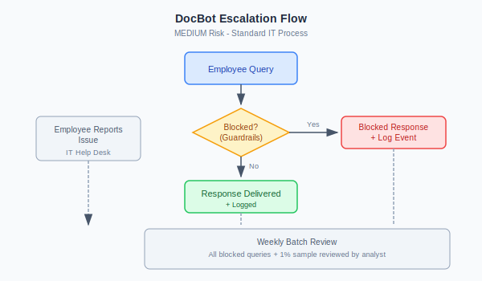

# Worked Example: Internal Document Assistant at TechCorp

> A lighter implementation for an internal-only AI tool.

This example shows how controls scale down for lower-risk internal tools. Compare with the [Customer Service AI example](01-customer-service-ai.md) to see how risk tier affects implementation.

---

## Note: Control Approach for MEDIUM Tier

For MEDIUM-risk internal tools, the control model simplifies:

| Layer | Approach |
|-------|----------|
| **Guardrails** | Rules-based validation (no LLM needed) |
| **LLM-as-Judge** | Recommended—sampling for quality assurance |
| **Human Oversight** | Periodic batch review, not real-time |

This example uses **guardrails only** for inline protection, with optional Judge sampling for quality monitoring. This is appropriate because:
- Internal users only (lower threat profile)
- No sensitive data access
- Informational only (no decisions made)
- Lower blast radius if something goes wrong

---

## The Use Case

**System Name:** DocBot

**What it does:**
- Answers employee questions about internal policies and procedures
- Searches company knowledge base (Confluence, SharePoint)
- Summarises long documents
- Available to all employees via Slack integration

**What it can access:**
- Company wiki and knowledge base (internal, non-confidential)
- HR policies (general, not individual employee data)
- IT documentation
- Project documentation (non-restricted)

**What it cannot access:**
- Employee personal data
- Financial data
- Customer data
- Restricted/confidential documents
- Source code repositories

**Scale:**
- 2,000 queries per day
- 5,000 employees eligible
- Peak: 200 concurrent users

**Technology:**
- Claude 3 Sonnet via Anthropic API
- RAG system connected to Confluence/SharePoint
- Deployed in company's AWS environment
- Slack bot interface

---

## Step 1: Risk Classification

### Quick Assessment

| Factor | Assessment | Score |
|--------|------------|-------|
| Decision Impact | Informational only | Low |
| Data Sensitivity | Internal docs, no PII/financial | Medium |
| User Population | Internal employees only | Low |
| Autonomy Level | Read-only | Low |
| Regulatory Scope | General corporate (no specific regs) | Low |
| Reputational Risk | Internal only, limited exposure | Low |

### Classification Decision

**Risk Tier: MEDIUM**

Rationale: Internal-only tool with no access to sensitive data. Primary risks are:
- Incorrect information leading to employee mistakes
- Potential for prompt injection to access restricted docs (mitigated by access controls)
- Shadow IT risk if not properly governed

**Approval Required:** Security review (streamlined, not full assessment)

---

## Step 2: Simplified Controls

### Required for MEDIUM Tier

| Control | Implementation | Why Simplified |
|---------|----------------|----------------|
| AI System Inventory | Register in inventory | Same as HIGH |
| Risk Classification | Document as MEDIUM | Same as HIGH |
| Input Validation | Rules-based (no Judge) | Lower threat profile |
| Output Filtering | Basic PII check | Less sensitive data |
| Access Control | SSO authentication | Same as HIGH |
| Logging | Query logging | Less detailed retention |
| Monitoring | Weekly review | No real-time needed |
| Human Oversight | 1% sample review | Batch, not real-time |

### What We Skip (vs. HIGH tier)

- LLM-as-Judge (rules sufficient for internal tool)
- Real-time SIEM integration
- Dedicated HITL queue

---

## Step 3: Input Guardrails (Rules-Based)

```python
def validate_input(query: str) -> tuple[bool, str]:
    """
    Rules-based input validation. Fast, simple, sufficient for MEDIUM risk.
    """
    
    # Length check
    if len(query) > 1000:
        return False, "Query too long. Please keep under 1000 characters."
    
    # Known injection patterns
    injection_patterns = [
        r"ignore (previous|all|your) instructions",
        r"disregard (previous|all|your)",
        r"forget (everything|your rules)",
        r"you are now",
        r"pretend (to be|you are)",
        r"system prompt",
        r"reveal your",
    ]
    
    for pattern in injection_patterns:
        if re.search(pattern, query, re.IGNORECASE):
            return False, "I can only help with questions about company documentation."
    
    # Note: We trust internal employees more than external users
    # More permissive than HIGH-tier customer-facing systems
    
    return True, ""
```

**Why rules-only is sufficient:**
- Internal users have less adversarial intent
- No sensitive data at risk even if bypassed
- 90% cost reduction vs. full Judge
- Can upgrade to Judge later if patterns emerge

---

## Step 4: Output Guardrails (Basic)

```python
def check_output(response: str, employee_id: str) -> tuple[bool, str]:
    """
    Basic output checks. Not as comprehensive as HIGH tier.
    """
    
    # Check for accidental PII patterns
    pii_patterns = [
        r'\b\d{3}-\d{2}-\d{4}\b',  # SSN
        r'\b\d{16}\b',              # Credit card
        r'salary|compensation.*\$\d+',  # Salary info
    ]
    
    for pattern in pii_patterns:
        if re.search(pattern, response, re.IGNORECASE):
            log_alert("pii_detected", employee_id, response)
            return False, "I found potentially sensitive information. Please contact HR directly."
    
    # Flag unusually long responses (potential data dump)
    if len(response) > 5000:
        log_alert("long_response", employee_id, len(response))
        # Allow but flag for review
    
    return True, response
```

---

## Step 5: Optional Judge for Quality Sampling

If you want additional quality assurance, add async Judge sampling:

```python
def sample_for_judge_review(query: str, response: str, employee_id: str) -> bool:
    """
    Decide if this query should be sent to async Judge review.
    For MEDIUM tier, this is optional quality assurance.
    """
    
    # 5% random sample
    if random.random() < 0.05:
        return True
    
    # 100% of flagged responses
    if was_flagged(response):
        return True
    
    # 100% of long conversations
    if get_conversation_length(employee_id) > 10:
        return True
    
    return False
```

The Judge prompt would be similar to HIGH tier but focused on quality, not security:

```
You are reviewing an internal documentation assistant conversation for quality.

EVALUATE FOR:
1. ACCURACY: Did the response correctly reflect the source documentation?
2. HELPFULNESS: Did it actually answer the employee's question?
3. APPROPRIATE: Was the response appropriate for an internal tool?

This is quality assurance, not security. The conversation has already been delivered.
```

---

## Step 6: System Prompt

Simpler than customer-facing systems:

```
You are DocBot, TechCorp's internal documentation assistant. You help employees find information in our company knowledge base.

## What You Do
- Answer questions about company policies and procedures
- Help find documentation in Confluence and SharePoint
- Summarise long documents
- Explain internal processes

## What You Don't Do
- Access or discuss individual employee information
- Provide information about salaries, performance reviews, or HR actions
- Access confidential or restricted documents
- Give legal, financial, or medical advice
- Execute any actions (you're read-only)

## Important
- If you don't know something, say so and suggest who to contact
- If a question seems to be about restricted information, direct them to the appropriate team
- Be helpful and concise—employees are busy

## Context
Employee: {employee_name}
Department: {department}
```

---

## Step 7: Monitoring (Weekly, Not Real-Time)

### Weekly Dashboard

| Metric | Target | Review |
|--------|--------|--------|
| Queries per day | Baseline ± 100% | Weekly |
| Blocked queries | <5% | Weekly |
| Average response time | <5 sec | Weekly |
| Employee satisfaction | >4.0/5.0 | Monthly |

### Monthly Review

- Review all blocked queries (~50/month expected)
- Sample 1% of queries for quality (~600/month, batch review)
- Check for unusual patterns
- Review any employee complaints

### What We Don't Do (vs. HIGH)

- No real-time alerting
- No SIEM integration
- No dedicated security monitoring
- No 24/7 coverage

---

## Step 8: Logging (Lightweight)

```json
{
  "timestamp": "2026-01-15T14:32:17Z",
  "employee_id": "emp_12345",
  "department": "Engineering",
  "query": "Where is the PTO policy?",
  "response_length": 423,
  "blocked": false,
  "latency_ms": 1823,
  "sources_retrieved": ["HR Policy Wiki", "Benefits Guide"]
}
```

**What we log:** Query, response metadata, who, when  
**What we don't log:** Full response text (storage cost, privacy)  
**Retention:** 1 year

---

## Step 9: HITL (Batch Review)

### Monthly Sample Review

- 1% random sample = ~600 queries/month
- One analyst reviews in batch (4 hours/month)
- Focus: accuracy, appropriateness, concerns

### No Real-Time Queue

- Blocked queries logged, reviewed weekly
- No immediate human intervention needed
- Employees can ask IT if something seems wrong

### Escalation

Simple escalation—no dedicated AI incident process:



1. Employee reports issue → IT Help Desk
2. IT checks logs
3. If systemic: Flag for weekly review
4. If security concern: Standard IT security escalation

---

## Step 10: Costs

### Implementation (One-Time)

| Item | Cost | Notes |
|------|------|-------|
| Basic security review | $10,000 | Streamlined |
| RAG integration | $15,000 | Confluence/SharePoint |
| Slack bot development | $10,000 | Standard integration |
| Input validation rules | $5,000 | Simple patterns |
| Documentation | $5,000 | Lighter than HIGH |
| **Total** | **$45,000** | 75% less than HIGH |

### Ongoing (Annual)

| Item | Cost | Notes |
|------|------|-------|
| LLM inference | $24,000 | ~$0.03/query × 2K/day |
| Storage and logging | $2,400 | Minimal retention |
| Monthly review time | $6,000 | 4 hrs/month analyst |
| IT ops allocation | $12,000 | Part of normal ops |
| **Total Annual** | **$44,400** | 95% less than HIGH |

**Cost per Query: ~$0.06**

---

## Comparison: MEDIUM vs. HIGH

| Aspect | MEDIUM (DocBot) | HIGH (Aria) |
|--------|-----------------|-------------|
| Input validation | Rules only | Rules + (optional Judge) |
| Output filtering | Basic checks | Comprehensive |
| Judge | Optional sampling | 20% sampling |
| HITL | Monthly batch | Daily + real-time queue |
| Monitoring | Weekly review | Real-time dashboards |
| Implementation | $45K | $175K |
| Annual Cost | $44K | $1.1M |
| Cost per Query | $0.06 | $0.06 |

**Key Insight:** Controls scale with risk. An internal documentation tool doesn't need the same investment as a customer-facing banking chatbot.

---

## When to Upgrade to HIGH

Consider upgrading if:

1. **Scope expands** to include sensitive documents
2. **External access** added (customers, partners)
3. **Decision-making** capabilities added
4. **Incident occurs** revealing higher risk
5. **Regulatory requirements** change

**Upgrade path:**
1. Add Judge sampling (+$20K implementation, +$25K/year)
2. Add real-time monitoring (+$15K implementation, +$30K/year)
3. Expand HITL (headcount as needed)

---

## Summary

DocBot shows that MEDIUM-risk internal tools can be deployed safely with lighter controls:

| Layer | Approach | Savings vs. HIGH |
|-------|----------|------------------|
| Input validation | Rules, not Judge | -90% per-query cost |
| Output filtering | Basic checks | Simpler maintenance |
| Judge | Optional sampling | -95% Judge cost |
| Monitoring | Weekly batch | -80% monitoring cost |
| HITL | Monthly sample | -95% HITL cost |

This is appropriate because:
- Internal users only (trusted)
- No sensitive data
- No customer impact
- Low regulatory exposure

**Don't over-engineer.** Match controls to actual risk.
---

*Enterprise AI Security Controls Framework, 2026 (Jonathan Gill).*
