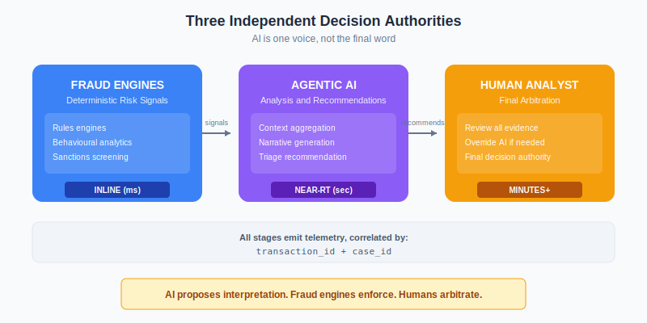
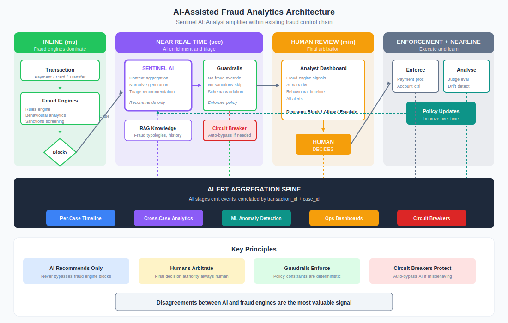

# Worked Example: AI-Assisted Fraud Analytics

> AI doesn't decide fraud. AI helps analysts interpret signals while fraud systems remain the enforcement authority.

This example follows Sentinel Bank (fictional) as they deploy AI to assist fraud analysts. The critical insight: the AI is an **analyst amplifier** sitting inside an existing fraud control chain — not a replacement for it.

---

## Why This Example Matters

Fraud triage is where **timing**, **alert aggregation**, and **defence-in-depth** matter most. Unlike customer communications where AI generates content, here AI interprets signals that feed into existing enforcement systems.

The goal is not "AI decides fraud."

The goal is: **AI helps interpret signals, while fraud systems remain the enforcement authority.**

---

## The Use Case

**System Name:** Sentinel (AI-Assisted Fraud Triage)

**What it does:**
- Aggregates transaction signals from multiple fraud engines
- Generates structured narrative summaries for analysts
- Recommends triage categories (escalate, allow, block)
- Surfaces anomalies and typology matches

**What it cannot do:**
- Override fraud engine blocks
- Suppress sanctions alerts
- Execute account actions directly
- Bypass human review for high-risk cases

**Scale:**
- 500,000 transactions per day analysed
- 15,000 cases created for review
- 200 fraud analysts across shifts
- 50+ fraud detection signals per transaction

**Technology:**
- Claude via AWS Bedrock
- RAG for fraud typologies and case history
- Integration with 6 fraud detection systems
- Real-time case management platform

---

## The Three-Authority Model

Fraud triage has three independent decision authorities. AI is one voice, not the final word.



| Authority | Role | Timing |
|-----------|------|--------|
| **Fraud Engines** | Deterministic risk signals, hard blocks | Inline (ms) |
| **Agentic AI** | Analysis, interpretation, recommendations | Near-RT (seconds) |
| **Human Analyst** | Final arbitration for edge cases | Minutes to hours |

Every stage emits telemetry. You correlate by `transaction_id` and `case_id`.

---

## Step 1: Risk Classification

### Assessment

| Factor | Assessment | Score |
|--------|------------|-------|
| **Decision Impact** | Influences fraud decisions, but doesn't execute | Medium |
| **Data Sensitivity** | Transaction data, customer PII, fraud patterns | High |
| **User Population** | Internal analysts (200), but affects all customers | Medium |
| **Autonomy Level** | Recommends only, cannot execute | Low |
| **Regulatory Scope** | PSD2, AML, FCA fraud rules | High |
| **Financial Risk** | Incorrect triage could enable fraud or block legitimate | High |
| **Reversibility** | Recommendations can be overridden, but delays cost money | Medium |

### Classification Decision

**Risk Tier: HIGH (Tier 3)**

Rationale: AI doesn't execute, but bad recommendations at scale could enable fraud losses or damage customer experience. Human remains in the loop for all consequential decisions.

---

## Step 2: The Seven-Stage Event Chain

Each stage generates events and alerts. The full chain provides complete audit trail and enables pattern detection.


### Stage 1: Transaction Enters Fraud Pipeline

Payment/card/transfer hits existing fraud detection systems:
- Rules engines (velocity, beneficiary novelty)
- Behavioural analytics
- AML pattern detectors
- Sanctions screening
- Merchant/device risk scoring

**Outputs:**
- Fraud risk score
- Triggered rules list
- Confidence/explanation metadata

**Alerts generated:**
- Extreme risk score
- Rule cascade anomaly
- Scoring engine inconsistency
- Unusual pattern vs customer baseline

### Stage 2: Case Creation

Fraud platform generates a case when thresholds are met.

**Events:**
- `case_id` assigned
- Transaction metadata captured
- Customer behavioural snapshot attached

**Alerts:**
- Repeated flags for same account
- Cross-channel anomalies
- Conflicting signals (low behavioural risk + high rule risk)

### Stage 3: AI Enrichment Layer

Agentic AI aggregates context and produces analysis:

**Inputs:**
- Historical transactions
- Device/location history
- Known fraud typologies
- Related alerts
- Merchant intelligence

**Outputs:**
- Structured narrative summary
- Anomaly explanation
- Recommended triage category: `escalate` | `allow_with_monitoring` | `block_recover`

**AI-generated alerts:**
- Reasoning uncertainty spike
- Tool/data retrieval conflict
- Atypical evidence weighting
- Recommendation vs fraud score mismatch

**Example conflict:**
```
Fraud engine = HIGH RISK (0.87)
AI recommends = ALLOW WITH MONITORING
→ Alert: DECISION_CONFLICT (severity: HIGH)
```

### Stage 4: Guardrail Enforcement

Deterministic controls validate AI output before it reaches analysts:

**Constraints:**
- Cannot recommend override of fraud thresholds
- Cannot suppress sanctions alerts
- Cannot recommend account actions outside policy
- Schema validation on all recommendations

**Alerts:**
- Attempted override
- Missing required evidence
- Out-of-policy recommendation

### Stage 5: Human Analyst Review

Analyst sees the complete picture:
- Fraud engine signals
- AI narrative
- Behavioural timeline
- All alerts

**Analyst decisions:**
- Block transaction
- Allow transaction
- Escalate to investigation
- Request additional information

**Alerts:**
- High analyst override rate
- Cluster of AI misclassifications
- SLA breach in review queue
- Analyst fatigue signals (speed dropping, errors rising)

Human actions are logged as structured evidence.

### Stage 6: Enforcement & Downstream Systems

Decision flows to execution:
- Payment processor
- Account controls
- Monitoring pipelines
- Customer notification workflows

**Alerts:**
- Enforcement failure
- Reconciliation mismatch
- Downstream system rejection

### Stage 7: Post-Event Assurance (Nearline)

LLM-as-Judge + ML analyse completed cases:
- AI reasoning quality
- Override patterns
- Signal correlation drift
- Typology emergence

**Alerts:**
- Drift cluster detected
- Systematic bias identified
- Failure cascade pattern

---

## Step 3: Timing Model

Fraud systems operate in risk bands. AI must fit within them, not slow them down.


### Inline (Milliseconds)

**What happens here:** Immediate blocks that don't wait for AI.

| Control | Latency | AI Required? |
|---------|---------|--------------|
| Fraud engine hard blocks | ~50ms | No |
| Sanctions screening | ~100ms | No |
| Guardrail deny | ~50ms | No |
| Impossible transaction patterns | ~10ms | No |

**AI is not required here.** Deterministic systems handle immediate safety.

### Near-Real-Time (Seconds)

**What happens here:** AI triage and enrichment.

| Process | Latency | Notes |
|---------|---------|-------|
| Context retrieval | ~200ms | Historical transactions, typologies |
| AI analysis | ~2-5s | Narrative generation, recommendation |
| Guardrail validation | ~50ms | Policy compliance check |

**If AI is delayed:**
- Transaction remains blocked or pending
- System defaults to safe posture (hold for human review)
- Case proceeds without AI enrichment if timeout exceeded

### Nearline (Minutes+)

**What happens here:** Pattern analysis that doesn't affect immediate decisions.

| Analysis | Frequency | Purpose |
|----------|-----------|---------|
| Drift detection | Hourly | AI recommendation quality |
| Cluster analysis | Daily | Emerging fraud patterns |
| Typology evolution | Weekly | Update RAG knowledge base |
| Model quality scoring | Continuous | Judge evaluation |

---

## Step 4: Alert Aggregation Architecture

All systems emit structured events into a shared telemetry spine.


### Event Categories

| Category | Source | Examples |
|----------|--------|----------|
| `FRAUD_ENGINE_ALERT` | Detection systems | Score spike, rule trigger, sanctions hit |
| `AI_ANALYSIS_ALERT` | Sentinel AI | Uncertainty, conflict, retrieval failure |
| `GUARDRAIL_ALERT` | Validation layer | Override attempt, policy violation |
| `HUMAN_DECISION_EVENT` | Analyst actions | Approve, block, escalate, override |
| `DOWNSTREAM_ALERT` | Execution systems | Enforcement failure, reconciliation error |

### Event Schema

```json
{
  "event_id": "evt_fraud_abc123",
  "timestamp": "2024-01-15T14:32:01Z",
  "transaction_id": "txn_xyz789",
  "case_id": "case_456",
  "category": "AI_ANALYSIS_ALERT",
  "alert_type": "decision_conflict",
  "severity": "HIGH",
  "confidence": 0.92,
  "component": "sentinel_ai",
  "details": {
    "fraud_engine_score": 0.87,
    "ai_recommendation": "allow_with_monitoring",
    "conflict_reason": "behavioural_pattern_mismatch"
  }
}
```

### Per-Case Timeline

Aggregation builds a complete story for each case:

| Time | Event | Source |
|------|-------|--------|
| 14:32:01 | Velocity alert triggered | Rules engine |
| 14:32:02 | Behavioural anomaly detected | Analytics |
| 14:32:05 | AI conflict warning | Sentinel AI |
| 14:32:18 | Case assigned to analyst | Queue |
| 14:35:42 | Analyst overrides AI recommendation | Human |
| 14:35:45 | Block enforced | Payment processor |

### Cross-Case Analytics

Aggregation enables pattern detection across cases:

| Pattern | Detection Method | Action |
|---------|------------------|--------|
| AI/fraud disagreement clusters | Correlation analysis | Review AI training data |
| Tool misuse patterns | Sequence analysis | Update guardrails |
| Escalation hotspots | Geographic/temporal clustering | Investigate |
| Emerging fraud typologies | Unsupervised clustering | Update knowledge base |
| Analyst fatigue signals | Performance metrics | Workload balancing |

---

## Step 5: Circuit Breakers

Circuit breakers protect against AI misbehaviour at scale.

### Triggers

| Metric | Threshold | Window | Action |
|--------|-----------|--------|--------|
| AI/fraud disagreement rate | >15% | 1 hour | Alert + increase sampling |
| AI uncertainty spike | >0.3 avg | 30 min | Force human review |
| Override rate by analysts | >25% | 2 hours | Disable AI recommendations |
| Guardrail violations | >5 | 15 min | Trip circuit breaker |
| Recommendation timeout | >10% | 30 min | Bypass AI, direct to human |

### Circuit Breaker States

| State | Behaviour | Recovery |
|-------|-----------|----------|
| **CLOSED** | Normal operation | — |
| **OPEN** | AI bypassed, all cases to human | Manual review + threshold clear |
| **HALF-OPEN** | AI enabled for sample (10%) | Auto-promote if sample passes |

---

## Step 6: AI-Fraud Disagreement Detection

The most valuable signal: when AI and fraud engines disagree.

### Disagreement Matrix

| Fraud Engine | AI Recommendation | Severity | Action |
|--------------|-------------------|----------|--------|
| HIGH (>0.8) | Allow | **CRITICAL** | Mandatory human review |
| HIGH (>0.8) | Monitor | HIGH | Priority human review |
| LOW (<0.3) | Block | MEDIUM | Analyst attention |
| LOW (<0.3) | Escalate | MEDIUM | Analyst attention |
| MEDIUM | Any | LOW | Standard workflow |

### Detection Logic

```yaml
rules:
  - name: "Critical disagreement"
    condition: >
      fraud_engine_score > 0.8 
      AND ai_recommendation IN ('allow', 'allow_with_monitoring')
    action:
      - set_severity(CRITICAL)
      - force_human_review()
      - alert(team: fraud_ops, priority: P1)
      - log_for_drift_analysis()
  
  - name: "AI uncertainty on high-risk"
    condition: >
      fraud_engine_score > 0.6
      AND ai_confidence < 0.7
    action:
      - escalate_to_senior_analyst()
      - flag_for_training_review()
```

---

## Step 7: Metrics Dashboard

### Real-Time Panel

| Metric | Target | Alert Threshold |
|--------|--------|-----------------|
| Cases in queue | <500 | >1,000 |
| AI recommendation latency | <5s | >10s |
| Disagreement rate | <10% | >15% |
| Circuit breaker status | CLOSED | Any OPEN |
| Guardrail violations/hour | 0 | >3 |

### Quality Panel (Nearline)

| Metric | Target | Alert Threshold |
|--------|--------|-----------------|
| AI accuracy (vs human decision) | >85% | <75% |
| False positive rate | <5% | >10% |
| False negative rate | <1% | >2% |
| Analyst override rate | <15% | >25% |
| Judge quality score | >4.0/5.0 | <3.5 |

### Operational Panel

| Metric | Target | Alert Threshold |
|--------|--------|-----------------|
| Analyst utilisation | 70-85% | <50% or >95% |
| Average case time | <10 min | >20 min |
| SLA compliance | >95% | <90% |
| Escalation rate | <5% | >10% |

---

## Key Takeaways

1. **AI recommends, fraud engines enforce.** The AI never bypasses deterministic safety controls.

2. **Three authorities, one decision.** Fraud engines provide signals, AI interprets, humans arbitrate.

3. **Timing bands preserve speed.** Inline blocks don't wait for AI. AI runs in near-real-time. Analysis happens nearline.

4. **Disagreements are the signal.** When AI and fraud engines disagree, that's where humans add most value.

5. **Circuit breakers protect at scale.** If AI misbehaves, the system automatically routes around it.

6. **Full audit trail.** Every event, every decision, every override is logged and correlated.

---

## Architecture Diagram


---

*AI Runtime Behaviour Security, 2026 (Jonathan Gill).*
