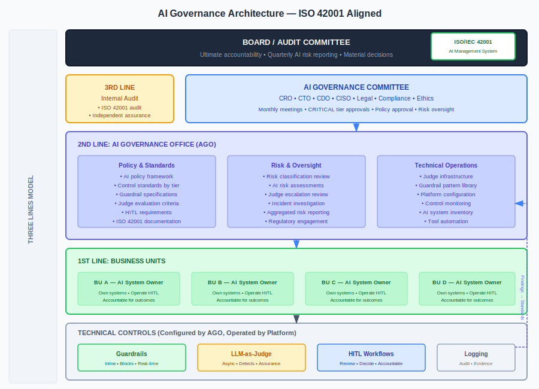
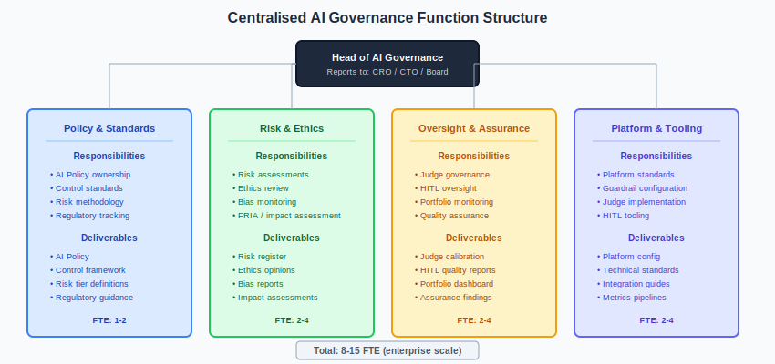
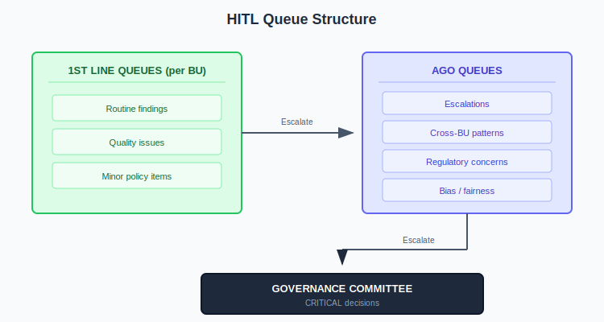
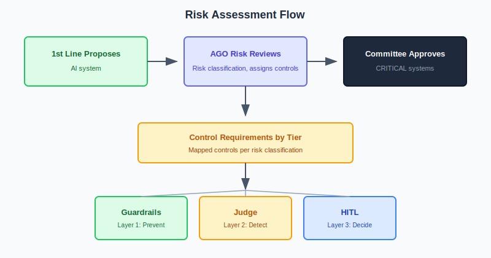
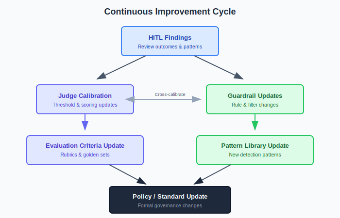

# AI Governance Operating Model

## Aligned with ISO/IEC 42001:2023

This document defines the operating model for a centralised AI governance function, mapping technical controls to governance processes and ISO 42001 requirements.

---

## Executive Summary

A centralised AI governance function provides:

- **Accountability:** Clear ownership of AI risk and outcomes
- **Consistency:** Standardised controls across all AI systems
- **Efficiency:** Shared services, expertise, and tooling
- **Compliance:** Demonstrable alignment with regulations and standards
- **Trust:** Stakeholder confidence in responsible AI use

This operating model integrates:
- Technical controls (guardrails, Judge, HITL)
- Platform capabilities (Bedrock, Databricks, Foundry)
- Organisational governance (policies, committees, roles)
- ISO 42001 requirements

---

## Governance Architecture



---

## Three Lines Model for AI

The AI governance function operates within the standard three lines model:

| Line | Function | AI Responsibilities |
|------|----------|---------------------|
| **1st Line** | Business / Operations | Own AI systems; operate HITL; first-line controls |
| **2nd Line** | AI Governance / Risk | Policy; oversight; Judge operations; control standards |
| **3rd Line** | Internal Audit | Independent assurance; ISO 42001 certification |

### 1st Line: Business Units

**Owns:**
- AI use cases and business outcomes
- Day-to-day operation of AI systems
- HITL review queues (for their systems)
- Incident escalation
- Data quality for their domain

**Accountable for:**
- Outcomes of AI decisions
- Compliance with AI policies
- Risk classification accuracy
- User training and awareness

### 2nd Line: Centralised AI Governance

**Owns:**
- AI policy framework
- Risk classification methodology
- Control standards (guardrails, Judge, HITL requirements)
- Judge operations and calibration
- AI system inventory
- Monitoring and reporting
- Regulatory engagement

**Accountable for:**
- Adequacy of control framework
- Oversight effectiveness
- Policy currency
- Aggregated risk view

### 3rd Line: Internal Audit

**Owns:**
- Independent testing of AI controls
- ISO 42001 audit programme
- Assurance reporting to Board/Audit Committee

**Accountable for:**
- Independent opinion on AI governance effectiveness

---

## Centralised AI Governance Function

### Organisation Structure



### AI Governance Office (AGO) Teams

#### Policy & Standards Team

**Responsibilities:**
- Maintain AI policy framework
- Define control standards by risk tier
- Develop guardrail specifications
- Create Judge evaluation criteria
- Define HITL requirements
- Maintain ISO 42001 documentation
- Regulatory horizon scanning

**Headcount:** 2-4 FTE (depends on portfolio size)

#### Risk & Oversight Team

**Responsibilities:**
- Review and approve risk classifications
- Conduct AI risk assessments
- Monitor aggregated AI risk
- Review Judge findings (escalations)
- Investigate incidents
- Report to governance committee
- Manage regulatory examinations

**Headcount:** 3-6 FTE (depends on portfolio size and tier mix)

#### Technical Operations Team

**Responsibilities:**
- Operate centralised Judge infrastructure
- Maintain guardrail patterns library
- Configure platform controls (Bedrock, Databricks, Foundry)
- Monitor control effectiveness
- Manage AI system inventory
- Support 1st line implementation
- Tool development and automation

**Headcount:** 3-5 FTE (depends on platform complexity)

---

## How Technical Controls Map to Governance

### Control Ownership Model

| Control | Configured By | Operated By | Overseen By |
|---------|---------------|-------------|-------------|
| **Guardrails** | AGO Technical | Platform (automated) | AGO Risk |
| **Judge** | AGO Technical | AGO Technical | AGO Risk |
| **HITL (routine)** | AGO Policy | 1st Line BU | AGO Risk |
| **HITL (escalations)** | AGO Policy | AGO Risk | Governance Committee |
| **Logging** | AGO Technical | Platform (automated) | AGO Risk / Audit |

### Guardrails Governance

**AGO Role:**
- Define enterprise guardrail standards
- Maintain pattern library (injection, PII, etc.)
- Review and approve custom guardrails
- Monitor false positive rates
- Update patterns based on threats

**1st Line Role:**
- Request guardrails for new systems
- Report false positives
- Escalate bypass requests

**Platform Integration:**

| Platform | AGO Configures | 1st Line Uses |
|----------|----------------|---------------|
| Bedrock | Guardrail policies in central account | Associate guardrails with models |
| Databricks | AI Gateway policies | Call endpoints through gateway |
| Foundry | Governance policies | Build within governed ontology |

### Judge Governance

**AGO Role:**
- Define evaluation criteria by use case
- Configure sampling rates by tier
- Calibrate Judge prompts
- Review Judge accuracy
- Route findings to appropriate queues
- Aggregate and report on findings

**1st Line Role:**
- Receive and action findings for their systems
- Provide feedback on Judge accuracy
- Escalate as required

**Centralised vs Federated:**

| Aspect | Centralised (AGO) | Federated (1st Line) |
|--------|-------------------|----------------------|
| Judge infrastructure | ✓ | |
| Evaluation criteria | ✓ | Input |
| Sampling configuration | ✓ | |
| Finding triage | ✓ | |
| Routine review | | ✓ |
| Escalation review | ✓ | |
| Calibration | ✓ | Feedback |

### HITL Governance

**AGO Role:**
- Define HITL requirements by tier
- Design queue structure
- Set SLAs
- Monitor SLA compliance
- Handle escalations from 1st line
- Report to governance committee

**1st Line Role:**
- Staff and operate queues for their systems
- Complete reviews within SLA
- Escalate as defined
- Document decisions

**Queue Structure:**



---

## ISO 42001 Alignment

### Clause Mapping

| ISO 42001 Clause | Governance Function | Key Activities |
|------------------|---------------------|----------------|
| **4. Context** | AGO Policy | Define scope; identify stakeholders; understand requirements |
| **5. Leadership** | Governance Committee | Commitment; policy; roles |
| **6. Planning** | AGO Risk | Risk assessment; objectives; change planning |
| **7. Support** | AGO (all) | Resources; competence; awareness; communication; documentation |
| **8. Operation** | AGO + 1st Line | AI lifecycle; risk treatment; 3rd party management |
| **9. Performance** | AGO Risk + Audit | Monitoring; internal audit; management review |
| **10. Improvement** | AGO + Committee | Nonconformity; continual improvement |

### Clause 4: Context of the Organisation

**4.1 Understanding the organisation and its context**

AGO maintains:
- AI strategy alignment documentation
- Regulatory landscape analysis
- Technology landscape assessment
- Stakeholder impact analysis

**4.2 Understanding needs and expectations of interested parties**

| Stakeholder | Needs | How Addressed |
|-------------|-------|---------------|
| Regulators | Compliance evidence | Audit trails, documentation |
| Customers | Fair treatment, privacy | Bias monitoring, PII controls |
| Employees | Clear guidance | Policies, training |
| Board | Risk visibility | Reporting, dashboards |
| Data subjects | Rights respected | HITL, transparency |

**4.3 Determining the scope of the AIMS**

AGO defines:
- Which AI systems are in scope
- Organisational boundaries
- Applicability of requirements

**4.4 AI management system**

AGO maintains the AIMS including:
- Policy framework
- Process documentation
- Control standards
- Records and evidence

---

### Clause 5: Leadership

**5.1 Leadership and commitment**

Governance Committee demonstrates commitment through:
- Approving AI policy
- Allocating resources to AGO
- Reviewing AI risk regularly
- Approving CRITICAL tier systems

**5.2 AI policy**

AGO maintains AI policy that:
- States commitment to responsible AI
- Provides framework for objectives
- Commits to compliance
- Commits to continual improvement

**5.3 Roles, responsibilities, and authorities**

| Role | Responsibility | Authority |
|------|----------------|-----------|
| Governance Committee | Oversight, CRITICAL approvals | Approve/reject systems |
| Head of AI Governance | Lead AGO, report to committee | Set standards, escalate |
| AI System Owner (1st line) | Operate system, comply with policy | Day-to-day decisions |
| AGO Risk | Assess risk, review findings | Escalate, recommend |
| AGO Technical | Operate controls, maintain tools | Configure controls |

---

### Clause 6: Planning

**6.1 Actions to address risks and opportunities**

AGO conducts:
- AI system risk assessments (per system)
- Aggregated AI portfolio risk assessment
- Opportunity identification
- Treatment planning

**Risk Assessment Integration:**



**6.2 AI management system objectives**

AGO sets measurable objectives:

| Objective | Metric | Target |
|-----------|--------|--------|
| Control coverage | % systems with required controls | 100% |
| Risk classification | % systems classified | 100% |
| HITL SLA compliance | % reviews within SLA | >95% |
| Incident response | Mean time to contain | <4 hours |
| Training | % staff trained | >90% |

---

### Clause 7: Support

**7.1 Resources**

AGO is resourced to:
- Staff governance function
- Operate Judge infrastructure
- Maintain tooling
- Conduct training
- Support 1st line

**7.2 Competence**

AGO ensures:
- Staff have required competencies
- Training programmes exist
- Competence is verified
- Records are maintained

**AI Competency Framework:**

| Role | Required Competencies |
|------|----------------------|
| AI System Owner | AI risk awareness, policy knowledge, domain expertise |
| HITL Reviewer | Domain expertise, bias awareness, decision documentation |
| AGO Risk Analyst | AI risk assessment, regulatory knowledge, investigation |
| AGO Technical | Platform expertise, guardrail configuration, Judge operation |

**7.3 Awareness**

All relevant personnel are aware of:
- AI policy
- Their contribution to AIMS effectiveness
- Implications of non-conformance

**7.4 Communication**

| What | From | To | When |
|------|------|-----|------|
| AI risk report | AGO | Committee | Monthly |
| Policy updates | AGO | All staff | As needed |
| Incident alerts | AGO | Stakeholders | As needed |
| Training | AGO | New staff | Onboarding |

**7.5 Documented information**

AGO maintains:
- AI policy and standards
- Risk assessments
- Control configurations
- HITL decisions
- Audit trails
- Meeting minutes

---

### Clause 8: Operation

**8.1 Operational planning and control**

AGO ensures:
- Processes are planned and controlled
- Criteria are established
- Controls are implemented per criteria
- Records demonstrate conformity

**8.2 AI risk assessment**

For each AI system:
1. Identify risks (using classification matrix)
2. Analyse risks (likelihood × impact)
3. Evaluate risks (compare to criteria)
4. Document assessment

**8.3 AI risk treatment**

Treatment = controls proportionate to risk tier:

| Tier | Treatment (Controls) |
|------|----------------------|
| CRITICAL | Full guardrails + 100% Judge + 100% HITL |
| HIGH | Full guardrails + 20-50% Judge + HITL escalation |
| MEDIUM | Standard guardrails + 5-10% Judge + periodic HITL |
| LOW | Basic guardrails + optional Judge + spot checks |

**8.4 AI system lifecycle**

AGO defines requirements for each phase:

| Phase | AGO Requirements |
|-------|------------------|
| Design | Risk classification; control selection |
| Development | Security review; testing requirements |
| Deployment | Pre-deployment approval; control verification |
| Operation | Guardrails active; Judge sampling; HITL |
| Monitoring | Performance monitoring; drift detection |
| Retirement | Decommissioning process; record retention |

---

### Clause 9: Performance Evaluation

**9.1 Monitoring, measurement, analysis, and evaluation**

AGO monitors:

| What | How | Frequency |
|------|-----|-----------|
| Guardrail effectiveness | Block rates, false positives | Real-time |
| Judge accuracy | HITL feedback, calibration tests | Weekly |
| HITL SLA compliance | Queue metrics | Daily |
| Risk classification coverage | Inventory analysis | Monthly |
| Incident trends | Incident data | Monthly |
| Control effectiveness | Testing, audit | Quarterly |

**9.2 Internal audit**

Internal Audit conducts:
- Annual AIMS audit against ISO 42001
- Risk-based audits of HIGH/CRITICAL systems
- Control testing
- Thematic reviews (e.g., HITL effectiveness)

**9.3 Management review**

Governance Committee reviews:
- Status of previous actions
- Changes affecting AIMS
- Performance metrics
- Audit results
- Stakeholder feedback
- Improvement opportunities

**Review Cadence:**

| Forum | Frequency | Focus |
|-------|-----------|-------|
| Governance Committee | Monthly | Risk, approvals, policy |
| AGO Leadership | Weekly | Operations, escalations |
| Management Review (ISO) | Quarterly | AIMS effectiveness |
| Board/Audit Committee | Quarterly | Material risks, assurance |

---

### Clause 10: Improvement

**10.1 Continual improvement**

AGO drives improvement through:
- HITL feedback → guardrail updates
- Judge findings → process improvements
- Incident learnings → control enhancements
- Audit findings → remediation

**10.2 Nonconformity and corrective action**

When nonconformity identified:
1. React to control nonconformity
2. Evaluate need for corrective action
3. Implement corrective action
4. Review effectiveness
5. Update AIMS if needed

**Improvement Cycle:**



---

## Operating Rhythm

### Daily

| Activity | Owner | Output |
|----------|-------|--------|
| HITL queue monitoring | AGO Technical | Queue health report |
| Guardrail alert review | AGO Technical | Escalations if needed |
| Incident triage | AGO Risk | Incident status |

### Weekly

| Activity | Owner | Output |
|----------|-------|--------|
| AGO leadership meeting | Head of AGO | Decisions, actions |
| Judge calibration review | AGO Technical | Calibration adjustments |
| HITL SLA review | AGO Risk | SLA compliance report |
| Escalation review | AGO Risk | Escalation decisions |

### Monthly

| Activity | Owner | Output |
|----------|-------|--------|
| Governance Committee | Committee Chair | Minutes, decisions |
| AI risk report | AGO Risk | Risk dashboard |
| New system approvals | AGO Risk | Approval decisions |
| Metrics review | AGO | Performance report |

### Quarterly

| Activity | Owner | Output |
|----------|-------|--------|
| Management review (ISO) | Head of AGO | Review minutes |
| Board/Audit Committee | Head of AGO | Assurance report |
| Policy review | AGO Policy | Policy updates |
| Control effectiveness | AGO Risk | Effectiveness report |

### Annually

| Activity | Owner | Output |
|----------|-------|--------|
| AIMS audit | Internal Audit | Audit report |
| Strategy review | Governance Committee | Strategy update |
| Training refresh | AGO | Training completion |
| External certification | Certification body | Certificate |

---

## Platform Integration

### Centralised Control Plane


### Multi-Platform Scenario

Many organisations use multiple platforms. AGO provides consistency:

| Capability | Bedrock | Databricks | Foundry | AGO Provides |
|------------|---------|------------|---------|--------------|
| Guardrails | Bedrock Guardrails | AI Gateway | AIP Gov | Common patterns, standards |
| Judge | Custom build | MLflow Judges | AIP Evals | Evaluation criteria, calibration |
| HITL | Custom build | Review App | Ontology workflows | Queue standards, SLAs |
| Logging | CloudWatch | Unity Catalog | Audit logs | Aggregation, analysis |

**AGO normalises across platforms:**
- Common risk classification
- Common evaluation criteria
- Common SLAs
- Aggregated reporting
- Consistent policies

---

## Metrics Framework

### Governance Effectiveness Metrics

| Metric | Definition | Target | Owner |
|--------|------------|--------|-------|
| Risk classification coverage | % AI systems classified | 100% | AGO Risk |
| Control implementation | % systems with required controls | 100% | AGO Technical |
| HITL SLA compliance | % reviews within SLA | >95% | AGO Risk |
| Judge accuracy | % agreement with HITL | >80% | AGO Technical |
| Guardrail effectiveness | Block rate for known-bad | >95% | AGO Technical |
| False positive rate | % legitimate blocked | <5% | AGO Technical |
| Time to classification | Days from request to classification | <5 | AGO Risk |
| Time to deployment | Days from approval to controls active | <10 | AGO Technical |

### Risk Metrics

| Metric | Definition | Threshold | Owner |
|--------|------------|-----------|-------|
| Open escalations | Count of unresolved escalations | <10 | AGO Risk |
| Overdue reviews | HITL items past SLA | 0 | AGO Risk |
| Incidents (severity) | Count by severity | Trend down | AGO Risk |
| Audit findings | Open findings by age | Age down | AGO Risk |
| Policy exceptions | Active exceptions | <5 | AGO Policy |

### Operational Metrics

| Metric | Definition | Target | Owner |
|--------|------------|--------|-------|
| Judge latency | Time from interaction to evaluation | <1 hour | AGO Technical |
| HITL throughput | Reviews per analyst per day | Baseline | AGO Risk |
| Queue depth | Items awaiting review | Trend stable | AGO Risk |
| System availability | Judge + HITL system uptime | >99.5% | AGO Technical |

---

## Staffing Model

### AGO Headcount by Portfolio Size

| Portfolio Size | Policy | Risk | Technical | Total AGO |
|----------------|--------|------|-----------|-----------|
| Small (<20 AI systems) | 1 | 2 | 2 | 5 |
| Medium (20-50 systems) | 2 | 4 | 3 | 9 |
| Large (50-100 systems) | 3 | 6 | 5 | 14 |
| Enterprise (100+ systems) | 4 | 8+ | 6+ | 18+ |

### 1st Line HITL Staffing (per BU)

Use formula from HITL model:

```
FTE = (Volume × Sample Rate × Review Time) / Working Hours
```

### Skills Required

| Team | Key Skills |
|------|------------|
| AGO Policy | Regulatory knowledge, policy drafting, stakeholder management |
| AGO Risk | Risk assessment, investigation, regulatory engagement |
| AGO Technical | ML/AI, platform expertise, data engineering, automation |

---

## Implementation Roadmap

### Phase 1: Foundation (Months 1-3)

- Establish AGO organisation
- Define AI policy framework
- Create risk classification methodology
- Inventory existing AI systems
- Classify existing systems
- Define control standards by tier

### Phase 2: Control Deployment (Months 4-6)

- Deploy guardrails on HIGH+ systems
- Implement Judge (shadow mode)
- Establish HITL workflows
- Configure logging
- Create governance dashboards

### Phase 3: Operationalise (Months 7-9)

- Activate Judge findings → HITL routing
- Staff HITL queues
- Establish operating rhythm
- Conduct first management review
- Tune controls based on learnings

### Phase 4: Certify (Months 10-12)

- Conduct internal audit
- Address findings
- Engage certification body
- Achieve ISO 42001 certification
- Transition to BAU

---

## Summary

A centralised AI governance function aligned with ISO 42001:

1. **Operates as 2nd line** — Sets policy, provides oversight, doesn't own systems
2. **Enables 1st line** — Provides standards, tools, and support
3. **Centralises what should be central** — Judge, patterns, policy, reporting
4. **Federates what should be federated** — HITL operations, system ownership
5. **Integrates technical controls** — Guardrails, Judge, HITL into governance processes
6. **Spans platforms** — Provides consistency across Bedrock, Databricks, Foundry
7. **Demonstrates compliance** — ISO 42001, regulations, internal standards

**The key insight:** Technical controls (guardrails, Judge, HITL) are governance controls. A centralised function ensures they're applied consistently, operated effectively, and demonstrate compliance.
---

*Enterprise AI Security Controls Framework, 2026 (Jonathan Gill).*
