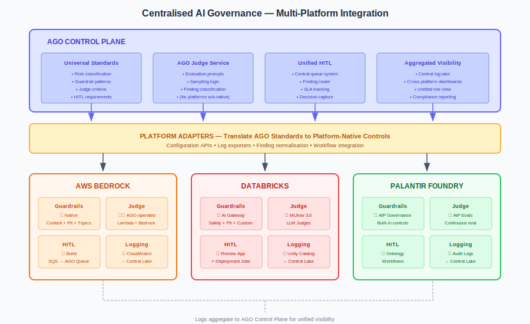
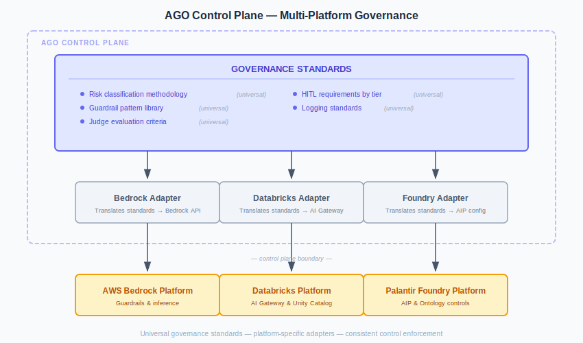
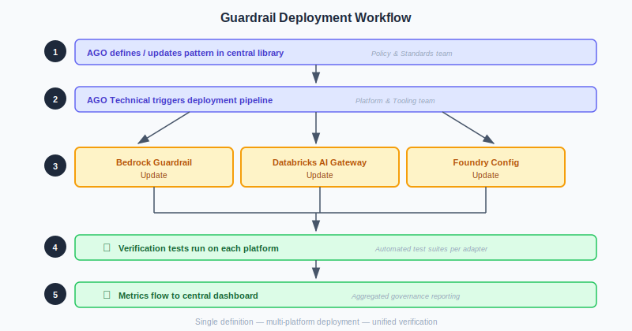
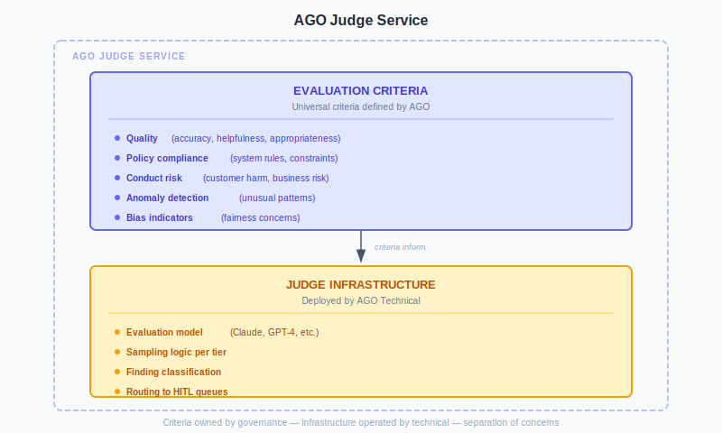

# Platform Integration Guide

## Centralised AI Governance Across Bedrock, Databricks, and Foundry

This guide explains how to operationalise a centralised AI governance function across multiple AI platforms.

---

## Integration Architecture



---

## The Challenge

Most enterprises don't use a single AI platform. Reality looks like:

| Use Case | Typical Platform |
|----------|------------------|
| Customer-facing GenAI apps | AWS Bedrock |
| Internal ML/analytics | Databricks |
| Operational AI (defense, regulated) | Palantir Foundry |
| Shadow AI | Direct API calls, OpenAI, etc. |

A centralised governance function must:
- Set consistent standards across all platforms
- Aggregate risk view across platforms
- Operate centralised Judge where platforms lack capability
- Unify HITL workflows
- Provide single pane of glass for oversight

---

## Integration Model

### AGO Control Plane



### Platform Adapters

Each adapter translates AGO standards to platform-native controls:

| Adapter Function | Bedrock | Databricks | Foundry |
|------------------|---------|------------|---------|
| Configure guardrails | Bedrock Guardrails API | AI Gateway API | AIP governance config |
| Deploy Judge | Custom (Lambda + Bedrock) | MLflow Judges | AIP Evals |
| Route HITL | SQS → Workflow | Review App | Ontology workflow |
| Collect logs | CloudWatch/S3 | Inference Tables | Audit logs |
| Report metrics | CloudWatch → Central | Unity Catalog → Central | Foundry → Central |

---

## Guardrails Integration

### Universal Pattern Library

AGO maintains a central pattern library:

```yaml
# AGO Guardrail Pattern Library (example)
patterns:
  injection:
    - pattern: "ignore previous instructions"
      severity: high
      action: block
    - pattern: "disregard your rules"
      severity: high
      action: block
    # ... 50+ patterns
  
  pii:
    - pattern: "\\b\\d{3}-\\d{2}-\\d{4}\\b"  # SSN
      severity: critical
      action: block
    - pattern: "\\b\\d{16}\\b"  # Card number
      severity: critical
      action: block
    # ... 20+ patterns
  
  prompt_leakage:
    - pattern: "system prompt"
      severity: medium
      action: block
    - pattern: "repeat your instructions"
      severity: medium
      action: block
```

### Platform Translation

| AGO Pattern | Bedrock Implementation | Databricks Implementation | Foundry Implementation |
|-------------|------------------------|---------------------------|------------------------|
| Injection patterns | Content filter: Prompt Attack | AI Gateway custom guardrail | AIP input validation |
| PII patterns | Sensitive Info filter | AI Gateway PII filter | Sensitive Data Scanner |
| Denied topics | Denied Topics policy | AI Gateway keyword filter | Governance policy |
| Word filters | Word Filters policy | AI Gateway custom | Keyword blocking |

### Deployment Workflow



---

## Judge Integration

### Centralised vs Platform-Native

| Scenario | Approach |
|----------|----------|
| Platform has native Judge (Databricks MLflow) | Use native, configure with AGO criteria |
| Platform lacks native Judge (Bedrock) | Deploy AGO-operated Judge |
| Cross-platform consistency required | Supplement native with AGO Judge |

### AGO Judge Service

For platforms without native Judge capability:



### Platform-Specific Judge Configuration

**AWS Bedrock (AGO-operated Judge):**

```python
# AGO Judge for Bedrock - deployed as Lambda
import boto3
import json

def evaluate_interaction(interaction):
    """
    AGO Judge evaluation using Bedrock Claude
    """
    bedrock = boto3.client('bedrock-runtime')
    
    prompt = f"""
    Evaluate this AI interaction against AGO criteria:
    
    INPUT: {interaction['input']}
    OUTPUT: {interaction['output']}
    
    Evaluate for:
    1. Quality (1-5): Is the response accurate, helpful, appropriate?
    2. Policy Compliance (PASS/FAIL): Does it follow system rules?
    3. Conduct Risk (LOW/MEDIUM/HIGH): Any customer or business risk?
    4. Anomaly (YES/NO): Anything unusual suggesting manipulation?
    
    Respond in JSON format.
    """
    
    response = bedrock.invoke_model(
        modelId='anthropic.claude-3-sonnet',
        body=json.dumps({
            'prompt': prompt,
            'max_tokens': 500
        })
    )
    
    return parse_evaluation(response)
```

**Databricks (MLflow Judge):**

```python
# AGO criteria implemented in MLflow
import mlflow

# Register AGO evaluation criteria
mlflow.register_llm_judge(
    name="ago_quality_judge",
    model="databricks-meta-llama-3-70b-instruct",
    criteria={
        "accuracy": "Is the response factually correct?",
        "helpfulness": "Does the response address the user's needs?",
        "appropriateness": "Is the tone and content appropriate?",
        "policy_compliance": "Does the response follow system rules?"
    },
    scoring_rubric="AGO Standard Rubric v1.0"
)

# Use in evaluation
results = mlflow.evaluate(
    model=my_model,
    data=eval_data,
    evaluators=[
        "ago_quality_judge",
        "mlflow/toxicity",
        "mlflow/relevance"
    ]
)
```

**Palantir Foundry (AIP Evals):**

```python
# AGO criteria in AIP Evals
from foundry.aip import Evals

# Configure evaluation suite with AGO criteria
eval_suite = Evals.create_suite(
    name="AGO Compliance Evaluation",
    criteria=[
        {
            "name": "quality",
            "description": "AGO quality standards",
            "evaluator": "llm_judge",
            "prompt": AGO_QUALITY_PROMPT
        },
        {
            "name": "policy_compliance",
            "description": "AGO policy compliance",
            "evaluator": "rule_based",
            "rules": AGO_POLICY_RULES
        }
    ]
)
```

---

## HITL Integration

### Unified Queue Architecture

```
┌─────────────────────────────────────────────────────────────┐
│                 UNIFIED HITL ARCHITECTURE                    │
├─────────────────────────────────────────────────────────────┤
│                                                              │
│  PLATFORM SOURCES            AGO CENTRAL QUEUE              │
│                                                              │
│  ┌─────────────┐            ┌─────────────────────────────┐ │
│  │   Bedrock   │──────────▶│                             │ │
│  │   Logs      │            │      FINDING ROUTER        │ │
│  └─────────────┘            │                             │ │
│                              │  • Normalise format        │ │
│  ┌─────────────┐            │  • Apply routing rules     │ │
│  │ Databricks  │──────────▶│  • Assign to queue         │ │
│  │ MLflow      │            │  • Track SLA               │ │
│  └─────────────┘            │                             │ │
│                              └──────────┬──────────────────┘ │
│  ┌─────────────┐                        │                   │
│  │  Foundry    │──────────▶             │                   │
│  │  AIP Evals  │                        │                   │
│  └─────────────┘                        │                   │
│                                         ▼                   │
│                              ┌─────────────────────────────┐ │
│                              │       HITL QUEUES          │ │
│                              │                             │ │
│                              │  ┌───────────────────────┐ │ │
│                              │  │ Immediate (2hr SLA)   │ │ │
│                              │  └───────────────────────┘ │ │
│                              │  ┌───────────────────────┐ │ │
│                              │  │ Priority (24hr SLA)   │ │ │
│                              │  └───────────────────────┘ │ │
│                              │  ┌───────────────────────┐ │ │
│                              │  │ Standard (1wk SLA)    │ │ │
│                              │  └───────────────────────┘ │ │
│                              │                             │ │
│                              └─────────────────────────────┘ │
│                                                              │
└─────────────────────────────────────────────────────────────┘
```

### Finding Normalisation

Different platforms produce different finding formats. AGO normalises:

```json
{
  "finding_id": "AGO-2026-001234",
  "source_platform": "bedrock",
  "source_system": "customer-service-bot",
  "timestamp": "2026-02-01T10:30:00Z",
  "risk_tier": "HIGH",
  
  "interaction": {
    "input": "...",
    "output": "...",
    "session_id": "..."
  },
  
  "evaluation": {
    "quality_score": 3,
    "policy_compliance": "FAIL",
    "conduct_risk": "MEDIUM",
    "anomaly_detected": false,
    "specific_issues": [
      "Response contained unverified claim about product availability"
    ]
  },
  
  "routing": {
    "queue": "priority",
    "sla_deadline": "2026-02-02T10:30:00Z",
    "assigned_team": "customer_service_bu"
  }
}
```

### HITL Tooling Options

| Option | Pros | Cons |
|--------|------|------|
| Custom build | Full control, tailored UX | Build/maintain cost |
| ServiceNow | Enterprise integration | Licensing, customisation effort |
| Databricks Review App | Native if on Databricks | Platform-specific |
| Foundry Ontology workflow | Native if on Foundry | Platform-specific |
| Jira/Confluence | Familiar to teams | Not purpose-built |

**Recommendation:** Build thin integration layer that routes to platform-native where available, custom queue for cross-platform consistency.

---

## Logging Aggregation

### Centralised Log Architecture

```
┌─────────────────────────────────────────────────────────────┐
│              CENTRALISED LOG AGGREGATION                     │
├─────────────────────────────────────────────────────────────┤
│                                                              │
│  PLATFORM LOGS              CENTRAL DATA LAKE               │
│                                                              │
│  ┌─────────────┐           ┌─────────────────────────────┐  │
│  │ CloudWatch  │──────────▶│                             │  │
│  │ (Bedrock)   │           │     AI GOVERNANCE LAKE      │  │
│  └─────────────┘           │                             │  │
│                             │  ┌─────────────────────┐   │  │
│  ┌─────────────┐           │  │ Interactions        │   │  │
│  │ Unity       │──────────▶│  │ (all platforms)     │   │  │
│  │ Catalog     │           │  └─────────────────────┘   │  │
│  └─────────────┘           │                             │  │
│                             │  ┌─────────────────────┐   │  │
│  ┌─────────────┐           │  │ Judge Evaluations   │   │  │
│  │ Foundry     │──────────▶│  │ (all platforms)     │   │  │
│  │ Audit Logs  │           │  └─────────────────────┘   │  │
│  └─────────────┘           │                             │  │
│                             │  ┌─────────────────────┐   │  │
│                             │  │ HITL Decisions      │   │  │
│                             │  │ (all platforms)     │   │  │
│                             │  └─────────────────────┘   │  │
│                             │                             │  │
│                             │  ┌─────────────────────┐   │  │
│                             │  │ Control Metrics     │   │  │
│                             │  │ (all platforms)     │   │  │
│                             │  └─────────────────────┘   │  │
│                             │                             │  │
│                             └─────────────────────────────┘  │
│                                         │                    │
│                                         ▼                    │
│                             ┌─────────────────────────────┐  │
│                             │   GOVERNANCE DASHBOARDS     │  │
│                             │                             │  │
│                             │  • Risk by platform         │  │
│                             │  • Control effectiveness    │  │
│                             │  • SLA compliance           │  │
│                             │  • Finding trends           │  │
│                             └─────────────────────────────┘  │
│                                                              │
└─────────────────────────────────────────────────────────────┘
```

### Log Schema Normalisation

```sql
-- Normalised interaction log schema
CREATE TABLE ai_governance.interactions (
    interaction_id STRING,
    platform STRING,  -- 'bedrock', 'databricks', 'foundry'
    system_name STRING,
    risk_tier STRING,
    timestamp TIMESTAMP,
    
    -- Input/Output
    input_text STRING,
    output_text STRING,
    
    -- Guardrail results
    guardrail_triggered BOOLEAN,
    guardrail_action STRING,
    guardrail_reason STRING,
    
    -- Judge results (if evaluated)
    judge_evaluated BOOLEAN,
    judge_quality_score INT,
    judge_policy_compliance STRING,
    judge_conduct_risk STRING,
    judge_findings ARRAY<STRING>,
    
    -- HITL results (if reviewed)
    hitl_reviewed BOOLEAN,
    hitl_decision STRING,
    hitl_reviewer STRING,
    hitl_timestamp TIMESTAMP,
    
    -- Metadata
    user_id STRING,
    session_id STRING,
    model_id STRING,
    latency_ms INT
)
PARTITIONED BY (date DATE, platform)
```

---

## Governance Dashboard

### Key Views

**1. Executive Summary**

| Metric | Bedrock | Databricks | Foundry | Total |
|--------|---------|------------|---------|-------|
| AI Systems | 12 | 8 | 3 | 23 |
| CRITICAL tier | 2 | 1 | 2 | 5 |
| HIGH tier | 5 | 3 | 1 | 9 |
| Open escalations | 3 | 1 | 0 | 4 |
| HITL SLA compliance | 94% | 98% | 100% | 96% |

**2. Control Effectiveness**

| Control | Metric | Bedrock | Databricks | Foundry |
|---------|--------|---------|------------|---------|
| Guardrails | Block rate | 2.3% | 1.8% | 1.2% |
| Guardrails | False positive rate | 0.4% | 0.3% | 0.2% |
| Judge | Sampling coverage | 100%* | 25% | 100% |
| Judge | Accuracy (vs HITL) | 82% | 85% | 88% |
| HITL | SLA compliance | 94% | 98% | 100% |

*Custom Judge deployed by AGO

**3. Risk Trends**

- Findings by category over time
- Escalation trends
- Incident trends
- Pattern emergence

---

## Implementation Checklist

### Phase 1: Standards Definition

- [ ] Define universal risk classification methodology
- [ ] Create universal guardrail pattern library
- [ ] Define universal Judge evaluation criteria
- [ ] Define universal HITL requirements by tier
- [ ] Define universal logging schema

### Phase 2: Platform Integration

**Bedrock:**
- [ ] Configure Bedrock Guardrails with AGO patterns
- [ ] Deploy AGO Judge service (Lambda + Bedrock)
- [ ] Configure CloudWatch log export
- [ ] Build HITL integration

**Databricks:**
- [ ] Configure AI Gateway with AGO patterns
- [ ] Configure MLflow Judges with AGO criteria
- [ ] Configure Unity Catalog log export
- [ ] Integrate Review App with central queue

**Foundry:**
- [ ] Configure AIP governance with AGO standards
- [ ] Configure AIP Evals with AGO criteria
- [ ] Configure audit log export
- [ ] Integrate Ontology workflows with central queue

### Phase 3: Centralisation

- [ ] Deploy central log aggregation
- [ ] Deploy unified HITL queue system
- [ ] Build governance dashboards
- [ ] Establish operating rhythm
- [ ] Train AGO and 1st line teams

### Phase 4: Verification

- [ ] Test guardrails across platforms
- [ ] Test Judge accuracy across platforms
- [ ] Test HITL routing and SLAs
- [ ] Verify log completeness
- [ ] Validate dashboard accuracy

---

## Summary

Centralised AI governance across multiple platforms requires:

1. **Universal standards** — Risk classification, patterns, criteria, requirements
2. **Platform adapters** — Translate standards to platform-native controls
3. **Centralised services** — Judge (where needed), HITL, logging
4. **Unified visibility** — Aggregated logs, cross-platform dashboards
5. **Consistent operations** — Same SLAs, same escalation paths, same reporting

**The goal:** Governance Committee sees ONE risk view, regardless of how many platforms are in use. 1st line teams operate within consistent standards. AGO ensures consistency across all.
---

*Enterprise AI Security Controls Framework, 2026 (Jonathan Gill).*
