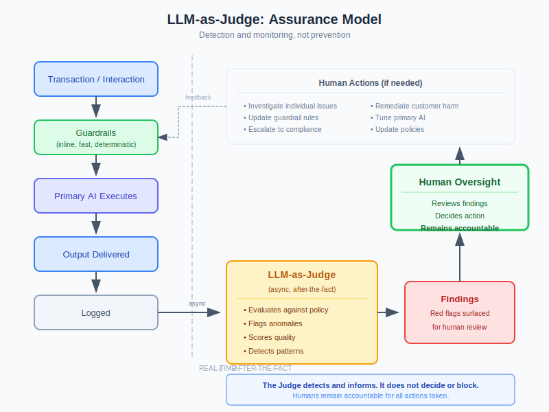
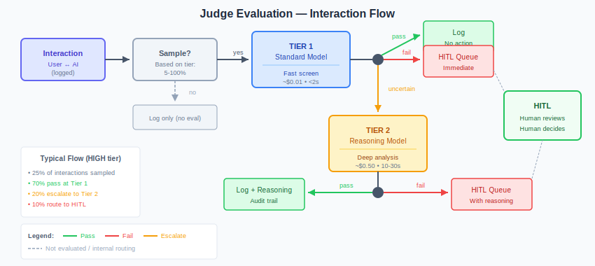
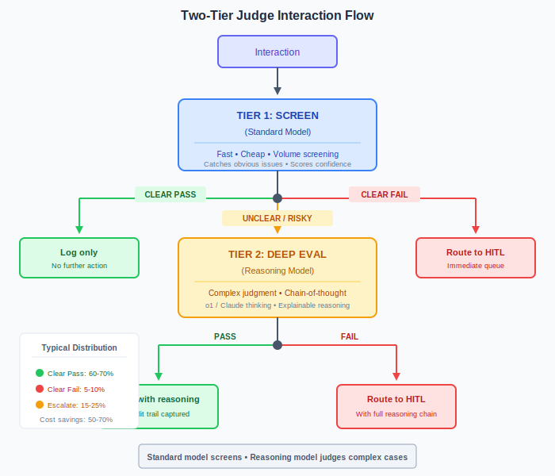
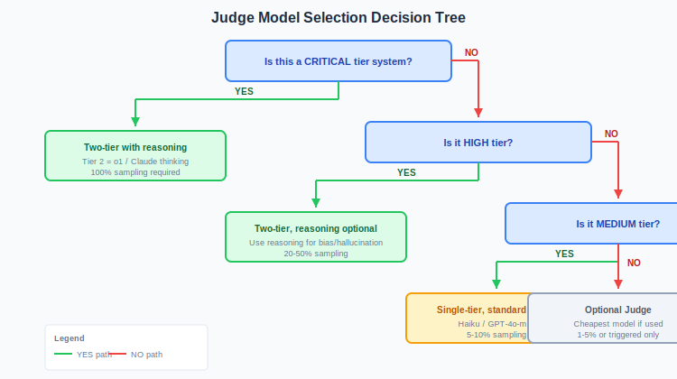

# LLM-as-Judge: An Assurance Mechanism

## What the Judge Is

The LLM-as-Judge is a **continuous assurance tool**, not a real-time control.

It reviews AI system outputs after the fact to identify red flags, quality issues, policy violations, and emerging patterns. It does not block, prevent, or make decisions. It surfaces findings for humans to act on.

Think of it as an auditor, not a gatekeeper.

→ For model selection guidance, see [Judge Model Selection](judge-model-selection.md)

---

## What the Judge Is Not

| The Judge Is Not | Why |
|------------------|-----|
| A real-time blocker | Too slow, too risky, legally problematic for customer-affecting decisions |
| A decision-maker | Cannot be accountable; humans must own decisions |
| A replacement for guardrails | Guardrails handle fast, deterministic, inline checks |
| A replacement for human oversight | It supports human oversight, doesn't replace it |
| Infallible | It's an AI evaluating AI—it can be wrong, gamed, or fail silently |

---

## The Assurance Model

The Judge operates **after the fact**, reviewing what has already happened:

1. **Transaction occurs** — User interacts with AI system
2. **Guardrails check inline** — Fast, deterministic, blocks obvious issues
3. **Primary AI executes** — Generates response
4. **Output delivered** — User receives response
5. **Interaction logged** — Full record captured
6. **Judge evaluates (async)** — Reviews against policy, flags issues
7. **Findings surfaced** — Red flags presented to humans
8. **Human decides** — Investigate, remediate, update controls, or dismiss

The critical point: the transaction completes before the Judge evaluates. The Judge informs future action; it does not gate current action.

### Two-Tier Architecture

For high-volume systems, use a two-tier approach:

---

## What the Judge Evaluates

| Evaluation Type | Question Answered | Example |
|-----------------|-------------------|---------|
| **Policy compliance** | Did the AI follow our policies? | "Did the chatbot disclose it was AI when required?" |
| **Output quality** | Was the response accurate and appropriate? | "Did the summary capture the key points?" |
| **Conduct risk** | Could this interaction harm the customer or bank? | "Did we give advice outside our permissions?" |
| **Anomaly detection** | Is this interaction unusual compared to baseline? | "This conversation pattern doesn't match normal usage" |
| **Bias indicators** | Are there patterns suggesting unfair treatment? | "Denial rates differ across demographic proxies" |
| **Adversarial signals** | Does this look like an attack or manipulation? | "This input resembles known prompt injection patterns" |

---

## What Happens With Findings

The Judge produces findings. Humans decide what to do with them.

| Finding Type | Human Action |
|--------------|--------------|
| Individual red flag | Investigate, remediate if needed |
| Pattern across transactions | Escalate to risk/compliance, consider policy change |
| Guardrail gap | Update guardrail rules to catch inline next time |
| Model drift | Trigger model review, potential retraining |
| Emerging attack vector | Update threat model, brief security team |
| Quality degradation | Review primary AI, consider tuning |

---

## Sampling Strategy

Not every transaction needs Judge evaluation. Use risk-based sampling:

| Risk Tier | Sampling Rate | Rationale |
|-----------|---------------|-----------|
| CRITICAL | 100% | Full audit trail required |
| HIGH | 20-50% | Statistically significant coverage |
| MEDIUM | 5-10% | Trend detection sufficient |
| LOW | 1-5% or triggered | Spot checks, investigate anomalies |

Sampling can also be triggered by:
- Guardrail near-misses (flagged but not blocked)
- User complaints
- Unusual session patterns
- Random selection for quality assurance

---

## Legal Alignment

This assurance model avoids key legal risks:

| Risk | How Assurance Model Avoids It |
|------|-------------------------------|
| GDPR Article 22 (automated decisions) | Judge doesn't decide—human reviews findings |
| Payment/execution SLAs | Transaction completes first; Judge reviews after |
| Blocking legitimate activity | Nothing blocked; red flags investigated |
| Accountability gap | Human is accountable for any action taken |
| Right to explanation | Judge reasoning available for human to interpret |

---

## Integration With Controls

The Judge is one component of a layered control stack:

| Layer | Function | Timing |
|-------|----------|--------|
| **Input guardrails** | Block known-bad inputs | Inline, pre-execution |
| **Output guardrails** | Filter known-bad outputs | Inline, post-execution |
| **LLM Judge** | Assurance, red flag detection | Async, after-the-fact |
| **Human oversight** | Decision-making, accountability | As needed based on findings |
| **Governance** | Policy, risk appetite, escalation paths | Ongoing |

---

## Operational Requirements

To function as an assurance tool, the Judge needs:

| Requirement | Why |
|-------------|-----|
| Comprehensive logging | Can't evaluate what isn't captured |
| Defined policies | Judge needs criteria to evaluate against |
| Escalation paths | Findings must reach someone who can act |
| Feedback loops | Human decisions inform Judge calibration |
| Performance monitoring | Judge itself needs assurance |

---

## Judge Governance

The Judge is itself an AI system. It requires:

1. **Validation** — How do we know it's finding what it should?
2. **Testing** — Regular red team exercises
3. **Monitoring** — False positive/negative rates
4. **Model risk governance** — Treat as a model under SR 11-7 / SS1/23
5. **Human oversight of the Judge** — Sample Judge findings, verify accuracy

---

## When NOT to Use a Judge

| Scenario | Why Not |
|----------|---------|
| Deterministic compliance checks | Rules work; LLM is overkill |
| Real-time blocking required | Use guardrails instead |
| No human capacity to review findings | Findings without action are waste |
| Cost prohibitive | Judge calls cost money; sampling may not be enough |
| Primary AI is low-risk, low-volume | Overhead not justified |

---

## Comparison: Guardrails vs Judge vs HITL

| Aspect | Guardrails | LLM Judge | Human Oversight |
|--------|------------|-----------|-----------------|
| **Timing** | Inline | Async | As needed |
| **Speed** | Milliseconds | Seconds | Minutes to hours |
| **Function** | Block known-bad | Detect unknown-bad | Decide and account |
| **Reasoning** | None (rules) | Contextual | Full judgement |
| **Cost** | Low | Medium-high | High |
| **Scales** | Yes | Yes (with sampling) | No |
| **Accountable** | No | No | Yes |

### Choosing a Judge Approach

---

## Summary

The LLM-as-Judge is a powerful assurance mechanism when used correctly:

**Do:**
- Use it for continuous quality monitoring
- Use it to find patterns humans would miss
- Use it to support human oversight
- Use it to improve guardrails over time

**Don't:**
- Use it to make real-time decisions
- Use it as the only control
- Use it without humans reviewing findings
- Assume it's infallible

**The Judge makes human oversight scalable. It doesn't replace it.**

---

*AI Runtime Behaviour Security, 2026 (Jonathan Gill).*
