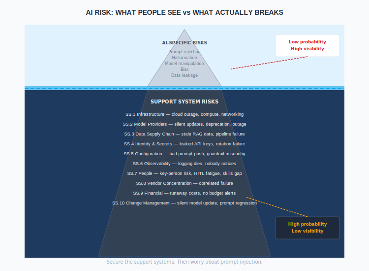
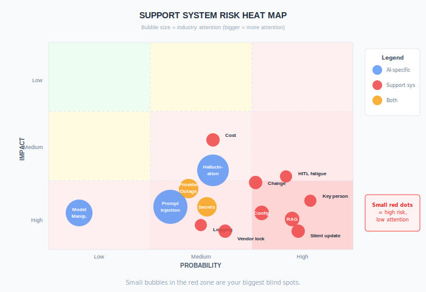

# Support Systems Risk

**The things most likely to break your AI aren't AI problems.**

---

## Why This Matters

The industry focuses here:

| AI-Specific Threat | Probability | Industry Attention |
|--------------------|------------|-------------------|
| Prompt injection | Low-Medium | Very High |
| Model manipulation | Very Low | High |
| Training data poisoning | Very Low | High |
| Hallucination | Medium | Very High |

But failures actually come from here:

| Support System Failure | Probability | Industry Attention |
|-----------------------|------------|-------------------|
| API key rotation breaks production | Medium | Low |
| Model provider silently changes behaviour | Medium | Low |
| Logging pipeline fails | Medium | Very Low |
| Key person leaves | High | Very Low |
| Stale RAG data serves wrong answers | High | Low |
| Cost blowout from misconfigured agent | Medium | Low |
| Guardrail config pushed without review | Medium | Low |

**The mundane risks are more likely to hurt you than the exotic ones.**

---

## Risk Categories

### 1. Dependency Risk

Your AI system depends on things you don't control.

#### 1.1 Model Provider Dependency

| Risk | Scenario | Impact |
|------|----------|--------|
| **Provider outage** | OpenAI / Anthropic / Azure API goes down | AI system unavailable |
| **Silent model change** | Provider updates model, outputs shift | Quality degradation, compliance drift |
| **Deprecation** | Model version retired with notice | Forced migration under pressure |
| **Rate limiting** | Hit API limits during peak | Customer-facing errors |
| **Pricing change** | Provider increases costs | Budget overrun |
| **Terms change** | Provider changes data handling terms | Compliance violation |
| **Region unavailability** | Provider exits a region | Data residency breach |

**Controls:**

| Control | Implementation | Framework Mapping |
|---------|---------------|-------------------|
| Multi-provider capability | Ability to switch models | AI.15 Continuity |
| Version pinning | Pin to specific model versions | AI.14 Configuration |
| Behaviour monitoring | Detect output drift after provider changes | AI.8 Judge |
| Contractual protections | SLAs, deprecation notice, data handling | AI.13 Supplier |
| Capacity planning | Understand rate limits vs demand | AI.15 Continuity |

---

#### 1.2 Infrastructure Dependency

| Risk | Scenario | Impact |
|------|----------|--------|
| **Cloud region failure** | Primary region outage | Full system outage |
| **DNS failure** | DNS resolution fails | Can't reach model APIs |
| **Network partition** | Connectivity between services lost | Partial or full failure |
| **Compute exhaustion** | GPU/CPU capacity exceeded | Degraded performance or outage |
| **Storage failure** | Vector DB or logging storage fails | RAG failure, blind spot |

**Controls:**

| Control | Implementation | Framework Mapping |
|---------|---------------|-------------------|
| Multi-region | Deploy across regions where justified | AI.15 Continuity |
| Health checks | Monitor all dependencies continuously | AI.11 Monitoring |
| Graceful degradation | System continues with reduced function | AI.15 Continuity |
| Capacity alerts | Alert before limits hit | AI.11 Monitoring |

---

#### 1.3 Data Supply Chain

| Risk | Scenario | Impact |
|------|----------|--------|
| **Stale data** | RAG knowledge base not updated | AI gives outdated answers confidently |
| **Corrupted data** | Bad data injected into knowledge base | AI gives wrong answers confidently |
| **Missing data** | Embedding pipeline fails, new docs not indexed | AI can't find information that exists |
| **Schema change** | Upstream data format changes | Pipeline breaks silently |
| **Source unavailable** | Data source goes offline | RAG returns no context, AI hallucinates |

This is arguably the highest-probability, highest-impact category. When RAG data is wrong, the AI is confidently wrong — and users trust it.

**Controls:**

| Control | Implementation | Framework Mapping |
|---------|---------------|-------------------|
| Data freshness monitoring | Alert when knowledge base staleness exceeds threshold | AI.5 Data Governance |
| Data validation | Validate data before indexing | AI.5 Data Governance |
| Pipeline monitoring | Monitor ingestion pipelines for failures | AI.11 Monitoring |
| Source health checks | Monitor upstream data sources | AI.11 Monitoring |
| Freshness metadata | Include "last updated" in AI responses where relevant | AI.7 Guardrails |

---

### 2. Configuration Risk

AI systems are extraordinarily sensitive to configuration. A one-word change in a system prompt can fundamentally alter behaviour.

#### 2.1 Prompt and Parameter Configuration

| Risk | Scenario | Impact |
|------|----------|--------|
| **Prompt regression** | System prompt changed, quality drops | Degraded output quality |
| **Parameter drift** | Temperature/token settings changed | Inconsistent behaviour |
| **Guardrail misconfiguration** | Rule disabled or threshold changed | Security control gap |
| **Judge criteria change** | Evaluation criteria modified without review | Assurance gap |
| **Circuit breaker override** | Limits relaxed "temporarily" | Agent runaway |

**This is the AI equivalent of a firewall rule change.** It should be treated with the same rigour.

**Controls:**

| Control | Implementation | Framework Mapping |
|---------|---------------|-------------------|
| Version control | All prompts, parameters, configs in git | AI.14 Configuration |
| Change approval | Config changes require review (by tier) | AI.14 Configuration |
| Drift detection | Alert on configuration differences from baseline | AI.14 Configuration |
| Rollback capability | Instant revert to last known good | AI.14 Configuration |
| Pre-production testing | Test config changes before prod | AI.4 Development |

---

#### 2.2 Secrets Management

| Risk | Scenario | Impact |
|------|----------|--------|
| **Leaked API key** | Key committed to repo or exposed in logs | Unauthorised model access, cost |
| **Key rotation failure** | Key rotated, dependent services not updated | Production outage |
| **Over-privileged keys** | Key has broader access than needed | Excessive blast radius |
| **No key rotation** | Same key used for months/years | Increased compromise window |
| **Shared credentials** | Multiple services use same key | Can't isolate or revoke |

**Controls:**

| Control | Implementation | Framework Mapping |
|---------|---------------|-------------------|
| Secrets vault | HashiCorp Vault, AWS Secrets Manager, etc. | AI.15 Cryptography |
| Automated rotation | Rotate keys on schedule | AI.15 Cryptography |
| Per-service credentials | Unique keys per service/environment | AI.15 Cryptography |
| Secret scanning | Scan repos and logs for leaked keys | AI.4 Development |
| Access logging | Log all API key usage | AI.11 Logging |

---

### 3. Observability Risk

If you can't see it, you can't govern it. Observability failures are silent and dangerous.

#### 3.1 Logging Failures

| Risk | Scenario | Impact |
|------|----------|--------|
| **Log pipeline failure** | Logging service goes down | Judge has no data, audit trail gap |
| **Log volume overflow** | Storage fills, logs dropped | Missing evidence |
| **Log format change** | Upstream changes log schema | Parsing breaks, Judge can't evaluate |
| **Selective logging** | Some interactions not captured | Biased Judge evaluation |
| **Log tampering** | Logs modified after the fact | Compromised audit trail |

**If logging fails, the Judge is blind, HITL has nothing to review, and your audit trail has a gap.** This is a governance failure, not just an ops issue.

**Controls:**

| Control | Implementation | Framework Mapping |
|---------|---------------|-------------------|
| Log pipeline monitoring | Alert within minutes of logging failure | AI.11 Monitoring |
| Dead letter queue | Capture failed log writes for retry | AI.11 Logging |
| Log completeness checks | Reconcile expected vs actual log volume | AI.11 Logging |
| Tamper protection | Immutable logs for CRITICAL tier | AI.11 Logging |
| Redundant logging | Write to multiple destinations for CRITICAL | AI.11 Logging |

---

#### 3.2 Monitoring and Alerting

| Risk | Scenario | Impact |
|------|----------|--------|
| **Alert fatigue** | Too many alerts, team ignores them | Real issues missed |
| **Missing alerts** | Key failure modes not monitored | Blind spot |
| **Stale dashboards** | Dashboards show cached/old data | False confidence |
| **Threshold drift** | Thresholds not updated as system evolves | Alerts no longer meaningful |

**Controls:**

| Control | Implementation | Framework Mapping |
|---------|---------------|-------------------|
| Alert review | Quarterly review of alert relevance | AI.11 Monitoring |
| Alert testing | Test that alerts fire correctly | AI.11 Monitoring |
| Escalation paths | Defined escalation when alerts ignored | AI.12 Incident |
| Dashboard freshness | Show "last updated" on all dashboards | AI.11 Monitoring |

---

### 4. People Risk

The H in HITL is a single point of failure.

#### 4.1 Key Person Dependency

| Risk | Scenario | Impact |
|------|----------|--------|
| **Sole prompt engineer** | One person wrote all system prompts | Can't maintain or debug if they leave |
| **Judge expertise** | Only one person understands Judge config | Assurance capability at risk |
| **HITL reviewer** | Domain expertise concentrated in one person | Review quality drops |
| **Platform knowledge** | One engineer knows the platform | Operational risk |

**Controls:**

| Control | Implementation | Framework Mapping |
|---------|---------------|-------------------|
| Documentation | Document all prompts, configs, decisions, rationale | AI.3 Documentation |
| Cross-training | Minimum 2 people for every critical function | AI.14 Training |
| Runbooks | Documented procedures for common operations | AI.14 Training |
| Succession planning | Identified backup for key roles | AI.1 Governance |

---

#### 4.2 HITL Sustainability

| Risk | Scenario | Impact |
|------|----------|--------|
| **Reviewer fatigue** | High volume, repetitive reviews | Quality drops, rubber-stamping |
| **Insufficient capacity** | More findings than reviewers can handle | Queue backlog, SLA breach |
| **Skill decay** | Reviewers lose domain sharpness over time | Review effectiveness drops |
| **Turnover** | Reviewers leave, replacements untrained | Assurance gap during transition |
| **Complacency** | Low finding rate leads to inattention | Miss the one that matters |

**This is a known failure mode in every human oversight system.** Aviation, nuclear, financial services — all have struggled with this.

**Controls:**

| Control | Implementation | Framework Mapping |
|---------|---------------|-------------------|
| Workload management | Monitor reviewer load, redistribute | AI.9 HITL |
| Quality checks | Sample-check HITL decisions | AI.9 HITL |
| Rotation | Rotate reviewers to maintain attention | AI.9 HITL |
| Calibration | Regular calibration exercises | AI.9 HITL |
| Canary reviews | Inject known findings to test reviewer attention | AI.9 HITL |

---

### 5. Financial Risk

AI costs are variable, opaque, and can spike without warning.

#### 5.1 Cost Control

| Risk | Scenario | Impact |
|------|----------|--------|
| **Agent cost blowout** | Agentic loop calls API repeatedly | Unexpected bill |
| **Judge cost overrun** | 100% sampling on high-volume system | Budget exceeded |
| **Shadow AI** | Teams spin up AI services without oversight | Uncontrolled spend |
| **Pricing surprise** | Provider changes pricing model | Budget assumptions invalid |
| **No budget allocation** | AI costs absorbed into general cloud spend | No visibility or control |

**Controls:**

| Control | Implementation | Framework Mapping |
|---------|---------------|-------------------|
| Budget caps | Hard spending limits per system/team | AG.2.2 Circuit Breakers |
| Cost alerts | Alert at 50%, 80%, 100% of budget | AI.11 Monitoring |
| Cost attribution | Tag all AI spend to system/team/use case | AI.3 Inventory |
| Forecast vs actual | Monthly comparison | AI.1 Governance |
| Shadow AI detection | Monitor for unauthorised AI API usage | AI.3 Inventory |

---

### 6. Vendor Concentration Risk

| Risk | Scenario | Impact |
|------|----------|--------|
| **Single model provider** | One provider for all AI capabilities | Total loss if provider fails |
| **Correlated failure** | Model + guardrails + logging all on same platform | Single event takes out controls and system |
| **Vendor lock-in** | Deep integration makes switching costly | No leverage, no alternatives |
| **Geopolitical** | Provider restricted in your jurisdiction | Forced migration |

**Controls:**

| Control | Implementation | Framework Mapping |
|---------|---------------|-------------------|
| Multi-provider strategy | At least evaluate alternatives | AI.13 Supplier |
| Abstraction layer | Don't hard-code to one provider's API | AI.4 Development |
| Exit planning | Documented migration path | AI.13 Supplier |
| Control separation | Don't run guardrails on same platform as AI | AI.15 Continuity |

---

### 7. Change Management Risk

| Risk | Scenario | Impact |
|------|----------|--------|
| **Library upgrade** | Python package update breaks integration | Production outage |
| **SDK change** | Provider SDK breaking change | Build failures or runtime errors |
| **Upstream model update** | Provider updates model behind same version string | Behaviour change |
| **Framework migration** | LangChain / LlamaIndex major version change | Significant rework |
| **Undocumented change** | Someone changes something, doesn't tell anyone | Mysterious behaviour shift |

**Controls:**

| Control | Implementation | Framework Mapping |
|---------|---------------|-------------------|
| Dependency pinning | Pin all library versions | AI.4 Development |
| Change log | All changes documented with rationale | AI.14 Configuration |
| Staged rollout | Dev → staging → canary → production | AI.4 Development |
| Automated testing | Tests run on every change | AI.4 Development |
| Change freeze | Freeze periods for critical business times | AI.4 Development |

---

## Risk Heat Map

| Category | Probability | Impact | Attention It Gets |
|----------|------------|--------|-------------------|
| **Data supply chain** | High | High | Low |
| **People / key person** | High | High | Very Low |
| **Configuration** | Medium-High | High | Low |
| **HITL sustainability** | High | Medium-High | Very Low |
| **Secrets management** | Medium | High | Medium |
| **Logging failure** | Medium | High | Very Low |
| **Cost blowout** | Medium | Medium | Low |
| **Model provider outage** | Medium | High | Medium |
| **Vendor concentration** | Medium | Very High | Low |
| **Change management** | Medium-High | Medium-High | Low |
| **Infrastructure** | Low-Medium | High | Medium |

The pattern: **high-probability, high-impact risks get the least attention** because they're not exciting. Prompt injection is interesting. API key rotation is not. But API key rotation is more likely to take you down.

---

## Framework Integration

These risks map to existing control families, but most need strengthening:

| Support System Risk | Primary Control Family | Gap |
|--------------------|-----------------------|-----|
| Model provider dependency | AI.13 Supplier, AI.15 Continuity | Needs operational runbooks |
| Infrastructure dependency | AI.15 Continuity | Needs AI-specific BCP |
| Data supply chain | AI.5 Data Governance | Needs freshness monitoring |
| Prompt/config changes | AI.14 Configuration | Needs change approval rigour |
| Secrets management | AI.15 Cryptography | Needs AI-specific secrets policy |
| Logging failures | AI.11 Logging | Needs pipeline monitoring |
| Monitoring gaps | AI.11 Monitoring | Needs alert effectiveness review |
| Key person dependency | AI.14 Training, AI.3 Documentation | Needs succession planning |
| HITL sustainability | AI.9 HITL | Needs workload management |
| Cost control | AG.2.2 Circuit Breakers, AI.11 Monitoring | Needs budget caps and attribution |
| Vendor concentration | AI.13 Supplier | Needs exit planning |
| Change management | AI.4 Development, AI.14 Configuration | Needs AI-specific change process |

---

## Implementation Priority

### Do First (Week 1-2)

| Action | Why |
|--------|-----|
| Monitor logging pipeline health | If logging fails, everything downstream is blind |
| Set budget alerts on AI spend | Prevent surprise bills |
| Document who knows what | Identify key-person risks |
| Pin model versions | Prevent silent behaviour changes |
| Put prompts in version control | If they're not in git, they're not controlled |

### Do Next (Month 1)

| Action | Why |
|--------|-----|
| Implement data freshness monitoring | Stale RAG data is a high-probability risk |
| Set up secrets rotation | Reduce credential compromise window |
| Cross-train at least one backup per function | Reduce key-person risk |
| Define change approval process for configs | Prevent unreviewed changes |
| Test failover for model provider | Know what happens before it happens |

### Do Later (Quarter 1)

| Action | Why |
|--------|-----|
| HITL workload analysis | Prevent reviewer fatigue |
| Multi-provider evaluation | Reduce vendor concentration |
| Full dependency mapping | Understand all failure paths |
| Canary reviews for HITL | Test reviewer attention |
| Exit planning for primary vendor | Have the plan before you need it |

---

## Operational Checklist

Use this for each production AI system:

| Check | Status |
|-------|--------|
| **Dependencies** | |
| Model provider SLA understood? | ☐ |
| Fallback if provider unavailable? | ☐ |
| Model version pinned? | ☐ |
| Data pipeline monitored? | ☐ |
| Data freshness threshold defined? | ☐ |
| **Configuration** | |
| All prompts in version control? | ☐ |
| Config changes require approval? | ☐ |
| Rollback procedure documented? | ☐ |
| **Secrets** | |
| API keys in vault (not code)? | ☐ |
| Rotation schedule defined? | ☐ |
| Per-service credentials? | ☐ |
| **Observability** | |
| Logging pipeline monitored? | ☐ |
| Alerts tested and relevant? | ☐ |
| Dashboard data fresh? | ☐ |
| **People** | |
| At least 2 people can maintain? | ☐ |
| Runbooks documented? | ☐ |
| HITL capacity sufficient? | ☐ |
| **Cost** | |
| Budget cap set? | ☐ |
| Cost alerts configured? | ☐ |
| Spend attributed to system? | ☐ |
| **Vendor** | |
| Exit plan documented? | ☐ |
| Alternative evaluated? | ☐ |

---

*Enterprise AI Security Controls Framework, 2026 (Jonathan Gill).*
