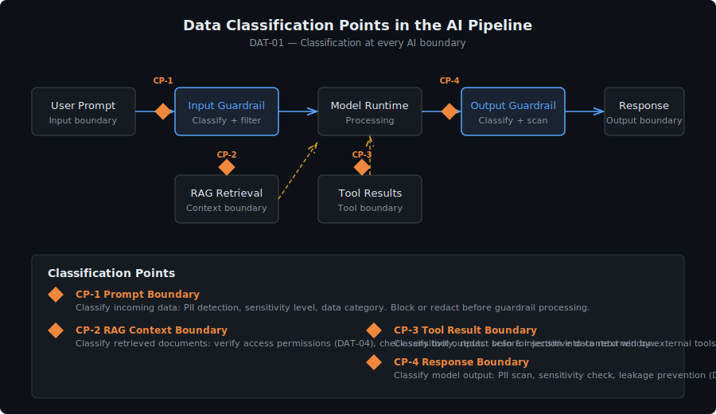

# Data Protection for AI Systems

> **Control Domain:** Confidentiality Controls  
> **Purpose:** Protect sensitive data as it flows through AI system components — in prompts, responses, context windows, vector stores, and logs.  
> **Relationship:** Supports the Guardrails layer (by detecting and redacting sensitive data in model I/O) and the Human Oversight layer (by ensuring humans can review AI interactions without unnecessary data exposure).

---

## Why AI Data Protection Is Different

Traditional data protection focuses on data at rest and in transit between known endpoints. AI systems introduce data flows that don't exist in conventional applications:

| Data Flow | Risk |
|-----------|------|
| **User prompts** | Users paste PII, credentials, and confidential documents into prompts without realising it enters a processing pipeline |
| **Context windows** | The model's full context (system prompt + conversation history + retrieved documents) may contain data from multiple sensitivity levels |
| **RAG retrieval** | Vector similarity search can surface documents the user shouldn't have access to if access controls aren't enforced at retrieval time |
| **Model responses** | Models can generate plausible-looking PII (hallucinated or memorised from training data) |
| **Agent tool results** | Agents retrieve data from backend systems and inject it into context — expanding the blast radius of any context window leak |
| **Evaluation data** | Model I/O sent to the Judge for evaluation contains all the sensitive data from the original interaction |
| **Conversation history** | Persistent conversation state accumulates sensitive data over time |

The core problem: **AI context windows mix data from multiple trust levels into a single processing unit.** A prompt containing public instructions and private customer data is processed identically by the model, with no internal boundary between them.

---

## Control Objectives

| ID | Objective | Risk Tiers |
|----|-----------|------------|
| DAT-01 | Classify data entering AI system components by sensitivity | All |
| DAT-02 | Enforce data minimisation in prompts and context windows | All |
| DAT-03 | Implement PII detection and redaction on model I/O | All |
| DAT-04 | Enforce access-controlled RAG retrieval | Tier 2+ |
| DAT-05 | Encrypt data at rest and in transit across all AI components | All |
| DAT-06 | Prevent sensitive data leakage via model responses | Tier 2+ |
| DAT-07 | Manage conversation history retention and purging | All |
| DAT-08 | Protect evaluation data sent to the Judge | Tier 2+ |

---

## DAT-01: Data Classification at AI Boundaries

Every data element entering an AI system component must be classifiable by sensitivity level. This doesn't require manual classification of every prompt — it requires automated classification at system boundaries.

### Classification Points

Data classification must occur at:

- **Prompt ingestion:** Before the user's input reaches the model, classify for PII, financial data, health data, credentials, and regulated content.
- **RAG retrieval:** Before retrieved documents are injected into context, verify the user's access level matches the document's classification.
- **Tool results:** Before agent tool results are injected into context, classify the returned data and apply sensitivity-appropriate handling.
- **Model output:** Before the response reaches the user, classify for generated/hallucinated PII and inadvertent disclosure of system internals.

### Classification Categories

Define categories aligned with your data governance framework. Common AI-relevant categories:

| Category | Examples | Handling |
|----------|----------|----------|
| **Public** | General knowledge, public documentation | No restrictions |
| **Internal** | Internal processes, non-sensitive business data | Log, no special handling |
| **Confidential** | Customer PII, financial data, HR records | Redact from logs, access-controlled retrieval |
| **Restricted** | Credentials, health records, legal privilege | Block from context windows, never log in plain text |

---

## DAT-02: Data Minimisation

Only the data necessary for the AI task should enter the context window. This is the principle of least privilege applied to data, not just access.

### Minimisation Strategies

- **System prompt design:** Include only the instructions and context the model needs. Don't inject entire policy documents when a summary suffices.
- **RAG chunk sizing:** Retrieve the minimum chunk size that provides useful context. Smaller chunks reduce the likelihood of including adjacent sensitive data.
- **Selective tool results:** When agents retrieve data from backend systems, filter the response to include only the fields relevant to the task. Don't inject full database records when only two fields are needed.
- **Context window pruning:** For long conversations, implement summarisation to reduce accumulated sensitive data in context. Don't carry forward full conversation history indefinitely.
- **Prompt sanitisation:** Strip metadata, headers, and formatting artefacts that may contain sensitive data unrelated to the user's actual question.

---

## DAT-03: PII Detection and Redaction

Automated PII detection must be applied to model inputs and outputs as part of the guardrail pipeline.

### Detection Methods

| Method | Strengths | Limitations |
|--------|-----------|-------------|
| **Regex patterns** | Fast, deterministic, good for structured PII (SSN, card numbers, phone) | Misses unstructured PII (names in context, addresses) |
| **NER models** | Good at unstructured PII (names, organisations, locations) | False positives with common nouns, slower |
| **Classification models** | Can detect semantic sensitivity (health conditions, financial distress) | Requires training data, model-dependent accuracy |
| **Hybrid approach** | Combine regex + NER + classification for layered coverage | Increased latency, complexity |

### Redaction vs. Tokenisation

- **Redaction** removes PII entirely: `"John Smith called about his account"` → `"[REDACTED] called about [REDACTED] account"`
- **Tokenisation** replaces PII with consistent tokens: `"John Smith called about his account"` → `"[PERSON_1] called about [PERSON_1] account"`

Tokenisation is preferred when referential integrity matters (the model needs to understand that the same entity is referenced across a conversation). Redaction is preferred when any PII presence in the pipeline is unacceptable.

### Application Points

- **Input guardrails:** Detect and optionally redact PII in user prompts before they reach the model (for Restricted-class data).
- **Output guardrails:** Detect PII in model responses before they reach the user (catches hallucinated or memorised PII).
- **Log pipeline:** Redact PII before writing to log storage (see LOG-09).
- **Evaluation pipeline:** Redact or tokenise PII before sending I/O to the Judge (see DAT-08).

---

## DAT-04: Access-Controlled RAG Retrieval

When a model retrieves documents from a vector store to augment its response (RAG), the retrieval must enforce the requesting user's access permissions. Semantic similarity alone is not an access control.

### The Problem

Vector stores index documents by embedding similarity. A query about "Q3 revenue" will retrieve the most semantically similar documents — regardless of whether the user is authorised to see those documents. Without access controls, RAG becomes a data exfiltration vector.

### Enforcement

- **Pre-filtering:** Apply metadata filters (user role, department, classification level) to the vector store query *before* similarity search. Only documents the user is authorised to access are candidates.
- **Post-filtering:** After retrieval, verify each document's access controls against the user's permissions before injecting into context. Reject documents that don't match.
- **Document classification metadata:** Every document in the vector store must carry classification metadata at ingestion time. Documents without classification are treated as Restricted by default.

### What This Prevents

- User A asks a question and receives documents only accessible to User B's department.
- An attacker crafts a prompt that triggers retrieval of privileged documents via semantic similarity.
- Prompt injection in an ingested document causes it to be retrieved for unrelated queries.

---

## DAT-05: Encryption Standards

All data within the AI system must be encrypted at rest and in transit.

### At Rest

| Component | Encryption Requirement |
|-----------|----------------------|
| Vector store | AES-256 or equivalent, customer-managed keys for Tier 3+ |
| Conversation history | Encrypted, per-user key isolation for multi-tenant systems |
| Log storage | Encrypted, separate key from operational data |
| Forensic store | Encrypted with dual-custody keys |
| Model artefacts | Encrypted at rest, integrity-verified at load time |
| System prompts / config | Encrypted, version-controlled, signed |

### In Transit

- TLS 1.2+ for all component-to-component communication within the AI system.
- mTLS for service-to-service communication within Zone 2 (Runtime) for Tier 3+ systems.
- No plaintext API calls between any components, including internal.

---

## DAT-06: Response Leakage Prevention

Models can leak sensitive data in responses through several mechanisms:

- **Memorisation:** The model reproduces training data containing PII or proprietary content.
- **System prompt disclosure:** The model reveals its system prompt when asked (or when tricked via prompt injection).
- **Context window disclosure:** The model reveals content from other users' conversations in multi-tenant deployments.
- **Indirect disclosure:** The model's response implies sensitive information without stating it directly.

### Controls

- Output guardrails scan for PII patterns, credential patterns, and system prompt fragments.
- System prompt includes instructions not to disclose its own content — but this is a defence-in-depth measure, not a primary control (infrastructure beats instructions).
- For multi-tenant deployments, conversation contexts are strictly isolated — no shared state between users at the model layer.
- For Tier 3+ systems, output classification compares the sensitivity level of the response against the user's access level.

---

## DAT-07: Conversation History Management

Persistent conversation history accumulates sensitive data over time. A conversation that starts with a benign question may, ten messages later, contain PII, financial data, and internal documents.

### Retention Controls

- Define maximum conversation retention periods per risk tier.
- Implement automatic purging of conversation history beyond the retention window.
- Allow users to delete their own conversation history.
- For Tier 3+ systems, implement rolling summarisation that replaces detailed history with a summary, discarding the sensitive raw content.
- Conversation exports (if supported) must apply the same PII redaction rules as the log pipeline.

---

## DAT-08: Evaluation Data Protection

Model I/O sent to the LLM-as-Judge for evaluation contains all the sensitive data from the original interaction. The evaluation pipeline must protect this data with the same rigour as the primary pipeline.

### Requirements

- PII tokenisation applied before evaluation data reaches the Judge (the Judge doesn't need real names to evaluate whether a response was appropriate).
- Evaluation data encrypted in transit from Zone 2 to Zone 3.
- Judge does not persist evaluation inputs beyond the evaluation session.
- Judge logs store tokenised versions, not original content.
- If using a third-party evaluation service, the same data protection standards apply — sensitive data doesn't leave the security boundary without classification-appropriate controls.

---

## Three-Layer Mapping

| Control | Guardrails | LLM-as-Judge | Human Oversight |
|---------|-----------|--------------|-----------------|
| DAT-01 Classification | Guardrails use classification to determine handling | Judge evaluates whether classification was appropriate | Humans define classification policies |
| DAT-02 Minimisation | Guardrails enforce context window limits | Judge evaluates data relevance in responses | Humans review data inclusion patterns |
| DAT-03 PII detection | Guardrails detect and redact PII inline | Judge flags responses containing potential PII | Humans tune PII detection rules |
| DAT-04 RAG access control | Guardrails enforce retrieval filtering | Judge evaluates retrieval appropriateness | Humans manage document classification |
| DAT-05 Encryption | Guardrail traffic encrypted | Judge traffic encrypted independently | Audit trail encrypted and integrity-verified |
| DAT-06 Leakage prevention | Output guardrails scan for leaked data | Judge detects indirect disclosure patterns | Humans investigate flagged disclosures |
| DAT-07 History management | Guardrails on history length and content | Judge evaluates history summarisation quality | Humans define retention policies |
| DAT-08 Eval data protection | Guardrails on data before Judge evaluation | Judge operates on tokenised data | Humans audit evaluation data handling |

---

## Platform-Neutral Implementation Checklist

- [ ] Automated data classification at all AI system boundaries
- [ ] Data minimisation enforced in system prompts, RAG retrieval, and tool results
- [ ] PII detection (regex + NER) applied to model inputs and outputs
- [ ] RAG retrieval enforces user access permissions via pre-filtering
- [ ] All data encrypted at rest (AES-256) and in transit (TLS 1.2+)
- [ ] Output guardrails detect memorised PII, system prompt disclosure, and context leaks
- [ ] Conversation history retention policies defined and enforced per risk tier
- [ ] Evaluation data tokenised before reaching the Judge
- [ ] Multi-tenant context isolation verified and tested
- [ ] Data classification metadata required for all vector store documents

---

*AI Runtime Behaviour Security, 2026 (Jonathan Gill).*
