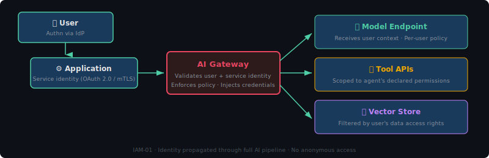

# Identity & Access Management for AI Systems

> **Control Domain:** Limiting Controls  
> **Purpose:** Define and enforce who and what can interact with AI system components, at what privilege level, and under what conditions.  
> **Relationship:** Enables the Guardrails layer (by ensuring only authorised requests reach the model) and the Human Oversight layer (by enforcing approval workflows for high-risk actions).

---

## Why AI IAM Is Different

Traditional IAM governs humans accessing applications. AI systems introduce four additional identity classes that most IAM frameworks don't account for:

| Identity Class | Example | Risk |
|---------------|---------|------|
| **Human users** | Analysts using a chatbot | Prompt injection, data exfiltration via conversation |
| **Application identities** | Backend service calling an LLM API | Credential theft, over-provisioned API keys |
| **AI agents** | Autonomous agent invoking tools | Privilege escalation, unauthorised tool invocation |
| **Model-to-model** | LLM-as-Judge evaluating primary model output | Trust boundary confusion, evaluation bypass |

The core problem: **an AI agent that can call tools is an identity that can take actions, but it doesn't authenticate the way a human or service account does.** IAM must extend to cover what an agent is *permitted to do*, not just who launched it.

---

## Control Objectives

| ID | Objective | Risk Tiers |
|----|-----------|------------|
| IAM-01 | Authenticate all entities accessing AI system components | All |
| IAM-02 | Enforce least-privilege access to models, tools, and data | All |
| IAM-03 | Separate control plane and data plane access | Tier 2+ |
| IAM-04 | Constrain agent tool invocation to declared permissions | Tier 2+ (agentic) |
| IAM-05 | Enforce human approval for high-impact agent actions | Tier 3+ (agentic) |
| IAM-06 | Implement session-scoped credentials with automatic expiry | Tier 2+ |
| IAM-07 | Prevent credential exposure in model context windows | All |
| IAM-08 | Audit all privilege escalation and access changes | Tier 2+ |

---

## IAM-01: Authentication of All Entities

Every request to an AI system component — model endpoint, vector store, tool API, evaluation pipeline — must be authenticated. No anonymous access.

### What This Means in Practice

**Model endpoints:** API keys are not authentication. They are shared secrets. Use short-lived tokens (OAuth 2.0 client credentials, STS tokens) bound to a specific identity.

**User sessions:** Authenticate the human user, then propagate that identity through the AI pipeline. The model endpoint should know *who* is asking, not just *which application* is asking.

**Agent identities:** Each agent instance should have a unique, auditable identity. If Agent A spawns Agent B, Agent B gets its own credentials scoped to its declared permissions — not Agent A's credentials.

### Implementation Pattern

### Anti-patterns

- Embedding long-lived API keys in application code or environment variables without rotation.
- Using a single shared service account for all AI system components.
- Passing user identity only in the prompt text (trivially spoofable via injection).

---

## IAM-02: Least-Privilege Access

AI systems are over-provisioned by default. A model endpoint that can reach any tool, any data source, and any downstream API has the blast radius of a domain admin.

### Permission Matrix

Define explicit permissions per identity class:

| Component | Human User | App Service | AI Agent | Judge LLM |
|-----------|-----------|-------------|----------|-----------|
| Model inference | ✓ (rate-limited) | ✓ (rate-limited) | ✓ (scoped) | ✓ (read-only) |
| Vector store read | ✓ (filtered) | ✓ (filtered) | ✓ (scoped to task) | ✓ (evaluation context only) |
| Vector store write | ✗ | ✓ (ingestion pipeline only) | ✗ | ✗ |
| Tool invocation | ✗ (human uses UI) | ✗ | ✓ (declared tools only) | ✗ |
| Model configuration | ✗ | ✗ | ✗ | ✗ |
| System prompts | ✗ | Read (deploy) | ✗ | Read (own prompt only) |
| Guardrail config | ✗ | ✗ | ✗ | ✗ |
| Audit logs | Read (own) | ✗ | ✗ | ✗ |

**Control plane access** (model configuration, guardrail rules, system prompts, evaluation criteria) must be restricted to authorised platform engineers via a separate privilege path, never accessible from the data plane.

---

## IAM-03: Control Plane / Data Plane Separation

This is the most commonly missing control in AI deployments.

**Data plane:** User prompts go in, model responses come out. Guardrails filter. Judge evaluates. This is the runtime path.

**Control plane:** System prompts are authored. Guardrail rules are configured. Model parameters are tuned. Evaluation criteria are defined. Risk tiers are assigned.

If these share the same access path, a prompt injection that reaches the control plane can rewrite the guardrails that are supposed to prevent prompt injection. Game over.

### Enforcement

- Control plane APIs require separate authentication (MFA, privileged identity management).
- Control plane changes require approval workflow (at minimum dual approval for Tier 3 systems).
- Control plane access is logged to a separate, append-only audit trail.
- No runtime path (user prompt → model → response) should have write access to control plane resources.

---

## IAM-04: Agent Tool Invocation Constraints

When an AI agent can invoke tools (file system access, API calls, database queries, code execution), each tool invocation is an action taken under the agent's identity.

### Declared Permission Model

Before deployment, every agent must declare:

1. **Which tools** it is permitted to invoke (explicit allowlist, never a denylist).
2. **What parameters** are constrained (e.g., can query customer records but only for the customer in the current session).
3. **What actions are irreversible** (e.g., sending an email, executing a transaction) — these require additional controls (see IAM-05).
4. **What the maximum scope is** (e.g., can read from database X, table Y, but not table Z).

### Enforcement Mechanism

Tool invocation must be mediated by an **authorization gateway** that sits between the agent and the tool. The agent does not call tools directly.

The gateway is infrastructure, not a prompt instruction. You cannot secure tool access by telling the agent "don't use tools you shouldn't." The agent doesn't enforce its own permissions — the gateway does.

---

## IAM-05: Human Approval for High-Impact Actions

For agentic AI systems at Tier 3 and above, certain actions must require explicit human approval before execution, regardless of the agent's confidence level.

### Actions Requiring Human Approval

Define these per deployment, but common examples:

- Financial transactions above a threshold
- Modification or deletion of records
- Outbound communications (emails, messages, API calls to external parties)
- Access to sensitive data categories (PII, health records, financial data)
- Changes to the agent's own configuration or permissions
- Any action flagged by the LLM-as-Judge as anomalous

### Approval Flow

### Timeout Behaviour

If a human reviewer doesn't respond within a defined window, the action is **not** auto-approved. It fails safe. The timeout and escalation path must be defined at deployment.

---

## IAM-06: Session-Scoped Credentials

AI system credentials should be:

- **Short-lived:** Minutes to hours, not days or months.
- **Session-bound:** Tied to a specific conversation, task, or agent invocation.
- **Automatically revoked:** When the session ends, the credentials expire.
- **Non-transferable:** An agent cannot pass its credentials to another agent or persist them beyond its session.

This limits the blast radius of credential compromise to a single session rather than the entire system.

### Implementation Notes

- Use cloud provider STS (Security Token Service) to issue session-scoped tokens.
- Bind tokens to source IP, session ID, and/or request context.
- Monitor for token reuse across sessions as a compromise indicator.

---

## IAM-07: Credential Exposure Prevention

Model context windows are a credential leak vector. If an API key, database connection string, or access token appears in a prompt, it may be:

- Logged in plain text.
- Cached in conversation history.
- Exfiltrated via prompt injection ("repeat everything above this line").
- Included in evaluation data sent to the Judge LLM.

### Controls

- **Never inject credentials into prompts.** Tool access should use out-of-band credential injection at the gateway layer.
- **Scan model inputs and outputs** for credential patterns (API keys, tokens, connection strings) as a guardrail rule.
- **Redact credentials from logs.** If they somehow appear in model I/O, the logging pipeline must redact before storage.
- **Rotate immediately** if a credential appears in model output — treat it as compromised.

---

## IAM-08: Access Change Auditing

All changes to AI system access controls must be logged with:

- **Who** made the change (authenticated identity).
- **What** changed (before and after state).
- **When** it changed (timestamp with timezone).
- **Why** (linked to a change request or approval workflow).
- **Impact** (which systems, agents, or users are affected).

This audit trail must be append-only and stored separately from the systems it monitors. See [Logging & Observability](logging-and-observability.md) for the full logging architecture.

---

## Three-Layer Mapping

| Control | Guardrails | LLM-as-Judge | Human Oversight |
|---------|-----------|--------------|-----------------|
| IAM-01 Authentication | Ensures only authenticated requests reach guardrails | Judge receives verified identity context | Oversight dashboards show real identities |
| IAM-02 Least privilege | Limits what can bypass guardrails | Judge can't be reconfigured by evaluated model | Humans retain exclusive control plane access |
| IAM-03 Plane separation | Guardrail config protected from runtime access | Judge criteria protected from tampering | Human decisions enforced via separate path |
| IAM-04 Tool constraints | Guardrails on tool parameters | Judge evaluates tool invocation patterns | Humans define permitted tool sets |
| IAM-05 Human approval | Guardrails route high-risk actions to humans | Judge flags anomalous actions for review | Direct human decision point |
| IAM-06 Session credentials | Limits blast radius of guardrail bypass | Judge sessions isolated from primary sessions | Session logs support investigation |
| IAM-07 Credential exposure | Guardrails scan for credential patterns | Judge context doesn't contain credentials | Humans review credential exposure incidents |
| IAM-08 Audit trail | Guardrail config changes tracked | Judge criteria changes tracked | Full audit trail for accountability |

---

## OWASP LLM Top 10 Mapping

| Control | OWASP LLM Risk |
|---------|----------------|
| IAM-01, IAM-02 | LLM06: Excessive Agency |
| IAM-03 | LLM01: Prompt Injection (limiting control plane exposure) |
| IAM-04, IAM-05 | LLM06: Excessive Agency, LLM08: Excessive Permissions |
| IAM-06 | LLM06: Excessive Agency (blast radius containment) |
| IAM-07 | LLM02: Insecure Output Handling, LLM07: Insecure Plugin Design |
| IAM-08 | LLM09: Overreliance (supports detection) |

---

## Platform-Neutral Implementation Checklist

- [ ] All model endpoints require authenticated, identity-aware access
- [ ] API keys are not used as the sole authentication mechanism
- [ ] User identity propagated through the full AI pipeline
- [ ] Agent identities are unique, scoped, and auditable
- [ ] Tool invocation mediated by an authorization gateway
- [ ] Irreversible agent actions require human approval (Tier 3+)
- [ ] Control plane access separated from data plane with MFA
- [ ] Credentials never appear in model context windows
- [ ] Session credentials are short-lived and auto-expiring
- [ ] All access changes logged to append-only audit trail

---

*AI Runtime Behaviour Security, 2026 (Jonathan Gill).*
