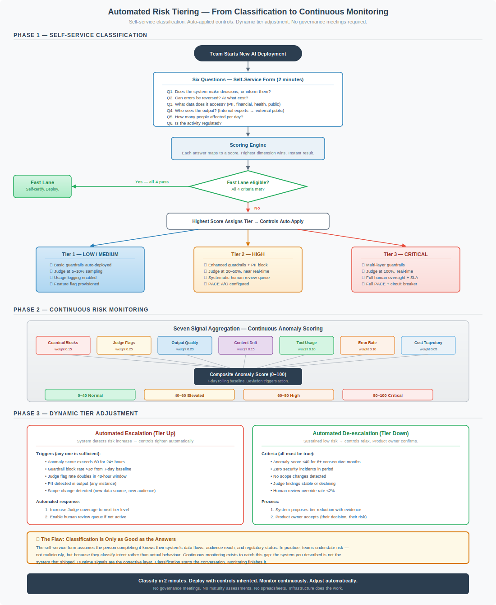

# Automated Risk Tiering

*If classifying your AI system requires a governance meeting, a questionnaire, and a three-week wait for sign-off — you have built a gate, not a guardrail. Classification should take two minutes, produce an immediate result, and auto-apply the controls that make the risk manageable.*

---

## The Problem with Manual Classification

The framework defines [risk tiers](../core/risk-tiers.md) across six dimensions: decision authority, reversibility, data sensitivity, audience, scale, and regulatory context. The highest dimension wins. The logic is sound.

The implementation, in most organisations, is not.

What typically happens:

1. A team wants to deploy an AI feature.
2. Someone emails the security or governance function asking how to classify it.
3. A meeting is arranged. Calendars are consulted. Two weeks pass.
4. The team fills in a questionnaire — often a spreadsheet, sometimes a Confluence page — with the help of someone from the governance function who explains what the questions mean.
5. The governance function reviews the answers, sometimes challenges them, occasionally escalates to a risk committee.
6. A tier is assigned. The team is told which controls apply. Another document is produced describing the controls. The team implements them manually.
7. Total elapsed time: three to six weeks. Often longer.

The framework was designed to be proportionate. The implementation process is not. A system that takes six weeks to classify and then requires manual control implementation is a system that incentivises teams to avoid classification entirely — or to understate risk so they fall into a lighter tier.

The [Fast Lane](../FAST-LANE.md) was designed to solve this for low-risk deployments. This article extends the same principle to all tiers: **classification should be self-service, instant, and directly connected to automated control deployment.**

---

## The Automated Path



The flow has three phases. Each one removes a manual step that currently exists in most organisations' implementation of risk frameworks.

---

## Phase 1: Self-Service Classification

### Six Questions, Two Minutes

The six dimensions that determine risk tier can each be answered with a single multiple-choice question. No ambiguity. No interpretation required. No meeting.

| # | Question | Answers (low → high) |
|---|----------|---------------------|
| **Q1** | Does the system make decisions, or inform them? | Informational → Advisory → Influential → Autonomous |
| **Q2** | Can errors be reversed? At what cost? | Fully reversible → Recoverable with effort → Difficult to reverse → Irreversible |
| **Q3** | What data does it access? | Public only → Internal → Confidential → PII → Sensitive PII → Regulated |
| **Q4** | Who sees the output? | Internal technical → Internal non-technical → External authenticated → External public |
| **Q5** | How many people are affected per day? | <100 → 100–10,000 → 10,000–100,000 → >100,000 |
| **Q6** | Is the activity regulated? | Unregulated → Light-touch → Sector-regulated → High-risk under AI Act |

Each answer maps to a score. The highest score across all six dimensions determines the tier. This is the framework's existing "highest dimension wins" rule — implemented as code, not as a conversation.

### Scoring Logic

```
For each dimension:
  Answer 1 (lowest)  → Score 1 (LOW)
  Answer 2           → Score 2 (MEDIUM)
  Answer 3           → Score 3 (HIGH)
  Answer 4 (highest) → Score 4 (CRITICAL)

Final tier = max(Q1_score, Q2_score, Q3_score, Q4_score, Q5_score, Q6_score)

Additional rule:
  If 3 or more dimensions score HIGH → escalate to CRITICAL
```

### Fast Lane Gate

Before tier assignment, the system checks Fast Lane eligibility. If all four criteria are met — internal users only, read-only, no regulated data, human always reviews — the system is classified as Fast Lane with minimal controls and self-certification. No further review needed.

This is not a shortcut. It is the designed default for the majority of enterprise AI deployments. If most of your teams are not landing in the Fast Lane, the problem is your implementation, not your teams.

### Instant Result

The form returns:

1. **The tier** — Fast Lane, Tier 1, Tier 2, or Tier 3
2. **The dimension that determined it** — so the team understands *why*
3. **The controls that will auto-apply** — not a list to implement, but a description of what the platform is about to provision

No approval queue. No governance sign-off. The logic is deterministic. The same answers always produce the same tier. If the answers are honest, the classification is correct.

### Where Human Review Still Applies

Self-service classification works because the scoring logic is mechanical. But two scenarios still need human involvement:

- **Borderline CRITICAL.** When the scoring engine returns CRITICAL — or when three or more dimensions score HIGH (triggering the escalation rule) — the system flags for confirmation by a risk practitioner. Not approval. Confirmation that the answers reflect reality. This can be async; it should not block deployment of Tier 3 controls while confirmation is in progress.
- **Novel use cases.** When a team selects answers that produce a combination the scoring engine hasn't seen — for example, a system that is read-only but processes highly regulated data at autonomous scale — the system flags for review. These are the edge cases where human judgement adds value. They are rare.

Everything else flows through without human intervention.

---

## Phase 2: Auto-Applied Controls

Classification without automated control deployment is just a labelling exercise. The tier must *do* something the moment it is assigned.

### Controls as Platform Primitives

When a team deploys on the AI platform at a given tier, the corresponding controls activate automatically. Teams do not implement controls. They inherit them.

| Control | Fast Lane | Tier 1 | Tier 2 | Tier 3 |
|---------|-----------|--------|--------|--------|
| **Input guardrails** | Basic content filter | Standard injection + content | Enhanced + ML + PII blocking | Multi-layer + custom rules |
| **Output guardrails** | Basic content filter | Standard + PII warn | Enhanced + PII block + grounding | Maximum + citation + confidence |
| **Judge coverage** | None | 5–10% batch sampling | 20–50% near real-time | 100% real-time |
| **Human review** | User reviews own output | Exception-based | Systematic queue, 4h SLA | All significant, 1h SLA |
| **Logging** | Metadata + usage | Full input/output | Full + context, 1yr retention | Full + reasoning, 7yr immutable |
| **Kill switch** | Feature flag | Feature flag | Circuit breaker | Circuit breaker + PACE |
| **PACE plan** | Feature flag off → manual | Basic documented fallback | A/C pre-configured | Full P/A/C/E tested monthly |

The platform provisions these controls when the deployment is registered at a tier. If the team deploys on approved infrastructure, the controls are already there. The secure path is the path of least resistance.

### What This Means in Practice

A team that classifies their system as Tier 2 (HIGH) and deploys on the AI platform gets:

- **Guardrails** already running on the API gateway — PII detection, injection classification, content policy enforcement. No configuration needed unless the team wants custom rules for their domain.
- **Judge evaluation** at 20–50% sampling, running asynchronously against the team's transactions. Findings route to the team's existing workflow tools (Jira, ServiceNow, Slack — wherever they work). Not to a governance dashboard.
- **Human review queue** pre-configured with the team as the owning group. Escalation rules based on Judge findings. 4-hour SLA on flagged items.
- **Logging** capturing full input/output with context, stored for one year, access-controlled to the team plus security operations.
- **Circuit breaker** configured with the team's PACE alternate (reduced functionality mode) as the fallback destination.

The team did not build any of this. They answered six questions. The platform did the rest.

---

## Phase 3: Continuous Risk Monitoring

Classification happens once. Risk does not stay constant.

The system a team described in the questionnaire is a statement of intent. The system that actually runs in production may diverge — sometimes because scope creeps, sometimes because the operating environment changes, sometimes because the initial classification was optimistic.

Continuous monitoring closes this gap. It watches seven signals, aggregates them into a composite anomaly score, and uses that score to adjust controls dynamically.

### Seven Signals

| Signal | Weight | What It Measures |
|--------|--------|-----------------|
| **Guardrail block rate** | 0.15 | Volume and pattern of blocked inputs/outputs against 7-day baseline |
| **Judge flag rate** | 0.25 | Frequency and severity of Judge findings relative to baseline |
| **Output quality** | 0.20 | Hallucination rate, grounding score, factual errors — tracked against tier targets |
| **Content drift** | 0.15 | Whether the topics and patterns in production match what was classified |
| **Tool usage patterns** | 0.10 | For agentic systems: whether tool calls match expected patterns |
| **Error rate** | 0.10 | System errors, timeout rates, failed transactions |
| **Cost trajectory** | 0.05 | Token consumption trends — spikes may indicate runaway loops or abuse |

These signals are already collected by the framework's existing observability controls. The anomaly score is an aggregation layer on top of infrastructure that should already exist.

### Composite Score

The seven signals produce a **composite anomaly score from 0 to 100**, calculated against a 7-day rolling baseline. The score uses weighted z-scores normalised to the 0–100 range:

| Score Range | State | Automated Response |
|-------------|-------|-------------------|
| **0–40** | Normal | No action. Controls operating as designed. |
| **40–60** | Elevated | Increase monitoring frequency. Alert the owning team. |
| **60–80** | High | Increase Judge coverage to next tier level. Enable human review if not active. PACE P→A transition. |
| **80–100** | Critical | Full PACE escalation. Circuit breaker evaluation. Incident response notification. |

The response is automated. When the score crosses 60, the platform increases Judge sampling from 10% to 50%, or from 50% to 100%. It does not send an email asking the team to increase their monitoring. It increases monitoring. The team is notified, not consulted.

### Dynamic Tier Adjustment

The anomaly score feeds two automated processes:

**Escalation (tier up):** If any of these triggers fire, the system's effective control level increases immediately:

- Anomaly score exceeds 60 for 24+ consecutive hours
- Guardrail block rate exceeds 3σ from 7-day baseline
- Judge flag rate doubles within a 48-hour window
- PII detected in output (any instance, at any tier)
- Scope change detected — new data sources accessed, new audience patterns observed

Escalation is automated and immediate. Controls tighten first, questions later. This is the same principle as a circuit breaker: act, then investigate.

**De-escalation (tier down):** Reducing controls requires sustained evidence and explicit product owner approval:

- Anomaly score below 40 for 6+ consecutive months
- Zero security incidents in the period
- No scope changes detected
- Judge findings stable or declining trend
- Human review override rate below 2%

When all criteria are met, the system proposes a tier reduction to the product owner with supporting evidence. The product owner accepts or declines. This is their decision, not the security function's. If they accept, controls adjust. If they decline, the system continues at the current tier.

De-escalation is slow by design. Escalation is fast by design. The asymmetry is intentional.

---

## The Flaw

This model has a structural weakness, and it is important to name it explicitly.

**Classification is only as good as the answers.**

The self-service form assumes the person completing it knows their system's data flows, audience reach, and regulatory status. In practice, teams understate risk — not maliciously, but because they classify *intent* rather than *actual behaviour*.

A team building an internal document assistant will answer the six questions based on what they designed: internal users, read-only, no PII. Six months later, the system may be processing documents that contain customer data, the output may be copy-pasted into external emails, and the "internal only" constraint may have eroded through integration with a customer-facing portal.

The self-service form captured day-one intent. It did not capture month-six reality.

This is why continuous monitoring is not optional — it is the corrective layer for classification error. The seven signals detect when runtime behaviour diverges from the classification assumptions. Content drift catches topic changes. PII detection catches data scope creep. Audience pattern monitoring catches exposure changes.

**Classification starts the conversation. Monitoring finishes it.**

The team classified their system as Tier 1. The monitoring system observed Tier 2 behaviour. Controls escalated automatically. The team was notified with evidence: "Your system is processing data patterns consistent with confidential content. Judge coverage has been increased from 10% to 50%. Please review your classification."

No governance meeting. No blame. No maturity assessment. The platform detected a gap and closed it.

---

## Implementation Architecture

### The Self-Service Form

The classification form is a web application. It can be a page in your internal developer portal, a step in your CI/CD pipeline, or a standalone tool. The requirements are minimal:

- **Six multiple-choice questions** with clear, unambiguous options
- **Deterministic scoring logic** that returns the same tier for the same answers every time
- **Fast Lane check** before tier assignment
- **Instant result** with tier, determining dimension, and control summary
- **API integration** with the AI platform to register the deployment at the assigned tier

The form should take less than two minutes. If it takes longer, the questions are ambiguous.

### The Control Provisioning Layer

When a deployment is registered at a tier, the platform provisions controls automatically:

```
on_classification(deployment_id, tier):
  apply_guardrails(deployment_id, tier.guardrail_config)
  configure_judge(deployment_id, tier.judge_coverage, tier.judge_timing)
  setup_logging(deployment_id, tier.log_level, tier.retention)
  provision_circuit_breaker(deployment_id, tier.pace_config)
  if tier >= TIER_2:
    create_review_queue(deployment_id, tier.review_sla)
  register_monitoring(deployment_id, tier.baseline_config)
```

This is platform engineering, not security engineering. The security team defines the control configurations per tier. The platform team implements the provisioning. The delivery team answers six questions and gets on with building their product.

### The Monitoring Pipeline

The monitoring pipeline aggregates signals from infrastructure that already exists:

```
every 5 minutes:
  signals = collect_signals(deployment_id)
  score = calculate_anomaly_score(signals, baseline)

  if score > 60 and duration(score > 60) > 24h:
    escalate_tier(deployment_id)
    notify_team(deployment_id, "Controls increased", evidence)

  if score > 80:
    evaluate_circuit_breaker(deployment_id)
    notify_incident_response(deployment_id, evidence)

  update_baseline(deployment_id, signals)
```

The monitoring pipeline is a platform service. It runs against every deployment. It does not require team configuration. If you deploy on the platform, you are monitored. Opting out is not an option.

---

## What This Changes

| Today | Automated |
|-------|-----------|
| Classification requires a meeting | Classification takes 2 minutes, self-service |
| Controls are implemented manually | Controls auto-apply when tier is assigned |
| Risk is assessed periodically | Risk is monitored continuously |
| Tier changes require governance approval | Escalation is automatic; de-escalation requires product owner confirmation |
| Teams avoid classification to avoid friction | Classification is frictionless; avoiding it is harder than doing it |
| Security function reviews teams | Platform monitors systems |
| Governance produces narratives | Infrastructure produces outcomes |

---

## Stakeholder Views

Automated risk tiering changes the operating model for every function involved in AI governance. What each stakeholder sees — and what changes for them — depends on where they sit in the organisation's control structure.

### First Line — Delivery Teams

Delivery teams are the primary beneficiaries. Classification drops from a multi-week process to a two-minute self-service form. Controls auto-apply. The team does not configure guardrails, provision logging, or set up review queues — the platform does. Their responsibility is answering the six questions honestly and responding when monitoring surfaces findings. They own the risk. They do not own the infrastructure.

### Second Line — Risk and Compliance Functions

In organisations operating a three lines of defence model, second line functions — enterprise risk management, compliance, information security risk — provide oversight, challenge, and frameworks. Automated risk tiering changes their operating model fundamentally.

**What improves:**

- **Visibility without overhead.** Second line no longer relies on periodic self-assessments or governance meetings to understand the risk profile of AI deployments. The platform provides a real-time view of every system's tier, anomaly score, and control state. The risk register populates itself.
- **Challenge with evidence.** When second line challenges a classification, they do so with runtime data — not with a questionnaire response from three months ago. "Your system was classified Tier 1 but has been operating at Tier 2 controls for six weeks because monitoring detected PII in outputs" is a more productive conversation than "please re-attest your risk classification."
- **Proportionality is enforced mechanically.** The framework's proportionality principle — higher risk, stronger controls — is encoded in the scoring logic and the control provisioning layer. Second line does not need to check whether teams have implemented the right controls for their tier. The platform enforces it.

**What changes:**

- The second line role shifts from **review and approve** to **define and monitor**. Second line defines the scoring logic, the control configurations per tier, the escalation thresholds, and the de-escalation criteria. They do not review individual classifications — the deterministic scoring engine handles that. They review the *rules*, not the *results*.
- Second line monitors aggregate patterns across the portfolio: which tiers are most common, where escalations cluster, which dimensions drive the highest classifications, and whether de-escalation criteria are appropriately calibrated. This is portfolio-level risk management, not case-by-case review.
- Regulatory reporting draws directly from platform data. When regulators ask "how do you classify your AI systems and what controls apply?", the answer is a data export — not a narrative.

### Third Line — Internal Audit

Internal audit provides independent assurance over both the first and second lines. Automated risk tiering gives audit something most AI governance frameworks do not: **a deterministic, auditable trail from classification to control to runtime evidence.**

**What audit can now verify:**

- **Classification integrity.** The scoring logic is deterministic. The same answers always produce the same tier. Audit can test the scoring engine directly — submit known answer sets and verify the output. They can also compare classification answers against observable system behaviour: if a team said "internal users only" but logs show external IP addresses, the classification is demonstrably wrong.
- **Control enforcement.** Controls are platform-provisioned, not team-implemented. Audit does not need to check whether a Tier 2 system has the correct guardrails configured — the platform enforces this at deployment. Audit verifies that the platform's control provisioning logic matches the framework's requirements for each tier. Test once, rely continuously.
- **Monitoring effectiveness.** The seven signals, the anomaly score calculation, and the escalation thresholds are all defined in code. Audit can review the logic, test with synthetic data, and verify that escalations fire when they should. They can also review historical escalation events: did the score cross 60? Did controls tighten? Did the team receive notification? The evidence trail is complete.
- **De-escalation governance.** Every de-escalation requires sustained low anomaly scores and explicit product owner approval. Audit can verify that no system had its controls reduced without meeting the defined criteria and obtaining documented approval. This is a binary check against platform records — not a judgement call.

**What changes for audit:**

- The audit approach shifts from **testing team-level compliance** (did this team implement the controls their tier requires?) to **testing platform-level enforcement** (does the platform correctly provision and maintain controls for each tier?). This is a more efficient model. Instead of sampling 30 AI deployments and checking controls on each, audit tests the provisioning engine once and verifies it is correctly applied everywhere.
- Audit evidence is machine-generated and immutable. Classification records, control configurations, monitoring data, escalation events, and de-escalation approvals are all captured by the platform. Audit does not request evidence from teams — they query the platform.
- The audit cycle can shift from annual to continuous. Platform data supports ongoing assurance rather than point-in-time testing.

### CISO and Security Leadership

The CISO's function builds and operates the platform. They define control configurations. They do not own individual risk classifications — product owners do. What they gain is a portfolio-level view of AI risk that updates in real time: how many systems at each tier, where anomaly scores are elevated, which controls are firing most frequently, and where the framework's assumptions are being tested by production behaviour.

### Platform Engineering

Platform engineering implements the control provisioning, the monitoring pipeline, and the self-service form. They are the team that makes "controls as infrastructure" real. Their success metric is straightforward: when a team answers six questions, the right controls apply within minutes, not days.

---

## Operating Principles

**1. The form is the risk assessment.** If the six questions are answered honestly, the tier is correct. No secondary review needed for Tier 1 and Tier 2. The scoring logic is the risk methodology — published, deterministic, and auditable.

**2. Controls are inherited, not implemented.** Teams do not build guardrails. They do not configure Judge pipelines. They do not set up logging. The platform provides all of this. Teams answer six questions and deploy.

**3. Monitoring is mandatory and invisible.** Every deployment is monitored. The seven signals are collected from platform infrastructure. Teams do not instrument their applications for monitoring. The platform instruments itself.

**4. Escalation is automated and immediate.** When monitoring detects risk increase, controls tighten without human approval. The team is informed, not consulted. Speed matters more than consensus when risk is increasing.

**5. De-escalation is earned and explicit.** Reducing controls requires sustained evidence of low risk and product owner acceptance. The asymmetry — fast up, slow down — reflects the reality that increasing risk needs immediate action, while decreasing controls can wait for confidence.

**6. The product owner owns the risk.** Classification is the team's responsibility. De-escalation is the product owner's decision. The security function builds the platform and defines the controls. It does not own the classification, the tier, or the decision to accept residual risk. Accountability follows the decision, not the infrastructure.

**7. The framework evolves through runtime evidence.** When monitoring consistently shows that a tier's controls are too aggressive or too permissive, the tier definitions change. The evidence comes from production behaviour, not from governance reviews. Strategy that tests the framework's limits is feedback, not non-compliance.

---

## Getting Started

If you are implementing automated risk tiering, start here:

1. **Build the form.** Six questions. Multiple choice. Deterministic scoring. Ship it as a page in your developer portal. Do not overthink the UI — a working form today is worth a perfect portal in six months.

2. **Automate Fast Lane first.** The four Fast Lane criteria are binary. If a team's answers qualify, auto-approve and provision minimal controls. This alone eliminates the majority of classification bottlenecks.

3. **Connect classification to control provisioning.** When a tier is assigned, the platform applies controls. Start with guardrails and logging — these are the easiest to automate. Add Judge provisioning and review queues as the platform matures.

4. **Deploy the monitoring pipeline.** Aggregate the seven signals. Calculate anomaly scores. Set escalation thresholds. Start with alerting (notify the team when score exceeds 60). Add automated escalation once you trust the scoring.

5. **Implement automated escalation.** When monitoring detects risk increase, tighten controls without waiting for approval. This is the step that transforms classification from a point-in-time assessment into a continuous process.

6. **Add de-escalation proposals.** When a system sustains low anomaly scores for six months, surface a proposal to the product owner. Include the evidence. Let them decide.

Each step delivers value independently. You do not need all six to start. A self-service form with manual control provisioning is already better than a governance meeting. A monitoring pipeline with alerting is already better than periodic review.

Build the infrastructure. Ship it. Iterate.

---

*AI Runtime Behaviour Security, 2026 (Jonathan Gill).*

*This article represents the personal views and opinions of the author alone. It is not affiliated with, endorsed by, or representative of any employer, organisation, or other entity. Nothing in this article should be construed as reflecting the position or policy of any company or institution with which the author is or has been associated.*
