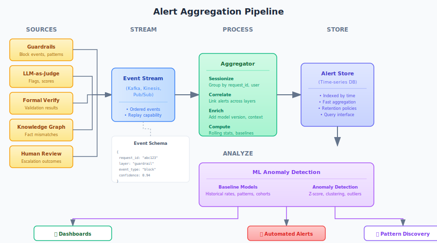

# Behavioral Anomaly Detection

**Aggregating safety signals to detect when agent behavior drifts from normal.**

---

## The Opportunity

Every safety layer generates signals:

| Layer | Signal Type | What It Catches |
|-------|-------------|-----------------|
| Guardrails | Block events | Known-bad patterns |
| LLM-as-Judge | Flag events | Policy violations, quality issues |
| Formal Verification | Validation failures | Rule non-compliance |
| Knowledge Graph | Fact mismatches | Factual errors |
| Token Detection | Uncertainty scores | Low-confidence claims |
| Self-Consistency | Disagreement scores | Unstable responses |
| Human Review | Escalation outcomes | Edge cases, false positives |

Individually, each signal catches specific problems. **Aggregated, they reveal behavioral patterns invisible to any single layer.**

---

## What Aggregation Enables

### 1. Drift Detection

Normal behavior establishes a baseline. Deviation indicates something changed:

- **Model drift**: New model version produces more guardrail blocks
- **Attack campaigns**: Spike in similar prompt injection attempts
- **Topic sensitivity**: Certain subjects trigger disproportionate failures
- **User anomalies**: Single user probing system boundaries

```
Week 1: 0.3% of requests flagged
Week 2: 0.3% of requests flagged
Week 3: 0.8% of requests flagged  ← Something changed
```

### 2. Correlated Failure Discovery

When multiple layers flag the same request, it's more significant than any single flag:

```
Request X:
  - Guardrail: PASS (no pattern match)
  - Judge: FLAG (inappropriate tone)
  - Formal Verify: FAIL (policy violation)
  - Human Review: BLOCK
  
Pattern: Formal + Human correlation = guardrails need updating
```

### 3. Unknown Attack Vector Identification

Adversaries probe for gaps. Aggregated signals reveal probing patterns before they succeed:

```
User Y (last 24 hours):
  - 47 requests with unusual token patterns
  - 12 guardrail near-misses (passed but close to threshold)
  - 3 judge flags for "boundary testing" language
  - Zero blocks

Assessment: Potential adversarial probing — add to watchlist
```

### 4. Effectiveness Measurement

Which layers catch what? Where are the gaps?

```
Last 30 days:
  - 1,247 total blocks/flags
  - 892 caught by guardrails alone (72%)
  - 234 caught by judge after guardrail pass (19%)
  - 89 caught by formal verification (7%)
  - 32 caught only by human review (2%)

Insight: 28% of issues pass guardrails — judge layer is load-bearing
```

---

## Architecture


### Signal Collection

Every safety layer emits structured events:

```json
{
  "timestamp": "2024-01-15T14:32:01Z",
  "request_id": "req_abc123",
  "session_id": "sess_xyz789",
  "user_id": "user_456",
  "model_version": "gpt-4-0125",
  "layer": "guardrail",
  "event_type": "block",
  "category": "prompt_injection",
  "confidence": 0.94,
  "input_hash": "a1b2c3...",
  "metadata": {
    "pattern_matched": "ignore_previous",
    "input_length": 1247
  }
}
```

### Aggregation Pipeline



### ML Anomaly Detection

**Baseline modeling**:
- Historical alert rates by category, user segment, time of day
- Normal distribution of confidence scores
- Typical failure correlation patterns

**Anomaly signals**:
- Volume anomalies: Alert rate exceeds X standard deviations
- Pattern anomalies: New failure signature not seen before
- Correlation anomalies: Layers that don't usually correlate suddenly do
- User anomalies: Individual behavior deviates from cohort
- Temporal anomalies: Unusual time-of-day patterns

**Example detections**:

| Anomaly Type | Signal | Possible Cause |
|--------------|--------|----------------|
| Volume spike | 3x guardrail blocks in 1 hour | Coordinated attack, viral jailbreak |
| New pattern | Unknown prompt structure triggering judge | Novel attack vector |
| Correlation shift | KG failures now correlate with judge flags | Model hallucinating in new domain |
| User outlier | One user generating 40% of flags | Adversarial probing |
| Temporal | 4am spike in high-risk requests | Bot activity, different timezone attackers |

---

## Implementation Levels

### Level 1: Centralized Logging
- Collect all safety events in one place
- Basic dashboards and queries
- Manual review of patterns
- **Effort**: Low | **Value**: Foundation

### Level 2: Automated Alerting
- Threshold-based alerts (>X blocks/hour)
- Category-specific monitoring
- On-call integration
- **Effort**: Medium | **Value**: Reactive detection

### Level 3: Statistical Anomaly Detection
- Baseline modeling with moving averages
- Z-score based anomaly flagging
- Seasonal adjustment (time of day, day of week)
- **Effort**: Medium | **Value**: Proactive detection

### Level 4: ML-Based Pattern Discovery
- Unsupervised clustering of failure patterns
- User behavior modeling
- Cross-layer correlation analysis
- Emerging attack signature detection
- **Effort**: High | **Value**: Unknown-unknown discovery

---

## What to Track

### Request-Level Metrics
- Pass/block/flag rates by layer
- Confidence score distributions
- Latency impact of safety checks
- False positive rates (from human review)

### Session-Level Metrics
- Flags per session
- Escalation patterns within session
- Session termination reasons

### User-Level Metrics
- Flag rate compared to cohort
- Category distribution of flags
- Behavioral trajectory over time

### Model-Level Metrics
- Performance by model version
- Drift between versions
- Category-specific accuracy

### System-Level Metrics
- Overall safety layer effectiveness
- Coverage gaps (what passes all checks but fails human review)
- Alert-to-incident conversion rate

---

## Integration with Existing Observability

This isn't a separate system — it's an extension of standard observability:

| Traditional Observability | AI Behavioral Monitoring |
|---------------------------|--------------------------|
| Error rates | Flag rates |
| Latency percentiles | Confidence score percentiles |
| Request tracing | Safety decision tracing |
| Anomaly detection on metrics | Anomaly detection on behaviors |
| Alerting on thresholds | Alerting on behavioral drift |

**Platforms already doing this**:
- Datadog LLM Observability
- Arize AI
- WhyLabs
- Galileo
- Langfuse
- Weights & Biases

The difference is framing: not just "is the model performing well?" but "is the model behaving safely?"

---

## Privacy and Compliance Considerations

Aggregating safety signals creates a detailed behavioral record. Consider:

- **Data retention**: How long to keep alert data?
- **PII in alerts**: Scrub or hash user identifiers?
- **Access control**: Who can query behavioral patterns?
- **Audit logging**: Track who accessed what analysis?
- **Cross-user analysis**: Legal basis for cohort comparisons?

The same data that enables security enables surveillance. Design constraints upfront.

---

## Connection to Risk Tiers

Monitoring depth should match risk:

| Tier | Monitoring Level | Anomaly Detection |
|------|------------------|-------------------|
| **Tier 1** (Minimal) | Basic logging | Threshold alerts |
| **Tier 2** (Moderate) | Aggregated dashboards | Statistical baselines |
| **Tier 3** (Significant) | Real-time monitoring | ML anomaly detection |
| **Tier 4** (Critical) | Full behavioral analysis | Continuous ML + human review |

---

## Key Takeaways

1. **Individual safety layers are necessary but not sufficient** — aggregation reveals patterns invisible to any single layer

2. **Behavioral baselines enable drift detection** — you can't detect anomalies without knowing what's normal

3. **Correlated failures are more significant** — when multiple independent layers flag the same thing, pay attention

4. **ML finds unknown-unknowns** — clustering and anomaly detection surface attack patterns you didn't anticipate

5. **This is observability, not a new system** — extend existing monitoring to include behavioral signals

The question isn't just "did we catch the bad request?" It's "is the agent behaving the way we expect, across all the requests we can see?"

---

## Related

- [The Verification Gap](./the-verification-gap.md) — Why independent verification matters
- [Judge Detects, Not Decides](./judge-detects-not-decides.md) — Async evaluation for pattern analysis
- [Current Solutions Reference](../extensions/technical/current-solutions.md) — Platforms implementing this
---

*AI Runtime Behaviour Security, 2026 (Jonathan Gill).*
