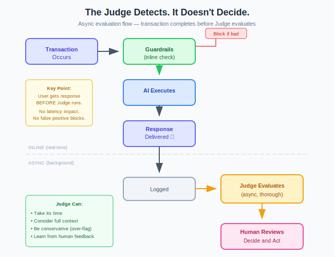

# The Judge Detects. It Doesn't Decide.

*Why using LLMs to block transactions is a mistake*

---

When teams discover that guardrails miss things, the instinct is to add another AI layer that can catch what rules-based systems can't. An LLM that evaluates every transaction. If it spots a problem, block it.

This is a mistake. A well-intentioned, logical mistake — but a mistake.

---

## The Appeal of Active Blocking

The reasoning makes sense on the surface:

1. Guardrails catch known patterns
2. LLMs can understand context and nuance
3. Therefore, an LLM should evaluate and block suspicious transactions

It's the same logic that drives spam filters, fraud detection, and content moderation. Add intelligence. Catch more. Block faster.

But AI-evaluating-AI is different. Here's why.

---

## Three Reasons the Judge Shouldn't Block

### 1. Latency Kills

LLM evaluation takes time. Even fast models need hundreds of milliseconds. Complex evaluation with reasoning? Seconds.

Add that to every customer interaction and you've destroyed the experience. Chatbots feel sluggish. APIs miss SLAs. Users leave.

Guardrails work because they're fast — pattern matching in single-digit milliseconds. The Judge is valuable precisely because it's thorough. Thoroughness and speed are opposing forces.

### 2. False Positives Create Harm

The Judge will be wrong. Not often, maybe, but sometimes. It will flag a legitimate transaction as suspicious.

If the Judge only detects, a false positive means a human reviews something that didn't need review. Annoying, but contained.

If the Judge blocks, a false positive means a customer can't complete a transaction. A patient doesn't get information. A user is locked out. Support tickets pile up. Lawyers get involved.

The failure modes are asymmetric. Detection failures waste internal time. Blocking failures harm customers.

### 3. Accountability Requires Humans

GDPR Article 22 grants individuals the right not to be subject to decisions based solely on automated processing that produce legal or significant effects.

An AI that blocks a transaction is making an automated decision. The customer can't proceed because an algorithm said no.

An AI that flags a transaction for human review is providing information. A human looks at the flag. The human decides. The human is accountable.

This isn't a technicality. It's the difference between defensible governance and regulatory exposure.

---

## The Right Pattern

The Judge operates **after the fact**, reviewing what has already happened:

The transaction completes before the Judge evaluates. The Judge informs future action; it doesn't gate current action.

---

## What the Judge Does Well

Freed from real-time blocking, the Judge can:

- **Take its time.** Complex evaluation with chain-of-thought reasoning? No problem. The user isn't waiting.

- **Consider context.** Review the full conversation, not just one message. Look at patterns across sessions.

- **Be conservative.** Flag anything uncertain. Better to over-flag for human review than under-flag and miss something.

- **Learn from feedback.** When humans disagree with findings, use that to improve. The feedback loop only works if there's a human in it.

---

## Making Human Oversight Scalable

The Judge doesn't replace human oversight. It makes human oversight possible at scale.

Without the Judge, human review means sampling. Maybe 1% of transactions. Maybe less. You're hoping problems are common enough to appear in your sample.

With the Judge, human review is targeted. 100% of transactions evaluated; only anomalies surfaced for human attention. Humans focus on what matters.

**The Judge is a force multiplier, not a replacement.**

---

## The Bottom Line

If you're tempted to build an LLM that blocks transactions in real-time, resist. You'll add latency, harm customers, and create accountability gaps.

Instead, build a Judge that:
- Operates asynchronously
- Evaluates thoroughly
- Flags concerns
- Routes to humans

Then let humans decide.

The Judge detects. Humans decide. Keep it that way.
---

*AI Runtime Behaviour Security, 2026 (Jonathan Gill).*
