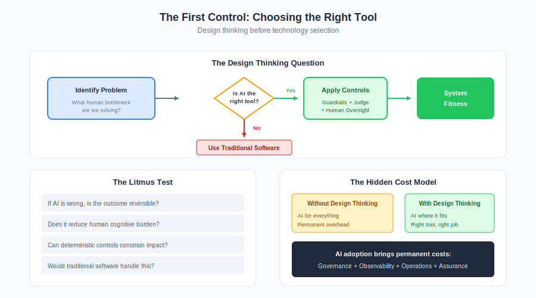

# The First Control: Choosing the Right Tool

> The most effective way to reduce AI risk is to not use AI where it doesn't belong.



Before guardrails, before judges, before human oversight — there's a more fundamental question:

**Is AI the right tool for this problem?**

This isn't anti-AI. It's design thinking. The goal is system fitness, not technology adoption.

---

## The Problem with "AI First"

Enterprise architects face real pressure to deploy AI meaningfully. The promise is compelling: faster decisions, smarter automation, better customer experience.

But architecture is not about promise. It's about **system behaviour over time**.

AI introduces probabilistic components into environments that were historically deterministic. That changes the cost structure, the operational model, and the failure modes in ways that are easy to underestimate.

When AI is introduced without design thinking, teams optimise for novelty rather than system fitness.

---

## The Design Thinking Question

Before any architecture work begins:

> "What human bottleneck or system limitation are we actually solving?"

If the answer is vague, AI is probably being used as a hammer in search of nails.

Design thinking asks architects to focus on:
- The real user problem
- The system context
- Constraints and tradeoffs
- Lifecycle behaviour
- Unintended consequences

AI should emerge as a solution to a well-understood problem — not as a starting point looking for application.

---

## The Architectural Shift

Traditional enterprise software offers:
- Predictable outputs
- Testable logic
- Bounded failure modes

AI systems introduce:
- Probabilistic reasoning
- Opaque decision paths
- Drift over time
- Confidence signals that may be misleading

This creates new classes of failure that cannot be eliminated — only designed around:
- Hallucinated content
- Inconsistent outputs
- Reasoning errors that pass superficial checks
- Unexpected tool behaviour in agentic flows

Every AI deployment permanently adds these failure modes to your system. The question is whether the value justifies it.

---

## The Hidden Cost Model

A common assumption: "We'll add review layers to keep AI safe."

This is directionally correct but incomplete. Review creates its own costs:

**Latency.** Human review queues introduce throughput bottlenecks, SLA pressure, and escalation complexity.

**Imperfection.** Reviewers miss edge cases, suffer fatigue, interpret inconsistently, and rely on AI explanations that may themselves be flawed.

**Downstream work.** When AI outputs slip through, remediation workflows activate — customer corrections, compliance follow-ups, analyst rework.

The system is no longer:

```
AI → result
```

It becomes:

```
AI → review → exception handling → remediation → audit
```

Each layer adds operational surface area. These costs rarely appear in initial ROI estimates.

---

## The Real Cost of AI

AI adoption brings persistent overhead that doesn't exist with deterministic systems:

| Category | Ongoing Cost |
|----------|--------------|
| **Governance** | Guardrails, evaluation pipelines, policy maintenance |
| **Observability** | Telemetry capture, drift detection, alert triage |
| **Operations** | Escalation workflows, rollback capability, review management |
| **Assurance** | Judge evaluation, human calibration, audit trail |

These aren't optional in regulated or safety-sensitive systems. They're the price of probabilistic components.

The correct architectural question:

> "Does the benefit justify permanent system complexity?"

---

## Where AI Genuinely Delivers Value

Design thinking identifies **human bottlenecks**, not technical opportunities.

AI works best when it:

### Compresses Cognitive Load

Fraud triage is a strong example. Analysts face dense, multi-source signals. AI summarises and contextualises. Deterministic engines still enforce rules.

Outcome: higher analyst throughput, reduced fatigue, consistent interpretation.

### Drafts Reversible Artefacts

Customer communications drafting reduces writing effort while humans retain authority for sensitive cases.

Errors are recoverable. Blast radius is controlled.

### Enhances Retrieval and Interpretation

AI acting as an intelligent index for documentation or logs saves time without executing irreversible actions.

The pattern: **AI augments human judgment on reversible decisions.**

---

## Where AI Is the Wrong Tool

AI is poorly suited for:

| Domain | Why AI Fails |
|--------|--------------|
| Direct financial authorisation | Requires deterministic guarantees |
| Compliance enforcement | Needs auditable, reproducible logic |
| Safety-critical automation | Probabilistic failure is unacceptable |
| Fully autonomous customer commitments | Irreversible with legal implications |

These domains require deterministic guarantees and auditable logic. Replacing them with probabilistic reasoning introduces fragility without proportional gain.

**The right answer is often: don't use AI here.**

---

## The Litmus Test

Before approving any AI use case:

| Question | If No... |
|----------|----------|
| If AI is wrong, is the outcome reversible? | Reconsider AI |
| Does it meaningfully reduce human cognitive burden? | Traditional software may suffice |
| Can deterministic controls constrain impact? | Risk may be unmanageable |
| Are review workflows sustainable at scale? | You're moving work, not eliminating it |
| Would traditional software handle this adequately? | Use traditional software |

If most answers are negative, AI adds complexity without net value.

---

## The Review Paradox

Architects should explicitly model:
- Review queue throughput
- Escalation latency
- Human error rates
- Exception handling cost

Otherwise, AI projects risk becoming:

> Automation that shifts work downstream instead of eliminating it.

Design thinking asks:
- Does this reduce total system effort or just move it?
- Are we creating hidden queues?
- What happens when volume spikes?

---

## The Architectural Boundary That Works

A reliable pattern:

> **AI proposes. Deterministic systems dispose.**

This ensures:
- Domain invariants remain authoritative
- Irreversible actions are validated externally
- Failures remain recoverable
- Auditability is preserved

Human oversight complements this model but should not be mistaken for absolute protection.

---

## Implications for This Framework

Everything in this Framework assumes you've already answered "yes" to the fundamental question: AI is the right tool for this problem.

If you haven't done that design work, no amount of guardrails, judges, or human oversight will make a bad architectural choice safe.

**The first control is choosing wisely.**

The controls, patterns, and examples that follow are for systems where AI genuinely improves outcomes. They're not a license to deploy AI everywhere — they're a framework for deploying AI well where it belongs.

---

## Key Takeaways

1. **AI is a design choice, not a default.** Apply design thinking before reaching for AI.

2. **Probabilistic systems have permanent costs.** Governance, observability, and review overhead don't go away.

3. **Reviews are mitigation, not certainty.** They reduce risk; they don't eliminate it.

4. **Downstream work is real.** Exception handling, remediation, and audit are part of the true cost.

5. **Traditional software is often better.** Deterministic systems are simpler, cheaper, and more auditable for many problems.

6. **The goal is system fitness, not AI adoption.** Use AI where it improves outcomes — and restraint where it doesn't.

---

## Related

- [Why Guardrails Aren't Enough](./why-guardrails-arent-enough.md) — The limits of inline controls
- [Humans Remain Accountable](./humans-remain-accountable.md) — Review workflow realities
- [Risk Tiers](../core/risk-tiers.md) — Determining appropriate control intensity
---

*AI Runtime Behaviour Security, 2026 (Jonathan Gill).*
