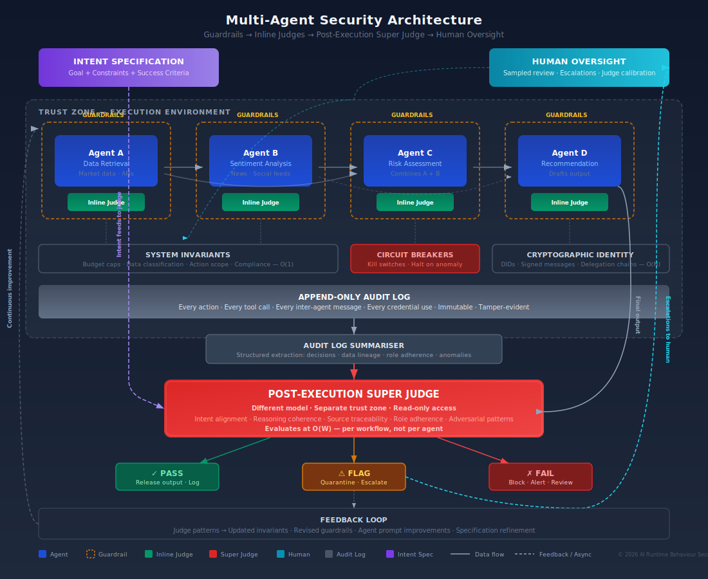
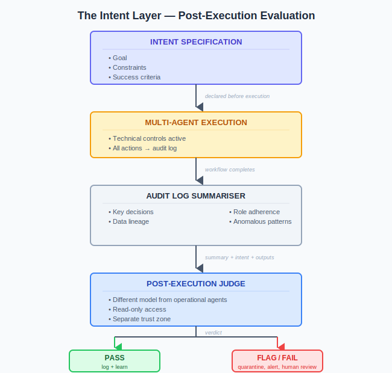

# The Intent Layer: Post-Execution Semantic Evaluation for Multi-Agent Systems

> The [technical controls that scale](what-scales.md) — invariants, identity, budget caps, trust zones — constrain *mechanics*. They govern what agents **can** do. They do not evaluate whether what was **done** was coherent, appropriate, or aligned with the stated objective. That is a semantic problem, and it requires a different kind of control.

---

## The Gap

Consider a multi-agent financial analysis workflow:

1. Agent A retrieves market data.
2. Agent B analyses sentiment from news sources.
3. Agent C combines both into a risk assessment.
4. Agent D drafts an investment recommendation.

Every agent operates within its trust zone. Every tool call is authenticated. No budget is exceeded. No data classification rule is violated. All invariants hold.

But Agent B hallucinated a sentiment trend. Agent C didn't notice because the hallucinated data was plausible. Agent D produced a confident recommendation based on fabricated analysis.

Every technical control passed. The outcome is wrong. No invariant was written to catch "the reasoning chain is incoherent" because that's not a mechanical property — it's a semantic one.

**This is the gap a post-execution LLM judge is designed to fill.**

---

## The Pattern: Declare → Execute → Evaluate

The architecture has three phases:

### Phase 1: Declare Intent

Before the multi-agent workflow executes, the orchestrator (or human initiator) **formally declares the intended outcome**.

This is not a vague objective. It is a structured specification:

- **Goal:** "Produce a risk assessment for portfolio X based on current market data and news sentiment, with a recommendation."
- **Constraints:** "Use only data from the last 30 days. Do not recommend actions exceeding $Y in exposure. Flag uncertainty above threshold Z."
- **Success criteria:** "The recommendation must be traceable to specific data points. Sentiment claims must cite sources. Risk scores must be internally consistent."

The research calls this an **Intent Specification (ISpec)** — a formal schema that encodes the deployer's intent including ethical rules, environmental limits, and performance objectives. The Verifiability-First Agents framework (Xu, Hu, and Lin, 2024) treats this as "the constitution of an agent" — every decision and tool call is compared against it.

**Why this matters:** Without a declared intent, a post-execution judge has no reference point. It can evaluate coherence and consistency, but it can't evaluate *correctness* because it doesn't know what "correct" was supposed to look like. The intent declaration gives the judge a target to compare against.

**Scaling property:** O(W) where W = number of workflows. One intent declaration per workflow, regardless of how many agents are involved.

### Phase 2: Execute with Technical Controls

The multi-agent workflow runs with the full stack of technical controls described in [What Scales](what-scales.md):

- System-level invariants enforced by Policy Decision Point
- Cryptographic identity and signed messages
- Trust zone boundaries
- Budget/economic constraints
- Circuit breakers armed
- **All interactions logged to append-only audit**

The audit log is the critical link. It captures every agent action, tool call, inter-agent message, credential use, and state change. This becomes the evidence base for post-execution evaluation.

### Phase 3: Post-Execution Semantic Evaluation

After the workflow completes (or after a defined phase), an LLM judge receives:

**Inputs:**
1. The declared Intent Specification
2. A structured summary of the audit log (not the raw log — more on this below)
3. The final output(s) of the workflow
4. Any intermediate outputs flagged during execution

**The judge evaluates:**

| Question | What It Catches |
| --- | --- |
| **Does the output satisfy the declared intent?** | Goal drift, scope creep, task failure |
| **Is the reasoning chain internally consistent?** | Hallucination in intermediate steps, contradictory analysis |
| **Are factual claims traceable to cited sources?** | Fabricated data, unsupported assertions |
| **Did any agent's contribution diverge from its assigned role?** | Role confusion, goal hijack, scope violation |
| **Are there patterns suggesting adversarial manipulation?** | Coordinated drift, planted instructions, gradual goal shift |
| **Does the output contain content that violates policy constraints?** | Content the per-agent guardrails missed because it only becomes problematic in aggregate |

**Scaling property:** O(W) — one evaluation per workflow completion, not per agent or per message. The judge sees the *outcome and the path*, not every individual step.

---

## Why This Works Where Inline Judging Doesn't

The per-agent LLM-as-Judge in the original three-layer pattern fails at multi-agent scale because:

| Problem | Inline Judge | Post-Execution Judge |
| --- | --- | --- |
| **Latency** | Adds 500ms-5s per agent hop. Multiplicative. | Async. Zero impact on execution pipeline. |
| **Context** | Sees one agent's output in isolation. Cannot detect cross-agent incoherence. | Sees the entire workflow: intent, path, and outcome together. |
| **Cost** | One judge evaluation per agent output. Scales O(N). | One judge evaluation per workflow. Scales O(W). |
| **Combinatorial interactions** | Would need to evaluate every agent-pair interaction. O(N²). | Evaluates the aggregate result. O(1) per workflow. |
| **Emergent behavior** | Cannot detect system-level patterns from individual outputs. | Can detect patterns that only become visible when the full workflow is examined. |

---

## The Practical Architecture

### Critical Design Decisions

**1. The judge must be a different model from the operational agents.**

If the same model runs the agents and judges the agents, you have a system evaluating its own output — exactly the self-validation gap that Gödel's incompleteness theorems warn about. The SagaLLM research (VLDB 2025) explicitly identifies this: "LLMs inherently lack robust self-validation mechanisms." Use a different model, ideally from a different provider, for the judge. This also provides resilience against model-specific failure modes and adversarial attacks tuned to one model's weaknesses.

**2. The judge operates in a separate trust zone with read-only access.**

The judge must not be able to influence the agents it evaluates. It reads the audit log and outputs. It writes a verdict. It cannot modify agent behavior, tool access, or data. This prevents the judge from being co-opted into the operational chain and becoming a target for manipulation.

**3. Audit log summarisation is essential — you cannot feed raw logs into a context window.**

A complex multi-agent workflow might generate hundreds of thousands of tokens of interaction. No current LLM can process this in a single evaluation. The audit log summariser is a separate component that extracts structured information:

- Decision points and the data that informed them
- Data lineage (where did each factual claim originate?)
- Role adherence (did each agent stay within its scope?)
- Anomalous patterns (unusual tool calls, unexpected data access, timing anomalies)

This summarisation is itself a potential failure point — if the summariser misses critical information, the judge can't evaluate it. The summariser should be deterministic where possible (structured extraction from typed log entries) and LLM-assisted only for unstructured content.

**4. Post-phase, not just post-execution.**

For long-running or high-risk workflows, waiting until full completion may be too late. The pattern adapts to **checkpoint evaluation** — the judge evaluates after each major phase:

| Phase | Judge Evaluates |
| --- | --- |
| Data retrieval complete | Are the sources legitimate? Is the data coverage sufficient for the stated intent? |
| Analysis complete | Is the analysis internally consistent? Are claims traceable to retrieved data? |
| Recommendation drafted | Does the recommendation follow from the analysis? Does it satisfy the intent constraints? |

This is O(P) where P = number of phases. Still dramatically cheaper than per-agent evaluation, and it catches problems before they propagate to later phases.

**5. The feedback loop matters more than the verdict.**

The judge's greatest value is not the pass/fail decision on a single workflow. It is the **pattern detection across many workflows**:

- If the judge repeatedly flags Agent B's sentiment analysis as inconsistent, that signals a systemic problem with Agent B, not a one-off error.
- If the judge detects that a particular data source frequently produces claims that don't survive scrutiny, that source should be deprioritised or removed.
- If the judge finds that certain intent specifications are too vague to evaluate against, the specification template needs improvement.

This feedback loop converts post-execution evaluation from a detective control into a **continuous improvement mechanism**. The patterns the judge detects become new invariant rules, updated guardrail configurations, or revised agent prompts. The system gets measurably better over time.

---

## What This Does Not Solve

Intellectual honesty requires mapping the limits:

**1. Prevention.**

By definition, post-execution evaluation is detective, not preventive. The harm has occurred. The output exists. If Agent D sent a recommendation to a client before the judge evaluated it, the judge's "fail" verdict arrives too late.

**Mitigation:** For high-risk workflows, the output is **quarantined** — held in a staging state until the judge clears it. This converts post-execution evaluation into a gate. The cost is latency (the judge evaluation adds time before the output reaches its destination), but for consequential decisions, this is acceptable.

**2. The judge can be wrong.**

The judge is itself an LLM. It can hallucinate. It can miss subtle misalignment. It can be manipulated through adversarial content in the audit log. Research confirms this: "simple, universal triggers can inflate judge scores, highlighting the fragility of naive evaluation" (Raina et al., 2024).

**Mitigation:** Multiple judge models with consensus requirements. If two independent judges (different models, different providers) both flag the same output, confidence is high. If they disagree, the output goes to human review. This is more expensive but substantially more robust.

**3. Intent is hard to specify for complex workflows.**

"Produce a good risk assessment" is not an evaluable intent. The success criteria must be specific, measurable, and complete. For novel or exploratory workflows, the intent specification may not capture all dimensions that matter.

**Mitigation:** Start with narrow, well-defined workflows where intent can be precisely specified. Expand the specification template based on judge feedback (what kinds of failures did the judge catch that the specification didn't anticipate?). Accept that for genuinely open-ended tasks, the intent specification will always be incomplete.

**4. Context window limits constrain the depth of evaluation.**

Even with summarisation, very large workflows may lose critical detail in the compression from raw log to structured summary. A subtle hallucination in step 47 of a 200-step workflow may not survive summarisation.

**Mitigation:** Hierarchical summarisation — each phase produces its own summary, and the judge evaluates both phase-level summaries and the workflow-level aggregate. Critical decisions (high-value transactions, access to sensitive data, irreversible actions) are flagged in the summary regardless of compression.

**5. Quis custodiet ipsos custodes — who judges the judge?**

If the judge produces incorrect verdicts (false positives or false negatives), the system either rejects good work or accepts bad work. Over time, either outcome erodes trust.

**Mitigation:** Sampled human review of judge verdicts. Not every verdict — that defeats the scaling purpose — but a statistically significant sample. If the human reviewers disagree with the judge more than X% of the time, the judge's configuration (model, prompt, evaluation criteria) needs revision. This is exactly how audit functions work in financial services: not every transaction is reviewed, but a sample is, and the sample rate increases when anomalies are detected.

---

## Where This Sits in the Framework

The post-execution judge is not a replacement for the three-layer pattern. It is a **fourth layer** that operates at a different level of abstraction:

| Layer | Scope | Timing | What It Catches |
| --- | --- | --- | --- |
| **Guardrails** | Per-agent input/output | Real-time | Known-bad content |
| **Technical controls** | System-level mechanics | Real-time | Mechanical violations (access, budget, scope) |
| **Post-execution judge** | Workflow-level intent | Async, post-phase or post-execution | Semantic misalignment, incoherent reasoning, emergent failures |
| **Human oversight** | Sampled review + escalations | As needed | Judge calibration, novel failures, ambiguous cases |

The guardrails catch what's obviously wrong. The technical controls prevent what's mechanically forbidden. The post-execution judge evaluates whether what was done *made sense and matched the objective*. Humans review samples and handle what the automated layers can't.

This is a layered assurance model. Each layer catches what the layers below miss. The total system coverage is greater than any layer alone.

---

## Scaling Assessment

| Property | Growth Rate | Assessment |
| --- | --- | --- |
| Intent declaration | O(W) — per workflow | Scales |
| Audit log storage | O(N) — per agent message, cheap | Scales |
| Log summarisation | O(W) — per workflow, automatable | Scales |
| Judge evaluation | O(W) or O(P) — per workflow or phase | Scales |
| Multi-model consensus | O(W) × number of judge models (2-3) | Scales (small constant multiplier) |
| Sampled human review | O(sample rate × W) — tunable | Scales if sample rate is managed |
| Feedback to invariants | O(patterns detected) — improves over time | Scales and compounds |

Everything is proportional to workflows (W) or phases (P), not to agent count (N) or agent interactions (N²). **This is the pattern's core scaling advantage.**

---

## Real-World Analogues

This pattern is not novel. It maps directly to established control frameworks:

| Domain | Equivalent |
| --- | --- |
| **Financial services** | Post-trade compliance monitoring. Trades execute, then compliance reviews for market manipulation, wash trading, and regulatory violations. |
| **Aviation** | Flight data recorder analysis. The flight completes, then the recorded data is analysed for anomalies, near-misses, and procedure deviations. |
| **Audit/Accounting** | Financial audit. Transactions occur throughout the year, then auditors evaluate whether the aggregate financial statements are materially correct. |
| **Software engineering** | Post-deployment monitoring + post-incident review. The code runs in production, then observability systems detect anomalies and post-mortems extract lessons. |
| **Clinical trials** | Data Safety Monitoring Board. The trial runs, then an independent board evaluates whether the aggregate results indicate harm, benefit, or futility. |

In every case, the pattern is the same: **declare intent → execute with controls → evaluate outcomes independently → feed findings back into the system**.

---

## Implementation Path

For organisations adopting this pattern:

**1. Start with the audit log.** If you're not logging every agent action, tool call, and inter-agent message, you have nothing for the judge to evaluate. This is prerequisite infrastructure. (See [What Scales](what-scales.md) — audit logs are O(N), cheap, and immediately useful.)

**2. Define intent specifications for your highest-risk workflows first.** Don't try to specify intent for every workflow. Start with the ones where a wrong answer causes material harm — financial recommendations, medical analysis, legal document generation, customer-facing decisions.

**3. Deploy a single judge model evaluating completed workflows.** Don't over-engineer the first iteration. One judge model, evaluating against the intent specification, producing a pass/flag/fail verdict with reasoning. Measure false positive and false negative rates against human review of a sample.

**4. Add multi-model consensus for high-risk workflows.** Once the single-judge baseline is established, add a second model for workflows where the cost of a false negative is high.

**5. Close the feedback loop.** The judge's findings should flow into three destinations: (a) immediate quarantine/release decisions for the current workflow, (b) invariant rule updates for the technical control layer, (c) agent configuration improvements (prompt revisions, tool scope changes, role clarifications).

**6. Instrument and measure.** Track: judge agreement with human reviewers, false positive/negative rates, mean time from execution to verdict, percentage of workflows flagged, and — critically — whether the feedback loop is reducing the flag rate over time. If the flag rate isn't declining, either the system isn't improving or the workflows are getting harder.

---

## Sources

| Source | Relevance |
| --- | --- |
| Xu, Hu, and Lin (2024). Verifiability-First Agents: Intent Specifications and Audit Agents | ISpec framework, lightweight audit agents, provenance logging |
| SagaLLM (VLDB 2025). Context Management, Validation, and Transaction Guarantees for Multi-Agent LLM Planning | Self-validation gap, compensation mechanisms, dependency tracking |
| Raina et al. (2024). Adversarial robustness of LLM judges | Universal triggers inflating judge scores — fragility of naive evaluation |
| Xia et al. (2025). Evaluation-Driven Development of LLM Agents | Reference architecture for embedding evaluation into agent lifecycle |
| Multi-Agent Models of Organizational Intelligence (2025) | Critic-based architecture with veto authority, 92.1% success rate, ~8% irreducible human floor |
| [OWASP Top 10 for Agentic Applications (Dec 2025)](https://genai.owasp.org/resource/owasp-top-10-for-agentic-applications-for-2026/) | ASI01 (Goal Hijack), ASI08 (Cascading Failures) — the threat categories this pattern addresses |

---

## The Honest Position

The post-execution LLM judge adds the **semantic layer** that technical controls lack. It evaluates intent, coherence, and appropriateness — properties that invariants, identity, and budget caps cannot assess.

It scales because it operates at the workflow level (O(W)), not the agent level (O(N)) or interaction level (O(N²)).

It is not a silver bullet. It is detective, not preventive. The judge can be wrong. Intent is hard to specify. Context windows constrain depth.

But combined with the technical controls that handle mechanics, it provides a **complete control stack**: mechanical constraints prevent what's forbidden, semantic evaluation catches what's incoherent, and sampled human review calibrates both.

That is as close to a scalable multi-agent security architecture as the current state of the art supports.

---

*AI Runtime Behaviour Security, 2026 (Jonathan Gill).*
