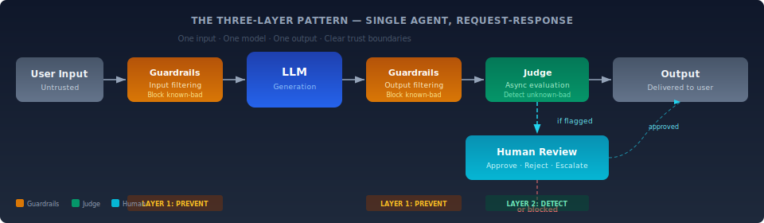

# When the Pattern Breaks: Scaling Limits of Guardrails → Judge → Human

> This framework's three-layer pattern (guardrails prevent, judge detects, humans decide) was designed for **single-agent, request-response architectures**. This document is honest about where that pattern holds, where it strains, and where it breaks in complex multi-agent systems.

---

## The Architecture Assumption

The three-layer pattern assumes a simple topology:

One input. One model. One output. Clear trust boundaries. The guardrails know what "input" and "output" mean. The judge evaluates a single response. The human reviews a discrete decision.

This works. The data confirms it (see [What's Working](/insights/what-works.md)).

The question is what happens when the topology changes.

---

## Scaling Stages: Where It Holds, Strains, and Breaks

### Stage 1: Single Agent, Single Model — Pattern Holds

**Topology:** User → Agent → Tools → Response

This is the architecture the framework was built for. RAG pipelines, document Q&A, customer service chatbots, code generation assistants.

**Why it works:**
- Trust boundaries are clear: user input is untrusted, system prompt is trusted, output is validated.
- Guardrails inspect a known input/output surface.
- The judge evaluates a single, bounded response.
- Human review is feasible — the decision volume is proportional to user interactions.

**Observed incidents at this stage:** Prompt injection, hallucination, data leakage. The framework's controls address these directly.

### Stage 2: Single Agent, Multiple Tools/Models — Pattern Adapts

**Topology:** User → Agent → [Tool A, Tool B, Model X, Model Y] → Response

An agent that calls different models for different subtasks (e.g., one model for classification, another for generation), or uses tools (web search, database queries, code execution).

**Where it strains:**
- **Tool-call chains introduce indirect prompt injection surfaces.** A web search result or database record can contain instructions that the agent's model interprets as commands. The guardrails on user input don't inspect tool outputs.
- **Model heterogeneity means inconsistent behavior.** A guardrail tuned for GPT-4's output patterns may not catch Mistral's failure modes.

**Adaptation required:** Guardrails at every trust boundary — not just input/output, but between agent and each tool. AWS's Agentic AI Security Scoping Matrix calls this "Scope 2: Prescribed Agency" — tools are available, but human approval gates critical actions.

**This is achievable within the existing pattern,** but the number of guardrail instances multiplies with the number of tools.

### Stage 3: Multi-Agent Orchestration — Pattern Strains Significantly

**Topology:** User → Orchestrator Agent → [Agent A, Agent B, Agent C] → Aggregated Response

A planner/orchestrator delegates subtasks to specialist agents. Common in document processing pipelines, multi-step research, financial analysis workflows.

**Where it strains hard:**

**1. Trust boundary collapse.** Agent A's output becomes Agent B's input. In the single-agent model, "system prompt" and "user input" are distinct. In multi-agent systems, this boundary dissolves. An instruction embedded in Agent A's output can hijack Agent B's behavior. The OWASP Agentic Top 10 calls this **ASI07: Insecure Inter-Agent Communication** — and it has already caused real incidents. Palo Alto Unit 42 demonstrated "Agent Session Smuggling" in the A2A protocol (November 2025), where a malicious agent exploited built-in trust relationships to manipulate victim agents across entire sessions.

**2. Combinatorial interaction surfaces.** With N agents, you have up to N² communication channels. Each channel needs guardrails. At N=3, this is 6 channels — manageable. At N=10, it's 90. At N=20, it's 380. Guardrail deployment doesn't scale linearly with agent count; it scales quadratically.

**3. The judge can't see the whole picture.** Each agent produces output that looks reasonable in isolation. The judge evaluating Agent B's response doesn't have the full context of Agent A's reasoning chain that influenced it. A hallucinating planner can issue instructions to downstream agents that individually pass guardrail checks but collectively produce a harmful outcome. OWASP identifies this as **ASI08: Cascading Failures** — "a small error in one agent can propagate across planning, execution, memory, and downstream systems."

**4. Latency budget exhaustion.** Guardrails at ~10ms per hop. In a 5-agent chain with guardrails at each boundary, you add 50-100ms minimum to every interaction. Add judge evaluation at 500ms-5s per agent, and the total pipeline latency becomes prohibitive for real-time applications. You're forced to choose: fewer guardrails (more risk) or slower responses (less utility).

**5. Human review volume exceeds capacity.** If each agent flags 5% of interactions for human review, a 5-agent pipeline flags approximately 23% of all transactions (1 - 0.95⁵). At enterprise scale, this overwhelms human reviewers. The "humans decide" layer becomes a bottleneck, and pressure to reduce human review creates the exact gap the pattern was designed to fill.

### Stage 4: Autonomous Multi-Agent Systems — Pattern Breaks

**Topology:** Agent A ↔ Agent B ↔ Agent C ↔ External Agents ↔ Tools ↔ Memory

Agents communicate peer-to-peer, maintain persistent memory, dynamically discover and invoke tools, delegate tasks to other agents (including external ones), and operate with minimal or no human oversight per transaction.

**This is where the three-layer pattern fundamentally breaks.** Here's why:

**1. There is no clear "input" or "output" to guard.**

In a peer-to-peer multi-agent system, communication is continuous and bidirectional. Guardrails are designed for request-response pairs. When Agent A and Agent B are in a multi-turn conversation, each message is simultaneously an "output" from one agent and an "input" to another. Where do you put the guardrail? On every message? The performance cost is prohibitive. On selected messages? You're guessing which ones matter.

**2. Emergent behavior is not detectable at the individual agent level.**

Even if every individual agent operates within its guardrails, the *collective* behavior of the system can produce outcomes that no individual guardrail was designed to catch. This is a systems property, not an agent property. A judge evaluating individual agent outputs will miss it. You need system-level behavioral monitoring — a fundamentally different architecture than the per-agent judge model.

The OWASP Agentic Top 10 documents this in multiple categories:
- **ASI01: Agent Goal Hijack** — an agent's objectives are redirected through manipulated instructions that cascade through the multi-agent graph.
- **ASI06: Memory & Context Poisoning** — persistent memory means a single poisoned interaction can reshape agent behavior long after the initial attack (documented in the Gemini Memory Attack).
- **ASI10: Rogue Agents** — agents that deviate from intended behavior, act deceptively, or seize control of trusted workflows. OWASP explicitly notes this "isn't something traditional rule-based security measures can cover."

**3. Identity and privilege become unmanageable.**

In a multi-agent system, agents inherit and delegate credentials. Agent A runs with user-level permissions, delegates a subtask to Agent B, which invokes Tool C using Agent A's credentials. The trust chain becomes: User → Agent A → Agent B → Tool C. A compromised Agent B can now act with Agent A's (and potentially the user's) full permissions. OWASP calls this **ASI03: Identity & Privilege Abuse** — "exploiting the trust and delegation in agents to escalate access and bypass controls." Three of the OWASP Agentic Top 4 risks are identity-related.

Traditional RBAC doesn't work when agents dynamically request new permissions, spin up by the hundreds, and maintain ephemeral identities. As Obsidian Security notes: "AI agents routinely hold 10x more privileges than required, and 90% of agents are over-permissioned."

**4. The human oversight layer is structurally insufficient.**

At Stage 4, the system operates at machine speed across potentially thousands of agent interactions per second. Human review of edge cases is not just a bottleneck — it's architecturally incompatible. The OWASP Agentic Top 10 introduces **ASI09: Human-Agent Trust Exploitation** as a distinct risk: "confident, polished explanations misled human operators into approving harmful actions." The humans-in-the-loop aren't just too slow; they're actively being manipulated by the agents they're supposed to oversee.

---

## What Replaces the Pattern at Scale?

The three-layer pattern doesn't need to be abandoned. It needs to be **augmented** for multi-agent architectures. The emerging consensus (from OWASP, AWS, and production deployments) points to several new architectural primitives:

### 1. System-Level Invariant Monitoring

Instead of evaluating individual agent outputs (judge per agent), define **system-level invariants** — properties that must remain true regardless of which agents are involved:

- No agent may access data outside its designated scope.
- Total financial exposure across all agents must not exceed $X per time window.
- No agent may create or modify credentials.
- All tool calls must be logged with complete provenance.

Monitor these invariants continuously at the system level, not the agent level. This is analogous to how distributed systems use health checks and circuit breakers rather than testing each microservice in isolation.

### 2. Trust Zones and Isolation Boundaries

OWASP recommends defining **trust zones** with constrained scopes and tightly controlled inter-zone communication. Each trust zone contains agents that are permitted to interact freely. Communication *between* zones requires explicit validation, credential exchange, and logging.

This maps to how network security works (VLANs, firewalls, zero-trust segments) and is architecturally familiar to enterprise security teams.

### 3. Least Agency (Not Just Least Privilege)

OWASP's 2026 Agentic Top 10 introduces the principle of **least agency**: only grant agents the minimum autonomy required to perform safe, bounded tasks. This is more than least privilege (which controls *access*) — it controls *action scope* (what an agent can *do*, not just what it can *see*).

In practice: don't give a code review agent the ability to execute code. Don't give a document analysis agent the ability to send emails. Scope the agent's *capabilities*, not just its permissions.

### 4. Watchdog Agents and Mutual Verification

Deploy dedicated monitoring agents whose sole purpose is to validate the outputs and behaviors of operational agents. OWASP recommends "watchdog/monitoring agents to validate peer outputs and spot collusion or abnormal exfiltration."

This is the judge pattern elevated to the system level — but with important differences:
- Watchdog agents operate in a *different trust zone* from the agents they monitor.
- They have *read-only access* to agent communications and state.
- They can trigger **circuit breakers** — kill switches that halt an agent or workflow when invariants are violated.

### 5. Kill Switches and Containment

Every agentic system needs a physically isolated, non-negotiable mechanism to halt agent execution. This is not optional. The OWASP Agentic Top 10 calls for "kill switches as a non-negotiable, auditable, and physically isolated mechanism." The Amazon Q incident (CVE-2025-8217) demonstrated what happens without one: a compromised VS Code extension with `--trust-all-tools --no-interactive` flags could execute destructive commands affecting nearly a million developers.

---

## Honest Summary: Where This Framework Applies

| System Complexity | Pattern Status | What's Needed |
| --- | --- | --- |
| Single agent, single model | **Holds** | This framework as-is |
| Single agent, multiple tools/models | **Holds with adaptation** | Guardrails at every tool boundary |
| Multi-agent orchestration (3-10 agents) | **Strains significantly** | System-level invariants, trust zones, enhanced judge |
| Autonomous multi-agent (10+ agents, peer-to-peer) | **Breaks** | New architectural primitives: least agency, watchdog agents, kill switches, identity orchestration |
| External agent federation (agents across org boundaries) | **Not addressed** | Open research problem. No production-proven pattern exists. |

This framework remains valid for Stage 1 and Stage 2 systems, which represent the vast majority of enterprise AI deployments today. For Stage 3+, it provides a foundation that must be augmented with the architectural patterns described above.

The OWASP Agentic Top 10, AWS's Agentic AI Security Scoping Matrix, and emerging production experience from early agentic adopters are collectively building the next layer of guidance. This framework will incorporate that guidance as it matures from theory to observed practice.

---

## Sources

| Source | Relevance |
| --- | --- |
| [OWASP Top 10 for Agentic Applications (2026)](https://genai.owasp.org/resource/owasp-top-10-for-agentic-applications-for-2026/) | Definitive taxonomy of agentic AI risks, 100+ expert contributors |
| [AWS Agentic AI Security Scoping Matrix](https://aws.amazon.com/blogs/security/the-agentic-ai-security-scoping-matrix-a-framework-for-securing-autonomous-ai-systems/) | Four-scope maturity model for agentic security |
| [OWASP Agentic Threats & Mitigations (Feb 2025)](https://hal.science/hal-04985337v1/file/Agentic-AI-Threats-and-Mitigations_v1.0.1.pdf) | First comprehensive agentic threat taxonomy |
| [Palo Alto Unit 42: Agent Session Smuggling (Nov 2025)](https://labs.lares.com/owasp-agentic-top-10/) | A2A protocol trust exploitation demonstrated |
| [Amazon Q CVE-2025-8217 (July 2025)](https://labs.lares.com/owasp-agentic-top-10/) | Compromised agent extension with destructive capability |
| [KPMG AI Pulse Q4 2025](https://kpmg.com/us/en/media/news/q4-ai-pulse.html) | 80% of leaders cite cybersecurity as top barrier to agentic AI; 65% cite system complexity |
| [Obsidian Security: 2025 AI Agent Landscape](https://www.obsidiansecurity.com/blog/ai-agent-market-landscape) | 90% of agents over-permissioned; agents move 16x more data than humans |

---

*Enterprise AI Security Controls Framework, 2026 (Jonathan Gill).*
