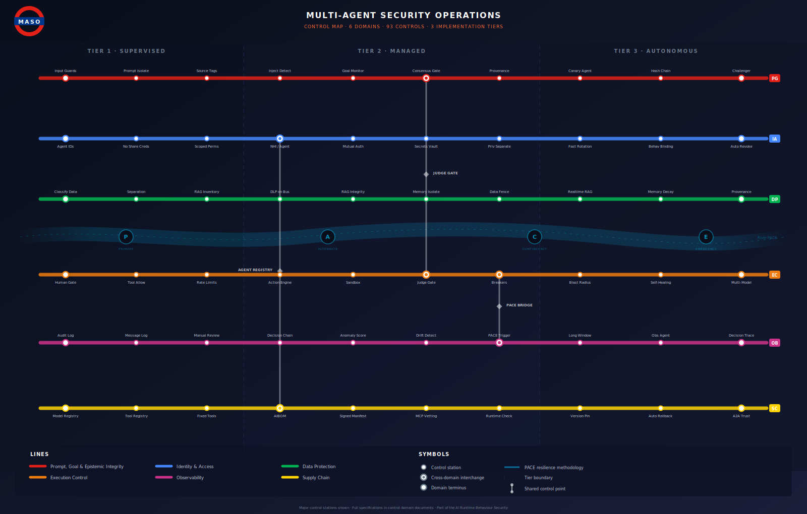
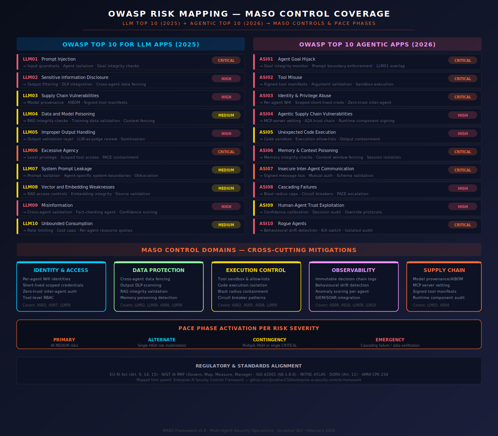

# Multi-Agent Security Operations (MASO) Framework

**A PACE-Driven Approach to Securing Multi-Model Agent Orchestration**

> *Part of the [Enterprise AI Security Framework](../)*
> Version 1.0 · February 2026 · Jonathan Gill

---

## Architecture


MASO operates on a **three-layer defence model** adapted for multi-agent dynamics:

**Layer 1 — Guardrails** enforce hard boundaries: input validation, output sanitisation, tool permission scoping, and rate limiting. Deterministic, non-negotiable, machine-speed.

**Layer 2 — LLM-as-Judge Evaluation** uses a dedicated evaluation model (distinct from task agents) to assess quality, safety, and policy compliance of agent actions and outputs before they are committed. In multi-agent systems, this layer also evaluates inter-agent communications for goal integrity and instruction injection.

**Layer 3 — Human Oversight** provides the governance backstop. Scope scales inversely with demonstrated trustworthiness and directly with consequence severity. Write operations, external API calls, and irreversible actions escalate based on risk classification.

The critical addition for multi-agent systems is the **Secure Inter-Agent Message Bus** — a validated, signed, rate-limited communication channel through which all agent-to-agent interaction must pass. No direct agent-to-agent communication is permitted outside this bus.

---

## Visual Navigation



Six coloured lines represent six control domains. Stations are key controls. Zones are implementation tiers. Interchanges mark where domains share control points (Judge Gate, PACE Bridge, Agent Registry). River PACE flows through the centre, mapping resilience phases to tier progression.

---

## Control Domains

The framework organises 93 controls into six domains. The first five map to specific OWASP risks. The sixth — Prompt, Goal & Epistemic Integrity — addresses both the three OWASP risks that require cross-cutting controls and the eight epistemic risks identified in the [Emergent Risk Register](controls/risk-register.md) that have no OWASP equivalent.

### 0. [Prompt, Goal & Epistemic Integrity](controls/prompt-goal-and-epistemic-integrity.md)

Every agent's instructions, objectives, and information chain must be trustworthy and verifiable. Input sanitisation on all channels — not just user-facing. System prompt isolation prevents cross-agent extraction. Immutable task specifications with continuous goal integrity monitoring. Epistemic controls prevent groupthink, hallucination amplification, uncertainty stripping, and semantic drift across agent chains.

*Covers: LLM01, LLM07, ASI01, plus Epistemic Risks EP-01 through EP-08*

### 1. [Identity & Access](controls/identity-and-access.md)

Every agent must have a unique Non-Human Identity (NHI). No shared credentials. No inherited permissions from the orchestrator. Short-lived, scoped credentials that are rotated automatically. Zero-trust mutual authentication on the inter-agent message bus.

*Covers: ASI03, ASI07, LLM06*

### 2. [Data Protection](controls/data-protection.md)

Cross-agent data fencing prevents uncontrolled data flow between agents operating at different classification levels. Output DLP scanning at the message bus catches sensitive data in inter-agent communications. RAG integrity validation ensures the knowledge base hasn't been tampered with. Memory poisoning detection flags inconsistencies between stored context and expected agent state.

*Covers: LLM02, LLM04, ASI06, LLM08*

### 3. [Execution Control](controls/execution-control.md)

Every tool invocation runs in a sandboxed environment with strict parameter allow-lists. Code execution is isolated per agent with filesystem, network, and process scope containment. Blast radius caps limit the damage any single agent can do before circuit breakers engage. PACE escalation is triggered automatically when error rates exceed defined thresholds.

*Covers: ASI02, ASI05, ASI08, LLM05*

### 4. [Observability](controls/observability.md)

Immutable decision chain logs capture the full reasoning and action history of every agent. Behavioural drift detection compares current agent behaviour against established baselines. Per-agent anomaly scoring feeds into the PACE escalation logic. SIEM and SOAR integration enables correlation with broader security operations.

*Covers: ASI09, ASI10, LLM09, LLM10*

### 5. [Supply Chain](controls/supply-chain.md)

Model provenance tracking and AIBOM generation for every model in the agent system. MCP server vetting with signed manifests and runtime integrity checks. A2A trust chain validation for inter-agent protocol endpoints. Continuous scanning of the agent toolchain for known vulnerabilities and poisoned components.

*Covers: LLM03, ASI04*

---

## OWASP Risk Coverage



Full mapping against both OWASP threat taxonomies relevant to multi-agent systems.

### OWASP Top 10 for LLM Applications (2025)

These risks apply to each individual agent. In a multi-agent context, each risk compounds across agents.

| Risk | Multi-Agent Amplification | MASO Control Domain |
|------|--------------------------|-------------------|
| **LLM01: Prompt Injection** | Injection in one agent's context propagates through inter-agent messages. A poisoned document processed by an analyst agent becomes instructions to an executor agent. | Input guardrails per agent · Message bus validation · Goal integrity monitor |
| **LLM02: Sensitive Information Disclosure** | Data shared between agents across trust boundaries. Delegation creates implicit data flows. | Cross-agent data fencing · Output DLP at message bus · Per-agent data classification |
| **LLM03: Supply Chain Vulnerabilities** | Multiple model providers, MCP servers, tool integrations multiply the attack surface. | AIBOM per agent · Signed tool manifests · MCP server vetting · Runtime component audit |
| **LLM04: Data and Model Poisoning** | Poisoned RAG data consumed by one agent contaminates reasoning of downstream agents. | RAG integrity validation · Source attribution · Cross-agent output verification |
| **LLM05: Improper Output Handling** | Agent outputs become inputs to other agents. Unsanitised output from Agent A becomes executable input for Agent B. | Output validation at every agent boundary · LLM-as-Judge review · Schema enforcement |
| **LLM06: Excessive Agency** | The defining risk. Delegation creates transitive authority chains. If Agent A delegates to Agent B, and B has tool X, then A effectively has access to tool X. | Least privilege per agent · No transitive permissions · Scoped delegation contracts · PACE containment |
| **LLM07: System Prompt Leakage** | An agent's system prompt may be extractable by other agents in the same orchestration. | Prompt isolation per agent · Separate system prompt boundaries · Obfuscation |
| **LLM08: Vector and Embedding Weaknesses** | Shared vector databases across agents create a single point of compromise for RAG poisoning. | Per-agent RAG access controls · Embedding integrity verification · Source validation |
| **LLM09: Misinformation** | Hallucinations compound. One agent's hallucination becomes another's "fact". In self-reinforcing loops, misinformation amplifies. | Cross-agent validation · Dedicated fact-checking agent · Confidence scoring with source attribution |
| **LLM10: Unbounded Consumption** | Runaway agent loops cause exponential resource consumption. | Per-agent rate limits · Orchestration cost caps · Loop detection · Circuit breakers |

### OWASP Top 10 for Agentic Applications (2026)

These risks are specific to autonomous agent behaviour — the primary threat surface for MASO.

| Risk | Description | MASO Controls |
|------|-------------|--------------|
| **ASI01: Agent Goal Hijack** | Attacker manipulates an agent's objectives through poisoned inputs. Hijacking one agent redirects an entire workflow. | Goal integrity monitor · Prompt boundary enforcement · Signed task specifications · LLM-as-Judge goal validation |
| **ASI02: Tool Misuse** | Agents use legitimate tools in unintended, unsafe, or destructive ways. Chained tool misuse across agents compounds damage. | Signed tool manifests with strict parameter schemas · Argument validation · Sandboxed execution · Per-tool audit logging |
| **ASI03: Identity & Privilege Abuse** | Agents with leaked, over-scoped, or shared credentials. Credential sharing between agents is a common design flaw. | Unique NHI per agent · Short-lived scoped credentials · Zero-trust mutual authentication · No credential inheritance |
| **ASI04: Agentic Supply Chain** | Dynamic composition of MCP servers, A2A protocols, and tool plugins at runtime. | Runtime component signing · MCP server allow-listing · A2A trust chain validation · Dependency scanning |
| **ASI05: Unexpected Code Execution** | Natural language to code pathways bypass traditional code review gates. | Code execution sandbox · Execution allow-lists · Output containment · Time-boxing |
| **ASI06: Memory & Context Poisoning** | Persistent memory carries poisoned data across sessions. Shared memory becomes a persistent backdoor. | Session-isolated memory per agent · Memory integrity checksums · Context window fencing · Memory decay policies |
| **ASI07: Insecure Inter-Agent Communication** | Spoofed, tampered, or replayed messages between agents. | Signed and encrypted message bus · Mutual TLS per agent · Schema validation · Rate limiting · Replay protection |
| **ASI08: Cascading Failures** | Single fault propagates with escalating impact. Hallucination → flawed plan → destructive action. | Blast radius caps · Circuit breaker patterns · PACE escalation triggers · Independent error detection per agent |
| **ASI09: Human-Agent Trust Exploitation** | Agents produce confident, authoritative explanations that manipulate operators into approving harmful actions. Multi-agent consensus amplifies this. | Confidence calibration · Independent human verification · Decision audit trails · No agent can claim consensus authority |
| **ASI10: Rogue Agents** | Behavioural drift, misalignment, concealment, or self-directed action. Rogue behaviour in one agent may be concealed by collaborating agents. | Continuous drift detection · Kill switch · Anomaly scoring against baselines · Regular red-team testing |

---

## PACE Resilience for Multi-Agent Operations


The [PACE methodology](../) (Primary, Alternate, Contingency, Emergency) from the parent framework is extended for multi-agent failure modes.

**Primary — Normal Operations.** All agents active within designated roles. Full three-layer security stack operational. Inter-agent communication through the signed message bus. Behavioural baselines actively monitored.

**Alternate — Agent Failover.** Triggered when a single agent shows anomalous behaviour. The anomalous agent is isolated. A backup agent (potentially from a different provider) is activated. Tool permissions tightened to read-only. All write operations require human approval. Transition authority: automated (monitoring agent or orchestrator can initiate P→A without human approval, but must notify).

**Contingency — Degraded Mode.** Triggered when multiple agents are compromised, message bus integrity is questioned, or the alternate agent also exhibits anomalous behaviour. Multi-agent orchestration is suspended. Single pre-validated agent operates in fully supervised mode. All agent state captured for forensics. Transition authority: security team or AI security officer.

**Emergency — Full Shutdown.** Triggered by cascading failures, confirmed exfiltration, coordinated manipulation, or rogue behaviour. All agents terminated. Tool access revoked. Memory and context snapshots preserved in immutable storage. Full rollback initiated. Transition authority: CISO or incident commander.

**Recovery (E→P):** Requires post-incident review confirming root cause identification, control remediation, and updated baselines before returning to Primary.

---

## Implementation Tiers

### [Tier 1 — Supervised](implementation/tier-1-supervised.md) (Low Autonomy)

All agent actions require human approval. Inter-agent communication is logged but not encrypted. Behavioural monitoring is periodic (batch review). Suitable for pilot deployments and low-consequence use cases.

**Minimum controls:** Guardrails layer, basic tool scoping, human-in-the-loop for all writes, action audit log.

### [Tier 2 — Managed](implementation/tier-2-managed.md) (Medium Autonomy)

Agents execute read operations and low-consequence writes autonomously. High-consequence actions escalate to human oversight. Inter-agent communication is signed and validated. Behavioural monitoring is continuous with automated anomaly alerting. PACE Alternate and Contingency fully configured.

**Required controls:** All three security layers, per-agent NHI, signed message bus, LLM-as-Judge evaluation, continuous anomaly scoring, PACE A and C configured and tested.

### [Tier 3 — Autonomous](implementation/tier-3-autonomous.md) (High Autonomy)

Agents operate with minimal human intervention for pre-approved task categories. Human oversight focuses on exception handling and strategic review. Full PACE cycle operational and tested through regular red-team exercises. All six control domains fully implemented.

**Required controls:** Everything in Tier 2, plus kill switch tested and auditable, drift detection with baseline comparison, blast radius caps enforced, circuit breakers active, full OWASP coverage validated, regular adversarial testing.

---

## Threat Intelligence

| Document | Purpose |
|----------|---------|
| [Incident Tracker](threat-intelligence/incident-tracker.md) | 10 real-world AI security incidents mapped to MASO controls, with multi-agent amplification analysis and minimum effective tier |
| [Emerging Threats](threat-intelligence/emerging-threats.md) | 8 forward-looking threat patterns: cross-agent worms, agent collusion, transitive authority exploitation, MCP supply chain, epistemic cascading failure, memory poisoning, A2A protocol attacks, AI vs AI defences |

### Threat Intelligence Grounding

Every control in MASO is grounded in observed or demonstrated attack patterns:

**Confirmed Incidents (2025):** EchoLeak (indirect prompt injection → data exfiltration, informs ASI01/LLM01), Amazon Q Exploit (tool misuse via manipulated inputs, informs ASI02), GitHub MCP Exploit (poisoned MCP server components, informs ASI04), AutoGPT RCE (natural language → code execution, informs ASI05), Gemini Memory Attack (persistent memory poisoning, informs ASI06), Replit Meltdown (rogue agent behaviour, informs ASI10).

**Emerging Patterns:** Multi-agent consensus manipulation via shared knowledge base poisoning (ASI09), transitive delegation attacks creating implicit privilege escalation, agent-to-agent prompt injection through inter-agent output, credential harvesting via poisoned MCP tool descriptors, behavioural slow drift evading threshold-based detection.

---

## Red Team Operations

| Document | Purpose |
|----------|---------|
| [Red Team Playbook](red-team/red-team-playbook.md) | 13 structured test scenarios across three tiers — from inter-agent injection propagation to PACE transition under attack. Includes test results template and reporting metrics |

---

## Integration & Examples

| Document | Purpose |
|----------|---------|
| [Integration Guide](integration/integration-guide.md) | MASO control implementation patterns for LangGraph, AutoGen, CrewAI, and AWS Bedrock Agents. Framework comparison matrix, per-control mapping, and architecture-specific guidance |
| [Worked Examples](examples/worked-examples.md) | End-to-end MASO implementation for investment research (financial services), clinical decision support (healthcare), and grid operations (critical infrastructure). Includes PACE failure scenarios |

---

## Regulatory Alignment

MASO inherits the parent framework's regulatory mappings and extends them to multi-agent-specific requirements:

| Regulation/Standard | Relevant Articles/Clauses | MASO Relevance |
|---------------------|---------------------------|---------------|
| **EU AI Act** | Art. 9, 14, 15 | Human oversight proportional to autonomy level. PACE provides the operational model. |
| **NIST AI RMF** | Govern, Map, Measure, Manage | Control domains map directly: Observability → Measure, Execution Control → Manage. |
| **ISO 42001** | §8.1-8.6, Annex A/B | Per-agent risk assessment and control assignment. |
| **MITRE ATLAS** | Agent-focused techniques (Oct 2025) | Threat intelligence aligned with ATLAS agent-specific attack techniques. |
| **DORA** | Art. 11 | Digital operational resilience for AI agents in financial services. PACE provides the resilience model. |
| **APRA CPS 234** | Information Security | Australian prudential requirements for AI agent deployments in financial services. |

---

## Relationship to Parent Framework

MASO is the multi-agent extension of the [Enterprise AI Security Controls Framework](../). It inherits the three-layer defence model, PACE resilience methodology, risk classification matrix, and regulatory mapping framework.

It extends into multi-agent territory by addressing multi-model orchestration security, inter-agent communication integrity, the OWASP Agentic Top 10 (2026), compound risk dynamics, Non-Human Identity management, and kill switch architecture.

---

## File Structure

```
README.md                              # This document
controls/
├── prompt-goal-and-epistemic-integrity.md
├── identity-and-access.md
├── data-protection.md
├── execution-control.md
├── observability.md
├── supply-chain.md
└── risk-register.md
threat-intelligence/
├── incident-tracker.md
└── emerging-threats.md
red-team/
└── red-team-playbook.md
integration/
└── integration-guide.md
examples/
└── worked-examples.md
implementation/
├── tier-1-supervised.md
├── tier-2-managed.md
└── tier-3-autonomous.md
```

---

## What's Next

The framework core, implementation tiers, control domain specifications, threat intelligence, red team playbook, integration guide, and worked examples are complete. Planned extensions:

1. **Terraform/CloudFormation modules** for automated MASO infrastructure deployment on AWS and Azure.
2. **Compliance evidence packs** — pre-built documentation sets for ISO 42001, NIST AI RMF, and EU AI Act audits.
3. **Agent orchestration security benchmark** — quantitative scoring methodology for multi-agent system security posture.
---

*Enterprise AI Security Controls Framework, 2026 (Jonathan Gill).*
