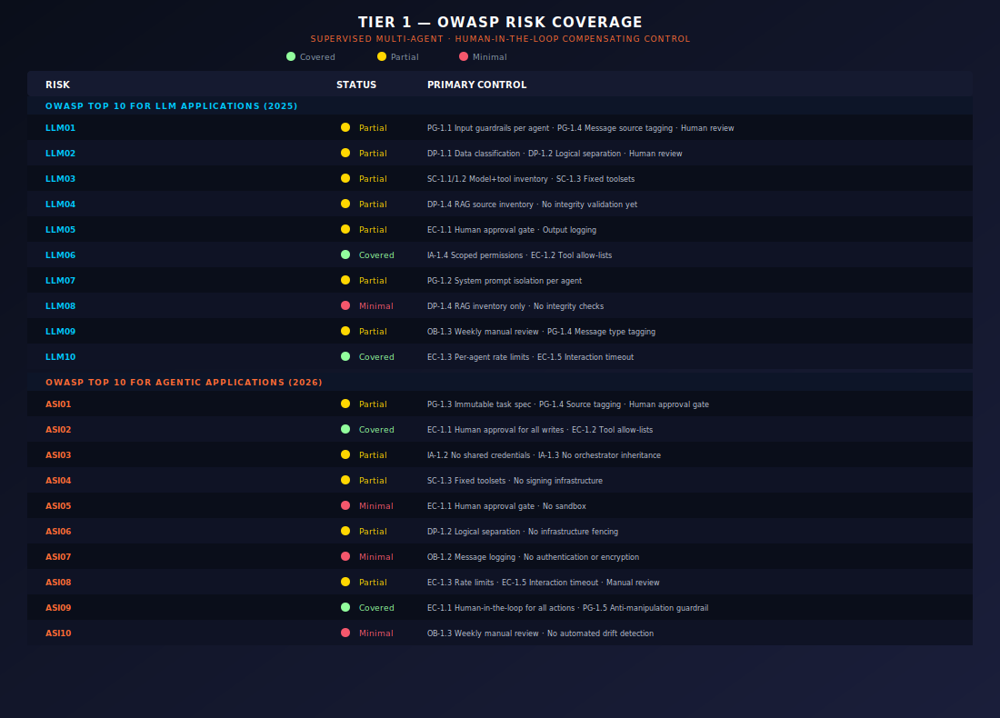

# Tier 1 — Supervised Multi-Agent Deployment

**Low Autonomy · Human-in-the-Loop · Pilot Phase**

> Part of the [MASO Framework](../README.md) · Implementation Guidance
> Version 1.0 · February 2026

---

## When to Use Tier 1

Tier 1 is the entry point for any organisation deploying multi-agent AI systems. It is deliberately conservative: every agent action that modifies state requires human approval before execution. The system operates as a force multiplier for human operators, not as an autonomous decision-maker.

Use Tier 1 when any of the following conditions apply:

- The organisation has no prior production experience with multi-agent AI orchestration.
- The use case involves regulated data or regulated processes (financial services, healthcare, legal).
- The agent system is in pilot or proof-of-concept phase and operational baselines have not been established.
- The consequence of an uncorrected agent error is material — financial loss, reputational damage, regulatory exposure, or safety impact.
- The organisation's AI security maturity is at CMMI Level 1–2 (initial or managed) for AI-specific controls.

Tier 1 is not a permanent state. It is designed to build the operational evidence base — behavioural baselines, failure mode data, and trust calibration — that justifies progression to Tier 2.

---

## Architecture at Tier 1

Key architectural constraints at Tier 1:

**Message bus** is operational but runs in logging mode only — all inter-agent messages are captured in the audit trail but are not cryptographically signed. This simplifies initial deployment while still providing the observability foundation needed for Tier 2 graduation.

**Guardrails (Layer 1)** are mandatory on every agent. Input validation, output sanitisation, tool permission scoping, and rate limiting are active. These are deterministic controls that operate at machine speed regardless of human availability.

**LLM-as-Judge (Layer 2)** is optional at Tier 1. Organisations that already have an evaluation model can deploy it, but it is not a gating requirement. The primary quality gate is human review.

**Human Oversight (Layer 3)** is the dominant control. Every action that modifies external state — write operations, API calls, data mutations, file modifications, message sends — requires explicit human approval before execution.

---

## Control Implementation by MASO Domain

### 1. Identity & Access — Tier 1 Requirements

**Mandatory:**

- Each agent has a distinct service account or identity label in logs. At Tier 1, this can be a simple string identifier (e.g., `agent-analyst-01`) rather than a full Non-Human Identity (NHI) with certificate-based authentication.
- No agent shares credentials with another agent. Each agent authenticates to its tools using its own credential set.
- The orchestrator's credentials are not inherited by task agents. If the orchestrator has admin-level access to a tool, that does not mean task agents do.
- Agent permissions are scoped to the minimum required for the defined task. Read access is the default; write access is granted only where the task explicitly requires it and is gated by human approval.

**Deferred to Tier 2:**

- Certificate-based NHI per agent.
- Short-lived credential rotation (agents can use longer-lived credentials at Tier 1 provided they are scoped).
- Mutual TLS on the message bus.
- Zero-trust authentication between agents.

**Implementation checklist:**

- [ ] Each agent has a unique identifier in all log entries.
- [ ] Agent credential inventory documented — which agent has access to which tools with which permissions.
- [ ] No shared credentials between agents (verified by audit).
- [ ] Orchestrator credentials are not passed to task agents.
- [ ] Write-capable tool access is documented and justified per agent.

---

### 2. Data Protection — Tier 1 Requirements

**Mandatory:**

- Data classification is applied to agent inputs and outputs. At minimum, the organisation must know whether agents are processing public, internal, confidential, or restricted data.
- Agents processing data at different classification levels do not share context or memory. An agent handling confidential customer data does not pass that data to an agent operating on public information without explicit data flow approval.
- Output logging captures what each agent produces, enabling post-hoc review for sensitive data leakage.
- RAG data sources used by agents are inventoried. The organisation knows which knowledge bases each agent accesses.

**Deferred to Tier 2:**

- Real-time DLP scanning on the message bus.
- Automated RAG integrity validation.
- Memory poisoning detection.
- Cross-agent data fencing enforced at the infrastructure level (rather than by policy).

**Implementation checklist:**

- [ ] Data classification applied to all agent data flows (input, output, inter-agent).
- [ ] Agents handling different data classifications are logically separated.
- [ ] All agent outputs are logged and available for review.
- [ ] RAG data sources inventoried per agent.
- [ ] Data flow diagram exists showing what data moves between which agents.

---

### 3. Execution Control — Tier 1 Requirements

**Mandatory:**

- Every write operation, external API call, and state-modifying action requires human approval before execution. The system presents the proposed action (tool name, parameters, target) to the human operator and waits for explicit confirmation.
- Basic tool scoping: each agent has a defined allow-list of tools it can invoke. Tools not on the allow-list are blocked regardless of what the agent requests.
- Rate limiting per agent: a maximum number of actions per time window (e.g., 100 tool calls per hour per agent). This prevents runaway loops even before human review catches them.
- Read operations can execute without human approval provided they are within the agent's scoped permissions.

**Deferred to Tier 2:**

- Sandboxed execution environments per agent.
- Blast radius caps with automated enforcement.
- Circuit breaker patterns.
- Code execution isolation.
- Argument-level validation against parameter schemas.

**Implementation checklist:**

- [ ] Human approval gate is active for all write operations.
- [ ] Tool allow-list defined and enforced per agent.
- [ ] Rate limits configured per agent.
- [ ] Read operations do not require human approval (efficiency baseline).
- [ ] Approval workflow is logged — who approved what, when, with what context.

---

### 4. Observability — Tier 1 Requirements

**Mandatory:**

- Action audit log captures every agent action: timestamp, agent ID, action type, tool invoked, parameters, result, and approval status (pending/approved/rejected/auto-approved-read).
- Inter-agent message log captures all messages on the bus: sender, recipient, message content, timestamp.
- Periodic human review of agent behaviour: at minimum, a weekly review of action logs to identify unexpected patterns, unusual tool usage, or output quality issues. This is the manual precursor to the automated drift detection required at Tier 2.
- Error logging: all agent errors, exceptions, and guardrail blocks are captured and reviewed.

**Deferred to Tier 2:**

- Continuous automated anomaly detection.
- Behavioural baseline establishment and drift scoring.
- SIEM/SOAR integration.
- Immutable decision chain logs (at Tier 1, logs should be tamper-resistant but full immutability is not required).

**Implementation checklist:**

- [ ] Action audit log operational and capturing all required fields.
- [ ] Inter-agent message log operational.
- [ ] Weekly log review process defined, with assigned reviewer and documented findings.
- [ ] Error and guardrail block logs captured.
- [ ] Log retention policy defined (minimum 90 days recommended at Tier 1).

---

### 5. Supply Chain — Tier 1 Requirements

**Mandatory:**

- Model inventory: the organisation knows which models (provider, version, endpoint) are used by which agents.
- Tool inventory: all tools, MCP servers, plugins, and API integrations used by the agent system are documented.
- No dynamic tool composition at runtime. At Tier 1, the agent's toolset is fixed at deployment time and cannot be modified during operation.
- Third-party model providers have been assessed against the organisation's vendor risk framework (this can be a lightweight assessment at Tier 1, not a full ISO 27001 audit).

**Deferred to Tier 2:**

- AIBOM generation per agent.
- Signed tool manifests.
- Runtime component integrity checks.
- MCP server vetting and allow-listing.
- A2A trust chain validation.

**Implementation checklist:**

- [ ] Model inventory documented (provider, version, endpoint, agent assignment).
- [ ] Tool inventory documented (tool name, function, permissions, agent assignment).
- [ ] No dynamic tool composition — toolsets are fixed at deployment.
- [ ] Third-party providers assessed against vendor risk framework.
- [ ] Change management process exists for modifying the agent toolset.

---

## PACE Configuration at Tier 1

At Tier 1, only two PACE phases are required to be fully operational:

### Primary (P) — Active

Normal operations as described above. All agents running with human-in-the-loop for write operations.

### Emergency (E) — Active

The kill switch. At Tier 1, this is the critical safety net. If anything goes wrong, the operator can shut down all agents immediately.

Emergency activation criteria at Tier 1:
- Any agent produces output that the human operator considers harmful, dangerous, or significantly incorrect and the root cause is not immediately apparent.
- Any agent attempts to access tools or data outside its defined scope.
- The human operator observes behaviour they cannot explain.

Emergency response at Tier 1:
1. All agents terminated.
2. Tool access revoked.
3. Logs preserved.
4. Post-incident review conducted before restarting.

### Alternate (A) — Configuration Optional

At Tier 1, having a backup agent ready is recommended but not required. If a single agent fails, the human operator can take over the task manually while the issue is investigated.

### Contingency (C) — Not Required

Degraded mode orchestration is unnecessary at Tier 1 because the system is already operating with maximum human oversight. There is no further degradation path short of Emergency shutdown.

---

## OWASP Risk Coverage at Tier 1

Not all OWASP risks require active technical controls at Tier 1. The human-in-the-loop for all write operations provides a compensating control for several risks that would otherwise require automated mitigation.

**Critical note on ASI09:** At Tier 1, the human operator is the primary control for most risks. This means ASI09 (Human-Agent Trust Exploitation) is the most dangerous risk at this tier. Agents producing confident, well-reasoned explanations can lead the human operator to approve harmful actions through authority bias. Mitigations: ensure the human reviewer has domain expertise, rotate reviewers to prevent trust complacency, and establish a "challenge by default" review culture where the operator's role is to find reasons NOT to approve, not reasons to approve.

---

## Staffing Model

Tier 1 requires direct human involvement in operations. The staffing model reflects this.

**Minimum roles:**

- **Agent Operator** (1 per active agent system during operating hours): Reviews and approves/rejects agent actions. Requires domain expertise in the task the agents are performing, plus basic understanding of the agent system's architecture and tools.
- **AI Security Lead** (part-time, ~0.25 FTE): Conducts weekly log reviews, manages the agent inventory, coordinates with the broader security team, and owns the PACE Emergency procedure.
- **Platform Engineer** (part-time, ~0.25 FTE): Maintains the agent infrastructure, deploys updates, manages credentials, and troubleshoots operational issues.

**For a financial services context:** Add a compliance reviewer who periodically audits the action logs against regulatory requirements (e.g., DORA Art. 11, APRA CPS 234). This can be part of the existing operational risk function.

---

## Cost Indicators

Tier 1 costs are dominated by human labour, not infrastructure.

The dominant cost is the Agent Operator. This is the intentional trade-off at Tier 1: you are paying for human oversight in exchange for lower technical control complexity. As the system matures and moves to Tier 2, the operator role shifts from approving every action to managing exceptions.

---

## Testing and Validation

Before declaring Tier 1 operational, validate the following:

**Functional tests:**

1. **Approval gate test:** Submit a write operation through an agent and confirm it blocks until human approval is received. Confirm that rejecting the approval prevents the action.
2. **Tool scope test:** Attempt to invoke a tool not on the agent's allow-list and confirm the guardrail blocks it.
3. **Rate limit test:** Submit actions at a rate exceeding the configured limit and confirm throttling engages.
4. **Kill switch test:** Activate the Emergency procedure and confirm all agents terminate within the defined SLA (recommended: under 30 seconds).
5. **Logging completeness test:** Perform a series of agent actions and confirm every action, message, and approval decision appears in the audit log with all required fields.

**Operational tests:**

6. **Operator workflow test:** Run the agent system for a full shift with the designated operator and measure approval latency, error rate, and operator fatigue indicators.
7. **Log review test:** Conduct a log review following the defined process and confirm the reviewer can identify a deliberately injected anomalous action.
8. **Incident response test:** Run a tabletop exercise where an agent produces harmful output. Walk through the Emergency procedure from detection to shutdown to post-incident review.

---

## Graduation Criteria — Moving to Tier 2

Tier 1 is the foundation. An organisation should progress to Tier 2 when the following conditions are met:

1. **Operational baseline established:** The agent system has been running in Tier 1 for at least 90 days with continuous logging, providing sufficient data to establish behavioural baselines for each agent.

2. **Low error rate demonstrated:** The human approval rejection rate (actions the operator rejected) has stabilised below 5% of total proposed actions, indicating the agents are operating within expectations.

3. **No uncontrolled incidents:** No Emergency shutdowns have been triggered due to security incidents (as opposed to operational issues or testing) in the most recent 60 days.

4. **Staffing capacity confirmed:** The organisation has the AI security and platform engineering capacity to implement Tier 2 controls (NHI, signed message bus, LLM-as-Judge, continuous monitoring).

5. **Organisational approval:** The risk owner (CISO, CTO, or equivalent) has formally approved the transition to Tier 2 based on the operational evidence from Tier 1.

6. **Regulatory alignment confirmed:** For regulated industries, the compliance function has reviewed the Tier 2 control set and confirmed it meets applicable requirements.

---

## Worked Example — Financial Services Document Processing

**Scenario:** A bank deploys two agents — an Analyst Agent (reads customer documents, extracts key data points) and a Summariser Agent (takes the extracted data and produces a structured summary for the relationship manager).

**Tier 1 configuration:**

- The Analyst Agent has read access to the document management system and can call a text extraction tool. It cannot write to any system.
- The Summariser Agent receives the Analyst's output via the message bus and produces a summary. It has write access to a staging area where summaries are placed for human review — but the write operation requires human approval.
- The human operator reviews each summary before it is committed to the staging area.
- Both agents are rate-limited to 50 tool calls per hour.
- All inter-agent messages are logged.
- The kill switch can terminate both agents and is tested weekly.

**What the operator watches for:**

- The Analyst extracting data fields not relevant to the task (potential data leakage or prompt injection).
- The Summariser producing summaries that include information not present in the Analyst's output (hallucination or context contamination).
- Either agent attempting to call tools outside their allow-list.
- Message volume between agents exceeding expected patterns (potential loop).

**Graduation trigger:** After 90 days, the operator's rejection rate is 2%, no incidents have occurred, and behavioural baselines show consistent patterns. The bank's operational risk function approves progression to Tier 2, where the Analyst's read operations and the Summariser's writes to the staging area (for pre-approved document types) will proceed without per-action human approval.
---

*AI Runtime Behaviour Security, 2026 (Jonathan Gill).*
