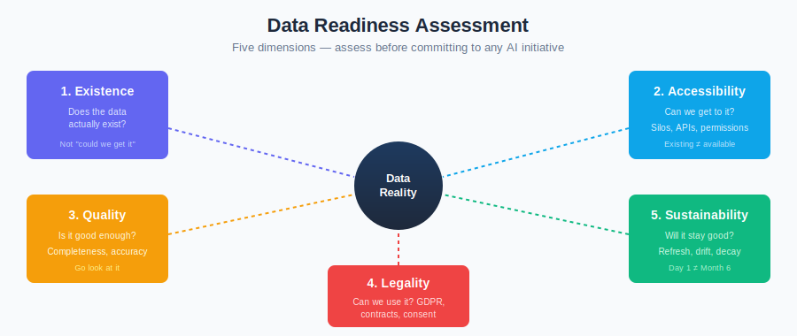

# Data Reality

*Your data determines your strategy more than your ambition does.*

> Part of [From Strategy to Production](./)

---

## The Data Assumption

Every AI strategy assumes data. "We'll use AI to analyse customer behaviour." "We'll build an AI-powered risk model." "We'll automate document processing with AI."

Each of these assumes that the required data exists, is accessible, is clean enough to use, and can legally be processed. In most organisations, at least one of these assumptions is wrong.

Data isn't a supporting resource for AI strategy. **Data is the strategy's foundation.** An organisation with excellent data and a modest model will outperform an organisation with poor data and the most capable model available. This is well-established in machine learning literature and routinely ignored in strategic planning.

---

## The Data Readiness Assessment

Before committing to any AI initiative, assess data reality across five dimensions:

### 1. Existence

**Does the data actually exist?**

This sounds absurd to ask, but it's the most common failure point. Organisations frequently plan AI initiatives around data they assume they have but don't.

| Scenario | What's Assumed | What's Actually True |
|----------|---------------|---------------------|
| "Customer interaction history" | Complete records of all customer contacts | Phone calls aren't transcribed; email is in 3 systems; chat logs were deleted after 90 days |
| "Product performance data" | Detailed usage metrics | Basic pageviews exist; feature-level usage isn't tracked |
| "Employee skills database" | Structured skills inventory | Freeform text in CV uploads, last updated 3 years ago |
| "Fraud labels" | Known fraud cases with outcomes | Fraud team uses spreadsheets; labelling is inconsistent; most cases are "suspected" not confirmed |
| "Equipment sensor data" | Continuous readings from all machines | 60% of machines have sensors; data gaps during maintenance windows; sampling rate varies |

**Before you plan the AI, find the data.** Literally. Go look at it. Open the database. Export a sample. If someone says "we have that data," ask them to show you.

### 2. Accessibility

**Can we get to the data?**

Data existing somewhere in the organisation is not the same as data being available for AI use.

| Barrier | How Common | Impact |
|---------|------------|--------|
| **Siloed systems** | Very common | Data in system A can't be joined with data in system B without a major integration project |
| **Legacy platforms** | Common | Data exists but in formats, systems, or databases that are difficult to extract from |
| **No API access** | Common | Data is in a SaaS platform with limited or no programmatic access |
| **Access permissions** | Very common | Data team doesn't have access; getting it requires approvals from multiple business units |
| **Real-time vs. batch** | Common | Data exists but is only available in nightly batch extracts, not real-time |

**A common strategic mistake:** Planning an AI initiative that requires real-time access to data that's only available in a data warehouse refreshed overnight. The AI is ready; the data pipeline isn't. This adds 3-6 months to the timeline that wasn't in the original plan.

### 3. Quality

**Is the data good enough?**

"Good enough" depends on the use case and risk tier. A CRITICAL-tier system making autonomous financial decisions needs higher data quality than a MEDIUM-tier internal assistant.

| Quality Dimension | What to Check | Why It Matters for AI |
|-------------------|---------------|----------------------|
| **Completeness** | What percentage of records have all required fields? | Missing data leads to biased models and unreliable outputs |
| **Accuracy** | How much of the data is actually correct? | Incorrect training data produces incorrect models |
| **Consistency** | Are the same things represented the same way? | "UK", "United Kingdom", "GB", "GBR" — same country, four representations |
| **Timeliness** | How current is the data? | Models trained on stale data make decisions about a world that no longer exists |
| **Duplication** | How many records are duplicated? | Duplicates skew distributions and bias models |
| **Labelling quality** | For supervised learning — are labels consistent and correct? | Inconsistent labelling is the single biggest quality issue for ML |

**Real-world example — customer churn prediction:**

An insurance company wants to predict customer churn. They have 5 years of customer data. Assessment reveals:

- Address fields are 70% complete (customers who moved didn't always update)
- "Churn reason" was only tracked for the last 18 months
- Product names changed twice, creating three naming conventions in the same dataset
- 12% of records are duplicates from a system migration
- "Renewal" sometimes means "auto-renewed" and sometimes means "customer actively renewed" — no way to distinguish

The model can still be built. But the strategy needs to account for 3-6 months of data cleaning before any AI development starts. And the model will be less accurate than the business case assumed, because the underlying data has limitations that no model can overcome.

**The framework connection:** The framework's data protection controls ([DAT-01 to DAT-08](../infrastructure/controls/data-protection.md)) focus on securing data. Data *quality* is a prerequisite the framework assumes but doesn't enforce. If your data quality is poor, the framework's controls will faithfully protect poor data — and the AI will faithfully produce poor outputs.

### 4. Representativeness

**Does the data represent the real world the AI will operate in?**

This is particularly important for high-stakes AI and is directly connected to the framework's [novel risk](../extensions/technical/novel-ai-risks.md) #6 (training data influence) and #5 (opacity).

| Representativeness Problem | Example | Consequence |
|---------------------------|---------|-------------|
| **Historical bias** | Lending data reflects past discrimination | AI perpetuates discriminatory patterns |
| **Survivorship bias** | Only data on customers who stayed, not those who left | Model can't predict churn because it's never seen churners |
| **Geographic bias** | Data primarily from one region | Model performs poorly in other regions |
| **Temporal bias** | Training data from pre-pandemic; deployment in post-pandemic economy | Model assumes conditions that no longer exist |
| **Selection bias** | Data from customers who opted in to tracking | Model doesn't represent customers who opted out |
| **Label bias** | Fraud labels applied by a team that only investigated certain transaction types | Model only detects fraud it was shown |

**Strategic implication:** If your data has representativeness problems, the AI will have bias problems. This isn't a technical issue to fix with model tuning — it's a data problem that requires data solutions. For CRITICAL-tier systems (lending, hiring, insurance pricing), representativeness isn't optional. Regulators will ask.

### 5. Permissibility

**Are we allowed to use this data for this purpose?**

| Legal/Ethical Dimension | Question | Consequence of Getting It Wrong |
|------------------------|----------|-------------------------------|
| **Data protection** | Does our GDPR/privacy basis cover AI processing? | Regulatory enforcement, fines |
| **Consent** | Did customers consent to AI-based decisions? | Complaints, regulatory action |
| **Contractual** | Do data supplier contracts permit AI use? | Contract breach, data loss |
| **Purpose limitation** | Was data collected for a different purpose? | GDPR Article 5 violation |
| **Automated decision-making** | Are we making solely automated decisions with legal effects? | GDPR Article 22 rights apply |
| **Intellectual property** | Are we training on copyrighted content? | IP litigation risk |
| **Ethical** | Even if legal, should we use this data this way? | Reputational risk |

**Real-world scenario:** A retailer wants to use loyalty card data to train a personalised recommendation AI. The loyalty card terms say data will be used "to provide personalised offers." Legal advises that training an AI model is different from running a database query, and may require updated consent under GDPR legitimate interest assessment. This isn't a technical blocker — it's a 3-month legal process that wasn't in the project plan.

---

## How Data Reality Shapes Strategy

### The Data-Strategy Matrix

Organisations fall into one of four quadrants based on their data position and their strategic ambition:

| | **Data ready** | **Data not ready** |
|---|---|---|
| **Ambitious strategy** (HIGH/CRITICAL tier) | **Possible but expensive.** Data is ready; controls are significant. Viable if funded and governed properly. | **Dangerous.** High ambition on weak foundations. Most likely outcome: expensive failure or silent quality problems. |
| **Conservative strategy** (LOW/MEDIUM tier) | **Best starting position.** Good data, low risk. Quick wins that build capability and confidence. | **Manageable.** Low risk means data limitations have lower consequences. Start here, improve data in parallel. |

**The common mistake:** Organisations with "data not ready" pursue ambitious strategies because the business case is compelling. The business case assumes the data problem will be solved during the project. It usually isn't.

**The better approach:** Start in the bottom-left quadrant (conservative strategy, data ready). Build capability. Improve data quality in parallel. Move to the top-left (ambitious strategy, data ready) when both data and organisational readiness support it. This is the [Progression](progression.md) path.

### Data Quality as Risk Multiplier

The framework's [risk tiers](../core/risk-tiers.md) classify systems by their potential impact. Data quality should modify this classification:

| Risk Tier | Good Data | Poor Data |
|-----------|-----------|-----------|
| **LOW** | Standard controls sufficient | Standard controls sufficient (errors are low-impact) |
| **MEDIUM** | Standard controls sufficient | Consider upgrading to HIGH — poor data increases error probability |
| **HIGH** | HIGH controls appropriate | Consider upgrading to CRITICAL — poor data on high-impact decisions |
| **CRITICAL** | Maximum controls | **Question the deployment.** CRITICAL decisions on poor data may not be appropriate. |

The framework doesn't currently incorporate data quality into risk classification. This is a gap. A CRITICAL-tier system built on well-curated, representative data is a different risk profile from a CRITICAL-tier system built on incomplete, biased data. The controls are the same; the residual risk is not.

---

## Data Strategies That Work

### Strategy 1: Start With What You Have

Don't wait for perfect data. Identify what's available now, assess its quality honestly, and design AI use cases that work within those constraints.

**Example:** A bank wants AI-powered customer insights. The ideal dataset would integrate all customer touchpoints. The available data is transactional data from core banking — complete, accurate, but limited in scope. Strategy: start with transaction-based insights (spending patterns, anomaly detection) where the data is strong. Add other data sources over time.

**Framework alignment:** This naturally produces a [Fast Lane](../FAST-LANE.md) or Tier 1 deployment. Internal users, read-only, leveraging data you already control.

### Strategy 2: Build Data Capability Alongside AI Capability

Treat data improvement as a parallel workstream, not a prerequisite. But be honest about which AI use cases are viable now and which need better data first.

| Timeline | AI Capability | Data Capability |
|----------|---------------|-----------------|
| **Months 1-3** | Fast Lane deployments using existing, well-understood data | Audit data landscape; identify gaps; start data quality programme |
| **Months 4-6** | Tier 1 deployments with cleaned data | First data quality improvements delivered; new data pipelines built |
| **Months 7-12** | Tier 2 deployments with enriched data | Data platform operational; quality monitoring automated |
| **Year 2** | Tier 3 (if needed) with high-quality, well-governed data | Mature data governance; continuous quality improvement |

### Strategy 3: Buy Data Capability, Don't Build It

For many organisations, building a data platform from scratch is a multi-year, multi-million-pound programme. Consider:

- **Cloud data platforms** (Snowflake, Databricks, BigQuery) that provide infrastructure without building it
- **Data quality tools** (Great Expectations, Monte Carlo, Anomalo) that automate quality monitoring
- **Data cataloguing** (Alation, Collibra, Atlan) that solve the "does this data exist?" problem

These don't eliminate the need for internal data governance, but they accelerate time to usable data.

### Strategy 4: Accept Data Limitations Explicitly

Not every data problem needs solving. For LOW and MEDIUM tier AI deployments, imperfect data may be acceptable — as long as:

1. The limitations are documented
2. The impact of data errors is understood
3. Human review catches the cases where data quality causes AI errors
4. The risk tier accounts for data quality (not just use case impact)

**The framework supports this.** The three-layer model (Guardrails → Judge → Human) is designed to catch errors regardless of their cause. Data quality issues manifest as AI output errors, which the Judge can detect and humans can review. The controls don't need to know *why* the output is wrong — they need to know *that* it's wrong.

---

## Data Anti-Patterns

| Anti-Pattern | Why It Happens | What Goes Wrong |
|--------------|---------------|-----------------|
| **"We'll fix data quality during the project"** | Project timelines don't include data work | Data cleaning takes longer than expected; AI development stalls |
| **"Our data warehouse has everything"** | Assumption based on warehouse existence, not content audit | Data warehouse has aggregated data; AI needs raw data; they're in different systems |
| **"We'll use synthetic data"** | Attractive solution to data availability | Synthetic data doesn't represent real-world distributions; model learns synthetic patterns |
| **"More data is always better"** | Quantity over quality mindset | Large datasets with poor quality produce worse models than small datasets with good quality |
| **"The vendor handles our data"** | Outsource AI to a vendor; assume data is their problem | Vendor needs your data in a usable form; data preparation still falls on you |
| **"Our data is fine"** | No one has actually assessed quality | Reality is only discovered when the model performs poorly in production |

---

## The Uncomfortable Truth

Most organisations' data is not ready for the AI strategy they want to pursue. This is not a failure — it's a starting condition. The organisations that succeed are the ones that:

1. **Assess data reality before committing to AI strategy** — not after
2. **Match ambition to data maturity** — pursue what's possible now, not what's possible with data you don't yet have
3. **Invest in data as a strategic asset** — not as an AI project dependency
4. **Accept that some use cases need to wait** — until the data supports them
5. **Use the framework's risk tiers to calibrate expectations** — higher tiers need better data, not just better controls

The framework can secure AI systems built on poor data. It cannot make them accurate. That distinction is critical for strategy.

---

*AI Runtime Behaviour Security, 2026 (Jonathan Gill).*
