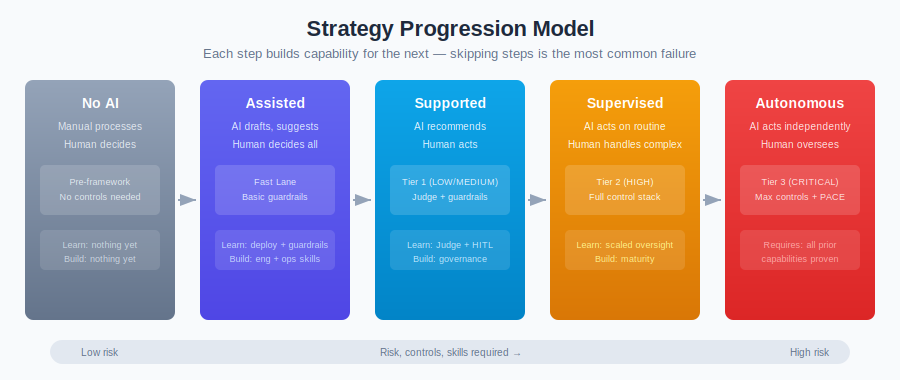

# Progression

*Moving from low-risk to high-risk AI — and why skipping steps is the most common strategic failure.*

> Part of [From Strategy to Production](./)

---

## The Maturity Trap

Organisations want to be at Tier 3. Autonomous agents making decisions, driving efficiency, transforming operations. The business case for full autonomy is always more compelling than the business case for decision support.

So they skip. They go from no AI directly to autonomous AI. Sometimes it works — usually because the specific use case is forgiving and the data is good. More often it fails, and the failure is expensive, visible, and corrosive to future AI investment.

The framework provides a progression path. This article explains why it exists, how to use it, and where it breaks down.

---

## The Progression Model

The framework supports five positions on a progression from no AI to autonomous AI:

| Position | Framework Equivalent | What the AI Does | Who Decides |
|----------|---------------------|------------------|-------------|
| **No AI** | Pre-framework | Nothing — manual processes | Humans |
| **Assisted** | [Fast Lane](../FAST-LANE.md) | AI drafts, suggests, summarises | Human decides everything; AI is a tool |
| **Supported** | Tier 1 (LOW/MEDIUM) | AI recommends; human acts | Human decides, informed by AI |
| **Supervised** | Tier 2 (HIGH) | AI acts on routine cases; human handles exceptions | AI decides routine; human decides complex |
| **Autonomous** | Tier 3 (CRITICAL) | AI acts independently; human monitors | AI decides; human oversees |

Each step up increases value. Each step up also increases risk, control requirements, skill requirements, and operational complexity. The progression is designed so that each step builds the capability needed for the next.

---

## What Each Step Builds

### Step 1: No AI → Assisted (Fast Lane)

**What you deploy:** Internal tools — drafting assistants, search helpers, summarisation tools. Fast Lane criteria apply: internal users, read-only, no regulated data, human reviews everything.

**What you learn:**
- How to deploy an AI system (engineering capability)
- How to configure basic guardrails (security capability)
- How users actually interact with AI (usage patterns)
- Where AI output is good enough and where it isn't (quality baseline)
- How to operate a feature flag and fallback process (operational basics)

**What you build:**
- AI engineering skills in the development team
- Guardrail configuration experience in security
- Usage data that informs future Judge criteria
- Organisational comfort with AI as a tool

**Controls required:** Basic guardrails, usage logging, feature flag, known fallback. That's it.

**Duration:** 1-3 months to first deployment. 3-6 months to establish patterns.

**The mistake:** Staying here too long. "Innovation theatre" — endless pilots that never progress to value. If Fast Lane deployments don't lead to Tier 1 within 6-12 months, something is blocking progression.

### Step 2: Assisted → Supported (Tier 1)

**What you deploy:** AI that recommends actions to internal users, or AI that handles structured tasks with human review. May start handling non-sensitive external interactions (public FAQ, basic routing).

**What you learn:**
- How to implement and operate a Judge (quality evaluation)
- False positive rates and how to tune controls
- What human reviewers need to do their job effectively
- How to classify risk (first formal risk assessment)
- How the AI performs on real data over time (drift detection baseline)

**What you build:**
- Judge evaluation capability (the biggest new skill)
- Risk classification process (governance foundation)
- Human review process (HITL basics)
- Operational metrics and monitoring (performance baseline)
- Incident response for AI (first playbook)

**Controls required:** Standard guardrails, Judge evaluation (5-10% sampling), periodic HITL, logging with 1-year retention.

**Duration:** 3-6 months to first deployment. 6-12 months to operational maturity.

**The mistake:** Treating Judge as a checkbox. Deploying a Judge that nobody monitors or calibrates. The Judge is only as good as its criteria and calibration. If nobody is reviewing Judge accuracy, you don't have a Judge — you have a log generator.

### Step 3: Supported → Supervised (Tier 2)

**What you deploy:** Customer-facing AI with real capability — customer service with account access, document processing with outputs going to external parties, decision support with significant business impact. The AI handles routine cases; humans handle exceptions and high-impact decisions.

**What changes:**
- **External exposure.** AI outputs reach customers. Errors have reputational and regulatory consequences.
- **Data sensitivity.** The AI accesses customer data. Privacy controls become mandatory.
- **Decision influence.** AI recommendations significantly influence outcomes. Automation bias becomes a real risk.
- **Control intensity.** Judge evaluation increases to 20-50%. Human review SLAs tighten to 4 hours for HIGH flags.

**What you learn:**
- How to manage AI at scale with external users
- How to handle AI incidents that affect customers
- How to maintain controls under production pressure
- Whether your human review process actually catches problems
- Where the framework's controls feel too heavy or too light for your context

**What you build:**
- Dedicated AI governance function (or at least a role within governance)
- Mature Judge operations (weekly calibration, accuracy tracking)
- Trained HITL reviewers with domain expertise
- AI incident response capability
- Regulatory engagement capability (explaining AI to regulators)

**Controls required:** Full guardrails, 20-50% Judge evaluation, HITL with 4-hour SLA, enhanced logging with 3-year retention.

**Duration:** 6-12 months to first deployment. 12-18 months to operational maturity.

**The mistake:** Skipping Tier 1. Organisations that go directly from Fast Lane to Tier 2 lack Judge operations experience, HITL maturity, and risk classification confidence. Everything is new simultaneously. Errors are externally visible.

### Step 4: Supervised → Autonomous (Tier 3)

**What you deploy:** AI that makes independent decisions with real-world impact — automated lending decisions, autonomous trading within parameters, clinical decision support without mandatory clinician review, or multi-agent systems that plan and execute without human approval for routine actions.

**What changes:**
- **Decisions are AI-made.** The human is a monitor, not a decision-maker.
- **Errors are direct.** No human buffer between AI decision and real-world consequence.
- **Regulatory exposure is maximum.** Every regulated decision requires demonstrable controls.
- **Control overhead is highest.** 100% Judge evaluation, 1-hour review SLAs, 7-year immutable logs.

**Prerequisites (non-negotiable):**

| Prerequisite | What It Means | How to Verify |
|--------------|---------------|---------------|
| Mature Judge with calibrated accuracy | You know your Judge's detection rate and false positive rate | 6+ months of Judge accuracy data |
| Proven HITL process | Reviewers are trained, calibrated, and meeting SLAs | 3+ months of SLA compliance data |
| Documented PACE plan | You know exactly what happens when each control fails | PACE plan tested through at least desktop exercise |
| AI governance committee | A body with authority to approve, modify, and stop AI systems | Meeting minutes showing active governance |
| Regulatory engagement | Regulators are aware and have no objections | Documented regulatory interaction |
| Incident response tested | You've responded to an AI incident (real or simulated) | Post-incident review documented |
| Kill switch operational | You can stop the AI within minutes | Tested quarterly |

**Duration:** 12-18 months to first deployment (after Tier 2 maturity). Ongoing.

**The mistake:** Treating autonomous AI as a cost-saving measure. If the business case depends on eliminating human review, the business case is wrong. Autonomous AI reduces human decision-making but increases human monitoring, governance, and incident response. The human cost shifts — it doesn't disappear.

---

## Progression Timelines

### Realistic Timeline for a Typical Enterprise

| Milestone | Elapsed Time | Key Dependencies |
|-----------|-------------|------------------|
| First Fast Lane deployment | Month 2-3 | Engineering capacity, basic security awareness |
| 5+ Fast Lane deployments operational | Month 6 | Usage data, pattern recognition |
| First Tier 1 deployment | Month 6-9 | Judge capability, risk classification process |
| Tier 1 operational maturity | Month 12-15 | Judge calibration data, HITL experience |
| First Tier 2 deployment | Month 12-18 | Governance function, trained reviewers, regulatory awareness |
| Tier 2 operational maturity | Month 18-24 | Incident response capability, Judge accuracy data |
| First Tier 3 deployment (if needed) | Month 24-36 | Full governance, proven controls, regulatory engagement |

**Total elapsed time from start to autonomous AI: 2-3 years.**

This feels slow. It is slow. It's also realistic. Organisations that claim to go from nothing to autonomous AI in 6 months are either:
- Deploying in a genuinely low-risk context that doesn't need Tier 3 controls
- Skipping controls and hoping nothing goes wrong
- About to have a bad quarter

### Accelerated Timeline (Possible Under Specific Conditions)

| Condition | How It Accelerates |
|-----------|-------------------|
| Existing mature governance | Saves 3-6 months; governance processes already exist |
| Experienced AI team (hired or acquired) | Saves 3-6 months; build skills aren't a bottleneck |
| Vendor-managed controls | Saves 3-6 months; guardrails and Judge operated by vendor |
| Low-risk domain | Tier 3 may not be needed; Tier 2 is the ceiling |
| Small scale | Fewer interactions = simpler operations = faster maturation |

Even accelerated, the progression from nothing to Tier 3 is 12-18 months. The reason is that operational maturity — the ability to detect and respond to AI failures — can't be compressed below the time it takes to actually operate systems and encounter real problems.

---

## What Makes Organisations Skip Steps

| Reason | Why It's Tempting | Why It's Dangerous |
|--------|------------------|-------------------|
| **Competitive pressure** | Competitor has autonomous AI; we need it too | You don't know their control maturity, incident rate, or risk appetite |
| **Board mandate** | "We need to be AI-first by Q4" | Mandating a timeline doesn't create the capability to meet it safely |
| **Vendor claims** | "Our platform handles all the security" | Vendor handles technical controls; you handle governance, HITL, incident response |
| **Sunk cost** | Already spent £2M building the system; delaying launch wastes the investment | Launching a system you can't safely operate wastes more |
| **Proof-of-concept success** | POC worked perfectly; let's go to production | POC operated at 1/1000th scale, with the best data, without adversarial inputs |
| **Cost pressure** | Manual process costs £5M/year; AI would cost £1M/year | The £1M estimate doesn't include controls, HITL, governance, or incident costs |

### What Happens When You Skip

**Scenario: Financial services firm skips from no AI to autonomous fraud detection (Tier 3)**

Month 1-3: Build and deploy. System goes live with basic guardrails only.

Month 4: First false positive storm. System blocks 200 legitimate transactions in one afternoon. No Judge evaluation to catch the drift. No HITL process to triage blocks. Customer complaints spike.

Month 5: Reactive fix. Lower guardrail thresholds. False positives decrease but false negatives increase. System misses actual fraud.

Month 6: Actual fraud gets through. Post-incident investigation reveals the guardrail threshold change was made by a developer without governance approval. No audit trail of the change.

Month 7: Regulatory inquiry. "Show us your controls." No Judge accuracy data. No HITL records. No PACE plan. No risk classification. The framework requirements exist, but none were implemented because the team skipped directly to autonomous deployment.

Month 8: System pulled back to human-supervised mode. 6 months of autonomous operation replaced with decision-support while controls are built. The progression starts where it should have started.

**Cost of skipping:** Lost customer trust. Regulatory scrutiny. 8 months of operating without appropriate controls. More expensive than doing it right because everything was built reactively under pressure.

---

## The Framework's Role in Progression

### Where the Framework Helps

The tiered model is inherently progressive:

| Framework Feature | How It Supports Progression |
|-------------------|----------------------------|
| **Risk tiers** | Clear criteria for what tier you need at each stage |
| **Control matrix** | Specific controls required at each tier; nothing ambiguous |
| **Fast Lane** | Entry point with minimal overhead; removes "security says no" as an excuse not to start |
| **PACE model** | Degradation is designed, not accidental; each progression step has a defined fallback |
| **Judge evaluation** | Sampling rates scale; you don't need 100% on day 1 |
| **HITL requirements** | Human oversight decreases as AI maturity increases; the framework models this explicitly |

### Where the Framework Hinders

| Limitation | Impact on Progression |
|------------|----------------------|
| **No explicit progression path** | The tiers exist but there's no documented "how to move from Tier 1 to Tier 2" process |
| **Tier classification is static** | Systems are classified at deployment; the framework doesn't guide dynamic reclassification during progression |
| **No human readiness assessment** | The framework tells you what controls you need; it doesn't tell you whether your people can operate them |
| **No data quality integration** | Progression should depend partly on data maturity; the framework doesn't incorporate this |
| **Binary tier boundaries** | Moving from MEDIUM to HIGH is a step function; no intermediate state |
| **Downgrade is slow** | 6+ months stable operation to downgrade a tier; but sometimes circumstances genuinely reduce risk faster |

### What Would Make It Better

| Gap | Proposed Addition | Impact |
|-----|-------------------|--------|
| **Progression guide** | Document: "When you're at Tier X, here's what to do to prepare for Tier X+1" | Organisations know what to build next |
| **Readiness checklist per tier** | Before deploying at Tier 2, confirm: Judge accuracy >80%, HITL SLA >95% for 3 months, etc. | Prevents premature progression |
| **Dynamic classification** | Allow systems to operate at different tiers for different functions | Supports gradual capability expansion |
| **Human readiness criteria** | Minimum human capability requirements per tier (training, experience, backup) | Prevents the "controls exist but nobody can operate them" failure |
| **Data quality overlay** | Data quality as a risk modifier that affects effective tier | Prevents high-risk AI on low-quality data |

---

## Progression Patterns by Industry

### Financial Services

| Position | Typical Use Cases | Regulatory Consideration |
|----------|-------------------|--------------------------|
| **Assisted** | Report drafting, research summarisation, code review | Low regulatory impact; manageable |
| **Supported** | Risk analysis assistance, customer query routing, AML triage | Moderate; outputs inform regulated decisions |
| **Supervised** | Customer service with account access, claims processing | High; customer-facing, data-sensitive |
| **Autonomous** | Fraud detection, credit scoring, algorithmic trading | Maximum; SR 11-7, EU AI Act, FCA oversight |

**Typical progression:** 18-30 months to reach Supervised. Autonomous only for specific, well-bounded use cases with strong regulatory engagement.

### Healthcare

| Position | Typical Use Cases | Regulatory Consideration |
|----------|-------------------|--------------------------|
| **Assisted** | Literature search, administrative summarisation, scheduling | Low; no clinical impact |
| **Supported** | Clinical documentation assistance, diagnostic research | Moderate; informs clinical decisions |
| **Supervised** | Triage support, treatment recommendation, imaging analysis | High; directly affects patient care |
| **Autonomous** | Very limited — monitoring alarms, drug interaction checking | Maximum; medical device regulations may apply |

**Typical progression:** 24-36 months to reach Supervised. Autonomous is rare and highly constrained by medical device regulation and clinical safety requirements.

### Retail / E-commerce

| Position | Typical Use Cases | Regulatory Consideration |
|----------|-------------------|--------------------------|
| **Assisted** | Product description generation, internal analytics | Low |
| **Supported** | Personalised recommendations, customer search | Moderate; consumer protection, GDPR |
| **Supervised** | Customer service, returns processing, pricing assistance | Moderate-high; customer-facing |
| **Autonomous** | Dynamic pricing, inventory management, fraud detection | High; competition law, consumer protection |

**Typical progression:** 12-18 months to reach Supervised. Faster progression possible because regulatory intensity is lower than financial services or healthcare.

---

## When to Stay Where You Are

Not every organisation needs to reach Tier 3. Not every organisation should.

**Stay at Assisted/Fast Lane if:**
- AI provides sufficient value as a productivity tool
- The organisation doesn't have governance capacity for higher tiers
- The risk appetite genuinely doesn't extend to AI-driven decisions

**Stay at Supported (Tier 1) if:**
- Human expertise is the competitive advantage, not AI speed
- Regulatory environment is uncertain (better to wait for clarity)
- The volume of decisions doesn't justify the cost of autonomous controls

**Stay at Supervised (Tier 2) if:**
- The human-AI combination outperforms both human-only and AI-only
- Accountability requirements favour human decision-making
- Control costs for Tier 3 exceed the value of removing human oversight

**Progress to Autonomous (Tier 3) only if:**
- The speed or scale of decisions requires it (fraud detection at 1M transactions/day)
- Demonstrable data shows the AI outperforms human decision-making
- Full governance, controls, and operational capability are proven
- Regulatory environment supports it
- The business case includes full operational cost, not just the technology cost

The strategic goal is not "highest tier possible." It's "right tier for the business, operated safely." For many organisations, that's Tier 1 or Tier 2 — and that's fine.

---

*AI Runtime Behaviour Security, 2026 (Jonathan Gill).*
